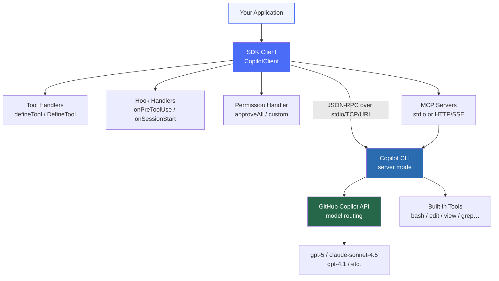
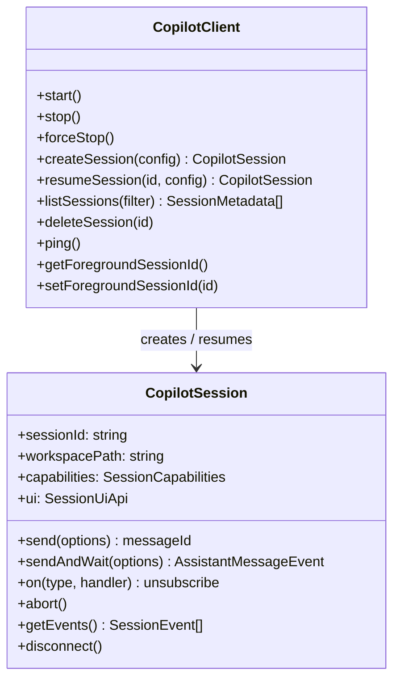
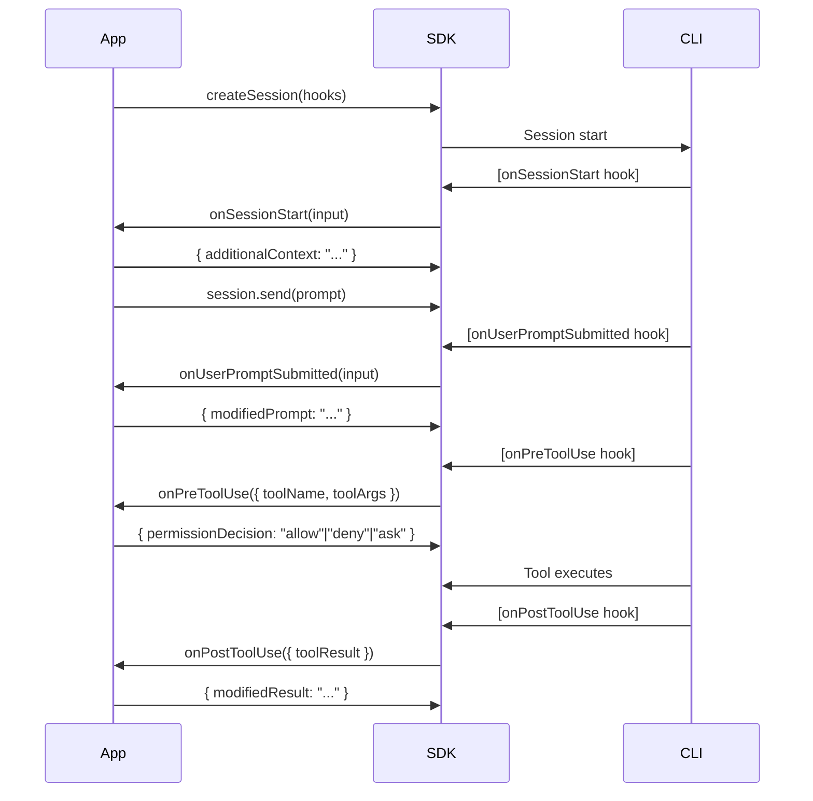
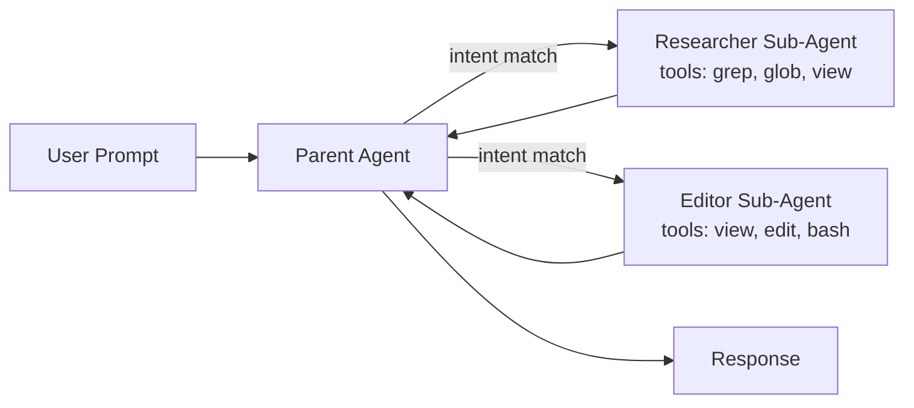
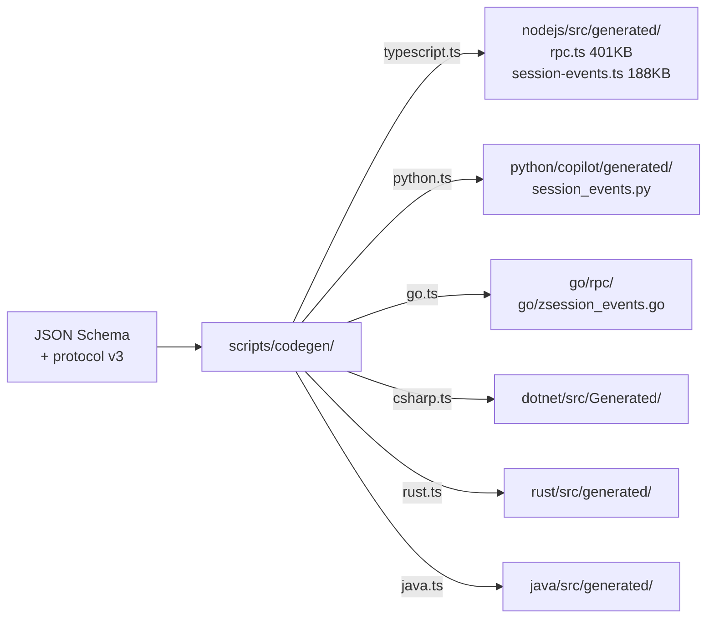
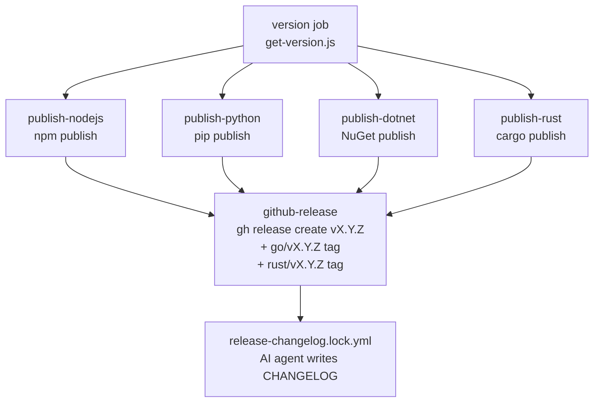

# GitHub Copilot SDK — Deep Research Report

**Repository:** [github/copilot-sdk](https://github.com/github/copilot-sdk)  
**Research Date:** 2026-05-30  
**Commit SHA at research time:** `c34785f3990cf64835a4aebae6ca492498a37a39`  
**Status:** Public Preview (most SDKs) / Technical Preview (Rust)

---

## Executive Summary

The `github/copilot-sdk` is a **multi-language SDK monorepo** (Node.js/TypeScript, Python, Go, .NET/C#, Rust, Java) that exposes GitHub Copilot CLI's production-tested agentic engine as a programmable JSON-RPC API. Created January 14, 2026, it has grown to **8,747 stars and 1,184 forks** within its first five months, with a commit velocity of 10–15+ commits/day. Rather than requiring developers to build their own orchestration stack, the SDK wraps the same runtime powering the Copilot CLI: developers define agent behavior (tools, hooks, system messages), the SDK handles all planning, tool invocation, context management, and streaming. A shared JSON Schema drives a TypeScript-based codegen pipeline that generates strongly-typed bindings for all six languages simultaneously, pinned to a single wire protocol version (`sdk-protocol-version.json: { "version": 3 }`).

---

## Table of Contents

1. [Architecture Overview](#architecture-overview)
2. [Repository Structure](#repository-structure)
3. [Language SDKs Summary](#language-sdks-summary)
4. [Core Concepts](#core-concepts)
   - [Client & Session Model](#client--session-model)
   - [Tool System](#tool-system)
   - [Hook System](#hook-system)
   - [Permission System](#permission-system)
   - [Custom Agents / Sub-Agents](#custom-agents--sub-agents)
   - [MCP Integration](#mcp-integration)
   - [Streaming Events](#streaming-events)
   - [Session Persistence](#session-persistence)
   - [Steering & Queueing](#steering--queueing)
5. [Authentication & BYOK](#authentication--byok)
6. [Deployment Patterns](#deployment-patterns)
7. [Code Generation Pipeline](#code-generation-pipeline)
8. [CI/CD Pipeline](#cicd-pipeline)
9. [Activity & Development Status](#activity--development-status)
10. [Key Repositories Summary](#key-repositories-summary)
11. [Confidence Assessment](#confidence-assessment)
12. [Footnotes](#footnotes)

---

## Architecture Overview



**Key design decisions:**

- The SDK wraps the **Copilot CLI in server mode** — it manages the CLI process lifecycle (spawn, stdio/TCP IPC, graceful shutdown). All AI orchestration happens inside the CLI.[^1]
- Callers never interact with the AI model directly. The SDK exposes high-level abstractions: `createSession()`, `send()`, `defineTool()`, `hooks`.
- **Three transport modes:** `stdio` (subprocess, default), `tcp` (external server, fixed or random port), `uri` (pre-existing server URL).
- **Connection token security:** TCP and URI connections support connection tokens for authentication between the SDK and the CLI server.[^2]

---

## Repository Structure

```
github/copilot-sdk/
├── nodejs/          Node.js / TypeScript SDK  → npm: @github/copilot-sdk
├── python/          Python SDK                → pip: github-copilot-sdk
├── go/              Go SDK                    → go get github.com/github/copilot-sdk/go
├── dotnet/          .NET / C# SDK             → dotnet add package GitHub.Copilot.SDK
├── rust/            Rust SDK (tech preview)   → cargo add github-copilot-sdk
├── java/            Java SDK                  → Maven: com.github:copilot-sdk-java
├── scripts/
│   └── codegen/     TypeScript codegen scripts (one per language)
├── test/
│   └── harness/     Shared cross-language test harness (Node.js/Vitest)
├── docs/            Cross-language documentation (Markdown)
├── .github/
│   └── workflows/   29 GitHub Actions workflows
├── justfile         Cross-SDK task runner (format/lint/test/generate)
└── sdk-protocol-version.json   { "version": 3 }
```

[^3]

---

## Language SDKs Summary

| SDK | Package | Version (as of 2026-05-30) | Language Requirements | CLI Bundled? |
|-----|---------|---------------------------|----------------------|-------------|
| **Node.js / TypeScript** | `@github/copilot-sdk` | 1.0.0-beta.9 | Node.js ≥ 20.0.0 | ✅ Yes |
| **Python** | `github-copilot-sdk` | ~1.0.0-beta (PyPI) | Python ≥ 3.11 | ✅ Yes |
| **Go** | `github.com/github/copilot-sdk/go` | ~0.2.3 | Go 1.24+ | Optional (via `go tool bundler`) |
| **.NET / C#** | `GitHub.Copilot.SDK` | ~1.0.0-beta | .NET 8.0+ | ✅ Yes |
| **Rust** | `github-copilot-sdk` | 0.0.0-dev (pre-release) | Rust 1.94.0+ | Optional (`bundled-cli` feature) |
| **Java** | `com.github:copilot-sdk-java` | 1.0.0-beta-10-java.5 | Java 17+; JDK 25 recommended | ❌ Manual |

[^4][^5]

---

## Core Concepts

### Client & Session Model

The SDK follows a two-object model: **`CopilotClient`** (manages the CLI process) and **`CopilotSession`** (manages one conversation).



**Quick start (all six languages):**

**TypeScript:**
```typescript
import { CopilotClient } from "@github/copilot-sdk";

const client = new CopilotClient();
const session = await client.createSession({ model: "gpt-4.1" });
const response = await session.sendAndWait({ prompt: "What is 2 + 2?" });
console.log(response?.data.content);  // "4"
await client.stop();
```
[^6]

**Python:**
```python
import asyncio
from copilot import CopilotClient
from copilot.session import PermissionHandler

async def main():
    client = CopilotClient()
    await client.start()
    session = await client.create_session(
        on_permission_request=PermissionHandler.approve_all, model="gpt-4.1"
    )
    response = await session.send_and_wait("What is 2 + 2?")
    print(response.data.content)
    await client.stop()
asyncio.run(main())
```
[^6]

**Go:**
```go
client := copilot.NewClient(nil)
client.Start(ctx)
defer client.Stop()

session, _ := client.CreateSession(ctx, &copilot.SessionConfig{Model: "gpt-4.1"})
response, _ := session.SendAndWait(ctx, copilot.MessageOptions{Prompt: "What is 2 + 2?"})
if d, ok := response.Data.(*copilot.AssistantMessageData); ok {
    fmt.Println(d.Content)
}
```
[^6]

**.NET:**
```csharp
await using var client = new CopilotClient();
await using var session = await client.CreateSessionAsync(new SessionConfig
{
    Model = "gpt-4.1",
    OnPermissionRequest = PermissionHandler.ApproveAll
});
var response = await session.SendAndWaitAsync(new MessageOptions { Prompt = "What is 2+2?" });
Console.WriteLine(response?.Data.Content);
```
[^7]

**Connection options:**

| Connection Type | TypeScript | Python | Go | .NET |
|----------------|-----------|--------|-----|------|
| Auto-spawned stdio (default) | `new CopilotClient()` | `CopilotClient()` | `NewClient(nil)` | `new CopilotClient()` |
| External TCP server | `{ cliUrl: "host:port" }` | `RuntimeConnection.for_uri("host:port")` | `copilot.UriConnection{URL: "..."}` | `RuntimeConnection.ForUri("host:port")` |
| TCP with auto port | `RuntimeConnection.forTcp()` | `TcpRuntimeConnection(port=0)` | `copilot.TcpConnection{}` | `RuntimeConnection.ForTcp(port: 0)` |

[^7][^8]

---

### Tool System

Custom tools are defined using language-idiomatic APIs; the SDK generates a JSON Schema from the parameter type and handles invocation dispatch.

**TypeScript — `defineTool` (manual schema):**
```typescript
import { defineTool, CopilotClient } from "@github/copilot-sdk";

const getWeather = defineTool("get_weather", {
    description: "Get the current weather for a city",
    parameters: {
        type: "object",
        properties: { city: { type: "string", description: "The city name" } },
        required: ["city"],
    },
    handler: async ({ city }: { city: string }) => {
        return { city, temperature: "62°F", condition: "cloudy" };
    },
});

const session = await client.createSession({ model: "gpt-4.1", tools: [getWeather] });
```
[^6]

**Python — `@define_tool` decorator (Pydantic schema):**
```python
from copilot.tools import define_tool
from pydantic import BaseModel, Field

class GetWeatherParams(BaseModel):
    city: str = Field(description="The name of the city to get weather for")

@define_tool(description="Get the current weather for a city")
async def get_weather(params: GetWeatherParams) -> dict:
    return {"city": params.city, "temperature": "62°F", "condition": "cloudy"}

session = await client.create_session(model="gpt-4.1", tools=[get_weather])
```
[^9]

**Go — `DefineTool[T, U]` (reflection schema):**
```go
type WeatherParams struct {
    City string `json:"city" jsonschema:"The city name"`
}

getWeather := copilot.DefineTool(
    "get_weather", "Get the current weather for a city",
    func(params WeatherParams, inv copilot.ToolInvocation) (any, error) {
        return fmt.Sprintf("Weather in %s: 22°C", params.City), nil
    },
)
session, _ := client.CreateSession(ctx, &copilot.SessionConfig{Tools: []copilot.Tool{getWeather}})
```
[^10]

**.NET — `CopilotTool.DefineTool` (Microsoft.Extensions.AI):**
```csharp
using Microsoft.Extensions.AI;
using System.ComponentModel;

var session = await client.CreateSessionAsync(new SessionConfig
{
    Tools = [
        CopilotTool.DefineTool(
            async ([Description("Issue identifier")] string id) =>
            {
                return await FetchIssueAsync(id);
            },
            factoryOptions: new AIFunctionFactoryOptions
            {
                Name = "lookup_issue",
                Description = "Fetch issue details from our tracker",
            }),
    ]
});
```
[^7]

**Tool result type:**

| Field | Purpose |
|-------|---------|
| `textResultForLLM` / `text_result_for_llm` | Text sent to the LLM (may be truncated for large outputs) |
| `resultType` | `"success"` \| `"failure"` \| `"rejected"` \| `"denied"` \| `"timeout"` |
| `error` | Error message (never exposed to LLM — security) |
| `binaryResultsForLLM` | Images/resources (base64 + mimeType) |
| `sessionLog` | Logged but not in LLM context |
| `toolTelemetry` | Metadata for tracing |

[^9]

**ToolSet builder (controls which tools are available):**
```typescript
// TypeScript
const tools = new ToolSet()
    .addBuiltIn(BuiltInTools.Isolated)  // safe built-ins (no FS/network access)
    .addMcp("*")                         // all MCP tools
    .addCustom("*");                     // all custom tools

// BuiltInTools.Isolated includes:
// "ask_user", "task_complete", "exit_plan_mode", "task",
// "read_agent", "write_agent", "list_agents", "send_inbox",
// "context_board", "skill"
```
[^11]

**Special tool options:**

| Option | Effect |
|--------|--------|
| `overridesBuiltInTool = true` | Replace a built-in tool with custom implementation |
| `skipPermission = true` | Bypass the permission prompt for this tool |

[^7][^9]

---

### Hook System

Hooks intercept session lifecycle events, enabling permission control, auditing, prompt enrichment, and error handling.



**All available hooks:**

| Hook | Fires When | Can Return |
|------|-----------|------------|
| `onSessionStart` | Session begins (new or resumed) | `additionalContext` |
| `onUserPromptSubmitted` | User sends a message | `modifiedPrompt`, `additionalContext` |
| `onPreToolUse` | Before a tool executes | `permissionDecision`, `modifiedArgs`, `additionalContext` |
| `onPostToolUse` | After a tool succeeds | `modifiedResult`, `additionalContext` |
| `onPostToolUseFailure` | After a tool fails | `additionalContext` |
| `onSessionEnd` | Session ends | (cleanup) |
| `onErrorOccurred` | An error is raised | `errorHandling` (`"retry"/"skip"/"abort"`), `retryCount`, `userNotification` |

[^12]

**Common hook patterns:**

```typescript
hooks: {
    // 1. Read-only tool enforcement
    onPreToolUse: async (input) => {
        const ALLOWED = ["read_file", "glob", "grep", "view"];
        if (!ALLOWED.includes(input.toolName))
            return { permissionDecision: "deny", permissionDecisionReason: "Read-only mode" };
        return { permissionDecision: "allow" };
    },

    // 2. Secret redaction from tool results
    onPostToolUse: async (input) => {
        const SECRET_RE = /(?:api[_-]?key|token|secret|password)\s*[:=]\s*["']?[\w\-.]+["']?/gi;
        if (typeof input.toolResult !== "string") return null;
        const redacted = input.toolResult.replace(SECRET_RE, "[REDACTED]");
        return redacted !== input.toolResult ? { modifiedResult: redacted } : null;
    },

    // 3. Context injection at session start
    onSessionStart: async () => {
        const pkg = JSON.parse(await fs.promises.readFile("package.json", "utf-8"));
        return { additionalContext: `Project: ${pkg.name} v${pkg.version}` };
    },

    // 4. Automatic retry on model errors
    onErrorOccurred: async (input) => {
        if (input.errorContext === "model_call" && input.recoverable)
            return { errorHandling: "retry", retryCount: 3, userNotification: "Retrying…" };
        return null;
    },
}
```
[^12]

---

### Permission System

The permission system controls whether tools can execute. It operates at two levels: a `PermissionHandler` callback on session creation, and `permissionDecision` returned from `onPreToolUse` hooks.

**Permission decision kinds:**

| Kind | Scope |
|------|-------|
| `"approve-once"` | This single request |
| `"approve-for-session"` | All requests in this session |
| `"approve-for-location"` | This file path / git root (persisted) |
| `"approve-permanently"` | Cross-session (e.g., URL domains) |
| `"reject"` | Deny with optional feedback to LLM |
| `"user-not-available"` | No user available to confirm |

[^7]

**Permission request kinds** (what the LLM is trying to do):

| Kind | Key Fields |
|------|-----------|
| `"shell"` | `fullCommandText`, `intention`, `commands[]`, `possiblePaths[]` |
| `"write"` | `fileName`, `diff`, `intention`, `newFileContents?` |
| `"read"` | `path`, `intention` |
| `"mcp"` | `serverName`, `toolName`, `toolTitle`, `readOnly` |
| `"url"` | `url`, `intention` |
| `"memory"` | `subject`, `fact`, `citations` |
| `"custom-tool"` | `toolName`, `toolDescription`, `args?` |

[^13]

---

### Custom Agents / Sub-Agents

The SDK supports multi-agent orchestration where a parent session spawns specialized sub-agents with isolated tool scopes and custom system prompts.



**Configuration (TypeScript):**
```typescript
const session = await client.createSession({
    model: "gpt-4.1",
    customAgents: [
        {
            name: "researcher",
            displayName: "Research Agent",
            description: "Explores codebases and answers questions using read-only tools",
            tools: ["grep", "glob", "view"],
            prompt: "You are a research assistant. Do not modify files.",
        },
        {
            name: "editor",
            displayName: "Editor Agent",
            description: "Makes targeted code changes",
            tools: ["view", "edit", "bash"],
            prompt: "You are a code editor. Make minimal, surgical changes.",
            infer: false,   // Opt-out of auto-selection; only invoked explicitly
        },
    ],
    agent: "researcher",   // Pre-select at session creation
    defaultAgent: {
        excludedTools: ["analyze-codebase"],  // Hidden from main agent, available to sub-agents
    },
});
```
[^14]

**`CustomAgentConfig` properties:**

| Property | Type | Required | Description |
|----------|------|----------|-------------|
| `name` | `string` | ✅ | Unique identifier for the agent |
| `displayName` | `string` | | Human-readable name shown in events |
| `description` | `string` | | Used for automatic intent-based selection |
| `tools` | `string[]` \| `null` | | Tool allowlist; `null`/omitted = all tools |
| `prompt` | `string` | ✅ | System prompt for this agent |
| `mcpServers` | `object` | | MCP server configurations specific to this agent |
| `infer` | `boolean` | | Allow runtime auto-selection (default: `true`) |
| `skills` | `string[]` | | Skill names eagerly injected at startup |
| `model` | `string` | | Per-agent model override |

[^14]

**Sub-agent events:**

| Event | Data |
|-------|------|
| `subagent.selected` | `agentName`, `agentDisplayName`, `tools` |
| `subagent.started` | `toolCallId`, `agentName`, `agentDisplayName`, `agentDescription` |
| `subagent.completed` | `toolCallId`, `agentName`, `agentDisplayName` |
| `subagent.failed` | `toolCallId`, `agentName`, `agentDisplayName`, `error` |
| `subagent.deselected` | _(empty)_ |

[^13]

---

### MCP Integration

Model Context Protocol (MCP) servers provide external tools. Two transport types are supported.

```typescript
const session = await client.createSession({
    mcpServers: {
        // Local/stdio process
        "filesystem": {
            type: "local",      // or "stdio"
            command: "npx",
            args: ["-y", "@modelcontextprotocol/server-filesystem", "/tmp"],
            tools: ["*"],       // "*" = all tools
            timeout: 30000,
        },
        // Remote/HTTP server
        "github": {
            type: "http",       // or "sse"
            url: "https://api.githubcopilot.com/mcp/",
            headers: { "Authorization": "Bearer ${TOKEN}" },
            tools: ["list_issues", "create_pull_request"],
        },
    },
});
```
[^15]

**Tool filtering:** `["*"]` enables all tools, `[]` disables all, or name a specific list.

MCP tools are addressed in `ToolSet` as `mcp:<toolName>`. Results can be converted via `convertMcpCallToolResult()` for bridge scenarios.[^11]

---

### Streaming Events

The SDK surfaces **40+ real-time event types** through a subscription API. Events follow a discriminated union pattern.

**Agentic turn flow (event order):**

```
assistant.turn_start
├── assistant.intent                (ephemeral)
├── assistant.reasoning_delta       (ephemeral, repeated)
├── assistant.reasoning
├── assistant.message_delta         (ephemeral, repeated)
├── assistant.message               (includes toolRequests[])
├── assistant.usage                 (ephemeral — token cost)
│
├── [If tools requested:]
│   ├── permission.requested        (ephemeral)
│   ├── permission.completed        (ephemeral)
│   ├── tool.execution_start
│   ├── tool.execution_partial_result  (ephemeral)
│   ├── tool.execution_complete
│   └── [loop: more reasoning → message → tools…]
│
assistant.turn_end
session.idle                        (ephemeral — signals complete)
```
[^13]

**Complete event reference (selected):**

| Event Type | Ephemeral | Key Data Fields |
|------------|-----------|-----------------|
| `assistant.turn_start` | | `turnId`, `interactionId?` |
| `assistant.reasoning` | | `reasoningId`, `content` |
| `assistant.reasoning_delta` | ✅ | `reasoningId`, `deltaContent` |
| `assistant.message` | | `messageId`, `content`, `toolRequests?` |
| `assistant.message_delta` | ✅ | `messageId`, `deltaContent` |
| `assistant.usage` | ✅ | `model`, `inputTokens`, `outputTokens`, `cacheReadTokens`, `cost` |
| `tool.execution_start` | | `toolCallId`, `toolName`, `arguments?`, `mcpServerName?` |
| `tool.execution_complete` | | `toolCallId`, `success`, `result?`, `error?` |
| `session.idle` | ✅ | `backgroundTasks?` |
| `session.compaction_start` | | _(empty)_ |
| `session.compaction_complete` | | `success`, `preCompactionTokens?`, `summaryContent?` |
| `session.shutdown` | | `shutdownType`, `codeChanges`, `modelMetrics` |
| `permission.requested` | ✅ | `requestId`, `permissionRequest` |
| `subagent.started` | | `toolCallId`, `agentName` |
| `subagent.completed` | | `toolCallId`, `agentName` |
| `elicitation.requested` | ✅ | `requestId`, `message`, `requestedSchema` |
| `external_tool.requested` | ✅ | `requestId`, `toolName`, `arguments?` |

[^13]

**Ephemeral events** are not persisted and are not replayed when a session is resumed.

**Streaming subscription (TypeScript):**
```typescript
const session = await client.createSession({ streaming: true, model: "gpt-4.1" });

session.on("assistant.message_delta", (event) => {
    process.stdout.write(event.data.deltaContent);  // Incremental text
});
session.on("session.idle", () => console.log("\n[done]"));

await session.sendAndWait({ prompt: "Tell me a short story" });
```
[^6]

---

### Session Persistence

Sessions are automatically persisted to disk. The session store layout:

```
~/.copilot/session-state/
└── {sessionId}/
    ├── checkpoints/        Conversation history snapshots
    │   ├── 001.json
    │   ├── 002.json
    │   └── ...
    ├── plan.md             Agent's planning state
    └── files/              Session artifacts (created by tools)
        ├── analysis.md
        └── notes.txt
```

[^16]

**What is/is not persisted:**

| Data | Persisted? |
|------|-----------|
| Conversation history | ✅ Full message thread |
| Tool call results | ✅ Cached for context |
| Agent planning state | ✅ `plan.md` |
| Session artifacts | ✅ In `files/` |
| Provider / API keys | ❌ Must re-provide on resume |
| In-memory tool state | ❌ Tools should be stateless |

[^16]

**Infinite sessions** (automatic context compaction for long-running workflows):
```typescript
const session = await client.createSession({
    sessionId: "long-workflow-123",
    infiniteSessions: {
        enabled: true,
        backgroundCompactionThreshold: 0.80,  // Begin compaction at 80% context
        bufferExhaustionThreshold: 0.95,      // Block new messages at 95%
    },
});
```
[^16]

**Resuming a session** (reconfigurable properties: `model`, `systemMessage`, `availableTools`, `excludedTools`, `provider`, `reasoningEffort`, `streaming`, `mcpServers`, `customAgents`, `infiniteSessions`):
```typescript
const resumed = await client.resumeSession("user-123-task-456", {
    provider: { type: "azure", baseUrl: "...", apiKey: process.env.AZURE_KEY },  // API keys re-required
    model: "gpt-5",
});
```
[^16]

---

### Steering & Queueing

Two message-send modes for interacting with an already-processing agent:

| Mode | Behavior | Use Case |
|------|----------|----------|
| `"enqueue"` (default) | Queued for **after** current turn | "After this, also fix tests" |
| `"immediate"` (steering) | Injected into **current** LLM turn | "Actually, use JWT not sessions" |

```typescript
// Start a long-running task
await session.send({ prompt: "Refactor the authentication module" });

// Steer mid-execution (injected into current turn)
await session.send({ prompt: "Use JWT tokens instead of sessions", mode: "immediate" });

// Queue a follow-up (runs after current task completes)
await session.send({ prompt: "Update the README", mode: "enqueue" });
```
[^17]

---

## Authentication & BYOK

### Authentication Methods (in priority order)

1. **`gitHubToken`** option on `CopilotClient` — highest priority; disables CLI login
2. **`COPILOT_GITHUB_TOKEN`** / **`GH_TOKEN`** / **`GITHUB_TOKEN`** environment variables
3. **CLI signed-in user** (via `copilot login`) — default
4. **BYOK** (Bring Your Own Key) — use a third-party model provider entirely

**Supported token types:**

| Token Prefix | Source | Status |
|-------------|--------|--------|
| `gho_` | OAuth user access token | ✅ Supported |
| `ghu_` | GitHub App user access token | ✅ Supported |
| `github_pat_` | Fine-grained PAT | ✅ Supported |
| `ghp_` | Classic PAT | ❌ Deprecated |

[^18]

### BYOK (Bring Your Own Key)

Use a third-party AI provider instead of GitHub Copilot — no Copilot subscription required.

**`ProviderConfig` fields:**

| Field | Type | Description |
|-------|------|-------------|
| `type` | `"openai"` \| `"azure"` \| `"anthropic"` | Provider type |
| `baseUrl` | `string` | **Required.** API endpoint URL |
| `apiKey` | `string` | API key |
| `bearerToken` | `string` | Bearer token (takes precedence over apiKey) |
| `wireApi` | `"completions"` \| `"responses"` | API format (default: `"completions"`; use `"responses"` for GPT-5 series) |
| `azure.apiVersion` | `string` | Azure API version (default: `"2024-10-21"`) |

[^19]

**Provider examples:**
```typescript
// Azure AI Foundry (GPT-5 series)
provider: { type: "openai", baseUrl: "https://your-resource.openai.azure.com/openai/v1/",
            apiKey: process.env.FOUNDRY_API_KEY, wireApi: "responses" }

// Native Azure OpenAI
provider: { type: "azure", baseUrl: "https://my-resource.openai.azure.com",
            apiKey: process.env.AZURE_OPENAI_KEY, azure: { apiVersion: "2024-10-21" } }

// Anthropic Claude
provider: { type: "anthropic", baseUrl: "https://api.anthropic.com",
            apiKey: process.env.ANTHROPIC_API_KEY }

// Ollama (local, no key needed)
provider: { type: "openai", baseUrl: "http://localhost:11434/v1" }
```
[^19]

**BYOK rules:** `model` is required (no fallback); subject to your provider's rate limits; API keys are **not persisted** and must be re-provided on session resume.[^19]

### Azure Managed Identity (Python)
```python
from azure.identity import DefaultAzureCredential
from copilot.session import ProviderConfig

credential = DefaultAzureCredential()
token = credential.get_token("https://cognitiveservices.azure.com/.default").token

session = await client.create_session(
    model="gpt-4.1",
    provider=ProviderConfig(type="openai", base_url=f"{foundry_url}/openai/v1/",
                             bearer_token=token, wire_api="responses"),
)
# Note: static tokens only — refresh per session creation for long-running apps
```
[^18]

---

## Deployment Patterns

### 1. Headless CLI + TCP Backend

For web services where the CLI runs separately from the application:

```
[API Server] → SDK Client (tcp) → [Copilot CLI --headless :4321] → [GitHub API]
```

```bash
# Start CLI in headless mode
copilot --headless --host 0.0.0.0 --port 4321
```

**Dockerfile:**
```dockerfile
FROM debian:bookworm-slim
ARG COPILOT_VERSION=1.0.7
RUN apt-get update && apt-get install -y --no-install-recommends ca-certificates wget \
    && ARCH=$(dpkg --print-architecture) \
    && case "${ARCH}" in amd64) COPILOT_ARCH="x64" ;; arm64) COPILOT_ARCH="arm64" ;; *) exit 1 ;; esac \
    && wget -q "https://github.com/github/copilot-cli/releases/download/v${COPILOT_VERSION}/copilot-linux-${COPILOT_ARCH}.tar.gz" \
    && tar -xzf "copilot-linux-${COPILOT_ARCH}.tar.gz" \
    && mv copilot /usr/local/bin/ && rm *.tar.gz
ENTRYPOINT ["copilot"]
```
[^20]

**Docker Compose:**
```yaml
services:
  copilot-cli:
    image: copilot-cli:latest
    command: ["--headless", "--host", "0.0.0.0", "--port", "4321"]
    environment: [COPILOT_GITHUB_TOKEN=${COPILOT_GITHUB_TOKEN}]
    volumes: [session-data:/root/.copilot/session-state]

  api:
    build: .
    environment: [CLI_URL=copilot-cli:4321]
    depends_on: [copilot-cli]

volumes:
  session-data:
```
[^20]

### 2. Isolated CLI per User (Strongest Isolation)

Spawn a dedicated CLI process per user for complete credential and data isolation. Best for multi-tenant SaaS, SOC 2/HIPAA compliance.[^21]

### 3. Shared CLI with Session Isolation

Use session naming conventions (`userId-taskId-timestamp`) and application-level Redis locking for concurrent access.[^21]

### 4. Kubernetes Horizontal Scaling

Scale the CLI tier independently using Kubernetes deployments with `PodDisruptionBudget` and persistent volume claims for session state. Session affinity routes requests to the same pod. For cross-pod sessions, mount Azure File Share or NFS.[^21]

### System Message Customization

Control the agent's behavior through three system message modes:

```typescript
// Append mode (default) — adds content after SDK-managed sections
systemMessage: { content: "<rules>Always use TypeScript</rules>" }

// Customize mode — selectively override named sections
systemMessage: {
    mode: "customize",
    sections: {
        tone: { action: "replace", content: "Warm, professional tone." },
        code_change_rules: { action: "remove" },
        guidelines: { action: "append", content: "\n* Always cite sources" },
    },
}

// Replace mode — full control, removes all guardrails
systemMessage: { mode: "replace", content: "You are a helpful assistant." }
```

**Named sections:** `identity`, `tone`, `tool_efficiency`, `environment_context`, `code_change_rules`, `guidelines`, `safety`, `tool_instructions`, `custom_instructions`, `runtime_instructions`, `last_instructions`[^7]

---

## Code Generation Pipeline

All SDK types are auto-generated from a central JSON Schema via TypeScript codegen scripts.



[^22]

**Codegen script sizes:**

| Script | Size | Output |
|--------|------|--------|
| `scripts/codegen/utils.ts` | 60.6 KB | Shared utilities |
| `scripts/codegen/python.ts` | 139 KB | Python bindings |
| `scripts/codegen/go.ts` | 171 KB | Go bindings |
| `scripts/codegen/csharp.ts` | 116 KB | C# bindings |
| `scripts/codegen/typescript.ts` | 39 KB | TypeScript bindings |
| `scripts/codegen/rust.ts` | 65 KB | Rust bindings |

[^22]

**Dependencies:** `json-schema-to-typescript` for TypeScript; `quicktype-core` for Python/Go/C#/Rust. Rust output requires post-processing with `cargo +nightly-2026-04-14 fmt` (nightly `group_imports` and `imports_granularity` options).

**Verification:** `codegen-check.yml` workflow runs `npm run generate` then `git status --porcelain` — fails if any generated file is stale. Java has a separate `java-codegen-check.yml` with an AI-powered auto-fix loop: if `mvn verify` fails, it triggers a `java-codegen-fix.lock.yml` agentic workflow that runs for up to 30 minutes to repair the generated code.[^22][^23]

---

## CI/CD Pipeline

**29 GitHub Actions workflows** cover all aspects of the SDK lifecycle.

### Per-Language Tests

All six language SDKs have dedicated test workflows with 3-OS matrix (`ubuntu-latest`, `macos-latest`, `windows-latest`). All tests depend on `npm ci` in `test/harness/` (shared Node.js/Vitest test harness with a **replay proxy** for deterministic offline E2E testing).[^23]

### Release Pipeline (`publish.yml`)

Manual-trigger multi-job release:



[^23]

**dist-tags:** `latest` (stable), `prerelease`, `unstable` (Node.js only). Java uses Maven Release Plugin independently on its own cadence (`java/v1.0.0-beta-10-java.X`).[^24]

### Automated Runtime Updates

The `@github/copilot` CLI dependency is bumped fully automatically: a bot detects new CLI releases, creates a draft PR, re-runs codegen for all languages, runs CI, and merges. This drives most of the commit volume (3–4 times per day).[^24]

### Agentic Workflows

The SDK itself uses Copilot coding agents for:
- **CHANGELOG generation** (`release-changelog.lock.yml`) — AI agent generates CHANGELOG from release data
- **Java codegen fixes** (`java-codegen-fix.lock.yml`) — AI agent repairs generated Java if `mvn verify` fails
- **Triage agent** (issues #646, #1459) — automated issue classification and triage
- **CI fixes** — PR #1508 authored by Copilot agent to fix Electron spawn compatibility[^24]

---

## Activity & Development Status

| Metric | Value |
|--------|-------|
| Stars | 8,747 |
| Forks | 1,184 |
| Open Issues | 222 |
| Active Branches | 83 (all protected) |
| Creation Date | 2026-01-14 |
| Current Runtime | `@github/copilot 1.0.56` |
| Commit velocity | ~10–15 commits/day |

**Core contributors:** `edburns` (Java/CI), `stephentoub` (C#/.NET), `SteveSandersonMS` (.NET), `tclem` (Rust/cloud sessions), `dmytrostruk` (Go/schema), `MRayermannMSFT` (extension SDK), `jmoseley` (extensions/canvas), `jasonetco` (cloud sessions/Python).[^25]

**Major in-flight features (not yet merged to `main`):**
- **Cloud sessions** (`CloudSessionOptions`) — run sessions in GitHub-managed cloud infrastructure with no local CLI needed; active across 8+ branches (`tclem/`, `jasonetco/`)
- **Extension SDK path** (`extensionSdkPath`) — merged May 29, enables embedding SDK within Copilot extensions
- **Reasoning effort API** (`reasoningEffort`) — per-message and per-agent model reasoning controls
- **Context tier typed support** — `ContextTier` struct (.NET), named type (Go) merged May 29[^25]

**Known limitations / open issues:**
- #1516: No stable API for querying token usage / context pressure (only ephemeral events)
- #1433: `session.abort()` doesn't cancel in-flight custom tool handlers (no `AbortSignal` plumbing)
- #1493: Cloud session `createSession` bug in Node.js v1.0.0-beta.9
- #1454: Python SDK incompatible with latest CLI (ISO 8601 timestamp parsing)[^25]

---

## Key Repositories Summary

| Repository | Purpose | Stars |
|-----------|---------|-------|
| [github/copilot-sdk](https://github.com/github/copilot-sdk) | Official SDK monorepo (all 6 languages) | 8,747 |
| [github/copilot-sdk-java](https://github.com/github/copilot-sdk-java) | Former standalone Java SDK (migrated Feb 2026) | 65 |
| [github/copilot-engine-sdk](https://github.com/github/copilot-engine-sdk) | SDK for Copilot Agent Engines (TypeScript) | 14 |
| [github/copilot-sdk-server-sample](https://github.com/github/copilot-sdk-server-sample) | Multi-user system sample (TypeScript) | 6 |
| [github/awesome-copilot](https://github.com/github/awesome-copilot) | SDK cookbook, custom instructions, collections | — |
| [copilot-community-sdk/copilot-sdk-clojure](https://github.com/copilot-community-sdk/copilot-sdk-clojure) | Community Clojure SDK (unofficial) | — |
| [0xeb/copilot-sdk-cpp](https://github.com/0xeb/copilot-sdk-cpp) | Community C++ SDK (unofficial) | — |

---

## Confidence Assessment

| Finding | Confidence | Notes |
|---------|-----------|-------|
| Repository structure, README, protocol version | ✅ High | Directly fetched; SHA-verified |
| Node.js/TypeScript API surface | ✅ High | Source files fetched and verified |
| Python API surface | ✅ High | `__init__.py`, `tools.py`, `_mode.py` fetched |
| Go API surface | ✅ High | `definetool.go`, `toolset.go`, `permissions.go` fetched |
| .NET API surface | ✅ High | README + full SessionConfig docs fetched |
| Documentation (hooks, MCP, custom agents, BYOK, streaming events) | ✅ High | Source markdown files fetched with SHA |
| Java API surface | 🟡 Medium | README fetched but Java source files not directly inspected |
| Rust API surface | 🟡 Medium | README fetched; `src/lib.rs` not directly read |
| CI/CD pipeline | ✅ High | Multiple workflow YAML files fetched |
| Codegen pipeline | ✅ High | Package.json and directory listings verified |
| Version numbers | 🟡 Medium | Inferred from commit messages and branch names; not cross-verified against registry pages |
| Cloud session feature | 🟡 Medium | Exists in branches and docs, not yet merged to `main` |
| Exact Node.js client.ts/session.ts internals | 🟡 Medium | Documented via README; large files not directly fetched |

---

## Footnotes

[^1]: [github/copilot-sdk:README.md](https://github.com/github/copilot-sdk/blob/c34785f3990cf64835a4aebae6ca492498a37a39/README.md) — Architecture section: "No need to build your own orchestration—you define agent behavior, Copilot handles planning, tool invocation, file edits, and more."

[^2]: [github/copilot-sdk:dotnet/README.md](https://github.com/github/copilot-sdk/blob/c34785f3990cf64835a4aebae6ca492498a37a39/dotnet/README.md) — `RuntimeConnection.ForTcp(connectionToken?)` and `RuntimeConnection.ForUri(url, connectionToken?)`

[^3]: [github/copilot-sdk:/](https://github.com/github/copilot-sdk/tree/c34785f3990cf64835a4aebae6ca492498a37a39) — Root directory listing; `sdk-protocol-version.json` (SHA: `cd2f236b292fcc4e93b5ee45bee567045c3fdfdf`)

[^4]: [github/copilot-sdk:nodejs/package.json](https://github.com/github/copilot-sdk/blob/c34785f3990cf64835a4aebae6ca492498a37a39/nodejs/package.json) — SHA: `9569e6816c997e192a0c9727efceba74f4b8727f`; `python/pyproject.toml` SHA: `897c5466d357da2df826397b0624bd12886312bf`

[^5]: [github/copilot-sdk:rust/Cargo.toml](https://github.com/github/copilot-sdk/blob/c34785f3990cf64835a4aebae6ca492498a37a39/rust/Cargo.toml) — SHA: `44c4b369efeda459d36172b254cb9f8eb28368bb`; `rust-version = "1.94.0"`, `version = "0.0.0-dev"`

[^6]: [github/copilot-sdk:docs/getting-started.md](https://github.com/github/copilot-sdk/blob/c34785f3990cf64835a4aebae6ca492498a37a39/docs/getting-started.md) — SHA: `80c9541`; Steps 1–5 tutorial code examples

[^7]: [github/copilot-sdk:dotnet/README.md](https://github.com/github/copilot-sdk/blob/c34785f3990cf64835a4aebae6ca492498a37a39/dotnet/README.md) — SHA: `719c554`; Full .NET API reference

[^8]: [github/copilot-sdk:nodejs/README.md](https://github.com/github/copilot-sdk/blob/c34785f3990cf64835a4aebae6ca492498a37a39/nodejs/README.md) — SHA: `aadf7c6`; `CopilotClientOptions` and `RuntimeConnection` docs

[^9]: [github/copilot-sdk:python/copilot/tools.py](https://github.com/github/copilot-sdk/blob/c34785f3990cf64835a4aebae6ca492498a37a39/python/copilot/tools.py) — `ToolResult`, `ToolBinaryResult` dataclasses; `define_tool` decorator patterns

[^10]: [github/copilot-sdk:go/definetool.go](https://github.com/github/copilot-sdk/blob/c34785f3990cf64835a4aebae6ca492498a37a39/go/definetool.go) — SHA: `ccaa69a`; `DefineTool[T, U]` generic function signature

[^11]: [github/copilot-sdk:nodejs/src/toolSet.ts](https://github.com/github/copilot-sdk/blob/c34785f3990cf64835a4aebae6ca492498a37a39/nodejs/src/toolSet.ts) — SHA: `559e923`; `ToolSet` class and `BuiltInTools.Isolated` catalog

[^12]: [github/copilot-sdk:docs/features/hooks.md](https://github.com/github/copilot-sdk/blob/c34785f3990cf64835a4aebae6ca492498a37a39/docs/features/hooks.md) — SHA: `6af5232a68e5b42de6792b5ba07eaaffa484b1b9`; All hook types, code patterns, best practices

[^13]: [github/copilot-sdk:docs/features/streaming-events.md](https://github.com/github/copilot-sdk/blob/c34785f3990cf64835a4aebae6ca492498a37a39/docs/features/streaming-events.md) — SHA: `3388d6a`; Full event reference table with 40+ events, permission request kinds, tool result fields

[^14]: [github/copilot-sdk:docs/features/custom-agents.md](https://github.com/github/copilot-sdk/blob/c34785f3990cf64835a4aebae6ca492498a37a39/docs/features/custom-agents.md) — SHA: `d0f209649f17342ce28e075abc7242248df2fb13`; `CustomAgentConfig` schema, sub-agent events, tool scope patterns

[^15]: [github/copilot-sdk:docs/features/mcp.md](https://github.com/github/copilot-sdk/blob/c34785f3990cf64835a4aebae6ca492498a37a39/docs/features/mcp.md) — SHA: `e974532b03d159f72e7ec3ad664243f92b14230b`; MCP config schema, tool filtering, stdio vs. HTTP transports

[^16]: [github/copilot-sdk:docs/features/session-persistence.md](https://github.com/github/copilot-sdk/blob/c34785f3990cf64835a4aebae6ca492498a37a39/docs/features/session-persistence.md) — SHA: `3bfff10`; Storage layout, persistence table, infinite sessions, resume options

[^17]: [github/copilot-sdk:docs/features/steering-and-queueing.md](https://github.com/github/copilot-sdk/blob/c34785f3990cf64835a4aebae6ca492498a37a39/docs/features/steering-and-queueing.md) — SHA: `7dbdc17`; Immediate vs. enqueue modes, internal processing details

[^18]: [github/copilot-sdk:docs/setup/github-oauth.md](https://github.com/github/copilot-sdk/blob/c34785f3990cf64835a4aebae6ca492498a37a39/docs/setup/github-oauth.md) — SHA: `aea6b22b9cef1cd38d1a0f51f42a143d291258bc`; Token types, OAuth flow, org membership verification; `docs/setup/azure-managed-identity.md` SHA: `c803c7f89e43ffdbf72e2989e2b5fcffe18e6891`

[^19]: [github/copilot-sdk:docs/auth/byok.md](https://github.com/github/copilot-sdk/blob/c34785f3990cf64835a4aebae6ca492498a37a39/docs/auth/byok.md) — SHA: `8bfc5d50cdfc8d0c6f0b2383a16bd35c7ffc419c`; `ProviderConfig` fields, all provider examples, BYOK rules

[^20]: [github/copilot-sdk:docs/setup/backend-services.md](https://github.com/github/copilot-sdk/blob/c34785f3990cf64835a4aebae6ca492498a37a39/docs/setup/backend-services.md) — SHA: `2dc2c47`; Headless architecture, Dockerfile, Docker Compose, session cleanup

[^21]: [github/copilot-sdk:docs/setup/scaling.md](https://github.com/github/copilot-sdk/blob/c34785f3990cf64835a4aebae6ca492498a37a39/docs/setup/scaling.md) — SHA: `371a402`; Three isolation patterns, Redis locking, Kubernetes patterns, Azure File Share

[^22]: [github/copilot-sdk:scripts/codegen/package.json](https://github.com/github/copilot-sdk/blob/c34785f3990cf64835a4aebae6ca492498a37a39/scripts/codegen/package.json) — `npm run generate` scripts; `scripts/codegen/` directory listing; `json-schema-to-typescript`, `quicktype-core` dependencies

[^23]: [github/copilot-sdk:.github/workflows/codegen-check.yml](https://github.com/github/copilot-sdk/blob/c34785f3990cf64835a4aebae6ca492498a37a39/.github/workflows/codegen-check.yml) — Full codegen CI pipeline; `test/harness/package.json` SHA: test harness dependencies

[^24]: [github/copilot-sdk:.github/workflows/publish.yml](https://github.com/github/copilot-sdk/blob/c34785f3990cf64835a4aebae6ca492498a37a39/.github/workflows/publish.yml) — Multi-job release pipeline; Java maven-release-plugin commits visible in commit history

[^25]: [github/copilot-sdk:main commits](https://github.com/github/copilot-sdk/commits/main) — Top 30 commits 2026-05-29–30; branch list (83 branches including `tclem/dotnet-create-cloud-session`, `jasonetco/cloud-runtime-plan`); open issues #1516, #1493, #1433, #1454
