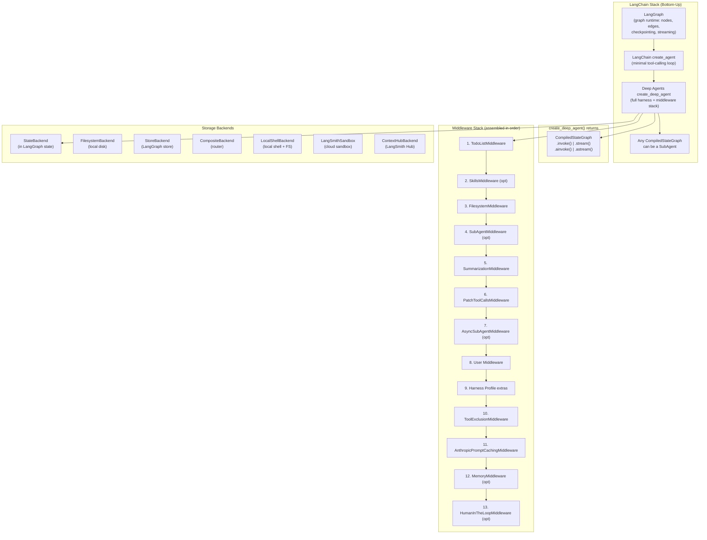
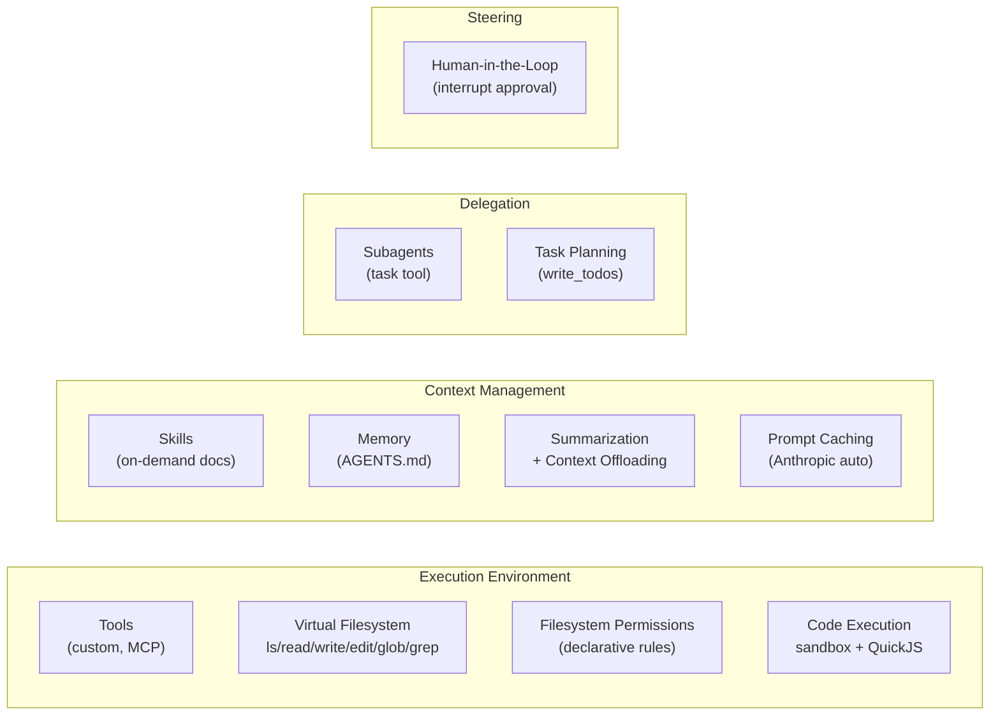
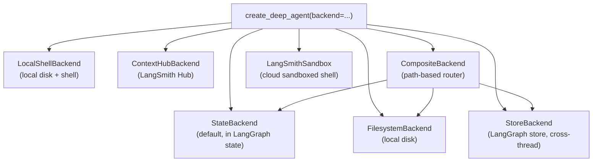
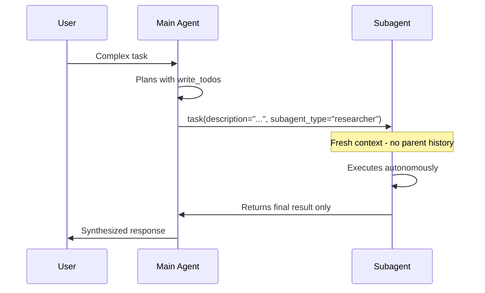

# LangChain Deep Agents — Comprehensive Technical Deep-Dive

> **Source URL:** https://docs.langchain.com/oss/python/deepagents/overview  
> **Research Date:** 2026-05-31  
> **Package:** `deepagents` (PyPI) | `pip install deepagents`  
> **Repository:** [langchain-ai/deepagents](https://github.com/langchain-ai/deepagents) (23,586 ⭐)

---

## Executive Summary

**LangChain Deep Agents** is an open-source, batteries-included Python agent harness built on top of LangChain and the LangGraph runtime. It provides a single entry-point function — `create_deep_agent()` — that assembles a fully configured agent with built-in task planning, a pluggable virtual filesystem, automatic context compression, subagent spawning, long-term memory, declarative filesystem permissions, a QuickJS JavaScript interpreter, and human-in-the-loop approval flows. It is model-agnostic (supports 100+ providers via LangChain's `init_chat_model`) and production-ready (deploys to LangSmith or self-hosted LangGraph servers with zero code changes). A companion CLI tool `dcode` delivers a Claude-Code-style terminal coding agent built on the same SDK. As of May 2026, the ecosystem also includes managed cloud hosting (private beta), an Agent Client Protocol (ACP) server integration for IDE connectivity, and async subagent patterns for non-blocking parallel delegation.

---

## Table of Contents

1. [Architecture Overview](#architecture-overview)
2. [Installation & Setup](#installation--setup)
3. [Core API: `create_deep_agent()`](#core-api-create_deep_agent)
4. [The Harness: Built-in Capabilities](#the-harness-built-in-capabilities)
5. [Filesystem Backends](#filesystem-backends)
6. [Subagents](#subagents)
7. [Async Subagents](#async-subagents)
8. [Interpreters (QuickJS)](#interpreters-quickjs)
9. [Filesystem Permissions](#filesystem-permissions)
10. [Human-in-the-Loop](#human-in-the-loop)
11. [Memory & Skills](#memory--skills)
12. [Context Engineering](#context-engineering)
13. [Sandboxes](#sandboxes)
14. [Model Configuration](#model-configuration)
15. [Deep Agents Code CLI (`dcode`)](#deep-agents-code-cli-dcode)
16. [Agent Client Protocol (ACP)](#agent-client-protocol-acp)
17. [Going to Production](#going-to-production)
18. [Comparison with Claude Agent SDK](#comparison-with-claude-agent-sdk)
19. [Key Repositories](#key-repositories)
20. [Complete API Reference](#complete-api-reference)
21. [Confidence Assessment](#confidence-assessment)

---

## Architecture Overview



### Layering Philosophy

Deep Agents sits *above* LangChain's `create_agent` and LangGraph, adding opinionated middleware for the most common reliability concerns[^1]:

- **LangGraph** — low-level graph runtime (nodes, edges, state, persistence)
- **LangChain `create_agent`** — minimal, configurable tool-calling loop
- **`create_deep_agent`** — full harness: planning, filesystem, subagents, context mgmt, memory, skills, HITL

---

## Installation & Setup

```bash
pip install -qU deepagents                # Core package
pip install -qU deepagents langchain-openai        # + OpenAI
pip install -qU deepagents langchain-anthropic     # + Anthropic
pip install -qU deepagents langchain-google-genai  # + Google Gemini
pip install -qU "deepagents[quickjs]"             # + JavaScript interpreter
pip install deepagents-acp                        # + ACP server for IDEs
```

**API Key setup:**
```bash
export GOOGLE_API_KEY="your-key"
export OPENAI_API_KEY="sk-..."
export ANTHROPIC_API_KEY="sk-ant-..."
export TAVILY_API_KEY="tvly-..."    # for web search
```

> **Note:** The PyPI slug is `deepagents` — not `langchain-deepagents` or `deep-agents`.[^2]

---

## Core API: `create_deep_agent()`

### Full Function Signature

```python
from deepagents import create_deep_agent

create_deep_agent(
    model: str | BaseChatModel | None = None,
    tools: Sequence[BaseTool | Callable | dict[str, Any]] | None = None,
    *,
    system_prompt: str | SystemMessage | None = None,
    middleware: Sequence[AgentMiddleware] = (),
    subagents: Sequence[SubAgent | CompiledSubAgent | AsyncSubAgent] | None = None,
    skills: list[str] | None = None,
    memory: list[str] | None = None,
    permissions: list[FilesystemPermission] | None = None,
    backend: BackendProtocol | BackendFactory | None = None,
    interrupt_on: dict[str, bool | InterruptOnConfig] | None = None,
    response_format: ResponseFormat[ResponseT] | type[ResponseT] | dict[str, Any] | None = None,
    state_schema: type[DeepAgentState] | None = None,
    context_schema: type[ContextT] | None = None,
    checkpointer: Checkpointer | None = None,
    store: BaseStore | None = None,
    debug: bool = False,
    name: str | None = None,
    cache: BaseCache | None = None,
) -> CompiledStateGraph[...]
```

**Source:** `libs/deepagents/deepagents/graph.py#L217`[^3]

### Parameter Reference

| Parameter | Type | What it does |
|-----------|------|-------------|
| `model` | `str \| BaseChatModel` | Model to use (`"provider:model"` string or instance). Deprecated if `None` since 0.5.3.[^3] |
| `tools` | `Sequence` | Domain tools (callables, `BaseTool`, dict specs, MCP). **Additive** — never removes built-ins.[^3] |
| `system_prompt` | `str \| SystemMessage` | Custom instructions prepended before base prompt |
| `middleware` | `Sequence[AgentMiddleware]` | Extra middleware inserted at position 8 of the stack |
| `subagents` | `Sequence` | Sync/async subagents for delegation |
| `skills` | `list[str]` | Paths to skill directories (progressive disclosure) |
| `memory` | `list[str]` | Paths to AGENTS.md memory files (always loaded) |
| `permissions` | `list[FilesystemPermission]` | Declarative filesystem access rules (requires `>=0.5.2`) |
| `backend` | `BackendProtocol \| BackendFactory` | Filesystem backend (default: `StateBackend`) |
| `interrupt_on` | `dict` | Tool-level human approval config |
| `response_format` | `ResponseFormat \| type[BaseModel]` | Structured output schema |
| `state_schema` | `type[DeepAgentState]` | Custom state extending `DeepAgentState` (requires `>=0.6.6`) |
| `context_schema` | `type[ContextT]` | Runtime context schema (propagates to subagents) |
| `checkpointer` | `Checkpointer` | LangGraph checkpointer (required for HITL and persistence) |
| `store` | `BaseStore` | LangGraph store for cross-thread persistence |
| `name` | `str` | Agent name (appears in LangSmith traces) |
| `cache` | `BaseCache` | LLM response cache |

### Minimal Examples

**Google Gemini:**
```python
# pip install -qU deepagents langchain-google-genai
from deepagents import create_deep_agent

def get_weather(city: str) -> str:
    """Get weather for a given city."""
    return f"It's always sunny in {city}!"

agent = create_deep_agent(
    model="google_genai:gemini-3.5-flash",
    tools=[get_weather],
    system_prompt="You are a helpful assistant",
)
result = agent.invoke({"messages": [{"role": "user", "content": "what is the weather in sf"}]})
```

**OpenAI:**
```python
# pip install -qU deepagents langchain-openai
agent = create_deep_agent(
    model="openai:gpt-5.4",
    tools=[get_weather],
    system_prompt="You are a helpful assistant",
)
```

**Anthropic:**
```python
# pip install -qU deepagents langchain-anthropic
agent = create_deep_agent(
    model="anthropic:claude-sonnet-4-6",
    tools=[get_weather],
    system_prompt="You are a helpful assistant",
)
```

**Return value** — `CompiledStateGraph` that supports `invoke()`, `stream()`, `ainvoke()`, `astream()`.[^4]

---

## The Harness: Built-in Capabilities

The harness provides four categories of built-in capabilities[^5]:



### Built-in Tools (Virtual Filesystem)

| Tool | Description | Notes |
|------|-------------|-------|
| `ls` | List files/dirs with metadata | Always available |
| `read_file` | Read with line numbers, offset/limit, multimodal | Images, video, audio, PDF |
| `write_file` | Create new files | |
| `edit_file` | Exact string replacements | Surgical edits |
| `glob` | Find files matching patterns | |
| `grep` | Search file contents | Multiple output modes |
| `execute` | Run shell commands | Sandbox backends only |
| `write_todos` | Create/manage task lists | Planning built-in |
| `task` | Delegate to subagents | Context isolation |

**Multimodal supported extensions:**
- Images: `.png`, `.jpg`, `.jpeg`, `.gif`, `.webp`, `.heic`, `.heif`
- Video: `.mp4`, `.mpeg`, `.mov`, `.avi`, `.flv`, `.mpg`, `.webm`, `.wmv`, `.3gpp`
- Audio: `.wav`, `.mp3`, `.aiff`, `.aac`, `.ogg`, `.flac`
- Documents: `.pdf`, `.ppt`, `.pptx`

### System Prompt Assembly

The final system message is assembled in this order[^5]:

1. Your `system_prompt=` argument (USER)
2. Base agent prompt (BASE/CUSTOM from profile)
3. Todo-list prompt
4. Memory prompt (if `memory` provided)
5. Skills prompt (if skills provided)
6. Virtual filesystem prompt
7. Subagent prompt
8. User-provided middleware prompts
9. Human-in-the-loop prompt (if `interrupt_on` set)

---

## Filesystem Backends

Deep Agents' virtual filesystem is backed by a pluggable `BackendProtocol`.[^6]



### StateBackend (default)
```python
# These are equivalent:
agent = create_deep_agent(model="google_genai:gemini-3.5-flash")
agent = create_deep_agent(model="google_genai:gemini-3.5-flash", backend=StateBackend())
```
Files stored in LangGraph checkpointer state — ephemeral per thread.

### FilesystemBackend (local disk)
```python
from deepagents.backends import FilesystemBackend

agent = create_deep_agent(
    model="google_genai:gemini-3.5-flash",
    backend=FilesystemBackend(root_dir=".", virtual_mode=True),
)
```
> ⚠️ **Security:** Grants direct read/write access to local disk. Always use `virtual_mode=True` with a restricted `root_dir`.

### LocalShellBackend (local shell + filesystem)
```python
from deepagents.backends import LocalShellBackend

agent = create_deep_agent(
    model="google_genai:gemini-3.5-flash",
    backend=LocalShellBackend(root_dir=".", virtual_mode=True, env={"PATH": "/usr/bin:/bin"}),
)
```
> ⚠️ **Extreme caution**: Adds unrestricted shell execution. Development only.

### StoreBackend (LangGraph store — cross-thread persistence)
```python
from deepagents.backends import StoreBackend
from langgraph.store.memory import InMemoryStore

agent = create_deep_agent(
    model="google_genai:gemini-3.5-flash",
    backend=StoreBackend(namespace=lambda rt: (rt.server_info.user.identity,)),
    store=InMemoryStore(),
)
```

**Common namespace patterns:**
```python
# Per-user
backend = StoreBackend(namespace=lambda rt: (rt.server_info.user.identity,))
# Per-assistant
backend = StoreBackend(namespace=lambda rt: (rt.server_info.assistant_id,))
# Per-thread
backend = StoreBackend(namespace=lambda rt: (rt.execution_info.thread_id,))
```

### CompositeBackend (path-based router)
```python
from deepagents.backends import CompositeBackend, StateBackend, StoreBackend
from langgraph.store.memory import InMemoryStore

agent = create_deep_agent(
    model="google_genai:gemini-3.5-flash",
    backend=CompositeBackend(
        default=StateBackend(),
        routes={
            "/memories/": StoreBackend(namespace=lambda _rt: ("memories",)),
            "/workspace/": FilesystemBackend(root_dir="/path/to/project", virtual_mode=True),
        },
    ),
    store=InMemoryStore(),
)
```

### Custom Backend (BackendProtocol)
```python
from deepagents.backends.protocol import (
    BackendProtocol, WriteResult, EditResult, LsResult, ReadResult, GrepResult, GlobResult,
)

class S3Backend(BackendProtocol):
    def __init__(self, bucket: str, prefix: str = ""):
        self.bucket = bucket
        self.prefix = prefix.rstrip("/")

    def _key(self, path: str) -> str:
        return f"{self.prefix}{path}"

    def ls(self, path: str) -> LsResult: ...
    def read(self, file_path: str, offset: int = 0, limit: int = 2000) -> ReadResult: ...
    def grep(self, pattern: str, path: str | None = None, glob: str | None = None) -> GrepResult: ...
    def glob(self, pattern: str, path: str = "/") -> GlobResult: ...
    def write(self, file_path: str, content: str) -> WriteResult: ...
    def edit(self, file_path: str, old_string: str, new_string: str, replace_all: bool = False) -> EditResult: ...
```

**Required methods:** `ls`, `read`, `grep`, `glob`, `write`, `edit`[^6]

---

## Subagents

Subagents solve **context bloat** — delegate detailed sub-tasks to fresh context windows and return only the final result.[^7]



### Subagent Types

| Type | Description |
|------|-------------|
| `SubAgent` (dict) | Lightweight inline config |
| `CompiledSubAgent` | Wrap any existing `CompiledStateGraph` |
| `AsyncSubAgent` | Background non-blocking via Agent Protocol |

### Dictionary-Based SubAgent
```python
from deepagents import create_deep_agent
from tavily import TavilyClient

research_subagent = {
    "name": "research-agent",
    "description": "Used to research more in depth questions",
    "system_prompt": "You are a great researcher",
    "tools": [internet_search],
    "model": "openai:gpt-5.4",  # can override model per-subagent
}

agent = create_deep_agent(
    model="google_genai:gemini-3.5-flash",
    subagents=[research_subagent],
)
```

### SubAgent Fields

| Field | Type | Description |
|-------|------|-------------|
| `name` | `str` | Required. Unique identifier |
| `description` | `str` | Required. What this subagent does |
| `system_prompt` | `str` | Required. Instructions for the subagent |
| `tools` | `list[Callable]` | Optional. Inherits from main if not set |
| `model` | `str \| BaseChatModel` | Optional. Override parent's model |
| `middleware` | `list` | Optional. Additional middleware |
| `interrupt_on` | `dict` | Optional. HITL config |
| `skills` | `list[str]` | Optional. Skill paths |
| `response_format` | `ResponseFormat` | Optional. Structured output (requires `>=0.5.3`) |
| `permissions` | `list[FilesystemPermission]` | Optional. Overrides parent's permissions entirely |

### CompiledSubAgent (wrap any graph)
```python
from deepagents import create_deep_agent, CompiledSubAgent
from langchain.agents import create_agent

custom_graph = create_agent(
    model=your_model,
    tools=specialized_tools,
    prompt="You are a specialized agent for data analysis..."
)

custom_subagent = CompiledSubAgent(
    name="data-analyzer",
    description="Specialized agent for complex data analysis tasks",
    runnable=custom_graph
)

agent = create_deep_agent(
    model="google_genai:gemini-3.5-flash",
    subagents=[custom_subagent]
)
```

### Structured Output for Subagents (requires `>=0.5.3`)
```python
from pydantic import BaseModel, Field

class ResearchFindings(BaseModel):
    summary: str = Field(description="Summary of findings")
    confidence: float = Field(description="Confidence score 0-1")
    sources: list[str] = Field(description="Sources consulted")

agent = create_deep_agent(
    model="google_genai:gemini-3.5-flash",
    subagents=[{
        "name": "researcher",
        "description": "Research agent with structured output",
        "system_prompt": "You are a researcher. Return structured findings.",
        "tools": [internet_search],
        "response_format": ResearchFindings,
    }]
)
```

**Default subagent:** Deep Agents automatically adds a synchronous `general-purpose` subagent unless you provide one with that name. To disable: set `general_purpose_subagent=GeneralPurposeSubagentProfile(enabled=False)` on the harness profile.[^7]

---

## Async Subagents

Preview feature in `deepagents` 0.5.0. Enables **non-blocking** background task delegation.[^8]

| Dimension | Sync | Async |
|-----------|------|-------|
| Execution model | Blocks until complete | Returns job ID immediately |
| Concurrency | Parallel but blocking | Parallel and non-blocking |
| Mid-task updates | Not possible | Send via `update_async_task` |
| Cancellation | Not possible | Via `cancel_async_task` |
| Statefulness | Stateless | Stateful across interactions |

### Configuration
```python
from deepagents import AsyncSubAgent, create_deep_agent

async_subagents = [
    AsyncSubAgent(
        name="researcher",
        description="Research agent for information gathering",
        graph_id="researcher",
        # No url → ASGI transport (co-deployed, recommended)
    ),
    AsyncSubAgent(
        name="coder",
        description="Coding agent for code generation",
        graph_id="coder",
        url="https://coder-deployment.langsmith.dev",  # HTTP transport for remote
        headers={"x-auth-scheme": "custom"},
    ),
]

agent = create_deep_agent(
    model="google_genai:gemini-3.5-flash",
    subagents=async_subagents,
)
```

**langgraph.json:**
```json
{
  "graphs": {
    "supervisor": "./src/supervisor.py:graph",
    "researcher": "./src/researcher.py:graph",
    "coder": "./src/coder.py:graph"
  }
}
```

### Async Subagent Tools

| Tool | Purpose | Returns |
|------|---------|---------|
| `start_async_task` | Start a new background task | Task ID (immediately) |
| `check_async_task` | Get current status/result | Status + result (if complete) |
| `update_async_task` | Send new instructions to running task | Confirmation + status |
| `cancel_async_task` | Stop a running task | Confirmation |
| `list_async_tasks` | List all tracked tasks | Summary of all tasks |

Task metadata stored in dedicated `async_tasks` state channel (separate from message history — survives context compaction).[^8]

---

## Interpreters (QuickJS)

Adds a programmable JavaScript workspace using an in-memory QuickJS runtime.[^9]

### Install & Setup
```bash
pip install -U "deepagents[quickjs]"
```

```python
from deepagents import create_deep_agent
from langchain_quickjs import CodeInterpreterMiddleware

agent = create_deep_agent(
    model="openai:gpt-5.4",
    middleware=[CodeInterpreterMiddleware()],
)
```

### The `eval` Tool

Runs TypeScript/JavaScript in a persistent context, captures `console.log`, returns last expression:

```javascript
const rows = [
  { team: "alpha", score: 8 },
  { team: "beta",  score: 13 },
  { team: "alpha", score: 21 },
];

const totals = rows.reduce((acc, row) => {
  acc[row.team] = (acc[row.team] ?? 0) + row.score;
  console.log(`${row.team} score: ${acc[row.team]}`)
  return acc;
}, {});

totals;
// → { alpha: 29, beta: 13 }
```

### Programmatic Tool Calling (PTC)

Expose agent tools inside the interpreter — agent can call tools in loops, batches, with error handling:

```python
agent = create_deep_agent(
    model="openai:gpt-5.4",
    middleware=[CodeInterpreterMiddleware(ptc=["task"])],
)
```

**PTC example — parallel subagent fan-out:**
```javascript
const topics = ["retrieval", "memory", "evaluation"];

const reports = await Promise.all(
  topics.map((topic) =>
    tools.task({
      description: `Research ${topic} in Deep Agents and return three concise findings.`,
      subagent_type: "general-purpose",
    }),
  ),
);

reports.join("\n\n");
```

**Recursive LLM pattern (risk analysis fan-out):**
```javascript
const candidates = notes.filter((note) => note.includes("migration")).slice(0, 5);

const riskReports = await Promise.all(
  candidates.map((note) =>
    tools.task({
      description: `Analyze this migration note for release risk:\n\n${note}`,
      subagent_type: "general-purpose",
    }),
  ),
);

riskReports.map((r, i) => `## Candidate ${i+1}\n${r}`).join("\n\n");
```

### Security & Limits

| Capability | Available by default | How to expose |
|-----------|---------------------|---------------|
| JavaScript execution | Yes | Add interpreter middleware |
| Top-level `await` | Yes | Use promises |
| `console.log` capture | Yes | Disable with `capture_console=False` |
| Agent tools | No | Add PTC allowlist |
| Filesystem access | No | Add built-in filesystem tools via PTC |
| Network access | No | Expose specific network tool via PTC |
| Shell commands | No | Use sandbox backends |

---

## Filesystem Permissions

Declarative permission rules that control filesystem access (requires `deepagents>=0.5.2`).[^10]

**Applies to:** `ls`, `read_file`, `glob`, `grep`, `write_file`, `edit_file`  
**Does NOT apply to:** custom tools, MCP tools, sandbox backends

### Rule Structure

```python
FilesystemPermission(
    operations=["read" | "write"],   # "read": ls/read_file/glob/grep; "write": write_file/edit_file
    paths=["/**"],                    # glob patterns, supports ** and {a,b}
    mode="allow" | "deny",           # default: "allow"
)
```

**First-match-wins.** If no rule matches, the call is **allowed**.

### Examples

```python
from deepagents import FilesystemPermission, create_deep_agent

# Read-only agent
agent = create_deep_agent(
    model=model, backend=backend,
    permissions=[
        FilesystemPermission(operations=["write"], paths=["/**"], mode="deny"),
    ],
)

# Isolate to workspace
permissions = [
    FilesystemPermission(operations=["read", "write"], paths=["/workspace/**"], mode="allow"),
    FilesystemPermission(operations=["read", "write"], paths=["/**"], mode="deny"),
]

# Protect specific files (IMPORTANT: specific denies before broad allows)
correct_permissions = [
    FilesystemPermission(operations=["read", "write"], paths=["/workspace/.env"], mode="deny"),
    FilesystemPermission(operations=["read", "write"], paths=["/workspace/**"], mode="allow"),
    FilesystemPermission(operations=["read", "write"], paths=["/**"], mode="deny"),
]

# BUG: /workspace/** matches .env before the deny rule
incorrect_permissions = [
    FilesystemPermission(operations=["read", "write"], paths=["/workspace/**"], mode="allow"),
    FilesystemPermission(operations=["read", "write"], paths=["/workspace/.env"], mode="deny"),  # never reached!
]
```

### Subagent Permissions

Subagents **inherit** parent permissions by default. Setting `permissions` on a subagent **replaces** the parent's rules entirely:

```python
subagents=[{
    "name": "auditor",
    "description": "Read-only code reviewer",
    "system_prompt": "Review the code for issues.",
    "permissions": [
        FilesystemPermission(operations=["write"], paths=["/**"], mode="deny"),
        FilesystemPermission(operations=["read"], paths=["/workspace/**"], mode="allow"),
        FilesystemPermission(operations=["read"], paths=["/**"], mode="deny"),
    ],
}]
```

---

## Human-in-the-Loop

Uses LangGraph's `interrupt()` primitive to pause before sensitive tool calls.[^11]

**Requires a checkpointer** — state must be persisted between interrupt and resume.

```python
from langchain.tools import tool
from deepagents import create_deep_agent
from langgraph.checkpoint.memory import MemorySaver

@tool
def remove_file(path: str) -> str:
    """Delete a file from the filesystem."""
    return f"Deleted {path}"

@tool
def notify_email(to: str, subject: str, body: str) -> str:
    """Send an email."""
    return f"Sent email to {to}"

checkpointer = MemorySaver()  # REQUIRED

agent = create_deep_agent(
    model="google_genai:gemini-3.5-flash",
    tools=[remove_file, notify_email],
    interrupt_on={
        "remove_file": True,         # Default decisions: approve/edit/reject/respond
        "notify_email": {"allowed_decisions": ["approve", "reject"]},
    },
    checkpointer=checkpointer,
)
```

### Decision Types

| Decision | Effect |
|----------|--------|
| `"approve"` | Execute tool with original arguments |
| `"edit"` | Modify tool arguments before execution |
| `"reject"` | Skip this tool call entirely |
| `"respond"` | Return human's message as tool result (skip execution) |

### Handling Interrupts

```python
from langchain_core.utils.uuid import uuid7
from langgraph.types import Command

config = {"configurable": {"thread_id": str(uuid7())}}

result = agent.invoke(
    {"messages": [{"role": "user", "content": "Delete the file temp.txt"}]},
    config=config, version="v2",
)

if result.interrupts:
    interrupt_value = result.interrupts[0].value
    action_requests = interrupt_value["action_requests"]

    # Approve
    result = agent.invoke(
        Command(resume={"decisions": [{"type": "approve"}]}),
        config=config, version="v2",  # SAME config!
    )

    # Edit arguments
    result = agent.invoke(
        Command(resume={"decisions": [{
            "type": "edit",
            "edited_action": {
                "name": action_requests[0]["name"],
                "args": {"path": "/tmp/safe_temp.txt"}
            }
        }]}),
        config=config, version="v2",
    )
```

---

## Memory & Skills

### Memory (AGENTS.md — always loaded)

Memory files are **always injected** into the system prompt at startup.[^12]

```python
agent = create_deep_agent(
    model="google_genai:gemini-3.5-flash",
    memory=["/project/AGENTS.md", "~/.deepagents/preferences.md"],
)
```

**Scoped memory patterns:**

```python
from deepagents.backends import CompositeBackend, StateBackend, StoreBackend

# Agent-scoped (shared across all users)
agent = create_deep_agent(
    memory=["/memories/AGENTS.md"],
    backend=CompositeBackend(
        default=StateBackend(),
        routes={
            "/memories/": StoreBackend(namespace=lambda rt: (rt.server_info.assistant_id,)),
        },
    ),
)

# User-scoped (isolated per user)
agent = create_deep_agent(
    memory=["/memories/preferences.md"],
    backend=CompositeBackend(
        default=StateBackend(),
        routes={
            "/memories/": StoreBackend(namespace=lambda rt: (rt.server_info.user.identity,)),
        },
    ),
)

# Organization-level (shared per org, read-only via permissions)
agent = create_deep_agent(
    memory=["/memories/preferences.md", "/policies/compliance.md"],
    permissions=[FilesystemPermission(operations=["write"], paths=["/policies/**"], mode="deny")],
    backend=CompositeBackend(
        default=StateBackend(),
        routes={
            "/memories/": StoreBackend(namespace=lambda rt: (rt.server_info.user.identity,)),
            "/policies/": StoreBackend(namespace=lambda rt: (rt.context.org_id,)),
        },
    ),
)
```

### Skills (progressive disclosure — loaded on-demand)

Skills follow the [Agent Skills specification](https://agentskills.io/specification). Each skill is a directory with a `SKILL.md` file.[^13]

```
skills/
├── langgraph-docs/
│   └── SKILL.md
└── arxiv_search/
    ├── SKILL.md
    └── arxiv_search.py
```

**Example `SKILL.md`:**
```markdown
---
name: langgraph-docs
description: Use this skill for requests related to LangGraph in order to fetch relevant documentation.
---

# langgraph-docs

## Instructions

### 1. Fetch the Documentation Index
Use the fetch_url tool to read: https://docs.langchain.com/llms.txt

### 2. Select Relevant Documentation
Identify 2-4 most relevant documentation URLs from the index.
```

**Usage:**
```python
agent = create_deep_agent(
    model="google_genai:gemini-3.5-flash",
    skills=["/skills/research/", "/skills/web-search/"],
)
```

**Key difference — Memory vs Skills:**
- **Memory**: always loaded; semantic facts, user preferences, behavior rules
- **Skills**: loaded only when relevant; procedural know-how, tool manuals, domain workflows

---

## Context Engineering

### Context Types

| Type | What You Control | Scope |
|------|-----------------|-------|
| Input context | System prompt, memory, skills | Static, applied each run |
| Runtime context | User metadata, API keys, connections | Per run, propagates to subagents |
| Context compression | Offloading and summarization | Automatic |
| Context isolation | Subagents quarantine heavy work | Per subagent |
| Long-term memory | Persistent storage across threads | Persistent |

### Runtime Context (passes through to subagents)

```python
from dataclasses import dataclass
from deepagents import create_deep_agent
from langchain.tools import tool, ToolRuntime

@dataclass
class Context:
    user_id: str
    api_key: str

@tool
def fetch_user_data(query: str, runtime: ToolRuntime[Context]) -> str:
    """Fetch data for the current user."""
    return f"Data for user {runtime.context.user_id}: {query}"

agent = create_deep_agent(
    model="google_genai:gemini-3.5-flash",
    tools=[fetch_user_data],
    context_schema=Context,
)

result = agent.invoke(
    {"messages": [{"role": "user", "content": "Get my recent activity"}]},
    context=Context(user_id="user-123", api_key="sk-..."),
)
```

### Custom State Schema (requires `>=0.6.6`)

```python
from deepagents import DeepAgentState, create_deep_agent
from langchain.tools import ToolRuntime, tool

class ResearchState(DeepAgentState):
    page_url: str
    file_urls: list[str]

@tool
def cite_page(runtime: ToolRuntime) -> str:
    """Return the current page URL."""
    return runtime.state["page_url"]

agent = create_deep_agent(
    model="anthropic:claude-sonnet-4-6",
    tools=[cite_page],
    state_schema=ResearchState,
)
```

### Automatic Context Compression

**Offloading triggers:**
- Tool call inputs > 20,000 tokens → older tool calls truncated, file pointer substituted
- Tool call results > 20,000 tokens → result offloaded to backend, replaced with `file_path + first 10 lines`

**Summarization triggers:**
- Context crosses **85% of `max_input_tokens`**
- LLM generates structured summary (session intent, artifacts, next steps)
- Original messages written to filesystem as canonical record
- Default trigger: 170,000 tokens if model profile unavailable; keeps 10% as recent context

---

## Sandboxes

Sandbox backends add an `execute` tool for shell commands in isolated environments.[^14]

### Modal
```python
import modal
from deepagents import create_deep_agent
from langchain_anthropic import ChatAnthropic
from langchain_modal import ModalSandbox

app = modal.App.lookup("your-app")
modal_sandbox = modal.Sandbox.create(app=app)
backend = ModalSandbox(sandbox=modal_sandbox)

agent = create_deep_agent(
    model=ChatAnthropic(model="claude-sonnet-4-6"),
    system_prompt="You are a Python coding assistant with sandbox access.",
    backend=backend,
)
try:
    result = agent.invoke({"messages": [{"role": "user", "content": "Create a small Python package and run pytest"}]})
finally:
    modal_sandbox.terminate()
```

### Runloop
```python
from langchain_runloop import RunloopSandbox
from runloop_api_client import RunloopSDK

client = RunloopSDK(bearer_token=os.environ["RUNLOOP_API_KEY"])
devbox = client.devbox.create()
backend = RunloopSandbox(devbox=devbox)
```

### Daytona
```python
from daytona import Daytona
from langchain_daytona import DaytonaSandbox

sandbox = Daytona().create()
backend = DaytonaSandbox(sandbox=sandbox)
```

### LangSmith (private beta)
```python
from deepagents.backends import LangSmithSandbox
from langsmith.sandbox import SandboxClient

client = SandboxClient()
ls_sandbox = client.create_sandbox()
backend = LangSmithSandbox(sandbox=ls_sandbox)
```

### Thread-Scoped Sandbox Pattern
```python
from langchain_core.runnables import RunnableConfig
from daytona import Daytona, CreateSandboxFromSnapshotParams

client = Daytona()

async def agent(config: RunnableConfig):
    thread_id = config["configurable"]["thread_id"]
    try:
        sandbox = await client.find_one(labels={"thread_id": thread_id})
    except Exception:
        sandbox = await client.create(
            CreateSandboxFromSnapshotParams(
                labels={"thread_id": thread_id},
                auto_delete_interval=3600,
            )
        )
    return create_deep_agent(
        model="google_genai:gemini-3.5-flash",
        backend=DaytonaSandbox(sandbox=sandbox)
    )
```

**Integration patterns:**
- **Agent in sandbox**: agent lives inside sandbox; mirrors local dev closely; but API keys must live in sandbox (security risk)
- **Sandbox as tool** *(recommended)*: agent runs on your machine, calls sandbox over API; API keys stay outside

---

## Model Configuration

### Supported Providers

| Provider | Install | Example Model String |
|----------|---------|---------------------|
| OpenAI | `langchain-openai` | `openai:gpt-5.4` |
| Anthropic | `langchain-anthropic` | `anthropic:claude-sonnet-4-6` |
| Google Gemini | `langchain-google-genai` | `google_genai:gemini-3.5-flash` |
| OpenRouter | `langchain-openrouter` | `openrouter:anthropic/claude-sonnet-4-6` |
| Fireworks | `langchain-fireworks` | `fireworks:accounts/fireworks/models/qwen3p5-397b-a17b` |
| Baseten | `langchain-baseten` | `baseten:zai-org/GLM-5` |
| Ollama | `langchain-ollama` | `ollama:devstral-2` |
| Azure OpenAI | `langchain[openai]` | `azure_openai:gpt-5.4` |
| AWS Bedrock | `langchain-aws` | `anthropic.claude-3-5-sonnet-20240620-v1:0` |

### Model Evaluations (Official Benchmarks)

| Model | Overall | File Ops | Retrieval | Tool Use | Memory | Conversation | Summarization |
|-------|---------|----------|-----------|----------|--------|--------------|---------------|
| `gemini-3.5-flash` | **82%** | 100% | 100% | 90% | 54% | 38% | 80% |
| `gpt-5.5` | 80% | 92% | 100% | 84% | 64% | 52% | 80% |
| `claude-opus-4-7` | 80% | 100% | 100% | 82% | — | 48% | 100% |
| `openrouter:z-ai/glm-5.1` | **89%** | 92% | 100% | 89% | — | 33% | 80% |
| `deepseek-v4-flash` | 81% | 100% | 80% | 90% | — | 33% | 80% |
| `baseten:Kimi-K2.6` | 79% | 92% | 100% | 84% | — | 43% | 60% |

### OpenAI-Specific Notes

- Uses **Responses API** by default (not Chat Completions)
- To use Chat Completions: `init_chat_model("openai:...", use_responses_api=False)`
- To disable data retention: `init_chat_model("openai:...", use_responses_api=True, store=False, include=["reasoning.encrypted_content"])`

### Runtime Model Switching

```python
from dataclasses import dataclass
from langchain.agents.middleware import wrap_model_call, ModelRequest, ModelResponse
from langchain.chat_models import init_chat_model
from deepagents import create_deep_agent

@dataclass
class Context:
    model: str

@wrap_model_call
def configurable_model(request: ModelRequest, handler) -> ModelResponse:
    model = init_chat_model(request.runtime.context.model)
    return handler(request.override(model=model))

agent = create_deep_agent(
    model="google_genai:gemini-3.5-flash",  # default
    middleware=[configurable_model],
    context_schema=Context,
)

result = agent.invoke(
    {"messages": [{"role": "user", "content": "Hello!"}]},
    context=Context(model="openai:gpt-5.4"),  # override at runtime
)
```

---

## Deep Agents Code CLI (`dcode`)

`dcode` is an open-source terminal coding agent (Claude Code-style) built on the Deep Agents SDK.[^15]

### Install
```bash
curl -LsSf https://langch.in/dcode | bash
```
> Not officially supported on Windows (use WSL).

### Built-in Tools

| Tool | Description | Approval Required? |
|------|-------------|-------------------|
| `ls` | List files/directories | No |
| `read_file` | Read file; multimodal for images/audio/video/PDF | No |
| `write_file` | Create or overwrite a file | Yes¹ |
| `edit_file` | Targeted edits to existing files | Yes¹ |
| `glob` | Find files matching a pattern | No |
| `grep` | Search for text patterns across files | No |
| `execute` | Shell commands locally or in remote sandbox | Yes¹ |
| `web_search` | Tavily-powered web search | Yes¹ |
| `fetch_url` | Fetch/convert web pages to markdown | Yes¹ |
| `task` | Delegate to subagents for parallel execution | Yes¹ |
| `ask_user` | Ask user free-form or multiple-choice questions | No |
| `compact_conversation` | Summarize older messages, offload to storage | Mixed |
| `write_todos` | Create/manage task lists | No |

¹ Can be bypassed with `--auto-approve` / `-y` or `Shift+Tab` toggle

### Key Flags

```bash
dcode --agent mybot                         # Named agent (separate memory)
dcode --model anthropic:claude-opus-4-7    # Override model
dcode -y                                    # Auto-approve all tool calls
dcode -n "fix failing tests"               # Non-interactive single task
dcode -n "task" --max-turns 10             # Cap turn count (exit 124 on exceed)
dcode -n "task" --timeout 120             # Hard wall-clock limit (exit 124)
dcode -n "task" -q                         # Clean stdout-only (for piping)
dcode -n "task" -q --no-stream             # Buffer full response before writing
dcode --sandbox langsmith                  # Remote sandbox
dcode -r                                   # Resume most recent session
dcode -r <ID>                              # Resume specific thread
dcode --shell-allow-list "pytest,git,make" # Allowlist for shell
dcode --shell-allow-list recommended       # Safe defaults
dcode --shell-allow-list all               # Permit any command (use with caution)
dcode --acp                                # Run as ACP server over stdio
```

### Piping / Non-Interactive Mode

```bash
echo "Explain this code" | dcode
cat error.log | dcode -n "What's causing this error?"
git diff | dcode -n "Review these changes"
git diff | dcode --skill code-review -n 'summarize changes'
dcode -n "Generate a .gitignore for Python" -q > .gitignore
dcode -n "List dependencies" -q --no-stream | sort
```
> Max piped input size: **10 MiB**

### Configuration Paths

| Path | Purpose |
|------|---------|
| `~/.deepagents/config.toml` | Model defaults, providers, themes, MCP trust |
| `~/.deepagents/.env` | Global API keys/secrets |
| `~/.deepagents/hooks.json` | Lifecycle hooks |
| `~/.deepagents/<agent_name>/` | Per-agent memory, skills, conversation threads |
| `.deepagents/` (project root) | Project-specific memory and skills |

### Interactive Slash Commands

`/model`, `/agents`, `/auth`, `/remember [context]`, `/skill:<name>`, `/skill-creator`, `/offload` (alias `/compact`), `/tokens`, `/clear`, `/copy`, `/threads`, `/mcp`, `/notifications`, `/reload`, `/theme`, `/update`, `/trace`, `/editor`, `/changelog`, `/docs`, `/feedback`, `/version`, `/help`, `/quit`

---

## Agent Client Protocol (ACP)

Allows Deep Agents to run as ACP servers for IDE/editor integration (Zed, VS Code, JetBrains, Neovim).[^16]

**Contrast with MCP:** MCP = agents *calling external tools*; ACP = *editor-to-agent* communication.

### Setup
```bash
pip install deepagents-acp
```

### ACP Server (stdio mode)
```python
import asyncio
from acp import run_agent
from deepagents import create_deep_agent
from langgraph.checkpoint.memory import MemorySaver
from deepagents_acp.server import AgentServerACP

async def main() -> None:
    agent = create_deep_agent(
        model="google_genai:gemini-3.5-flash",
        system_prompt="You are a helpful coding assistant",
        checkpointer=MemorySaver(),
    )
    server = AgentServerACP(agent)
    await run_agent(server)

if __name__ == "__main__":
    asyncio.run(main())
```

### Zed Setup
Add to Zed `settings.json`:
```json
{
  "agent_servers": {
    "DeepAgents": {
      "type": "custom",
      "command": "/your/absolute/path/to/deepagents/libs/acp/run_demo_agent.sh"
    }
  }
}
```

---

## Going to Production

### Production Quickstart (Research Agent)

```python
# Step 1: Install
# pip install deepagents tavily-python

import os
from typing import Literal
from deepagents import create_deep_agent
from tavily import TavilyClient

tavily_client = TavilyClient(api_key=os.environ["TAVILY_API_KEY"])

def internet_search(
    query: str, max_results: int = 5,
    topic: Literal["general", "news", "finance"] = "general",
    include_raw_content: bool = False,
):
    """Run a web search"""
    return tavily_client.search(
        query, max_results=max_results,
        include_raw_content=include_raw_content, topic=topic,
    )

research_instructions = """You are an expert researcher. Your job is to conduct
thorough research and then write a polished report.

You have access to an internet search tool as your primary means of gathering information.
"""

agent = create_deep_agent(
    model="google_genai:gemini-3.5-flash",
    tools=[internet_search],
    system_prompt=research_instructions,
)

result = agent.invoke({"messages": [{"role": "user", "content": "What is langgraph?"}]})
print(result["messages"][-1].content)
```

**How it works automatically:**
1. Plans approach using `write_todos`
2. Conducts research via `internet_search`
3. Manages context using `write_file`/`read_file` to offload large results
4. Spawns subagents as needed
5. Synthesizes final report

### Production Deployment Template

```python
# langchain-ai/deep-agent-template:src/deep_agent/graph.py (SHA ee05c19d)
from deepagents import create_deep_agent

DEFAULT_MODEL = os.getenv("DEEP_AGENT_MODEL", "anthropic:claude-sonnet-4-6")

SYSTEM_PROMPT = """
You are a deep agent.

Workflow:
1. Write and maintain a todo list for non-trivial requests.
2. Delegate focused fact-finding to subagents when helpful.
3. Store intermediate drafts in files when the task is long.
4. Before finalizing, critique your work for risks, gaps, and missing constraints.
5. Return concise, actionable output.
""".strip()

SUBAGENTS = [
    {
        "name": "researcher",
        "description": "Use for evidence collection and source-grounded fact finding.",
        "system_prompt": "You are a focused researcher...",
    },
    {
        "name": "critic",
        "description": "Use for adversarial review of drafts and plans.",
        "system_prompt": "You are a critical reviewer...",
    },
]

def build_agent(backend=None):
    return create_deep_agent(
        model=DEFAULT_MODEL,
        backend=backend,
        system_prompt=SYSTEM_PROMPT,
        subagents=SUBAGENTS,
        interrupt_on={"execute": True, "write_file": True},  # HITL gates
        name="deep_agent",
    )
```

### Managed Deep Agents (LangSmith — Private Beta)

- **API surface:** `/v1/deepagents`
- **Agent definition files:** `AGENTS.md`, `skills/`, `subagents/`, `tools.json`
- **Context Hub:** managed cross-run context retention
- **LangSmith Engine:** self-improving evaluation pipeline (reviews traces to fix agent prompts)
- **Join waitlist:** https://www.langchain.com/langsmith-managed-deep-agents-waitlist

### Multi-Tenancy

- User identity via custom authentication in LangSmith Deployments
- Team RBAC: Workspace Admin, Editor, Viewer roles
- **Agent Auth (OAuth 2.0):**
```python
from langchain_auth import Client
from langchain.tools import tool, ToolRuntime

auth_client = Client()

@tool
async def github_action(runtime: ToolRuntime):
    """Perform an action on behalf of the user via GitHub."""
    auth_result = await auth_client.authenticate(
        provider="github",
        scopes=["repo", "read:org"],
        user_id=runtime.server_info.user.identity,
    )
    # Use auth_result.token for API calls
```

---

## Comparison with Claude Agent SDK

| Dimension | **Deep Agents** | **Claude Agent SDK** |
|-----------|-----------------|---------------------|
| Model providers | Any (100+ via LangChain) | Claude (Anthropic, Bedrock, Vertex, Azure) |
| Where agent runs | Inside sandbox OR outside (sandbox as tool) | Inside sandbox |
| Execution backend | Pluggable: local, virtual, remote sandbox, custom | Local filesystem of sandbox |
| Deployment | Managed (LangSmith) or self-host | Self-host only |
| Agent server | Included (streaming endpoints, thread mgmt, auth) | Build yourself |
| Multi-tenancy | Built-in scoped threads, per-user sandboxes, RBAC | Build yourself |
| Per-provider tuning | Harness profiles | Configure at each model call site |
| License | MIT | MIT (Claude Code itself is proprietary) |

**Choose Deep Agents:** model and infrastructure flexibility, built-in multi-tenant deployment  
**Choose Claude Agent SDK:** already invested in Anthropic ecosystem, willing to build API/auth layers yourself[^17]

---

## Key Repositories

| Repository | Stars | Purpose |
|------------|-------|---------|
| [langchain-ai/deepagents](https://github.com/langchain-ai/deepagents) | 23,586 ⭐ | Core Python SDK |
| [langchain-ai/deepagentsjs](https://github.com/langchain-ai/deepagentsjs) | 1,280 ⭐ | TypeScript twin |
| [langchain-ai/deep-agents-from-scratch](https://github.com/langchain-ai/deep-agents-from-scratch) | 693 ⭐ | Educational notebooks: implementing patterns from scratch |
| [langchain-ai/deep-agent-template](https://github.com/langchain-ai/deep-agent-template) | — | Production-ready deployment template |
| [langchain-ai/deep-agents-ui](https://github.com/langchain-ai/deep-agents-ui) | 1,629 ⭐ | Custom UI for Deep Agents |
| [langchain-ai/async-deep-agents](https://github.com/langchain-ai/async-deep-agents) | 15 ⭐ | Async patterns reference |

### Example Catalogue (`langchain-ai/deepagents:examples/`)

| Directory | Description |
|-----------|-------------|
| `deep_research/` | Multi-step web research with Tavily, parallel subagents, strategic reflection |
| `deploy-coding-agent/` | Autonomous coding agent in LangSmith sandbox |
| `async-subagent-server/` | Self-hosted Agent Protocol server + supervisor REPL |
| `content-builder-agent/` | Blog/social posts with memory + skills + image gen |
| `text-to-sql-agent/` | NL→SQL with planning and skill-based workflows |
| `llm-wiki/` | LLM wiki synced via LangSmith hub |
| `deploy-gtm-agent/` | GTM strategy agent with sync + async subagents |
| `rlm_agent/` | Recursive REPL + PTC subagent chain for parallel fan-out |
| `nvidia_deep_agent/` | NVIDIA Nemotron + RAPIDS GPU-accelerated execution |

---

## Complete API Reference

### Core

| Symbol | Module | Description |
|--------|--------|-------------|
| `create_deep_agent()` | `deepagents.graph` | Main factory function |
| `DeepAgentState` | `deepagents.graph` | Agent state schema (todos + files + messages) |

### Middleware

| Class | Module | Description |
|-------|--------|-------------|
| `FilesystemMiddleware` | `middleware.filesystem` | fs tools + permission enforcement (92KB) |
| `SubAgentMiddleware` | `middleware.subagents` | Synchronous `task` tool (34KB) |
| `AsyncSubAgentMiddleware` | `middleware.async_subagents` | Background async subagents (38KB) |
| `SummarizationToolMiddleware` | `middleware.summarization` | Auto-summarization + offloading (66KB) |
| `MemoryMiddleware` | `middleware.memory` | AGENTS.md injection (18KB) |
| `SkillsMiddleware` | `middleware.skills` | Progressive skill loading (40KB) |
| `RubricMiddleware` | `middleware.rubric` | LLM-as-judge evaluation (32KB) |
| `PatchToolCallsMiddleware` | `middleware.patch_tool_calls` | Fixes interrupted tool calls |
| `SubAgent` | `middleware.subagents` | Dict-typed subagent config |
| `CompiledSubAgent` | `middleware.subagents` | Wrap any CompiledStateGraph |
| `AsyncSubAgent` | `middleware.async_subagents` | Async subagent config |
| `AsyncTask` | `middleware.async_subagents` | Background task record |

### Backends

| Class | Module | Description |
|-------|--------|-------------|
| `StateBackend` | `backends.state` | LangGraph state (default) |
| `FilesystemBackend` | `backends.filesystem` | Local disk |
| `LocalShellBackend` | `backends.local_shell` | Local shell + filesystem |
| `StoreBackend` | `backends.store` | LangGraph store |
| `ContextHubBackend` | `backends.context_hub` | LangSmith Hub |
| `LangSmithSandbox` | `backends.langsmith` | Cloud sandbox |
| `CompositeBackend` | `backends.composite` | Path-based router |
| `BackendProtocol` | `backends.protocol` | Custom backend interface |
| `SandboxBackendProtocol` | `backends.protocol` | Custom sandbox interface |
| `BaseSandbox` | `backends.sandbox` | Base class for sandboxes |

### Profiles

| Class | Module | Description |
|-------|--------|-------------|
| `HarnessProfile` | `profiles.harness` | Reusable named harness config |
| `HarnessProfileConfig` | `profiles.harness` | Profile config object |
| `GeneralPurposeSubagentProfile` | `profiles.harness` | Default subagent configuration |
| `ProviderProfile` | `profiles.provider` | Per-provider model init overrides |
| `register_harness_profile()` | `profiles.harness` | Register a harness profile |
| `register_provider_profile()` | `profiles.provider` | Register a provider profile |

### Filesystem Permission Types

| Class | Description |
|-------|-------------|
| `FilesystemPermission` | Single access control rule |
| `FileInfo` | File metadata |
| `ReadResult` | Result of `read()` |
| `WriteResult` | Result of `write()` |
| `EditResult` | Result of `edit()` |
| `LsResult` | Result of `ls()` |
| `GrepResult` | Result of `grep()` |
| `GlobResult` | Result of `glob()` |
| `GrepMatch` | Single grep match |
| `ExecuteResponse` | Shell execution result |

---

## Confidence Assessment

| Claim | Confidence | Source |
|-------|------------|--------|
| `create_deep_agent()` full signature | **High** | Official API reference + documentation |
| Middleware stack order | **High** | Official customization docs |
| All 17 documentation pages content | **High** | Directly fetched from docs.langchain.com |
| GitHub repository structure | **High** | Directly searched/fetched |
| Model evaluation benchmarks | **High** | Official models docs page |
| PyPI package name (`deepagents`) | **High** | Confirmed via direct PyPI page access |
| `deepagents` exact version number | **Medium** | Package active but exact version not captured (PyPI badge rendered as image) |
| Blog post summaries | **Medium** | Blog index confirmed titles; some content from preview renders |
| `graph.py` internal LangGraph topology | **Medium** | File size 39KB, not fully read; inferred from examples |
| `RubricMiddleware` internals | **Low** | Discovered in API reference but file content not read |
| Managed Deep Agents API details | **Low** | From blog post; product in private beta, details may change |

**Key assumption:** The URL `https://docs.langchain.com/oss/python/deepagents/overview` is the correct canonical entry point for Open Source Python Deep Agents documentation, as confirmed by direct fetch.

---

## Footnotes

[^1]: Overview page — [docs.langchain.com/oss/python/deepagents/overview](https://docs.langchain.com/oss/python/deepagents/overview)  
[^2]: PyPI package page — [pypi.org/project/deepagents/](https://pypi.org/project/deepagents/)  
[^3]: `create_deep_agent()` API reference — [reference.langchain.com/python/deepagents/graph/create_deep_agent](https://reference.langchain.com/python/deepagents/graph/create_deep_agent) — Source: `libs/deepagents/deepagents/graph.py#L217`  
[^4]: [langchain-ai/deepagents](https://github.com/langchain-ai/deepagents) README (SHA `93b49371`)  
[^5]: Harness capabilities page — [docs.langchain.com/oss/python/deepagents/harness](https://docs.langchain.com/oss/python/deepagents/harness)  
[^6]: Backends page — [docs.langchain.com/oss/python/deepagents/backends](https://docs.langchain.com/oss/python/deepagents/backends)  
[^7]: Subagents page — [docs.langchain.com/oss/python/deepagents/subagents](https://docs.langchain.com/oss/python/deepagents/subagents)  
[^8]: Async subagents page — [docs.langchain.com/oss/python/deepagents/async-subagents](https://docs.langchain.com/oss/python/deepagents/async-subagents)  
[^9]: Interpreters page — [docs.langchain.com/oss/python/deepagents/interpreters](https://docs.langchain.com/oss/python/deepagents/interpreters)  
[^10]: Permissions page — [docs.langchain.com/oss/python/deepagents/permissions](https://docs.langchain.com/oss/python/deepagents/permissions)  
[^11]: Human-in-the-loop page — [docs.langchain.com/oss/python/deepagents/human-in-the-loop](https://docs.langchain.com/oss/python/deepagents/human-in-the-loop)  
[^12]: Memory page — [docs.langchain.com/oss/python/deepagents/memory](https://docs.langchain.com/oss/python/deepagents/memory)  
[^13]: Skills page — [docs.langchain.com/oss/python/deepagents/skills](https://docs.langchain.com/oss/python/deepagents/skills)  
[^14]: Sandboxes page — [docs.langchain.com/oss/python/deepagents/sandboxes](https://docs.langchain.com/oss/python/deepagents/sandboxes)  
[^15]: Deep Agents Code CLI — [docs.langchain.com/oss/python/deepagents/code/overview](https://docs.langchain.com/oss/python/deepagents/code/overview)  
[^16]: ACP page — [docs.langchain.com/oss/python/deepagents/acp](https://docs.langchain.com/oss/python/deepagents/acp)  
[^17]: Comparison page — [docs.langchain.com/oss/python/deepagents/comparison](https://docs.langchain.com/oss/python/deepagents/comparison)  
