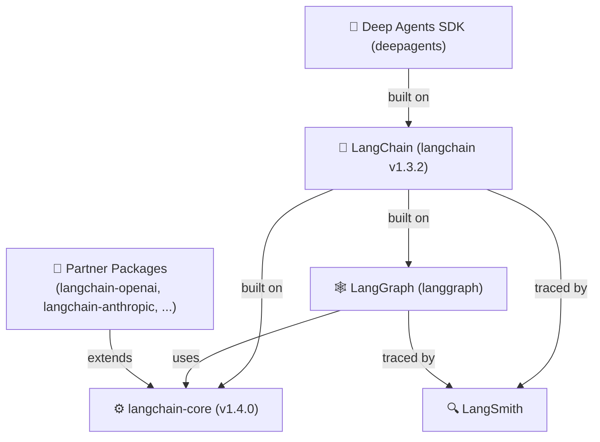
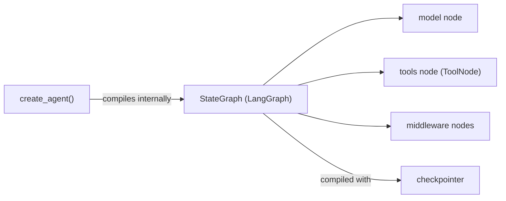
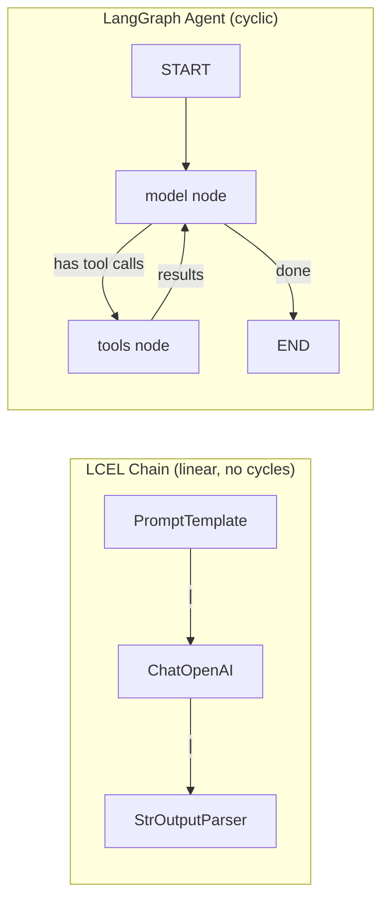
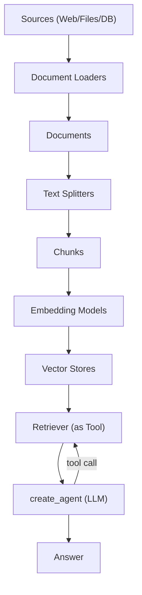
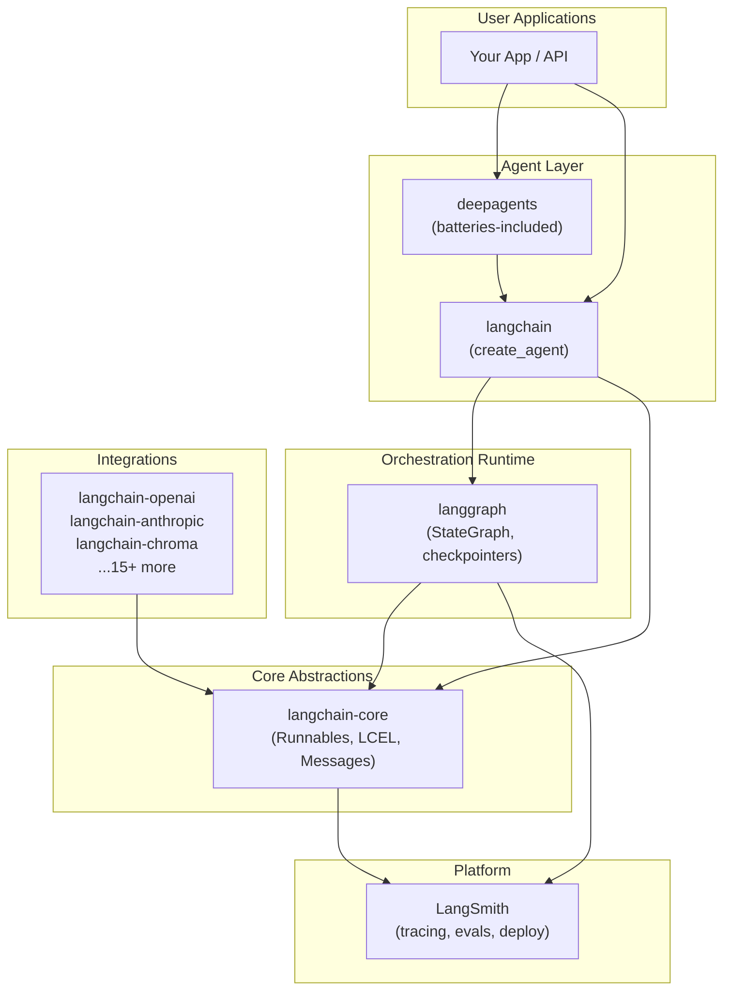

# LangChain Python — Comprehensive Overview

> **Source URL:** https://docs.langchain.com/oss/python/langchain/overview  
> **Research conducted:** 2026-05-31 | **Citations:** 50+ | **Sub-agent dispatches:** 9

---

## Executive Summary

LangChain is a Python framework for building agents and LLM-powered applications, described as **"the agent engineering platform."** As of 2025–2026, it has undergone a major architectural shift: the primary API is now `create_agent()` — a minimal, highly configurable harness (model + tools + prompt + middleware) built on top of **LangGraph** as the runtime. The framework lives in a monorepo at `langchain-ai/langchain` and ships five main packages: `langchain-core` (base abstractions), `langchain` (active v1 package), `langchain-classic` (legacy v1), `langchain-text-splitters`, and 15+ `langchain-<provider>` partner packages. The legacy `langchain-community` catch-all has been archived and sunset. The ecosystem spans 1,000+ integrations and is paired with **LangSmith** (observability/evaluation platform) and **LangGraph** (low-level orchestration runtime).

---

## Table of Contents

1. [Ecosystem Architecture](#1-ecosystem-architecture)
2. [Package Structure & Versions](#2-package-structure--versions)
3. [Installation](#3-installation)
4. [Core Concepts: LCEL & Runnables](#4-core-concepts-lcel--runnables)
5. [Chat Models & `init_chat_model`](#5-chat-models--init_chat_model)
6. [Agents: `create_agent` API](#6-agents-create_agent-api)
7. [LangGraph: Orchestration Runtime](#7-langgraph-orchestration-runtime)
8. [RAG: Retrieval-Augmented Generation](#8-rag-retrieval-augmented-generation)
9. [LangSmith: Observability & Evaluation](#9-langsmith-observability--evaluation)
10. [Integrations Ecosystem](#10-integrations-ecosystem)
11. [Key Repositories Summary](#11-key-repositories-summary)
12. [Confidence Assessment](#12-confidence-assessment)
13. [Footnotes](#footnotes)

---

## 1. Ecosystem Architecture

LangChain is organized as a **layered ecosystem**, not a single package[^1]:



| Layer | Package | Role |
|-------|---------|------|
| **Deep Agents** | `deepagents` | "Batteries-included": planning, subagents, filesystem, context compression |
| **LangChain** | `langchain` | Configurable harness: `create_agent`, `init_chat_model`, middleware |
| **LangGraph** | `langgraph` | Low-level runtime: durable execution, state machines, HITL, persistence |
| **langchain-core** | `langchain-core` | Base abstractions: Runnables, LCEL, messages, prompts. **No third-party integrations.** |
| **Platform** | LangSmith | Tracing, evaluation, debugging, deployment |

> **"Agent = Model + Harness."** The harness is everything around the model loop: the prompt, the tools, and any middleware that shapes behavior.[^2]

### When to Use Which

| Use Case | Recommended |
|----------|------------|
| Simple LLM call / pipeline | `langchain-core` LCEL chain |
| Agent with tools, standard loop | `create_agent` (LangChain) |
| Fine-grained cyclic workflow | LangGraph `StateGraph` directly |
| Long-running stateful workflows | LangGraph with checkpointer |
| Maximum capability, minimal setup | Deep Agents SDK |
| Tracing, evals, debugging | LangSmith |

---

## 2. Package Structure & Versions

The entire ecosystem lives in a **single monorepo** at [langchain-ai/langchain](https://github.com/langchain-ai/langchain) (138K+ ⭐)[^3]:

```
langchain-ai/langchain/
└── libs/
    ├── core/               # langchain-core v1.4.0
    ├── langchain_v1/       # langchain v1.3.2 (ACTIVELY MAINTAINED)
    ├── langchain/          # langchain-classic v1.0.7 (LEGACY — no new features)
    ├── partners/           # First-party: openai/, anthropic/, ollama/, groq/, ...
    ├── text-splitters/     # langchain-text-splitters v1.1.2
    ├── standard-tests/     # Standardized integration test suite
    └── model-profiles/     # Model capability/config profiles
```

### Package Versions

| PyPI Package | Version | Python | Source Path |
|-------------|---------|--------|-------------|
| `langchain-core` | **1.4.0** | ≥3.10 | `libs/core/` |
| `langchain` | **1.3.2** | ≥3.10 | `libs/langchain_v1/` |
| `langchain-classic` | **1.0.7** | ≥3.10 | `libs/langchain/` (LEGACY) |
| `langchain-text-splitters` | **1.1.2** | ≥3.10 | `libs/text-splitters/` |

### ⚠️ Important: `langchain-community` is SUNSET

`langchain-community` (the legacy catch-all integration repo) has been **officially archived** as of 2025. The repo at `langchain-ai/langchain-community` is marked archived with a note pointing to [issue #674](https://github.com/langchain-ai/langchain-community/issues/674) for migration guidance. Integrations have been moved to individual `langchain-<provider>` packages.[^4]

### `langchain-core` Abstractions (No third-party dependencies)[^5]

```python
# langchain-ai/langchain:libs/core/langchain_core/__init__.py
"""langchain-core defines the base abstractions for the LangChain ecosystem.
The interfaces for core components like chat models, LLMs, vector stores, retrievers,
and more are defined here. The universal invocation protocol (Runnables) along with
a syntax for combining components are also defined here.
**No third-party integrations are defined here.**
"""
```

Core dependencies: `langsmith>=0.3.45`, `pydantic>=2.7.4`, `tenacity>=8.1.0`

---

## 3. Installation

**Requires Python 3.10+**[^6]

```bash
# Core package
pip install -U langchain
# or with uv (recommended)
uv add langchain

# Provider integrations
pip install -U langchain-openai        # OpenAI / Azure OpenAI
pip install -U langchain-anthropic     # Anthropic Claude
pip install -U langchain-google-genai  # Google Gemini
pip install -U langchain-aws           # AWS Bedrock
pip install -U langchain-ollama        # Ollama (local models)
pip install -U langchain-groq          # Groq
pip install -U langchain-mistralai     # Mistral AI
pip install -U langchain-huggingface   # HuggingFace

# Convenience extras (equivalent to above)
pip install "langchain[openai]"
pip install "langchain[anthropic]"
pip install "langchain[google-genai]"
pip install "langchain[aws]"

# LangGraph (for agents with memory/HITL)
pip install langgraph

# Deep Agents (batteries-included)
pip install deepagents
```

### Environment Variables

```bash
# LangSmith tracing (highly recommended)
export LANGSMITH_TRACING="true"
export LANGSMITH_API_KEY="lsv2_..."

# Provider API keys
export OPENAI_API_KEY="sk-..."
export ANTHROPIC_API_KEY="sk-ant-..."
export GOOGLE_API_KEY="AIza..."
export GROQ_API_KEY="..."

# Azure OpenAI
export AZURE_OPENAI_API_KEY="..."
export AZURE_OPENAI_ENDPOINT="https://your-resource.openai.azure.com"
export AZURE_OPENAI_DEPLOYMENT_NAME="your-deployment"
export OPENAI_API_VERSION="2025-03-01-preview"

# AWS Bedrock
export AWS_ACCESS_KEY_ID="..."
export AWS_SECRET_ACCESS_KEY="..."
export AWS_REGION="us-east-1"
```

### Simplest Working Example

```python
from langchain.chat_models import init_chat_model

model = init_chat_model("openai:gpt-4o")
result = model.invoke("Hello, world!")
print(result.content)
```

---

## 4. Core Concepts: LCEL & Runnables

### 4.1 LangChain Expression Language (LCEL)

LCEL is a **declarative composition system** for building production-grade LLM programs using Python's `|` pipe operator to create `RunnableSequence` objects[^7]:

> *"LCEL offers a declarative method to build production-grade programs that harness the power of LLMs. Programs created using LCEL and LangChain Runnable objects inherently support synchronous, asynchronous, batch, and streaming operations."*

```python
# The LCEL grammar — every | creates a RunnableSequence
chain = prompt | model | output_parser

# Under the hood:
def __or__(self, other) -> RunnableSerializable:
    return RunnableSequence(self, coerce_to_runnable(other))
```

**`coerce_to_runnable()` automatic coercion:**
- Plain `Callable` → `RunnableLambda`
- `dict` of Runnables → `RunnableParallel`
- `Runnable` → passed through unchanged

### 4.2 The `Runnable` Interface

Every component in LangChain implements the `Runnable` interface[^8]:

```python
class Runnable(ABC, Generic[Input, Output]):
    """A unit of work that can be invoked, batched, streamed, transformed and composed."""
```

**Complete invocation API:**

| Method | Sync | Async | Description |
|--------|------|-------|-------------|
| Single | `invoke(input, config)` | `ainvoke(input, config)` | Returns one `Output` |
| Batch | `batch(inputs, config)` | `abatch(inputs, config)` | Returns `list[Output]`, runs in parallel |
| Batch (as completed) | `batch_as_completed(...)` | `abatch_as_completed(...)` | Yields results as finished |
| Stream | `stream(input, config)` | `astream(input, config)` | Yields output chunks progressively |
| Log stream | — | `astream_log(input, ...)` | Streams output + intermediate steps |
| Event stream | — | `astream_events(input, version="v2")` | Rich structured event stream |

**Modifier methods (return new Runnables):**

```python
runnable.with_retry(stop_after_attempt=3, wait_exponential_jitter=True)
runnable.with_fallbacks([fallback1, fallback2])
runnable.with_listeners(on_start=..., on_end=..., on_error=...)
runnable.configurable_fields(temperature=ConfigurableField(id="temp"))
runnable.configurable_alternatives(default_key="gpt4", claude=claude_model)
runnable.pick("output_key")         # Pick keys from dict output
runnable.assign(new_field=lambda x: x["field"] + 1)  # Add fields to dict
runnable.bind(stop=["\n"])          # Bind kwargs permanently
runnable.as_tool(name=None, description=None)  # Convert to BaseTool
```

### 4.3 All Runnable Types

From `langchain-core/runnables/__init__.py`[^9]:

| Class | Created By | Description |
|-------|-----------|-------------|
| `RunnableSequence` | `a \| b \| c` | Sequential chain — output of each is input to next |
| `RunnableParallel` / `RunnableMap` | `{"k1": r1, "k2": r2}` | Concurrent map — same input, dict of results |
| `RunnableLambda` | `RunnableLambda(fn)` | Wraps any Python callable |
| `RunnableGenerator` | `@chain` decorator | Wraps a generator function |
| `RunnablePassthrough` | `RunnablePassthrough()` | Identity — passes input unchanged |
| `RunnableAssign` | `.assign(new_key=fn)` | Extends dict output with new computed keys |
| `RunnablePick` | `.pick(keys)` | Selects subset of keys from dict output |
| `RunnableBranch` | `RunnableBranch(...)` | Conditional if/elif/else routing |
| `RunnableWithFallbacks` | `.with_fallbacks([...])` | Retry with alternate runnables on failure |
| `RunnableWithMessageHistory` | — | Auto-inject/persist chat history |
| `RunnableBinding` | `.bind(...)` | Wraps runnable with config/bound kwargs |
| `RouterRunnable` | — | Routes input to different runnables by key |

### 4.4 LCEL Code Examples

**Sequential Chain:**
```python
from langchain_core.prompts import ChatPromptTemplate
from langchain_core.output_parsers import StrOutputParser
from langchain_openai import ChatOpenAI

chain = (
    ChatPromptTemplate.from_template("Tell me about {topic}")
    | ChatOpenAI()
    | StrOutputParser()
)

result = chain.invoke({"topic": "quantum computing"})

# Streaming
for chunk in chain.stream({"topic": "quantum computing"}):
    print(chunk, end="", flush=True)

# Batch (concurrent)
results = chain.batch([{"topic": "cats"}, {"topic": "dogs"}, {"topic": "birds"}])
```

**Parallel Chain:**
```python
from langchain_core.runnables import RunnableParallel

runnable = RunnableParallel(
    joke=ChatPromptTemplate.from_template("Tell a joke about {topic}") | model,
    poem=ChatPromptTemplate.from_template("Write a poem about {topic}") | model,
)
result = runnable.invoke({"topic": "cats"})
# {'joke': AIMessage(...), 'poem': AIMessage(...)} — both fire concurrently!
```

**Passthrough (RAG chain):**
```python
from langchain_core.runnables import RunnablePassthrough

rag_chain = (
    {"context": retriever, "question": RunnablePassthrough()}
    | ChatPromptTemplate.from_template("Answer using context:\n{context}\n\nQuestion: {question}")
    | ChatOpenAI()
)
rag_chain.invoke("What's in the document?")
```

**Branching:**
```python
from langchain_core.runnables import RunnableBranch

branch = RunnableBranch(
    (lambda x: "technical" in x["classification"], technical_chain),
    (lambda x: "creative" in x["classification"], creative_chain),
    default_chain,  # fallback — last arg has no condition
)
```

**`@chain` Decorator:**
```python
from langchain_core.runnables import chain

@chain
def my_chain(topic: str):
    result = (prompt | model | StrOutputParser()).invoke({"topic": topic})
    yield result.upper()

my_chain.invoke("cats")
my_chain.stream("cats")
my_chain.batch(["cats", "dogs"])
```

**Streaming Events (v2):**
```python
async for event in chain.astream_events({"topic": "AI"}, version="v2"):
    if event["event"] == "on_llm_stream":
        print(event["data"]["chunk"].content, end="")
```

---

## 5. Chat Models & `init_chat_model`

### Universal Initialization[^10]

```python
from langchain.chat_models import init_chat_model

# Provider:model string format
model = init_chat_model("openai:gpt-4o")
model = init_chat_model("anthropic:claude-3-5-sonnet-20241022")
model = init_chat_model("google_genai:gemini-2.0-flash")
model = init_chat_model("azure_openai:gpt-4o",
                        azure_deployment=os.environ["AZURE_OPENAI_DEPLOYMENT_NAME"])
model = init_chat_model("anthropic.claude-3-5-sonnet-20240620-v1:0",
                        model_provider="bedrock_converse")

# With parameters
model = init_chat_model(
    "openai:gpt-4o",
    temperature=0.5,
    timeout=300,
    max_tokens=25000,
    max_retries=6,  # Default: auto-retry on 429/5xx with exponential backoff+jitter
)
```

### Direct Class Instantiation

```python
from langchain_openai import ChatOpenAI
from langchain_anthropic import ChatAnthropic
from langchain_google_genai import ChatGoogleGenerativeAI
from langchain_aws import ChatBedrock

model = ChatOpenAI(model="gpt-4o")
model = ChatAnthropic(model="claude-3-5-sonnet-20241022")
model = ChatGoogleGenerativeAI(model="gemini-2.0-flash")
model = ChatBedrock(model="anthropic.claude-3-5-sonnet-20240620-v1:0")
```

### Invocation Patterns

```python
# Single string
response = model.invoke("Why do parrots talk?")
print(response.text)

# Conversation — dict format
response = model.invoke([
    {"role": "system", "content": "You are a helpful assistant."},
    {"role": "user", "content": "Hello!"},
])

# Conversation — message objects
from langchain.messages import HumanMessage, AIMessage, SystemMessage
response = model.invoke([
    SystemMessage("You translate English to French."),
    HumanMessage("I love programming."),
    AIMessage("J'adore la programmation."),
    HumanMessage("I love building apps."),
])

# Streaming
for chunk in model.stream("Explain quantum computing"):
    print(chunk.text, end="", flush=True)

# Stream with reasoning + tool calls
for chunk in model.stream("What color is the sky?"):
    for block in chunk.content_blocks:
        if block["type"] == "reasoning":
            print(f"Reasoning: {block.get('reasoning')}")
        elif block["type"] == "tool_call_chunk":
            print(f"Tool call: {block}")
        elif block["type"] == "text":
            print(block["text"])

# Batch
responses = model.batch(["Question 1", "Question 2", "Question 3"])
```

### Advanced Capabilities

```python
# Tool calling
model_with_tools = model.bind_tools([search_tool, calculator_tool])

# Structured output (returns a Pydantic model instance)
class PersonInfo(BaseModel):
    name: str
    age: int

model_structured = model.with_structured_output(PersonInfo)
result: PersonInfo = model_structured.invoke("Extract info: John is 30 years old.")
```

### Model Parameters

| Parameter | Default | Description |
|-----------|---------|-------------|
| `model` | required | Model identifier (`"provider:name"` or just `"name"`) |
| `temperature` | varies | Randomness (0=deterministic, 1=creative) |
| `max_tokens` | varies | Max output tokens |
| `timeout` | varies | Seconds before canceling request |
| `max_retries` | **6** | Auto-retries on 429/5xx with exponential backoff + jitter |
| `api_key` | from env var | Provider API key |

---

## 6. Agents: `create_agent` API

### Core Concept[^11]

```
Agent = Model + Harness

Agent Loop:
1. User sends message
2. Model receives full context (system prompt + message history)
3. Model generates either:
   a. Tool calls → tools execute → results fed back to model
   b. Final response → returned to user
4. Loop repeats at step 3 until final response
```

### Full API Signature[^12]

```python
from langchain.agents import create_agent
from langgraph.checkpoint.memory import InMemorySaver
from langchain_core.utils.uuid import uuid7

agent = create_agent(
    model="openai:gpt-4o",           # str or initialized model instance
    tools=[search, calculator],       # Python callables, LangChain tools, or tool dicts
    system_prompt="You are a helpful assistant. Be concise.",
    name="research_assistant",        # Node name in multi-agent systems
    response_format=MyPydanticModel,  # Structured output schema
    context_schema=UserContext,       # Defines per-run context shape (dataclass)
    state_schema=CustomState,         # Extend the state schema
    checkpointer=InMemorySaver(),     # Enable conversation persistence (LangGraph)
    middleware=[FilesystemMiddleware()],
)
```

### Invocation Patterns

```python
# Basic invoke
result = agent.invoke({
    "messages": [{"role": "user", "content": "What's the weather in SF?"}]
})
print(result["messages"][-1].content_blocks)

# Multi-turn conversation (requires checkpointer)
config = {"configurable": {"thread_id": str(uuid7())}}
result = agent.invoke(
    {"messages": [{"role": "user", "content": "What's the weather in SF?"}]},
    config=config,
)
result = agent.invoke(
    {"messages": [{"role": "user", "content": "What about tomorrow?"}]},
    config=config,  # same thread_id → reuses history
)

# Per-run context (user IDs, API keys, feature flags)
result = agent.invoke(
    {"messages": [{"role": "user", "content": "What's my balance?"}]},
    config={"configurable": {"thread_id": str(uuid7())}},
    context=UserContext(user_id="user-123"),
)

# Structured output
class Answer(BaseModel):
    summary: str
    confidence: float

agent = create_agent("openai:gpt-4o", tools=tools, response_format=Answer)
result = agent.invoke({"messages": [{"role": "user", "content": "Summarize AI trends"}]})
result["structured_response"]  # Answer(summary=..., confidence=...)
```

### Streaming

```python
# Stream agent steps
for chunk in agent.stream(
    {"messages": [{"role": "user", "content": "Search for AI news"}]},
    stream_mode="values",
):
    latest_message = chunk["messages"][-1]
    if latest_message.content:
        print(f"Agent: {latest_message.content}")
    elif latest_message.tool_calls:
        print(f"Calling tools: {[tc['name'] for tc in latest_message.tool_calls]}")
```

### Tools

```python
# Option 1: Plain Python function (docstring = tool description)
def get_weather(city: str) -> str:
    """Get weather for a given city."""
    return f"It's always sunny in {city}!"

# Option 2: @tool decorator
from langchain.tools import tool

@tool
def search(query: str) -> str:
    """Search for information on the web."""
    return f"Results for: {query}"

# Option 3: @tool with artifact output (for RAG)
@tool(response_format="content_and_artifact")
def retrieve(query: str):
    """Retrieve relevant documents."""
    docs = vector_store.similarity_search(query, k=2)
    return "\n\n".join(d.page_content for d in docs), docs

agent = create_agent("openai:gpt-4o", tools=[get_weather, search, retrieve])
```

### Middleware System[^13]

Middleware is the core extensibility primitive for `create_agent`:

| Category | Examples |
|----------|---------|
| **Execution environment** | `FilesystemMiddleware`, sandbox integration, code execution |
| **Context management** | Summarization, memory management, prompt caching |
| **Planning & delegation** | Todo lists, subagents for parallel work |
| **Fault tolerance** | Retries, fallbacks, call limits |
| **Guardrails** | PII detection, content controls |
| **Steering** | Human-in-the-loop approval before high-impact actions |

### Provider Compatibility

| Provider | Install | Model String |
|----------|---------|-------------|
| OpenAI | `langchain[openai]` | `"openai:gpt-4o"` |
| Anthropic | `langchain[anthropic]` | `"anthropic:claude-3-5-sonnet-20241022"` |
| Google Gemini | `langchain[google-genai]` | `"google_genai:gemini-2.0-flash"` |
| Azure OpenAI | `langchain[openai]` | `"azure_openai:gpt-4o"` |
| AWS Bedrock | `langchain[aws]` | `"anthropic.claude-3-5-sonnet-20240620-v1:0"` + `model_provider="bedrock_converse"` |
| HuggingFace | `langchain[huggingface]` | `"microsoft/Phi-3-mini-4k-instruct"` + `model_provider="huggingface"` |
| Ollama | `langchain-ollama` | `"ollama:llama3.2"` |
| OpenRouter | `langchain-openrouter` | `"openrouter:anthropic/claude-3-5-sonnet"` |
| Groq | `langchain-groq` | `"groq:llama-3.1-70b-versatile"` |
| Fireworks | `langchain-fireworks` | `"fireworks:accounts/fireworks/models/..."` |

---

## 7. LangGraph: Orchestration Runtime

### What is LangGraph[^14]

LangGraph is a **low-level orchestration runtime** inspired by Google's Pregel and Apache Beam. It runs stateful, long-running agent workflows as **directed graphs — including cyclic ones** (which LCEL chains cannot do). As of LangChain v1, `create_agent` is built directly on top of LangGraph.

> *"LangGraph is the orchestration runtime: durable execution, streaming, human-in-the-loop, and persistence. LangChain is the agent framework: abstractions and integrations for models, tools, and agent loops."*

### Architecture Relationship



From `langchain-ai/langchain:libs/langchain_v1/langchain/agents/factory.py`[^15]:

```python
# create_agent internally uses:
from langgraph.graph.state import StateGraph
from langgraph.prebuilt.tool_node import ToolNode
from langgraph.types import Command, Send
# ...
graph = StateGraph(state_schema)
graph.add_node("model", model_node)
graph.add_node("tools", ToolNode(tools))
# + middleware nodes
return graph.compile(checkpointer=checkpointer, ...)
```

### StateGraph, Nodes & Edges[^16]

```python
from langgraph.graph import StateGraph, START, END, MessagesState
from typing import Annotated, TypedDict
import operator

# State = shared memory across all nodes
class AgentState(TypedDict):
    messages: Annotated[list, operator.add]  # reducer: append new messages
    llm_calls: int

graph = StateGraph(AgentState)

# Nodes = functions returning partial state updates
def model_node(state: AgentState):
    response = model_with_tools.invoke(state["messages"])
    return {"messages": [response], "llm_calls": state["llm_calls"] + 1}

def tool_node(state: AgentState):
    results = []
    for tc in state["messages"][-1].tool_calls:
        result = tools_by_name[tc["name"]].invoke(tc["args"])
        results.append(ToolMessage(content=str(result), tool_call_id=tc["id"]))
    return {"messages": results}

# Edges
graph.add_node("model", model_node)
graph.add_node("tools", tool_node)
graph.add_edge(START, "model")
graph.add_conditional_edges(
    "model",
    lambda s: "tools" if s["messages"][-1].tool_calls else END,
    ["tools", END]
)
graph.add_edge("tools", "model")  # ← CYCLE: tools loop back to model

from langgraph.checkpoint.memory import InMemorySaver
agent = graph.compile(checkpointer=InMemorySaver())
```

### Human-in-the-Loop (HITL)[^17]

```python
from langgraph.types import interrupt, Command

def approval_node(state: State):
    # Pauses execution; saves state; resumes only when Command(resume=...) is sent
    approved = interrupt("Do you approve this action?")
    return {"approved": approved}

# Resume flow
from langgraph.checkpoint.memory import InMemorySaver
graph = workflow.compile(checkpointer=InMemorySaver())
config = {"configurable": {"thread_id": "thread-1"}}

# Step 1: Run until interrupt
stream = graph.stream_events({"input": "data"}, config=config, version="v3")
_ = stream.output

# Step 2: Resume with human response
resumed = graph.stream_events(Command(resume=True), config=config, version="v3")
```

### Persistence & Checkpointing[^18]

At each **super-step**, LangGraph writes a `StateSnapshot` checkpoint. This enables:
- **Memory**: Repeat invocations reuse same `thread_id`
- **HITL**: State survives while waiting for human input
- **Time travel**: Replay or fork from any prior checkpoint
- **Fault tolerance**: Resume from last successful step after failures

```python
# Inspect state
snapshot = graph.get_state(config)
# snapshot.values → {'messages': [...]}
# snapshot.next → ()  (done)

# Full history
history = list(graph.get_state_history(config))

# Time travel: fork from specific checkpoint
config_at_step_1 = {"configurable": {"thread_id": "1", "checkpoint_id": "<id>"}}
graph.invoke(new_input, config_at_step_1)
```

### Functional API (Alternative)

```python
from langgraph.func import entrypoint, task

@task
def call_llm(messages):
    return model_with_tools.invoke(messages)

@task
def call_tool(tool_call):
    return tools_by_name[tool_call["name"]].invoke(tool_call)

@entrypoint()
def agent(messages):
    response = call_llm(messages).result()
    while response.tool_calls:
        tool_results = [call_tool(tc).result() for tc in response.tool_calls]
        messages = add_messages(messages, [response, *tool_results])
        response = call_llm(messages).result()
    return response
```

---

## 8. RAG: Retrieval-Augmented Generation

### Architecture Shift (2025)[^19]

**`RetrievalQA` and `create_retrieval_chain` are deprecated** as of langchain v0.1.17–v0.2.13. The modern approach uses **`create_agent` + tool-based retrieval**.

**Three RAG Architectures:**

| Architecture | Description | When to Use |
|---|---|---|
| **Agentic RAG** | Agent *decides when/how* to retrieve via tool calls | Variable queries, multi-step reasoning |
| **2-Step RAG** | Retrieval always precedes generation (predictable pipeline) | Fast, deterministic answers |
| **Hybrid RAG** | Query enhancement + retrieval + validation loop | High-accuracy requirements |

### Complete RAG Pipeline

```python
# pip install langchain langchain-openai langchain-text-splitters langchain-community bs4 requests
import bs4, requests
from langchain.agents import create_agent
from langchain.chat_models import init_chat_model
from langchain.tools import tool
from langchain_core.documents import Document
from langchain_text_splitters import RecursiveCharacterTextSplitter
from langchain_openai import OpenAIEmbeddings
from langchain_community.vectorstores import FAISS

# === 1. INDEXING PHASE ===
def load_web_page(url: str) -> list[Document]:
    soup = bs4.BeautifulSoup(requests.get(url).text, "html.parser")
    return [Document(page_content=soup.get_text(), metadata={"source": url})]

docs = load_web_page("https://example.com/article")
chunks = RecursiveCharacterTextSplitter(
    chunk_size=1000, chunk_overlap=200
).split_documents(docs)

vector_store = FAISS.from_documents(chunks, OpenAIEmbeddings(model="text-embedding-3-large"))

# === 2. RETRIEVAL TOOL ===
@tool(response_format="content_and_artifact")
def retrieve_context(query: str):
    """Retrieve information to help answer a query."""
    docs = vector_store.similarity_search(query, k=2)
    return "\n\n".join(f"Source: {d.metadata}\nContent: {d.page_content}" for d in docs), docs

# === 3. AGENT ===
model = init_chat_model("openai:gpt-4o")
agent = create_agent(
    model,
    [retrieve_context],
    system_prompt="Use the tool to help answer queries. Say 'I don't know' if context is insufficient.",
)

for step in agent.stream(
    {"messages": [{"role": "user", "content": "What is task decomposition?"}]},
    stream_mode="values",
):
    step["messages"][-1].pretty_print()
```

### Document Data Structures

```python
# Document — core data container for RAG
class Document(BaseMedia):
    page_content: str          # The text content
    id: str | None = None      # Optional UUID identifier
    metadata: dict = {}        # Source, page, author, etc.

# Blob — raw binary/text for loaders
blob = Blob.from_path("path/to/file.pdf")
blob = Blob.from_data("Hello, world!", mime_type="text/plain")
```

### Text Splitters[^20]

From `langchain-text-splitters`:

| Splitter | Best For | Key Params |
|----------|----------|-----------|
| **`RecursiveCharacterTextSplitter`** | **Most recommended** — tries `\n\n, \n, " ", ""` recursively | `chunk_size=1000`, `chunk_overlap=200` |
| `CharacterTextSplitter` | Simple single-separator splits | `separator`, `chunk_size` |
| `TokenTextSplitter` | Token-count based (tiktoken) | `chunk_size`, `encoding_name` |
| `MarkdownHeaderTextSplitter` | Markdown docs (preserves headers) | `headers_to_split_on` |
| `HTMLHeaderTextSplitter` | HTML docs | `headers_to_split_on` |
| `PythonCodeTextSplitter` | Python source code | inherits recursive |
| `RecursiveJsonSplitter` | JSON structures | `max_chunk_size` |

```python
# Language-specific splitting
splitter = RecursiveCharacterTextSplitter.from_language(
    Language.PYTHON,  # JS, TS, GO, RUST, JAVA, CPP, etc.
    chunk_size=500,
    chunk_overlap=50
)
```

### Vector Store Interface[^21]

```python
# Standard API on all vector stores
vector_store.add_documents(documents=..., ids=...)
vector_store.update_documents(ids=..., documents=...)
vector_store.delete(ids=...)
vector_store.similarity_search(query, k=4, filter={...})
vector_store.similarity_search_with_score(query, k=4)
vector_store.similarity_search_by_vector(embedding=..., k=4)

# Create retriever from vector store
retriever = vector_store.as_retriever(
    search_type="mmr",   # or "similarity", "similarity_score_threshold"
    search_kwargs={"k": 4, "fetch_k": 20}
)
```

### Retriever Types[^22]

| Retriever | Description |
|-----------|-------------|
| `VectorStoreRetriever` | Basic semantic similarity search |
| `EnsembleRetriever` | Weighted RRF fusion of multiple retrievers (e.g., BM25 + FAISS) |
| `ContextualCompressionRetriever` | Post-processes docs with compressor (LLM extract, reranker) |
| `MultiQueryRetriever` | LLM generates N alt queries, unions unique results |
| `MultiVectorRetriever` | Multiple embeddings per doc (summaries + raw) |
| `ParentDocumentRetriever` | Indexes small chunks, returns full parent documents |
| `SelfQueryRetriever` | Translates NL into structured metadata filters |
| `TimeWeightedVectorStoreRetriever` | Weights by similarity + recency |
| `BM25Retriever` | Keyword/sparse retrieval (lexical) |
| `EnsembleRetriever` w/ BM25+FAISS | Hybrid semantic + keyword |

**Hybrid Retrieval with EnsembleRetriever:**

```python
from langchain_classic.retrievers import EnsembleRetriever
from langchain_community.retrievers import BM25Retriever

bm25_retriever = BM25Retriever.from_texts(texts, k=4)
faiss_retriever = faiss_store.as_retriever(search_kwargs={"k": 4})

# 60% semantic, 40% keyword via Reciprocal Rank Fusion
ensemble = EnsembleRetriever(
    retrievers=[faiss_retriever, bm25_retriever],
    weights=[0.6, 0.4],
)
```

---

## 9. LangSmith: Observability & Evaluation

### Overview[^23]

LangSmith is LangChain's framework-agnostic observability and evaluation platform. It has **four core pillars**:

1. **Observability** — Full-stack tracing of every LLM call, chain, tool invocation, retrieval step
2. **Evaluation** — Offline (pre-ship) and online (production) evaluation with LLM-as-judge, human annotation
3. **Deployment** — Deploy agents as "Agent Servers" with 1-click deploy
4. **Fleet / Prompt Engineering** — Visual no-code agent builder, prompt versioning, A/B testing

### Enabling Tracing

**Method 1: Zero-code (env vars) — Recommended**

```bash
export LANGSMITH_TRACING=true
export LANGSMITH_API_KEY=ls_...
export LANGSMITH_PROJECT="my-project"   # optional; defaults to "default"
```

Once set, **all LangChain/LangGraph code traces automatically with zero code changes.**

**Method 2: `@traceable` decorator (framework-agnostic)**

```python
from langsmith import traceable
from langsmith.wrappers import wrap_openai
import openai

client = wrap_openai(openai.Client())  # auto-traces LLM calls

@traceable(
    run_type="chain",
    name="MyPipeline",
    metadata={"env": "prod"},
    tags=["v2", "experiment"],
)
def pipeline(user_input: str) -> str:
    result = client.chat.completions.create(
        messages=[{"role": "user", "content": user_input}],
        model="gpt-4o"
    )
    return result.choices[0].message.content
```

**Method 3: Context manager (selective)**

```python
import langsmith as ls

with ls.tracing_context(enabled=True, project_name="My Project"):
    chain.invoke({"question": "Am I being traced?"})

with ls.tracing_context(enabled=False):
    chain.invoke(...)  # NOT traced
```

### Trace Data Model

```
Project
  └── Trace (one per user request)
        └── Run (span: LLM call, tool, chain, retriever, embedding)
              └── child Runs (nested)

Thread = linked Traces across multi-turn conversations
         (linked by metadata: session_id / thread_id)
```

Per-run captured data: `name`, `run_type`, `inputs`, `outputs`, `error`, `tags`, `metadata`, `start_time`, `end_time`, token usage.

### Evaluation API[^24]

```python
from langsmith import evaluate, Client

def my_evaluator(run, example):
    return {"score": 0.9, "value": "CORRECT"}

results = evaluate(
    lambda inputs: my_app(inputs),
    data=dataset,
    evaluators=[my_evaluator],
    experiment_prefix="v2-test"
)
```

**Pytest integration:**
```python
from langsmith import test, expect

@test
def test_my_pipeline():
    result = pipeline("What is 2+2?")
    expect(result).to_contain("4")
```

### SDK API

```python
from langsmith import (
    Client, AsyncClient,
    traceable, trace, tracing_context,
    get_current_run_tree, get_tracing_context,
    evaluate, aevaluate,
    EvaluationResult, RunEvaluator,
    test, unit, expect,
)
```

### Pricing Tiers (LangSmith)[^25]

| | Developer (Free) | Plus | Enterprise |
|---|---|---|---|
| Traces | 5k/mo base + PAYG | 10k/mo + PAYG | Custom |
| Seats | 1 | Unlimited (+$39/seat/mo) | Custom |
| Compliance | — | Cloud (US/EU) | HIPAA, SOC 2, GDPR |
| Hosting | Cloud | Cloud | Cloud / Self-hosted VPC |

Sign up at `smith.langchain.com`.

---

## 10. Integrations Ecosystem

### 1,000+ Integrations[^26]

| Category | Count | Key Options |
|----------|-------|-------------|
| Chat models | 40+ | OpenAI, Anthropic, Google, AWS, Ollama, Groq, Mistral... |
| Embedding models | 30+ | OpenAI, Cohere, HuggingFace, Nomic, Ollama... |
| Vector stores | 50+ | Chroma, Pinecone, Qdrant, Milvus, MongoDB, PGVector... |
| Document loaders | 100+ | Web, PDF, CSV, Office, Cloud, DB, YouTube... |
| Tools | 50+ | Tavily, Exa, DuckDuckGo, SQL, APIs, MCP... |
| Retrievers | 30+ | BM25, Arxiv, Wikipedia, Cohere, Kendra... |

### First-Party Partner Packages (in monorepo)[^27]

| Provider | Package | LLM | Embeddings | Vector Store |
|----------|---------|-----|-----------|-------------|
| OpenAI | `langchain-openai` | ✅ | ✅ | — |
| Anthropic | `langchain-anthropic` | ✅ | — | — |
| Google GenAI | `langchain-google-genai` | ✅ | ✅ | — |
| Google Vertex AI | `langchain-google-vertexai` | ✅ | ✅ | — |
| AWS | `langchain-aws` | ✅ | ✅ | — |
| Ollama | `langchain-ollama` | ✅ | ✅ | — |
| Groq | `langchain-groq` | ✅ | — | — |
| HuggingFace | `langchain-huggingface` | ✅ | ✅ | — |
| MistralAI | `langchain-mistralai` | ✅ | ✅ | — |
| Chroma | `langchain-chroma` | — | — | ✅ |
| Qdrant | `langchain-qdrant` | — | — | ✅ |
| Nomic | `langchain-nomic` | — | ✅ | — |
| DeepSeek | `langchain-deepseek` | ✅ | — | — |
| xAI (Grok) | `langchain-xai` | ✅ | — | — |
| Fireworks | `langchain-fireworks` | ✅ | ✅ | — |
| Perplexity | `langchain-perplexity` | ✅ | — | — |
| OpenRouter | `langchain-openrouter` | ✅ | — | — |

### Document Loader Categories

| Category | Examples |
|----------|---------|
| **Web** | `WebBaseLoader`, `RecursiveUrlLoader`, `SitemapLoader` |
| **Files** | `TextLoader`, `CSVLoader`, `PyPDFLoader`, `PDFPlumberLoader`, `PyMuPDFLoader` |
| **Office** | `Docx2txtLoader`, `UnstructuredWordDocumentLoader`, `UnstructuredExcelLoader` |
| **Cloud** | `GoogleDriveLoader`, `S3FileLoader`, `AzureBlobStorageFileLoader` |
| **Collaboration** | `NotionDirectoryLoader`, `ConfluenceLoader`, `SlackDirectoryLoader` |
| **Code** | `GitLoader`, `NotebookLoader` |
| **Database** | `SQLDatabaseLoader` |
| **Research** | `ArxivLoader`, `PubMedLoader`, `WikipediaLoader` |

---

## 11. Key Repositories Summary

| Repository | Stars | Purpose |
|-----------|-------|---------|
| [langchain-ai/langchain](https://github.com/langchain-ai/langchain) | 138K+ ⭐ | Main Python monorepo (core, agents, partners) |
| [langchain-ai/langgraph](https://github.com/langchain-ai/langgraph) | N/A | LangGraph runtime: StateGraph, checkpointers, HITL |
| [langchain-ai/langsmith-sdk](https://github.com/langchain-ai/langsmith-sdk) | 910 ⭐ | LangSmith Python + JS/TS client SDK |
| [langchain-ai/docs](https://github.com/langchain-ai/docs) | 343 ⭐ | Unified documentation source |
| [langchain-ai/langchain-community](https://github.com/langchain-ai/langchain-community) | 283 ⭐ | ⚠️ **ARCHIVED** — legacy integrations, sunset 2025 |
| [langchain-ai/langchain-google](https://github.com/langchain-ai/langchain-google) | N/A | Google (Vertex AI, GenAI) integrations |
| [langchain-ai/langchain-aws](https://github.com/langchain-ai/langchain-aws) | N/A | AWS Bedrock integrations |

---

## 12. Architecture Diagrams

### LCEL Chain vs. Agent Flow



### RAG Pipeline Flow



### Full LangChain Ecosystem



---

## 13. Confidence Assessment

| Topic | Confidence | Notes |
|-------|-----------|-------|
| Package structure & versions | ✅ **High** | Directly from `pyproject.toml` files in the monorepo |
| `create_agent` API parameters | ✅ **High** | From official docs + `factory.py` source |
| LCEL/Runnable interface | ✅ **High** | From `runnables/base.py` source code |
| LangGraph concepts (StateGraph, HITL) | ✅ **High** | From official LangGraph docs |
| LangSmith features & pricing | ✅ **High** | From official LangSmith docs and pricing page |
| RAG patterns | ✅ **High** | From official tutorials + source code |
| `langchain-community` sunset | ✅ **High** | GitHub repo confirmed archived, issue #674 referenced |
| Model names (`gpt-5.4`, `claude-sonnet-4-6`) | ⚠️ **Medium** | From docs as-of research date; model names change frequently — verify against provider APIs |
| Provider integration counts ("1,000+") | ⚠️ **Medium** | From official docs marketing copy; exact count fluctuates |
| `langchain-protocol` internals | ⚠️ **Low** | Listed as core dependency but not found as public repo |

**Key Assumption:** The docs at `docs.langchain.com/oss/python/langchain/overview` and `python.langchain.com/docs/introduction/` now resolve to the same canonical page. All old concept URLs (`/docs/concepts/*`) redirect to the overview.

---

## Footnotes

[^1]: [langchain-ai/langchain README](https://github.com/langchain-ai/langchain/blob/ddb6937/README.md) — Ecosystem overview and hierarchy

[^2]: [docs.langchain.com/oss/python/langchain/overview](https://docs.langchain.com/oss/python/langchain/overview) — "Agent = Model + Harness" definition

[^3]: [langchain-ai/langchain:libs/README.md](https://github.com/langchain-ai/langchain/blob/main/libs/README.md) — Monorepo structure

[^4]: [langchain-ai/langchain-community](https://github.com/langchain-ai/langchain-community) — Archived repo, issue #674 migration guidance

[^5]: [langchain-ai/langchain:libs/core/langchain_core/__init__.py](https://github.com/langchain-ai/langchain/blob/main/libs/core/langchain_core/__init__.py) — Core package docstring

[^6]: [docs.langchain.com/oss/python/langchain/install](https://docs.langchain.com/oss/python/langchain/install) — Installation instructions

[^7]: [langchain-ai/langchain:libs/core/langchain_core/runnables/__init__.py](https://github.com/langchain-ai/langchain/blob/d619bfa/libs/core/langchain_core/runnables/__init__.py) — LCEL docstring and full `__all__` exports

[^8]: [langchain-ai/langchain:libs/core/langchain_core/runnables/base.py](https://github.com/langchain-ai/langchain/blob/3a9b0cd/libs/core/langchain_core/runnables/base.py) — `Runnable` ABC definition, all methods

[^9]: langchain-ai/langchain:libs/core/langchain_core/runnables/__init__.py:55-89 — Full `__all__` export list (commit SHA `d619bfa`)

[^10]: [docs.langchain.com/oss/python/langchain/models](https://docs.langchain.com/oss/python/langchain/models) — `init_chat_model` documentation

[^11]: [docs.langchain.com/oss/python/langchain/agents](https://docs.langchain.com/oss/python/langchain/agents) — Agent concept and loop documentation

[^12]: [docs.langchain.com/oss/python/langchain/agents](https://docs.langchain.com/oss/python/langchain/agents) — `create_agent` full API signature

[^13]: [docs.langchain.com/oss/python/langchain/agents](https://docs.langchain.com/oss/python/langchain/agents) — Middleware system documentation

[^14]: [langchain-ai/langgraph README](https://github.com/langchain-ai/langgraph/blob/main/README.md) — LangGraph definition and inspiration (Pregel/Beam)

[^15]: [langchain-ai/langchain:libs/langchain_v1/langchain/agents/factory.py:1-30](https://github.com/langchain-ai/langchain/blob/main/libs/langchain_v1/langchain/agents/factory.py) — `create_agent` imports LangGraph internals

[^16]: [langchain-ai/langgraph:libs/langgraph/langgraph/graph/__init__.py](https://github.com/langchain-ai/langgraph/blob/main/libs/langgraph/langgraph/graph/__init__.py) — `StateGraph`, `MessagesState`, `add_messages`, `START`, `END` exports

[^17]: [docs.langchain.com/oss/python/langgraph/interrupts](https://docs.langchain.com/oss/python/langgraph/interrupts) — `interrupt()`, `Command(resume=...)` documentation

[^18]: [docs.langchain.com/oss/python/langgraph/persistence](https://docs.langchain.com/oss/python/langgraph/persistence) — Checkpointing, threads, StateSnapshot, time travel

[^19]: [langchain-ai/langchain:libs/langchain/langchain_classic/chains/retrieval.py](https://github.com/langchain-ai/langchain/blob/main/libs/langchain/langchain_classic/chains/retrieval.py) — `create_retrieval_chain` (deprecated)

[^20]: [langchain-ai/langchain:libs/text-splitters/langchain_text_splitters/__init__.py](https://github.com/langchain-ai/langchain/blob/main/libs/text-splitters/langchain_text_splitters/__init__.py) — Full text splitter catalog

[^21]: [docs.langchain.com/oss/python/integrations/vectorstores/chroma](https://docs.langchain.com/oss/python/integrations/vectorstores/chroma) — Vector store standard API

[^22]: [langchain-ai/langchain:libs/langchain/langchain_classic/retrievers/__init__.py](https://github.com/langchain-ai/langchain/blob/main/libs/langchain/langchain_classic/retrievers/__init__.py) — Full retriever catalog

[^23]: [docs.langchain.com/langsmith/observability](https://docs.langchain.com/langsmith/observability) — LangSmith four pillars overview

[^24]: [langchain-ai/langsmith-sdk:python/langsmith/evaluation/__init__.py](https://github.com/langchain-ai/langsmith-sdk/blob/main/python/langsmith/evaluation/__init__.py) — Evaluation API exports (v0.8.7)

[^25]: [langchain.com/pricing](https://langchain.com/pricing) — LangSmith pricing tiers

[^26]: [docs.langchain.com/oss/python/integrations/providers/overview](https://docs.langchain.com/oss/python/integrations/providers/overview) — "1,000+ integrations" claim and full provider table

[^27]: [langchain-ai/langchain:libs/partners/](https://github.com/langchain-ai/langchain/tree/main/libs/partners) — First-party partner packages directory listing

---

*Report generated by GitHub Copilot research agent. All findings sourced from official LangChain GitHub repositories and documentation. Verify rapidly-changing details (model names, package versions) against current provider documentation before use in production.*
