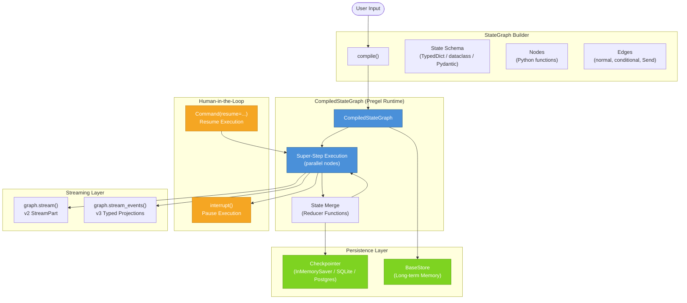
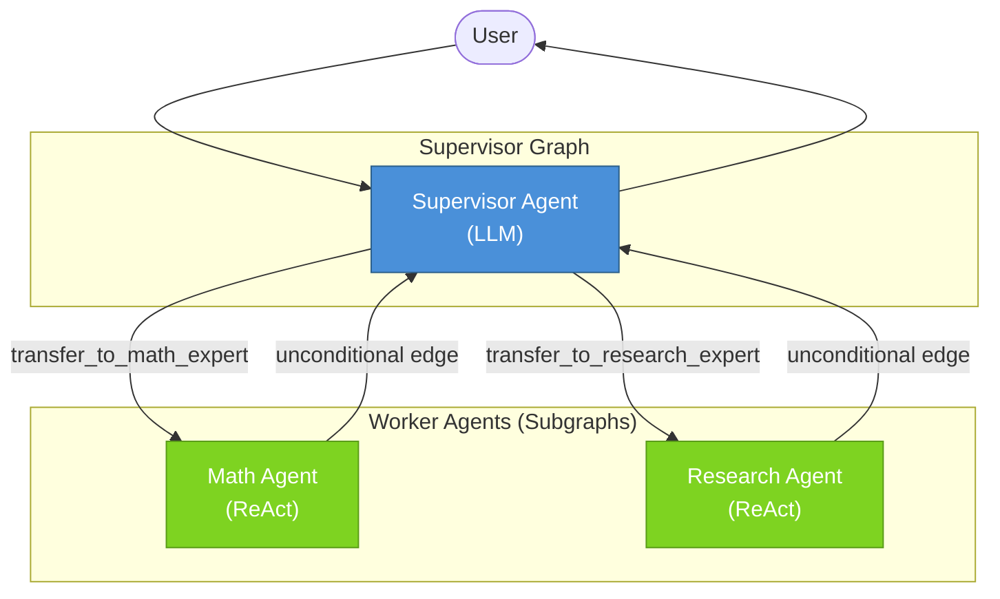
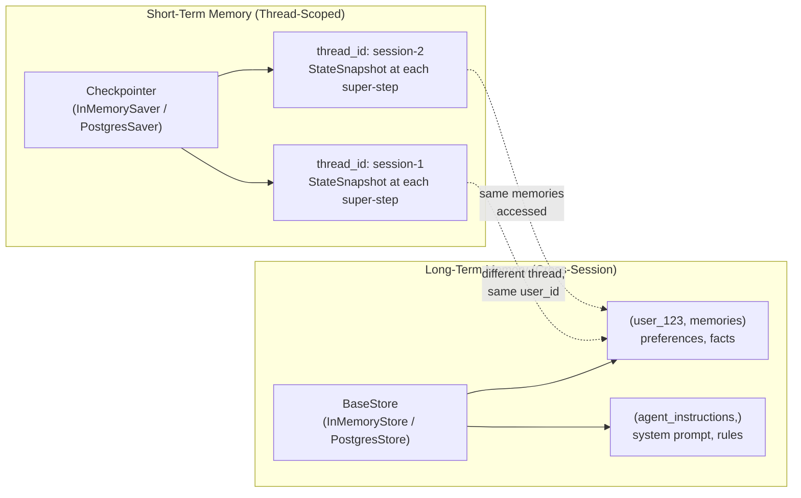

# LangGraph — Comprehensive Research Report

> **Source URL:** https://docs.langchain.com/oss/python/langgraph/overview  
> **Research date:** 2026-05-31  
> **Total subagent dispatches:** 7  
> **Citations:** 58 footnotes

---

## Executive Summary

LangGraph is a **low-level orchestration runtime** for building, managing, and deploying long-running, stateful AI agents. It sits below LangChain in the abstraction stack — providing the execution infrastructure (durable state, streaming, human-in-the-loop, fault tolerance) without wrapping prompts or model integrations. Inspired by Google's Pregel graph-processing system, it models agent workflows as directed graphs of nodes (Python functions) connected by edges (routing logic), sharing a typed **State** snapshot. Two complementary APIs are provided: the **Graph API** (explicit `StateGraph` builder) and the **Functional API** (`@entrypoint` + `@task` decorators). LangGraph is production-grade, trusted by Klarna, Uber, J.P. Morgan, Replit, and Elastic, and is MIT-licensed.

---

## Table of Contents

1. [Product Positioning](#1-product-positioning)
2. [Core Architecture — Pregel Model](#2-core-architecture--pregel-model)
3. [StateGraph — The Graph Builder](#3-stategraph--the-graph-builder)
4. [State — Shared Data Structure](#4-state--shared-data-structure)
5. [Nodes](#5-nodes)
6. [Edges](#6-edges)
7. [Graph Compilation — `compile()`](#7-graph-compilation--compile)
8. [Persistence & Checkpointing](#8-persistence--checkpointing)
9. [Streaming](#9-streaming)
10. [Human-in-the-Loop (Interrupts)](#10-human-in-the-loop-interrupts)
11. [Memory System](#11-memory-system)
12. [Durable Execution](#12-durable-execution)
13. [Time-Travel: Replay & Fork](#13-time-travel-replay--fork)
14. [Multi-Agent Architectures](#14-multi-agent-architectures)
15. [Subgraphs](#15-subgraphs)
16. [Functional API: @entrypoint & @task](#16-functional-api-entrypoint--task)
17. [Prebuilt Components](#17-prebuilt-components)
18. [LangGraph Platform (LangSmith Deployment)](#18-langgraph-platform-langsmith-deployment)
19. [Installation & Hello World](#19-installation--hello-world)
20. [Key Repositories](#20-key-repositories)
21. [Architecture Diagram](#21-architecture-diagram)
22. [Confidence Assessment](#22-confidence-assessment)
23. [Footnotes](#footnotes)

---

## 1. Product Positioning

LangGraph occupies a precise layer in the LangChain product stack[^1]:

```
Deep Agents SDK       ← Agent harness (planning, subagents, filesystem)
       │
  LangChain           ← Agent framework (model integrations, tools, agent loops)
       │
  LangGraph           ← Orchestration runtime (durable execution, streaming, HITL, persistence)
       │
  LangSmith           ← Platform (tracing, evaluation, deployment)
```

**What LangGraph is NOT:**
- It does **not** wrap LLM APIs or prompts (that is LangChain's role)
- It does **not** require LangChain — it can be used standalone
- It does **not** provide high-level agent abstractions — those are in LangChain Agents

**What LangGraph uniquely provides vs. plain LangChain:**[^2]

| Capability | Plain LangChain | LangGraph |
|---|---|---|
| Stateful execution with persistence | ❌ | ✅ via Checkpointers |
| Resume after failure | ❌ | ✅ via Durable Execution |
| Human-in-the-loop pausing | Limited | ✅ via `interrupt()` |
| Long-running cross-session memory | ❌ | ✅ |
| Parallel node execution (super-steps) | ❌ | ✅ |
| Time-travel debugging | ❌ | ✅ |
| Graph visualization | ❌ | ✅ via `draw_mermaid_png()` |

---

## 2. Core Architecture — Pregel Model

LangGraph's execution engine is inspired by **Google's Pregel** (large-scale graph processing) and **Apache Beam**, with a public interface inspired by **NetworkX**[^3].

### Execution Model: Super-Steps

Execution proceeds in discrete **super-steps** (single "ticks"):

1. All nodes scheduled for the current step execute (potentially **in parallel**)
2. Each node reads the current State, performs work, and returns a **partial update**
3. State updates are merged via **reducer functions**
4. A **checkpoint** is saved
5. Scheduled nodes for the next step are determined by edges
6. Graph terminates when all nodes are `inactive` and no messages are in-transit

```
START → [super-step 0: node_a] → checkpoint → [super-step 1: node_b] → checkpoint → END
```

For a graph `START → A → B → END`, there are **4 checkpoints**: empty, after input, after A, after B.[^4]

### Two Available APIs

| API | Description | Best For |
|---|---|---|
| **Graph API** | Explicit `StateGraph` builder with nodes, edges, typed State schema | Complex topologies, visualization, fine-grained control |
| **Functional API** | `@entrypoint` + `@task` decorators on regular Python functions | Python-native control flow (loops, conditionals), minimal boilerplate |

---

## 3. StateGraph — The Graph Builder

`StateGraph` is the primary builder class. It is **parameterized by a user-defined State type** and uses that type as the communication contract between all nodes and edges.[^5]

```python
class StateGraph(Generic[StateT, ContextT, InputT, OutputT]):
    """A graph whose nodes communicate by reading and writing to a shared state.
    The signature of each node is `State -> Partial<State>`.
    """
    edges: set[tuple[str, str]]
    nodes: dict[str, StateNodeSpec[Any, ContextT]]
    branches: defaultdict[str, dict[str, BranchSpec]]
    channels: dict[str, BaseChannel]
    managed: dict[str, ManagedValueSpec]
    waiting_edges: set[tuple[tuple[str, ...], str]]
```

### Constructor Signature[^6]

```python
def __init__(
    self,
    state_schema: type[StateT],
    context_schema: type[ContextT] | None = None,
    *,
    input_schema: type[InputT] | None = None,
    output_schema: type[OutputT] | None = None,
) -> None:
```

| Parameter | Purpose |
|---|---|
| `state_schema` | **Required.** The TypedDict/dataclass/Pydantic class defining the graph's state |
| `context_schema` | Optional. Immutable runtime context (user_id, DB connections, etc.) passed via `context=` |
| `input_schema` | Optional. Subset of state that acts as graph input. Defaults to `state_schema` |
| `output_schema` | Optional. Subset of state that acts as graph output. Defaults to `state_schema` |

### Fluent (Method-Chaining) API[^7]

All builder methods return `Self`, enabling chaining:

```python
graph = (
    StateGraph(State)
    .set_node_defaults(retry_policy=RetryPolicy(max_attempts=3))
    .add_node("a", node_a)
    .add_node("b", node_b)
    .add_edge(START, "a")
    .add_edge("a", "b")
    .add_edge("b", END)
    .compile()
)
```

### `add_sequence()` — Shorthand for Linear Chains[^8]

```python
builder.add_sequence([node_a, node_b, node_c])
# Equivalent to:
# builder.add_node(node_a); builder.add_node(node_b); builder.add_node(node_c)
# builder.add_edge("node_a", "node_b"); builder.add_edge("node_b", "node_c")
```

---

## 4. State — Shared Data Structure

The **State** is a snapshot of the entire application at any point. Every node receives the full state as input and returns a *partial update* — only the keys they modified.[^9]

### Schema Options

| Schema Style | Notes |
|---|---|
| `TypedDict` | Recommended default. No default values |
| `dataclass` | Use when you need default field values |
| Pydantic `BaseModel` | Supports recursive validation, less performant |

### Default Reducer (Last-Write Wins)

```python
class State(TypedDict):
    foo: int        # last value wins
    bar: list[str]  # last value wins (entire list overwritten)
```

### Custom Reducers via `Annotated`[^10]

```python
from typing import Annotated
from operator import add

class State(TypedDict):
    foo: int
    bar: Annotated[list[str], add]   # reducer: list concatenation
```

If Node A returns `{"bar": ["hi"]}` and Node B returns `{"bar": ["bye"]}`, result is `{"bar": ["hi", "bye"]}`.

### Multiple Schemas (Private, Input, Output)[^11]

```python
class InputState(TypedDict):
    user_input: str

class OutputState(TypedDict):
    graph_output: str

class OverallState(TypedDict):
    foo: str
    user_input: str
    graph_output: str

class PrivateState(TypedDict):
    bar: str  # internal only — not exposed as I/O

builder = StateGraph(OverallState, input_schema=InputState, output_schema=OutputState)
```

### MessagesState (Prebuilt)[^12]

A prebuilt state for conversational agents:

```python
from langgraph.graph import MessagesState
# Equivalent to:
class MessagesState(TypedDict):
    messages: Annotated[list[AnyMessage], add_messages]

# Extend with extra fields:
class State(MessagesState):
    documents: list[str]
```

`add_messages` is a smart reducer that: (1) appends new messages, (2) overwrites existing messages by ID, (3) handles deserialization of dict-format messages.

---

## 5. Nodes

Nodes are Python functions (sync or async) that accept the graph State as input and return a **partial state update**.[^13]

### Function Signatures

```python
# Minimal signature
def my_node(state: State) -> dict:
    return {"key": "value"}

# With RunnableConfig (tracing, thread_id, etc.)
def my_node(state: State, config: RunnableConfig) -> dict:
    thread_id = config["configurable"]["thread_id"]
    return {"key": "value"}

# With Runtime context (modern, preferred)
from langgraph.runtime import Runtime

def my_node(state: State, runtime: Runtime[Context]) -> dict:
    user_id = runtime.context["user_id"]
    return {"key": "value"}
```

### Adding Nodes[^14]

```python
# Auto-name from function name
builder.add_node(my_node)  # node name = "my_node"

# Explicit name
builder.add_node("my_fair_node", my_node)

# With custom input schema (node sees subset of state)
builder.add_node(my_node, input_schema=NodeInput)
```

### Node Policies[^15]

```python
builder.add_node(
    "my_node",
    my_fn,
    retry_policy=RetryPolicy(max_attempts=3),
    cache_policy=CachePolicy(ttl=60),
    error_handler=my_fallback,
    timeout=30.0,           # async only
    defer=False,
    metadata={"tag": "important"},
)
```

### Node Caching[^16]

```python
from langgraph.cache.memory import InMemoryCache
from langgraph.types import CachePolicy

builder.add_node("expensive_node", expensive_fn, cache_policy=CachePolicy(ttl=3))
graph = builder.compile(cache=InMemoryCache())

graph.invoke({"x": 5})  # takes 2s
graph.invoke({"x": 5})  # instant — {'__metadata__': {'cached': True}}
```

---

## 6. Edges

### Types of Edges[^17]

| Edge Type | Method | Description |
|---|---|---|
| Normal edge | `add_edge(a, b)` | Always route from Node A → Node B |
| Conditional edge | `add_conditional_edges(a, fn)` | Call a routing function to decide next node |
| Entry point | `add_edge(START, "node_a")` | First node(s) to execute |
| Finish point | `add_edge("node_a", END)` | Terminal node |
| Fan-in (wait-all) | `add_edge(["node_a", "node_b"], "node_c")` | Wait for ALL listed nodes before proceeding |

### Conditional Edges[^18]

```python
def routing_function(state: State) -> str:
    if state["foo"] == "bar":
        return "node_b"
    else:
        return "node_c"

graph.add_conditional_edges("node_a", routing_function)

# With explicit mapping:
graph.add_conditional_edges(
    "node_a",
    routing_function,
    {True: "node_b", False: "node_c"}  # path_map
)
```

### `Send` — Dynamic Fan-Out (Map-Reduce)[^19]

```python
from langgraph.types import Send

def continue_to_jokes(state: OverallState):
    # Dynamically spawn N parallel node executions
    return [Send("generate_joke", {"subject": s}) for s in state['subjects']]

graph.add_conditional_edges("node_a", continue_to_jokes)
```

`Send(node_name, state)` sends different state slices to multiple invocations of the same node in parallel — enabling map-reduce with data-driven parallelism.

### `Command` — Combined State Update + Routing[^20]

```python
from langgraph.types import Command
from typing import Literal

def my_node(state: State) -> Command[Literal["my_other_node"]]:
    return Command(
        update={"foo": "bar"},       # state update
        goto="my_other_node"         # routing
    )

# Navigate from subgraph to parent:
def subgraph_node(state: State) -> Command[Literal["parent_node"]]:
    return Command(
        update={"foo": "bar"},
        goto="parent_node",
        graph=Command.PARENT         # ← escapes to parent graph
    )
```

> ⚠️ When returning `Command` in node functions, **always** add return type annotations with `Command[Literal["node1", "node2"]]` for graph rendering.

### START and END Nodes[^21]

```python
from langgraph.graph import START, END
# START = "__start__" (virtual input anchor)
# END = "__end__"   (virtual terminal anchor)

graph.add_edge(START, "node_a")   # entry point
graph.add_edge("node_a", END)     # terminal

# Validation rules (compile-time):
# END cannot be a start node; START cannot be an end node
# Every graph must have at least one edge from START
```

---

## 7. Graph Compilation — `compile()`

Compilation converts the **builder** (`StateGraph`) into an executable **`CompiledStateGraph`** (extends `Pregel`).[^22]

### What Compile Does

1. Validates graph structure (no orphaned nodes, `START` has outgoing edges, all edge targets exist)
2. Attaches all nodes, edges, and branches to the Pregel runtime
3. Configures channels (state keys → `LastValue`, `BinaryOperatorAggregate`, etc.)
4. Connects the checkpointer (persistence layer)
5. Applies default node policies

### `compile()` Signature[^23]

```python
def compile(
    self,
    checkpointer: Checkpointer = None,           # persistence backend
    *,
    cache: BaseCache | None = None,              # node caching backend
    store: BaseStore | None = None,              # long-term memory store
    interrupt_before: All | list[str] | None = None,  # pause BEFORE these nodes
    interrupt_after: All | list[str] | None = None,   # pause AFTER these nodes
    debug: bool = False,
    name: str | None = None,
) -> CompiledStateGraph[StateT, ContextT, InputT, OutputT]:
```

### Examples[^24]

```python
# Minimal
graph = builder.compile()

# With persistence
from langgraph.checkpoint.memory import InMemorySaver
graph = builder.compile(checkpointer=InMemorySaver())

# With interrupt points (human-in-the-loop)
graph = builder.compile(
    checkpointer=InMemorySaver(),
    interrupt_before=["human_review"],
    interrupt_after=["tool_call"],
)

# With long-term memory store
from langgraph.store.memory import InMemoryStore
graph = builder.compile(
    checkpointer=InMemorySaver(),
    store=InMemoryStore(),
)
```

---

## 8. Persistence & Checkpointing

When compiled with a **checkpointer**, LangGraph saves a `StateSnapshot` at the end of every super-step boundary.[^25]

### Checkpointer Implementations[^26]

| Checkpointer | Package | Use Case |
|---|---|---|
| `InMemorySaver` | `langgraph-checkpoint` | Dev/testing — no persistence across restarts |
| `SqliteSaver` / `AsyncSqliteSaver` | `langgraph-checkpoint-sqlite` | Local persistence, single-process |
| `PostgresSaver` / `AsyncPostgresSaver` | `langgraph-checkpoint-postgres` | Production multi-process |
| `RedisSaver` / `AsyncRedisSaver` | `langgraph-checkpoint-redis` | Production high-throughput |

### Basic Checkpointing Example[^27]

```python
from langgraph.checkpoint.memory import InMemorySaver
from langgraph.graph import StateGraph, START, END
from typing import Annotated
from typing_extensions import TypedDict
from operator import add

class State(TypedDict):
    foo: str
    bar: Annotated[list[str], add]   # reducer accumulates values

def node_a(state: State):
    return {"foo": "a", "bar": ["a"]}

def node_b(state: State):
    return {"foo": "b", "bar": ["b"]}

workflow = StateGraph(State)
workflow.add_node(node_a)
workflow.add_node(node_b)
workflow.add_edge(START, "node_a")
workflow.add_edge("node_a", "node_b")
workflow.add_edge("node_b", END)

checkpointer = InMemorySaver()
graph = workflow.compile(checkpointer=checkpointer)

# thread_id is REQUIRED when using a checkpointer
config = {"configurable": {"thread_id": "1"}}
graph.invoke({"foo": "", "bar": []}, config)
# bar = ['a', 'b'] — reducer accumulated both node outputs
```

### `StateSnapshot` Fields[^28]

| Field | Type | Description |
|---|---|---|
| `values` | `dict` | Channel values at this checkpoint |
| `next` | `tuple[str,...]` | Nodes to run next. Empty `()` = graph complete |
| `config` | `dict` | Contains `thread_id`, `checkpoint_ns`, `checkpoint_id` |
| `metadata` | `dict` | `source` (input/loop/update), `writes`, `step` |
| `created_at` | `str` | ISO 8601 timestamp |
| `parent_config` | `dict\|None` | Previous checkpoint config |
| `tasks` | `tuple[PregelTask,...]` | Pending tasks with ids, errors, interrupts |

### State Inspection & Checkpoints Navigation[^29]

```python
config = {"configurable": {"thread_id": "1"}}

# Latest checkpoint
snapshot = graph.get_state(config)

# Specific checkpoint by ID
config_at_step = {"configurable": {
    "thread_id": "1", "checkpoint_id": "1ef663ba-..."
}}

# Full history (newest first)
history = list(graph.get_state_history(config))
```

### SQLite Security Note[^30]

Set `LANGGRAPH_STRICT_MSGPACK=true` or pass `allowed_msgpack_modules` to restrict deserialization when using `SqliteSaver`.

---

## 9. Streaming

LangGraph provides two streaming APIs[^31]:

| API | Version | Notes |
|---|---|---|
| `graph.stream()` / `graph.astream()` | v1 (default), v2 | Raw stream-mode chunks |
| `graph.stream_events()` | v3 | **Recommended for new apps** — typed projections |

### Stream Modes (v2 unified format)[^32]

All modes with `version="v2"` return a `StreamPart` TypedDict:

```python
{"type": "values"|"updates"|"messages"|"custom"|"checkpoints"|"tasks"|"debug",
 "ns": (),       # namespace tuple; populated for subgraph events
 "data": ...     # payload specific to each mode
}
```

| Mode | Description |
|---|---|
| `values` | Full state snapshot after **each step** |
| `updates` | Only changed keys from each node |
| `messages` | LLM tokens token-by-token + metadata |
| `custom` | User-defined data via `get_stream_writer()` |
| `checkpoints` | Checkpoint events (needs checkpointer) |
| `tasks` | Node start/finish events with results |
| `debug` | Combined `checkpoints` + `tasks` |

### Stream Usage Examples[^33]

```python
# --- UPDATES mode ---
for chunk in graph.stream({"topic": "ice cream"}, stream_mode="updates", version="v2"):
    if chunk["type"] == "updates":
        for node_name, state in chunk["data"].items():
            print(f"Node `{node_name}` updated: {state}")

# --- LLM TOKEN STREAMING (messages mode) ---
for chunk in graph.stream({"topic": "ice cream"}, stream_mode="messages", version="v2"):
    if chunk["type"] == "messages":
        message_chunk, metadata = chunk["data"]
        if message_chunk.content:
            print(message_chunk.content, end="|", flush=True)

# --- MULTIPLE MODES ---
for chunk in graph.stream(
    {"topic": "ice cream"},
    stream_mode=["values", "updates", "messages", "custom"],
    version="v2",
):
    if chunk["type"] == "values":
        print(f"State: {chunk['data']}")
    elif chunk["type"] == "messages":
        msg, meta = chunk["data"]
        print(msg.content, end="", flush=True)

# --- SUBGRAPH STREAMING ---
for chunk in graph.stream({"foo": "foo"}, subgraphs=True, stream_mode="updates", version="v2"):
    if chunk["ns"]:   # non-empty namespace = subgraph event
        print(f"Subgraph {chunk['ns']}: {chunk['data']}")
```

### Custom Streaming from within Nodes[^34]

```python
from langgraph.config import get_stream_writer

def my_node(state: State):
    writer = get_stream_writer()
    writer({"status": "Starting phase 1...", "progress": 0})
    # ... do work ...
    writer({"status": "Phase 1 complete", "progress": 50})
    return {"result": "done"}
```

### `stream_events()` — Typed Projections API (v3, recommended)[^35]

```python
stream = graph.stream_events(
    {"messages": [{"role": "user", "content": "What is 42 * 17?"}]},
    version="v3"
)

# Token-by-token output
for message in stream.messages:
    for token in message.text:
        print(token, end="", flush=True)

final_state = stream.output  # blocks until graph finishes
```

**Projections available on the stream object:**

| Projection | Use |
|---|---|
| `stream.messages` | Token-by-token LLM output |
| `stream.values` | Full state snapshots after each step |
| `stream.output` | Await final output |
| `stream.subgraphs` | Nested graph executions |
| `stream.interrupts` | Human-in-the-loop interrupt payloads |
| `stream.interrupted` | `True` if paused for human input |

### Suppress Token Streaming with `nostream` Tag[^36]

```python
internal_model = ChatAnthropic(...).with_config({"tags": ["nostream"]})
# Tokens from this model are NOT emitted in stream_mode="messages"
```

---

## 10. Human-in-the-Loop (Interrupts)

### Architecture[^37]

Interrupts are **dynamic breakpoints** placed anywhere in node code (not statically at compile time). They require a checkpointer. The `interrupt()` function:

1. Suspends graph execution at that exact point
2. Saves state via the checkpointer
3. Returns a payload to the caller (appears on `stream.interrupts`)
4. Waits indefinitely until resumed with `Command(resume=...)`

> The modern `interrupt()` function replaces the older `interrupt_before`/`interrupt_after` compile-time flags (which remain valid but are less flexible).

### Basic Interrupt + Resume Pattern[^38]

```python
from langgraph.checkpoint.memory import InMemorySaver
from langgraph.graph import StateGraph, START, END
from langgraph.types import interrupt, Command
from typing import TypedDict

class State(TypedDict):
    action_details: str
    status: str

def approval_node(state: State):
    # Pause execution; payload surfaces via stream.interrupts
    approved = interrupt({
        "question": "Do you approve this action?",
        "details": state["action_details"]
    })
    return {"status": "approved" if approved else "rejected"}

graph = (
    StateGraph(State)
    .add_node("approval", approval_node)
    .add_edge(START, "approval")
    .add_edge("approval", END)
    .compile(checkpointer=InMemorySaver())
)

config = {"configurable": {"thread_id": "approval-123"}}

# Step 1: Run — hits interrupt, pauses
stream = graph.stream_events(
    {"action_details": "Transfer $500", "status": "pending"},
    config=config, version="v3"
)
_ = stream.output
print(stream.interrupted)   # True
print(stream.interrupts)    # (Interrupt(value={'question': ..., 'details': ...}),)

# Step 2: Resume with human decision
resumed = graph.stream_events(Command(resume=True), config=config, version="v3")
print(resumed.output["status"])   # "approved"
```

### Full HITL Production Loop Pattern[^39]

```python
stream_input = initial_input

while True:
    stream = graph.stream_events(stream_input, config=config, version="v3")

    # Stream AI responses token-by-token to the user
    for message in stream.messages:
        for token in message.text:
            display_to_user(token)

    if not stream.interrupted:
        final_state = stream.output
        break

    # Get human input and continue
    interrupt_info = stream.interrupts[0].value
    user_response = get_user_input(interrupt_info)
    stream_input = Command(resume=user_response)
```

### Parallel Interrupts (Fan-out)[^40]

```python
# Resume ALL pending interrupts at once — map interrupt ID → answer
resume_map = {i.id: f"answer for {i.value}" for i in stream.interrupts}
resumed = graph.stream_events(Command(resume=resume_map), config, version="v3")
```

### Interrupt Inside a Tool[^41]

```python
from langchain.tools import tool
from langgraph.types import interrupt

@tool
def send_email(to: str, subject: str, body: str):
    """Send an email to a recipient."""
    response = interrupt({
        "action": "send_email",
        "to": to, "subject": subject, "body": body,
        "message": "Approve sending this email?"
    })
    if response.get("action") == "approve":
        return f"Email sent to {response.get('to', to)}"
    return "Email cancelled"
```

### Static Breakpoints (Legacy Compile-Time)[^42]

```python
graph = workflow.compile(
    checkpointer=InMemorySaver(),
    interrupt_before=["risky_node"],   # pause BEFORE node runs
    interrupt_after=["review_node"],   # pause AFTER node runs
)
config = {"configurable": {"thread_id": "1"}}
graph.invoke(initial_state, config)   # hits interrupt_before
graph.invoke(None, config)            # resumes
```

---

## 11. Memory System

LangGraph has a **two-tier memory architecture**[^43]:

| Tier | Mechanism | Scope | Use Case |
|---|---|---|---|
| **Short-term** | Checkpointer (thread state) | Single `thread_id` | Conversation history within a session |
| **Long-term** | `BaseStore` (key-value store) | Any namespace, any thread | User preferences, facts, episodic memory |

### Memory Types (Conceptual — from CoALA paper)[^44]

| Type | Pattern | Example |
|---|---|---|
| **Semantic** | Profile or document collection | User preferences, facts |
| **Episodic** | Past experiences/sequences | Few-shot examples of past actions |
| **Procedural** | Instructions/rules | Agent system prompt |

### Long-Term Memory: `InMemoryStore` API[^45]

```python
from langgraph.store.memory import InMemoryStore
store = InMemoryStore()
graph = builder.compile(checkpointer=InMemorySaver(), store=store)
```

**`store.put(namespace, key, value, index, ttl)`**

```python
# Basic put
store.put(("user_123", "memories"), "mem_abc", {"fact": "Likes Python"})

# With selective field indexing for vector search
store.put(
    ("user_123", "memories"),
    str(uuid.uuid4()),
    {"fact": "Prefers dark mode", "category": "ui"},
    index=["fact"]  # Only embed "fact" field
)

# With TTL (minutes)
store.put(("cache",), "temp_key", {"data": "..."}, ttl=60.0)

# Deletion: set value=None
store.put(("user_123", "memories"), "mem_abc", None)
```

**`store.get(namespace, key)`**

```python
item = store.get(("user_123", "memories"), "mem_abc")
if item:
    print(item.value)      # dict
    print(item.key)        # str
    print(item.namespace)  # tuple[str, ...]
    print(item.created_at) # datetime
```

**`store.search(namespace_prefix, query, filter, limit, offset)`**

```python
# List all items in namespace
items = store.search(("user_123", "memories"), limit=100)

# Filter operators: $eq, $ne, $gt, $gte, $lt, $lte
items = store.search(("docs",), filter={"score": {"$gt": 4.99}})

# Semantic vector search (requires IndexConfig on store)
items = store.search(
    ("user_123", "memories"),
    query="What does the user prefer for UI?",
    filter={"category": "ui"},
    limit=3
)
for item in items:
    print(item.score, item.value)  # Cosine similarity score
```

### Semantic Search Setup[^46]

```python
from langchain.embeddings import init_embeddings
store = InMemoryStore(
    index={
        "embed": init_embeddings("openai:text-embedding-3-small"),
        "dims": 1536,
        "fields": ["fact", "summary"]  # Fields to embed; "$" = entire doc
    }
)
```

### Accessing Store Inside Nodes (Runtime API)[^47]

```python
from langgraph.runtime import Runtime

async def call_model(state: MessagesState, runtime: Runtime[Context]):
    user_id = runtime.context.user_id
    namespace = (user_id, "memories")

    # Search for relevant memories
    memories = await runtime.store.asearch(
        namespace,
        query=state["messages"][-1].content,
        limit=3
    )
    # Store a new memory
    await runtime.store.aput(
        namespace,
        str(uuid.uuid4()),
        {"memory": "User prefers Python over JavaScript"}
    )
```

---

## 12. Durable Execution

LangGraph's persistence model goes beyond simple checkpointing[^48]:

| Simple Persistence | LangGraph Durable Execution |
|---|---|
| Saves at end of run | Saves at every super-step boundary |
| No replay | Full `get_state_history` and replay |
| No fork | `update_state` creates forks |
| No sub-step fault recovery | Per-task writes enable pending writes recovery |
| No interrupts | Human-in-the-loop via `interrupt()` |

### Durability Modes[^49]

Three explicit modes to trade performance vs. safety:

```python
graph.stream(
    {"input": "test"},
    durability="sync"   # or "async" or "exit"
)
```

| Mode | When writes are flushed | Risk | Performance |
|---|---|---|---|
| `"exit"` | Only on graph exit | Intermediate state lost on crash | Best |
| `"async"` | Async while next step executes | Small window of unwritten checkpoints | Good |
| `"sync"` | Synchronously before next step starts | None (every step is durable) | Overhead |

### DeltaChannel (Beta)[^50]

For large accumulated channels (e.g., long message histories), `DeltaChannel` stores only incremental deltas instead of full channel state at each step, reducing storage significantly. Requires `langgraph>=1.2`.

---

## 13. Time-Travel: Replay & Fork

### Two Operations[^51]

| Operation | What It Does |
|---|---|
| **Replay** | Re-executes from a prior checkpoint; nodes before it are skipped (already saved) |
| **Fork** | Creates a new branch with modified state; original history preserved |

> ⚠️ Replay re-executes LLM calls and API requests — results may differ.

### Replay from Prior Checkpoint[^52]

```python
config = {"configurable": {"thread_id": "debug-1"}}
graph.invoke({}, config)

# Get checkpoint history
history = list(graph.get_state_history(config))

# Find checkpoint before "write_joke" node
before_joke = next(s for s in history if s.next == ("write_joke",))

# Replay from before write_joke — generate_topic is SKIPPED, write_joke re-runs
replay_result = graph.invoke(None, before_joke.config)
```

### Fork with Modified State[^53]

```python
# Fork: update state (creates NEW checkpoint, original history untouched)
fork_config = graph.update_state(
    before_joke.config,
    values={"topic": "chickens"},       # modify the topic
    as_node="generate_topic"            # treat update as if generate_topic produced it
)

# Run the fork — write_joke executes with new topic
fork_result = graph.invoke(None, fork_config)

# Find fork checkpoints
forks = [s for s in history if s.metadata["source"] == "update"]
```

---

## 14. Multi-Agent Architectures

LangGraph documents four official multi-agent patterns[^54]:

| Pattern | How It Works | Strengths |
|---|---|---|
| **Subagents** | Main agent coordinates subagents as tools; routing always through main | Distributed dev, parallelization, multi-hop |
| **Handoffs** | Tool calls dynamically switch active agent; state variable triggers routing | Stateful/repeat interactions, direct user access |
| **Skills** | Single agent loads specialized prompts/knowledge on-demand | Low overhead, stateful |
| **Router** | LLM routing step classifies and routes to specialists | Parallel multi-domain tasks |

### The Supervisor Pattern (Hierarchical)[^55]

A **Supervisor** is the **Subagents** pattern with a central LLM agent delegating to worker agents via **handoff tools**. Control always flows back through the supervisor:

```
User → Supervisor → [math_agent | research_agent | ...] → back to Supervisor → User
```

Using the `langgraph-supervisor` library:

```python
from langchain_openai import ChatOpenAI
from langgraph_supervisor import create_supervisor
from langgraph.prebuilt import create_react_agent

model = ChatOpenAI(model="gpt-4o")

math_agent = create_react_agent(
    model=model, tools=[add, multiply],
    name="math_expert",
    prompt="You are a math expert. Always use one tool at a time."
)
research_agent = create_react_agent(
    model=model, tools=[web_search],
    name="research_expert",
    prompt="You are a world class researcher with access to web search."
)

workflow = create_supervisor(
    [research_agent, math_agent],
    model=model,
    prompt="You are a team supervisor managing a research expert and a math expert."
)

app = workflow.compile()
result = app.invoke({"messages": [{"role": "user", "content": "FAANG headcount 2024?"}]})
```

### Multi-Level Hierarchies[^56]

```python
research_team = create_supervisor(
    [research_agent, math_agent], model=model,
    supervisor_name="research_supervisor"
).compile(name="research_team")

writing_team = create_supervisor(
    [writing_agent, publishing_agent], model=model,
    supervisor_name="writing_supervisor"
).compile(name="writing_team")

top_level = create_supervisor(
    [research_team, writing_team],     # ← supervisors AS agents
    model=model, supervisor_name="top_level_supervisor"
).compile(name="top_level_supervisor")
```

### The Swarm Pattern (Peer-to-Peer)[^57]

A **Swarm** is the **Handoffs** pattern — agents directly hand off to each other (no central node). The system tracks `active_agent` to resume the last active agent in subsequent turns:

```
User → active_agent (Alice) → [handoff tool] → Bob → [handoff tool] → Alice → User
```

---

## 15. Subgraphs

A **subgraph** is a compiled `StateGraph` used as a node inside a parent graph.[^58]

### Two Communication Patterns[^59]

**Pattern A: Direct add — shared state keys**

```python
class State(TypedDict):
    foo: str   # shared key

subgraph_builder = StateGraph(State)
subgraph = subgraph_builder.compile()

parent_builder = StateGraph(State)
parent_builder.add_node("node_1", subgraph)  # ← direct add
```

**Pattern B: Wrapper function — different state schemas**

```python
class SubgraphState(TypedDict):
    bar: str         # no overlap with parent

def call_subgraph(state: State):
    out = subgraph.invoke({"bar": state["foo"]})  # manual transform
    return {"foo": out["bar"]}                     # manual transform back

parent_builder.add_node("node_1", call_subgraph)
```

### Subgraph Persistence Modes[^60]

| Mode | `checkpointer=` | Behavior |
|---|---|---|
| **Per-invocation** (default) | `None` | Each call starts fresh; inherits parent checkpointer for HITL |
| **Per-thread** | `True` | Accumulates state across calls |
| **Stateless** | `False` | Plain function call; no durable execution, no interrupts |

---

## 16. Functional API: @entrypoint & @task

The Functional API provides persistence and HITL with minimal structural overhead.[^61]

### `@task` Decorator[^62]

```python
def task(
    __func_or_none__: Callable[P, Awaitable[T]] | Callable[P, T] | None = None,
    *,
    name: str | None = None,
    retry_policy: RetryPolicy | Sequence[RetryPolicy] | None = None,
    cache_policy: CachePolicy[...] | None = None,
    timeout: float | timedelta | TimeoutPolicy | None = None,
) -> _TaskFunction[P, T]
```

Calling a `@task` function returns a **`SyncAsyncFuture[T]`** immediately (non-blocking):

```python
future = my_task(arg)
result = future.result()   # sync: blocks until done
result = await my_task(arg)  # async: awaits
```

**Parallelism via @task:**

```python
@task
def add_one_task(a: int) -> int:
    return a + 1

@entrypoint()
def add_one(numbers: list[int]) -> list[int]:
    futures = [add_one_task(n) for n in numbers]   # all launched in parallel
    return [f.result() for f in futures]            # collected synchronously

add_one.invoke([1, 2, 3])  # → [2, 3, 4]
```

**Checkpointing Semantics:**
- Task results are serialized and saved to the checkpoint upon completion
- On **resume**, completed tasks are **replayed from checkpoint** (not re-executed)
- All `@task` outputs must be **JSON-serializable**

### `@entrypoint` Decorator[^63]

```python
class entrypoint(Generic[ContextT]):
    def __init__(
        self,
        checkpointer: BaseCheckpointSaver | None = None,
        store: BaseStore | None = None,
        cache: BaseCache | None = None,
        context_schema: type[ContextT] | None = None,
        retry_policy: RetryPolicy | ... | None = None,
        timeout: float | timedelta | TimeoutPolicy | None = None,
    ) -> None
```

**Injectable Parameters (auto-injected at runtime):**

| Parameter | Type | Description |
|---|---|---|
| `previous` | `Any` | Return value of the **previous invocation** on the same thread (stateful/conversational) |
| `store` | `BaseStore` | Long-term memory store |
| `writer` | `StreamWriter` | Manual streaming output writer |
| `config` | `RunnableConfig` | Full run-time configuration including `thread_id` |
| `runtime` | `Runtime` | Provides context, store, stream_writer |

```python
@entrypoint(checkpointer=InMemorySaver(), store=InMemoryStore())
def my_workflow(
    some_input: dict,
    *,
    previous: Any = None,
    store: BaseStore,
    config: RunnableConfig,
) -> dict:
    ...
```

**`entrypoint.final` — Decoupling return vs. checkpoint value:**

```python
@entrypoint(checkpointer=InMemorySaver())
def my_workflow(number: int, *, previous: Any = None) -> entrypoint.final[int, int]:
    previous = previous or 0
    return entrypoint.final(value=previous, save=2 * number)

# Thread "1":
my_workflow.invoke(3, config)  # returns 0  (previous=None, saves 6)
my_workflow.invoke(1, config)  # returns 6  (previous=6, saves 2)
```

### ReAct Agent via Functional API[^64]

```python
from langgraph.func import entrypoint, task
from langgraph.graph import add_messages

@task
def call_llm(messages: list[BaseMessage]):
    return model_with_tools.invoke(
        [SystemMessage(content="You are a helpful assistant...")] + messages
    )

@task
def call_tool(tool_call: ToolCall):
    tool = tools_by_name[tool_call["name"]]
    return tool.invoke(tool_call)

@entrypoint()
def agent(messages: list[BaseMessage]):
    model_response = call_llm(messages).result()
    while True:
        if not model_response.tool_calls:
            break
        # Execute all tools in parallel
        tool_result_futures = [call_tool(tc) for tc in model_response.tool_calls]
        tool_results = [fut.result() for fut in tool_result_futures]
        messages = add_messages(messages, [model_response, *tool_results])
        model_response = call_llm(messages).result()
    return add_messages(messages, model_response)
```

### @entrypoint vs StateGraph — When to Use Each[^65]

| Dimension | `@entrypoint` | `StateGraph` |
|---|---|---|
| Control flow | Standard Python (`if`, `for`, `while`) | Explicit edges and `Send` API |
| State management | Implicit (function-scoped) | Explicit TypedDict with reducers |
| Visualization | Not supported | Full Mermaid diagram |
| Streaming | `updates` mode by default | All modes |
| Code volume | Less boilerplate | More explicit |

**Use `@entrypoint` when:** migrating existing Python code, natural sequential/conditional logic, no need for graph visualization.

**Use `StateGraph` when:** complex multi-node topologies, fan-out/fan-in, multiple streaming modes needed.

---

## 17. Prebuilt Components

### `create_react_agent` — Full API[^66]

> ⚠️ **Deprecated in v1.x** — migrated to `from langchain.agents import create_agent`. Still widely functional.

```python
def create_react_agent(
    model: str | LanguageModelLike | Callable[...],
    tools: Sequence[BaseTool | Callable | dict] | ToolNode,
    *,
    prompt: SystemMessage | str | Callable | Runnable | None = None,
    response_format: StructuredResponseSchema | tuple | None = None,
    pre_model_hook: RunnableLike | None = None,
    post_model_hook: RunnableLike | None = None,
    state_schema: StateSchemaType | None = None,
    context_schema: type[Any] | None = None,
    checkpointer: Checkpointer | None = None,
    store: BaseStore | None = None,
    interrupt_before: list[str] | None = None,
    interrupt_after: list[str] | None = None,
    version: Literal["v1", "v2"] = "v2",
    name: str | None = None,
) -> CompiledStateGraph
```

**Internal graph flow:**

```
START
  │
  ▼
[pre_model_hook] ──► agent ──► (conditional)──┐
       ▲                                       │ if tool_calls
       │                                       ▼
       └────────────────────────────────── [tools]
                                               │
                                       [post_model_hook]
                                               │
                                [generate_structured_response]
                                               │
                                             END
```

**Key parameters:**

- `version="v2"`: Uses `Send` API to dispatch each tool call as a separate graph node (better for HITL, more granular than v1)
- `response_format`: Forces structured final output via `with_structured_output` — makes a *separate* LLM call after the agent loop
- `pre_model_hook`: Node injected before the agent, useful for message trimming/summarization
- `remaining_steps` guard: If `remaining_steps < 2` and tool calls are present, returns a graceful message instead of raising `GraphRecursionError`

**Dynamic Model Selection Example:**

```python
@dataclass
class ModelContext:
    model_name: str = "gpt-3.5-turbo"

def select_model(state: AgentState, runtime: Runtime[ModelContext]) -> ChatOpenAI:
    return (ChatOpenAI(model=runtime.context.model_name)).bind_tools(tools)

graph = create_react_agent(select_model, tools=tools, context_schema=ModelContext)
```

### `ToolNode` (Prebuilt)[^67]

```python
from langgraph.prebuilt import ToolNode

tool_node = ToolNode(tools=[search, multiply])  # auto-executes all tool calls
```

### Graph Visualization[^68]

```python
from IPython.display import Image, display
display(Image(agent.get_graph(xray=True).draw_mermaid_png()))
```

---

## 18. LangGraph Platform (LangSmith Deployment)

> **Note:** The old LangGraph Platform has merged into **LangSmith Deployment**. The URL `langgraph_platform` redirects to `docs.langchain.com/langsmith/home`.[^69]

### What It Is

LangSmith Deployment is a **workflow orchestration runtime purpose-built for agent workloads** — managed infrastructure providing durable execution, real-time streaming, horizontal scaling, and the full agent lifecycle from local development to production.

**Framework-agnostic** — deploys LangGraph, LangChain Agents, Google ADK, CrewAI, Strands, and more.

### Deployment Environments[^70]

| Mode | Description | Requirements |
|---|---|---|
| **Cloud** | Fully managed by LangChain (AWS + GCP). Deploy from GitHub via LangSmith UI or `langgraph deploy` CLI | Plus plan or above |
| **Standalone Server** | Docker/Compose/Kubernetes. Bring your own PostgreSQL, Redis, LangSmith license | Self-managed |
| **Self-hosted** | Full LangSmith platform (control + data plane) in your Kubernetes cloud | Enterprise plan |

### Core Concepts[^71]

- **Assistants** — configuration objects for deployed agents
- **Threads** — persistent state containers (identified by `thread_id`)
- **Runs** — individual workload executions

### Key Capabilities

- **Streaming** — real-time stream to users during execution
- **Human-in-the-loop** — pause/resume via `interrupt()`
- **RemoteGraph** — call other deployed agents from any agent (A2A composition)
- **MCP** — connect via Model Context Protocol
- **Memory** — short-term (thread checkpointer) + long-term (store)
- **Studio** — visual IDE for developing/debugging agents

---

## 19. Installation & Hello World

### Installation[^72]

```bash
pip install -U langgraph
# or
uv add langgraph

# With LLM integration (Anthropic example):
pip install langchain-anthropic langchain-core langgraph
export ANTHROPIC_API_KEY="..."

# Checkpointer backends:
pip install langgraph-checkpoint-sqlite    # SQLite
pip install langgraph-checkpoint-postgres  # PostgreSQL

# Supervisor multi-agent:
pip install langgraph-supervisor langchain-openai
```

### Minimal Hello World[^73]

```python
from langgraph.graph import StateGraph, MessagesState, START, END

def mock_llm(state: MessagesState):
    return {"messages": [{"role": "ai", "content": "hello world"}]}

graph = StateGraph(MessagesState)
graph.add_node(mock_llm)
graph.add_edge(START, "mock_llm")
graph.add_edge("mock_llm", END)
graph = graph.compile()

graph.invoke({"messages": [{"role": "user", "content": "hi!"}]})
```

### Full Calculator Agent (Graph API Quickstart)[^74]

```python
from langchain.tools import tool
from langchain.chat_models import init_chat_model
from typing import Literal
from langgraph.graph import StateGraph, MessagesState, START, END

model = init_chat_model("claude-sonnet-4-6", temperature=0)

@tool
def multiply(a: int, b: int) -> int:
    """Multiply `a` and `b`."""
    return a * b

@tool
def add(a: int, b: int) -> int:
    """Adds `a` and `b`."""
    return a + b

tools = [add, multiply]
tools_by_name = {tool.name: tool for tool in tools}
model_with_tools = model.bind_tools(tools)

def llm_call(state: MessagesState):
    return {"messages": [model_with_tools.invoke(state["messages"])]}

def tool_node(state: MessagesState):
    result = []
    for tool_call in state["messages"][-1].tool_calls:
        observation = tools_by_name[tool_call["name"]].invoke(tool_call["args"])
        result.append(ToolMessage(content=observation, tool_call_id=tool_call["id"]))
    return {"messages": result}

def should_continue(state: MessagesState) -> Literal["tool_node", "__end__"]:
    if state["messages"][-1].tool_calls:
        return "tool_node"
    return END

agent_builder = StateGraph(MessagesState)
agent_builder.add_node("llm_call", llm_call)
agent_builder.add_node("tool_node", tool_node)
agent_builder.add_edge(START, "llm_call")
agent_builder.add_conditional_edges("llm_call", should_continue, ["tool_node", END])
agent_builder.add_edge("tool_node", "llm_call")   # loop back

agent = agent_builder.compile()
messages = agent.invoke({"messages": [HumanMessage(content="Add 3 and 4.")]})
```

---

## 20. Key Repositories

| Repository | URL | Purpose |
|---|---|---|
| **langchain-ai/langgraph** | [github.com/langchain-ai/langgraph](https://github.com/langchain-ai/langgraph) | Core Python library (MIT license) |
| **langchain-ai/langgraphjs** | [github.com/langchain-ai/langgraphjs](https://github.com/langchain-ai/langgraphjs) | JavaScript/TypeScript equivalent |
| **langchain-ai/langgraph-supervisor-py** | [github.com/langchain-ai/langgraph-supervisor-py](https://github.com/langchain-ai/langgraph-supervisor-py) | Supervisor multi-agent pattern library (⭐ 1,586) |
| **langchain-ai/langgraph-swarm-py** | [github.com/langchain-ai/langgraph-swarm-py](https://github.com/langchain-ai/langgraph-swarm-py) | Swarm peer-to-peer handoff pattern library |

### Monorepo Structure (`langchain-ai/langgraph`)[^75]

```
libs/
├── langgraph/             # Core library (StateGraph, Pregel, Functional API)
│   └── langgraph/
│       ├── graph/
│       │   ├── state.py   # StateGraph, CompiledStateGraph (75KB)
│       │   ├── message.py # MessagesState, add_messages
│       │   └── __init__.py # Public exports
│       ├── func/          # @entrypoint, @task
│       ├── types.py       # StreamPart, Command, Send, interrupt
│       └── pregel/
│           └── main.py    # Pregel execution engine
├── prebuilt/              # create_react_agent, ToolNode
├── checkpoint/            # InMemorySaver, BaseStore
├── checkpoint-sqlite/     # SqliteSaver, AsyncSqliteSaver
├── checkpoint-postgres/   # PostgresSaver, AsyncPostgresSaver
├── checkpoint-conformance/ # Conformance test suite
├── cli/                   # langgraph CLI
├── sdk-py/                # Python SDK
└── sdk-js/                # JavaScript SDK
```

---

## 21. Architecture Diagram

### LangGraph Execution Architecture



### Multi-Agent Supervisor Pattern



### Two-Tier Memory Architecture



---

## 22. Confidence Assessment

### High Confidence (verified from official docs + source code)
- ✅ Core architecture: StateGraph, nodes, edges, State, reducers, Pregel super-steps
- ✅ Graph API: all methods (`add_node`, `add_edge`, `add_conditional_edges`, `compile`)
- ✅ Persistence: checkpointer implementations, `StateSnapshot` fields, `get_state`/`get_state_history`
- ✅ Streaming: both `stream()` v2 and `stream_events()` v3 APIs, all modes
- ✅ Human-in-the-loop: `interrupt()`, `Command(resume=...)`, static breakpoints
- ✅ Functional API: `@entrypoint`, `@task` signatures, checkpointing semantics
- ✅ Memory system: `InMemoryStore` complete API (`put`, `get`, `search`)
- ✅ Multi-agent: supervisor pattern via `langgraph-supervisor`, handoff mechanics
- ✅ Subgraphs: two communication patterns, persistence modes
- ✅ `create_react_agent`: full signature, internal graph flow, deprecation status

### Medium Confidence (referenced but not fully explored)
- ⚠️ **LangGraph Platform / LangSmith Deployment**: noted the URL redirect; full platform features not exhaustively verified
- ⚠️ **langgraph-swarm-py**: confirmed library exists; detailed API not fully explored
- ⚠️ **DeltaChannel**: mentioned as beta in v1.2+; implementation details not inspected

### Assumptions Made
- Documentation has migrated from `langchain-ai.github.io/langgraph/` to `docs.langchain.com/oss/python/langgraph/` — confirmed by multiple redirect observations
- `create_react_agent` deprecation to `langchain.agents.create_agent` is in progress as of v1.x; old import still works
- Star count for `langchain-ai/langgraph` repo estimated at 10k+ based on prominence; not verified

---

## Footnotes

[^1]: [docs.langchain.com/oss/python/langgraph/overview](https://docs.langchain.com/oss/python/langgraph/overview) — Product stack diagram and positioning
[^2]: [docs.langchain.com/oss/python/langgraph/overview](https://docs.langchain.com/oss/python/langgraph/overview) — Capability comparison table
[^3]: [docs.langchain.com/oss/python/langgraph/graph-api](https://docs.langchain.com/oss/python/langgraph/graph-api) — Pregel, Beam, and NetworkX inspiration
[^4]: [docs.langchain.com/oss/python/langgraph/persistence](https://docs.langchain.com/oss/python/langgraph/persistence) — Super-step and checkpoint count explanation
[^5]: [langchain-ai/langgraph:libs/langgraph/langgraph/graph/state.py:107-118](https://github.com/langchain-ai/langgraph/blob/main/libs/langgraph/langgraph/graph/state.py)
[^6]: [langchain-ai/langgraph:libs/langgraph/langgraph/graph/state.py:165-210](https://github.com/langchain-ai/langgraph/blob/main/libs/langgraph/langgraph/graph/state.py)
[^7]: [langchain-ai/langgraph:libs/langgraph/langgraph/graph/state.py](https://github.com/langchain-ai/langgraph/blob/main/libs/langgraph/langgraph/graph/state.py) — Fluent API return Self pattern
[^8]: [langchain-ai/langgraph:libs/langgraph/langgraph/graph/state.py:660-700](https://github.com/langchain-ai/langgraph/blob/main/libs/langgraph/langgraph/graph/state.py)
[^9]: [docs.langchain.com/oss/python/langgraph/graph-api](https://docs.langchain.com/oss/python/langgraph/graph-api) — State overview
[^10]: [docs.langchain.com/oss/python/langgraph/graph-api](https://docs.langchain.com/oss/python/langgraph/graph-api) — Annotated reducer example
[^11]: [docs.langchain.com/oss/python/langgraph/graph-api](https://docs.langchain.com/oss/python/langgraph/graph-api) — Multiple schemas section
[^12]: [langchain-ai/langgraph:libs/langgraph/langgraph/graph/message.py](https://github.com/langchain-ai/langgraph/blob/main/libs/langgraph/langgraph/graph/message.py) — MessagesState and add_messages
[^13]: [langchain-ai/langgraph:libs/langgraph/langgraph/graph/_node.py](https://github.com/langchain-ai/langgraph/blob/main/libs/langgraph/langgraph/graph/_node.py) — StateNode, StateNodeSpec
[^14]: [langchain-ai/langgraph:libs/langgraph/langgraph/graph/state.py:380-600](https://github.com/langchain-ai/langgraph/blob/main/libs/langgraph/langgraph/graph/state.py)
[^15]: [langchain-ai/langgraph:libs/langgraph/langgraph/graph/state.py](https://github.com/langchain-ai/langgraph/blob/main/libs/langgraph/langgraph/graph/state.py) — add_node policies
[^16]: [docs.langchain.com/oss/python/langgraph/graph-api](https://docs.langchain.com/oss/python/langgraph/graph-api) — Node caching example
[^17]: [langchain-ai/langgraph:libs/langgraph/langgraph/graph/state.py:700-790](https://github.com/langchain-ai/langgraph/blob/main/libs/langgraph/langgraph/graph/state.py)
[^18]: [langchain-ai/langgraph:libs/langgraph/langgraph/graph/state.py:800-840](https://github.com/langchain-ai/langgraph/blob/main/libs/langgraph/langgraph/graph/state.py)
[^19]: [docs.langchain.com/oss/python/langgraph/graph-api](https://docs.langchain.com/oss/python/langgraph/graph-api) — Send API map-reduce
[^20]: [docs.langchain.com/oss/python/langgraph/graph-api](https://docs.langchain.com/oss/python/langgraph/graph-api) — Command combined update+route
[^21]: [langchain-ai/langgraph:libs/langgraph/langgraph/graph/__init__.py](https://github.com/langchain-ai/langgraph/blob/main/libs/langgraph/langgraph/graph/__init__.py) — START, END constants
[^22]: [langchain-ai/langgraph:libs/langgraph/langgraph/graph/state.py:1000-1030](https://github.com/langchain-ai/langgraph/blob/main/libs/langgraph/langgraph/graph/state.py)
[^23]: [langchain-ai/langgraph:libs/langgraph/langgraph/graph/state.py:890-960](https://github.com/langchain-ai/langgraph/blob/main/libs/langgraph/langgraph/graph/state.py)
[^24]: [docs.langchain.com/oss/python/langgraph/persistence](https://docs.langchain.com/oss/python/langgraph/persistence) — compile() examples
[^25]: [docs.langchain.com/oss/python/langgraph/persistence](https://docs.langchain.com/oss/python/langgraph/persistence) — checkpoint mechanics
[^26]: [langchain-ai/langgraph:libs/checkpoint-sqlite/README.md](https://github.com/langchain-ai/langgraph/blob/main/libs/checkpoint-sqlite/README.md) — Checkpointer backends
[^27]: [docs.langchain.com/oss/python/langgraph/persistence](https://docs.langchain.com/oss/python/langgraph/persistence) — Basic checkpointing
[^28]: [docs.langchain.com/oss/python/langgraph/persistence](https://docs.langchain.com/oss/python/langgraph/persistence) — StateSnapshot fields table
[^29]: [docs.langchain.com/oss/python/langgraph/persistence](https://docs.langchain.com/oss/python/langgraph/persistence) — get_state / get_state_history
[^30]: [langchain-ai/langgraph:libs/checkpoint-sqlite/README.md](https://github.com/langchain-ai/langgraph/blob/main/libs/checkpoint-sqlite/README.md) — Security note
[^31]: [docs.langchain.com/oss/python/langgraph/streaming](https://docs.langchain.com/oss/python/langgraph/streaming) — Two streaming APIs overview
[^32]: [docs.langchain.com/oss/python/langgraph/streaming](https://docs.langchain.com/oss/python/langgraph/streaming) — Stream modes table
[^33]: [docs.langchain.com/oss/python/langgraph/streaming](https://docs.langchain.com/oss/python/langgraph/streaming) — Stream examples
[^34]: [docs.langchain.com/oss/python/langgraph/streaming](https://docs.langchain.com/oss/python/langgraph/streaming) — get_stream_writer custom streaming
[^35]: [docs.langchain.com/oss/python/langgraph/event-streaming](https://docs.langchain.com/oss/python/langgraph/event-streaming) — stream_events v3
[^36]: [docs.langchain.com/oss/python/langgraph/streaming](https://docs.langchain.com/oss/python/langgraph/streaming) — nostream tag
[^37]: [docs.langchain.com/oss/python/langgraph/interrupts](https://docs.langchain.com/oss/python/langgraph/interrupts) — HITL architecture
[^38]: [docs.langchain.com/oss/python/langgraph/interrupts](https://docs.langchain.com/oss/python/langgraph/interrupts) — Basic interrupt + resume pattern
[^39]: [docs.langchain.com/oss/python/langgraph/interrupts](https://docs.langchain.com/oss/python/langgraph/interrupts) — Full HITL production loop
[^40]: [docs.langchain.com/oss/python/langgraph/interrupts](https://docs.langchain.com/oss/python/langgraph/interrupts) — Parallel interrupts fan-out
[^41]: [langchain-ai/langgraph:libs/prebuilt/langgraph/prebuilt/interrupt.py](https://github.com/langchain-ai/langgraph/blob/main/libs/prebuilt/langgraph/prebuilt/interrupt.py) — interrupt inside tool
[^42]: [docs.langchain.com/oss/python/langgraph/interrupts](https://docs.langchain.com/oss/python/langgraph/interrupts) — Static breakpoints (legacy)
[^43]: [docs.langchain.com/oss/python/langgraph/memory](https://docs.langchain.com/oss/python/langgraph/memory) — Two-tier memory architecture
[^44]: [docs.langchain.com/oss/python/langgraph/memory](https://docs.langchain.com/oss/python/langgraph/memory) — Memory types from CoALA paper
[^45]: [langchain-ai/langgraph:libs/checkpoint/langgraph/store/memory/__init__.py:136-204](https://github.com/langchain-ai/langgraph/blob/main/libs/checkpoint/langgraph/store/memory/__init__.py)
[^46]: [docs.langchain.com/oss/python/langgraph/durable-execution](https://docs.langchain.com/oss/python/langgraph/durable-execution) — Semantic search setup
[^47]: [docs.langchain.com/oss/python/langgraph/add-memory](https://docs.langchain.com/oss/python/langgraph/add-memory) — Runtime API for store access
[^48]: [docs.langchain.com/oss/python/langgraph/durable-execution](https://docs.langchain.com/oss/python/langgraph/durable-execution) — Durable vs simple persistence
[^49]: [docs.langchain.com/oss/python/langgraph/durable-execution](https://docs.langchain.com/oss/python/langgraph/durable-execution) — Durability modes (sync/async/exit)
[^50]: [docs.langchain.com/oss/python/langgraph/durable-execution](https://docs.langchain.com/oss/python/langgraph/durable-execution) — DeltaChannel beta feature
[^51]: [docs.langchain.com/oss/python/langgraph/use-time-travel](https://docs.langchain.com/oss/python/langgraph/use-time-travel) — Replay and fork operations
[^52]: [docs.langchain.com/oss/python/langgraph/use-time-travel](https://docs.langchain.com/oss/python/langgraph/use-time-travel) — Replay from prior checkpoint
[^53]: [docs.langchain.com/oss/python/langgraph/use-time-travel](https://docs.langchain.com/oss/python/langgraph/use-time-travel) — Fork with modified state
[^54]: [docs.langchain.com/oss/python/langchain/multi-agent](https://docs.langchain.com/oss/python/langchain/multi-agent) — Multi-agent pattern matrix
[^55]: [langchain-ai/langgraph-supervisor-py:langgraph_supervisor/supervisor.py:191-360](https://github.com/langchain-ai/langgraph-supervisor-py/blob/main/langgraph_supervisor/supervisor.py)
[^56]: [langchain-ai/langgraph-supervisor-py:README.md](https://github.com/langchain-ai/langgraph-supervisor-py/blob/main/README.md) — Multi-level hierarchies
[^57]: [langchain-ai/langgraph-swarm-py:README.md](https://github.com/langchain-ai/langgraph-swarm-py/blob/main/README.md) — Swarm peer-to-peer pattern
[^58]: [docs.langchain.com/oss/python/langgraph/use-subgraphs](https://docs.langchain.com/oss/python/langgraph/use-subgraphs) — Subgraph overview
[^59]: [docs.langchain.com/oss/python/langgraph/use-subgraphs](https://docs.langchain.com/oss/python/langgraph/use-subgraphs) — Two communication patterns
[^60]: [docs.langchain.com/oss/python/langgraph/use-subgraphs](https://docs.langchain.com/oss/python/langgraph/use-subgraphs) — Subgraph persistence modes
[^61]: [docs.langchain.com/oss/python/langgraph/functional-api](https://docs.langchain.com/oss/python/langgraph/functional-api) — Functional API overview
[^62]: [langchain-ai/langgraph:libs/langgraph/langgraph/func/__init__.py:132-251](https://github.com/langchain-ai/langgraph/blob/main/libs/langgraph/langgraph/func/__init__.py)
[^63]: [langchain-ai/langgraph:libs/langgraph/langgraph/func/__init__.py:437-514](https://github.com/langchain-ai/langgraph/blob/main/libs/langgraph/langgraph/func/__init__.py)
[^64]: [docs.langchain.com/oss/python/langgraph/quickstart](https://docs.langchain.com/oss/python/langgraph/quickstart) — Functional API ReAct agent
[^65]: [docs.langchain.com/oss/python/langgraph/functional-api](https://docs.langchain.com/oss/python/langgraph/functional-api) — @entrypoint vs StateGraph comparison
[^66]: [langchain-ai/langgraph:libs/prebuilt/langgraph/prebuilt/chat_agent_executor.py:270-560](https://github.com/langchain-ai/langgraph/blob/main/libs/prebuilt/langgraph/prebuilt/chat_agent_executor.py)
[^67]: [langchain-ai/langgraph:libs/prebuilt/](https://github.com/langchain-ai/langgraph/tree/main/libs/prebuilt) — ToolNode prebuilt
[^68]: [docs.langchain.com/oss/python/langgraph/quickstart](https://docs.langchain.com/oss/python/langgraph/quickstart) — Graph visualization
[^69]: [docs.langchain.com/langsmith/deployment](https://docs.langchain.com/langsmith/deployment) — LangSmith Deployment
[^70]: [docs.langchain.com/langsmith/deployment](https://docs.langchain.com/langsmith/deployment) — Deployment environments table
[^71]: [docs.langchain.com/langsmith/deployment](https://docs.langchain.com/langsmith/deployment) — Core execution model concepts
[^72]: [docs.langchain.com/oss/python/langgraph/overview](https://docs.langchain.com/oss/python/langgraph/overview) — Installation
[^73]: [docs.langchain.com/oss/python/langgraph/overview](https://docs.langchain.com/oss/python/langgraph/overview) — Hello world example
[^74]: [docs.langchain.com/oss/python/langgraph/quickstart](https://docs.langchain.com/oss/python/langgraph/quickstart) — Full calculator agent
[^75]: [langchain-ai/langgraph:libs/](https://github.com/langchain-ai/langgraph/tree/main/libs) — Monorepo directory structure
