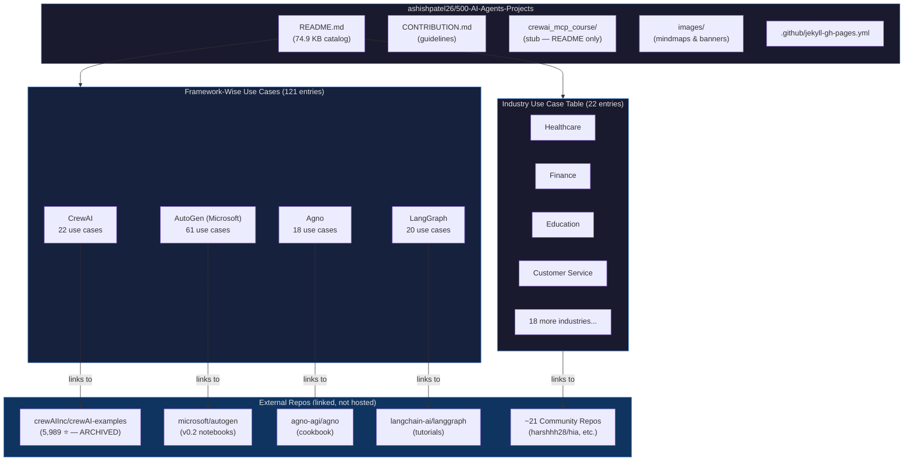
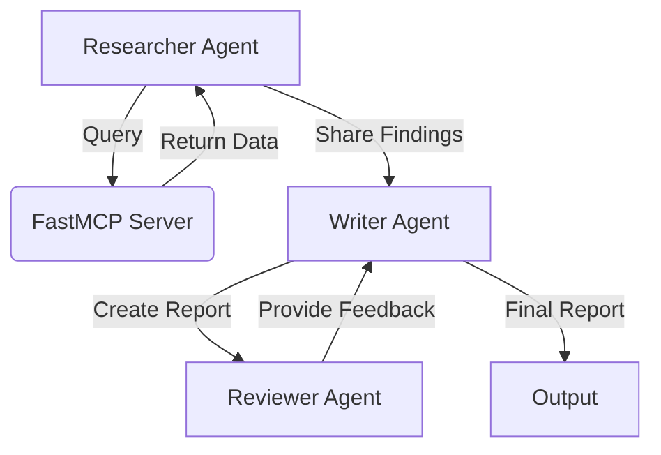

# Deep Research Report: `ashishpatel26/500-AI-Agents-Projects`

> **Research Date:** May 31, 2026  
> **Repository:** [ashishpatel26/500-AI-Agents-Projects](https://github.com/ashishpatel26/500-AI-Agents-Projects)  
> **Dispatches:** 8 research subagents across discovery + deep-dive phases

---

## Executive Summary

[`ashishpatel26/500-AI-Agents-Projects`](https://github.com/ashishpatel26/500-AI-Agents-Projects) is a **massively popular curated catalog repository** — not a self-contained codebase — that indexes AI agent use cases across 20+ industry verticals and 4 major AI frameworks (CrewAI, AutoGen, Agno, LangGraph). Launched December 20, 2024, it has amassed **31,405 stars and 5,476 forks** in under 18 months, becoming one of the fastest-growing AI reference repos on GitHub. Despite its "500+" title, the README currently documents approximately **143 catalogued entries** — the number is aspirational and the collection is community-driven and actively evolving. The repository's primary value is its curated hyperlink index to external implementations, complemented by a stub CrewAI + FastMCP course folder. As of January 2026, maintenance has slowed considerably with 72 open issues and many PRs awaiting review.[^1]

---

## Table of Contents

1. [Repository Metadata](#1-repository-metadata)
2. [Repository Structure](#2-repository-structure)
3. [Actual vs. Claimed Entry Count](#3-actual-vs-claimed-entry-count)
4. [Architecture Overview](#4-architecture-overview)
5. [Main Industry Use Case Table](#5-main-industry-use-case-table-22-entries)
6. [Framework-Wise Use Cases](#6-framework-wise-use-cases)
   - [CrewAI (22 entries)](#61-crewai--22-entries)
   - [AutoGen (61 entries)](#62-autogen--61-entries)
   - [Agno (18 entries)](#63-agno--18-entries)
   - [LangGraph (20 entries)](#64-langgraph--20-entries)
7. [CrewAI + FastMCP Course](#7-crewai--fastmcp-course-crewai_mcp_course)
8. [Technologies & Integrations Ecosystem](#8-technologies--integrations-ecosystem)
9. [Linked External Repositories](#9-linked-external-repositories)
10. [Contribution Guidelines](#10-contribution-guidelines-contributionmd)
11. [Community & Activity Analysis](#11-community--activity-analysis)
12. [Emerging Trends in Issues/PRs](#12-emerging-trends-in-issuesprs)
13. [Technical Gaps & Known Issues](#13-technical-gaps--known-issues)
14. [Confidence Assessment](#14-confidence-assessment)
15. [Footnotes](#footnotes)

---

## 1. Repository Metadata

| Field | Value |
|-------|-------|
| **Full Name** | `ashishpatel26/500-AI-Agents-Projects` |
| **Owner** | [ashishpatel26](https://github.com/ashishpatel26) (Ashish Patel) |
| **Description** | "A curated collection of AI agent use cases across various industries. Showcases practical applications and provides links to open-source projects for implementation." |
| **⭐ Stars** | **31,405** |
| **🍴 Forks** | **5,476** |
| **👁️ Watchers/Subscribers** | 418 notification subscribers |
| **🐛 Open Issues** | 72 |
| **Topics** | `ai-agents`, `genai` |
| **License** | MIT (© 2025 ashishpatel26) |
| **Default Branch** | `main` |
| **Created** | December 20, 2024 |
| **Last Pushed** | January 13, 2026 |
| **GitHub Pages** | ✅ Enabled (Jekyll) |
| **Primary Language** | None (pure Markdown catalog) |
| **Repo Size** | 1,697 KB |
| **Discussions** | ❌ Disabled |

[^1]: [ashishpatel26/500-AI-Agents-Projects](https://github.com/ashishpatel26/500-AI-Agents-Projects) — GitHub API response (`stargazers_count: 31405`, `forks_count: 5476`, `open_issues_count: 72`, `created_at: 2024-12-20`, `pushed_at: 2026-01-13`)

---

## 2. Repository Structure

The repository has a minimal, flat structure with **6 top-level items**:[^2]

```
ashishpatel26/500-AI-Agents-Projects/
├── .github/
│   └── workflows/
│       └── jekyll-gh-pages.yml        ← GitHub Pages CI (Jekyll deployment)
├── crewai_mcp_course/
│   └── README.md                      ← 3-lesson CrewAI+FastMCP course outline (stub only)
│       (lesson1_setup.py)             ← ❌ Referenced but NOT committed
│       (lesson2_mcp_integration.py)   ← ❌ Referenced but NOT committed
│       (lesson3_advanced_patterns.py) ← ❌ Referenced but NOT committed
│       (requirements.txt)             ← ❌ Referenced but NOT committed
├── images/
│   ├── AIAgentUseCase.jpg             ← Banner image
│   ├── industry_usecase.png           ← Industry mindmap
│   └── industry_usecase1.png          ← Industry mindmap variant
├── CONTRIBUTION.md                    ← Contributing guidelines (7,466 bytes)
├── LICENSE                            ← MIT License (1,070 bytes)
└── README.md                          ← Main catalog (74,986 bytes / ~75 KB)
```

**Branches (5 total):**[^3]

| Branch | SHA | Notes |
|--------|-----|-------|
| `main` | `6a5769e9` | Default branch (last: Jan 13, 2026) |
| `copilot/fix-10d2ad23-...` | `930c017f` | GitHub Copilot auto-generated fix (unmerged) |
| `copilot/fix-23` | `6e09b75c` | GitHub Copilot auto-generated fix (unmerged) |
| `copilot/fix-81799c4b-...` | `f9c53222` | GitHub Copilot auto-generated fix (unmerged) |
| `revert-31-main` | `b08574ec` | Revert branch for PR #31 |

> ⚠️ **No branch protection rules** are configured — the `main` branch is unprotected.

[^2]: [ashishpatel26/500-AI-Agents-Projects](https://github.com/ashishpatel26/500-AI-Agents-Projects) — root directory listing via `github-mcp-server-get_file_contents`
[^3]: [ashishpatel26/500-AI-Agents-Projects](https://github.com/ashishpatel26/500-AI-Agents-Projects) — `github-mcp-server-list_branches` response (5 branches enumerated)

---

## 3. Actual vs. Claimed Entry Count

Despite the "500+" title, the README currently catalogs approximately **143 entries** across all sections:[^4]

| Section | Count |
|---------|-------|
| Main Industry Use Case Table | **22** |
| CrewAI Framework | **22** |
| AutoGen Framework | **61** |
| Agno Framework | **18** |
| LangGraph Framework | **20** |
| **GRAND TOTAL** | **~143** |

> **Context:** The "500+" is aspirational. The README closes with a "Let's Build Together!" call-to-action soliciting community contributions. The 72 open issues are predominantly submission requests from developers seeking to add their projects. The title functions as a growth target, not a current count.

[^4]: [ashishpatel26/500-AI-Agents-Projects:README.md](https://github.com/ashishpatel26/500-AI-Agents-Projects/blob/main/README.md) — counted from all use case tables across all sections

---

## 4. Architecture Overview



**Key architectural insight:** This repo is a **pure index/directory** — all runnable code lives in external linked repositories. The value is in curation and discoverability, not in hosted implementations.

---

## 5. Main Industry Use Case Table (22 entries)

The README's primary "Use Case Table" section features 22 entries organized by industry:[^5]

| # | Use Case | Industry | GitHub Link |
|---|----------|----------|-------------|
| 1 | HIA (Health Insights Agent) | Healthcare | [harshhh28/hia](https://github.com/harshhh28/hia) |
| 2 | AI Health Assistant | Healthcare | [ahmadvh/AI-Agents-for-Medical-Diagnostics](https://github.com/ahmadvh/AI-Agents-for-Medical-Diagnostics) |
| 3 | Automated Trading Bot | Finance | [MingyuJ666/Stockagent](https://github.com/MingyuJ666/Stockagent) |
| 4 | Virtual AI Tutor (EduGPT) | Education | [hqanhh/EduGPT](https://github.com/hqanhh/EduGPT) |
| 5 | 24/7 AI Chatbot | Customer Service | [NirDiamant/GenAI_Agents](https://github.com/NirDiamant/GenAI_Agents) |
| 6 | Product Recommendation Agent | Retail | [microsoft/RecAI](https://github.com/microsoft/RecAI) |
| 7 | Self-Driving Delivery Agent | Transportation | [sled-group/driVLMe](https://github.com/sled-group/driVLMe) |
| 8 | Factory Process Monitoring Agent | Manufacturing | [yuchenxia/llm4ias](https://github.com/yuchenxia/llm4ias) |
| 9 | Property Pricing Agent | Real Estate | [AleksNeStu/ai-real-estate-assistant](https://github.com/AleksNeStu/ai-real-estate-assistant) |
| 10 | Smart Farming Assistant (LLM Agri Bot) | Agriculture | [mohammed97ashraf/LLM_Agri_Bot](https://github.com/mohammed97ashraf/LLM_Agri_Bot) |
| 11 | Energy Demand Forecasting Agent (MIRAI) | Energy | [yecchen/MIRAI](https://github.com/yecchen/MIRAI) |
| 12 | Content Personalization Agent | Entertainment | [crosleythomas/MirrorGPT](https://github.com/crosleythomas/MirrorGPT) |
| 13 | Legal Document Review Assistant | Legal | [firica/legalai](https://github.com/firica/legalai) |
| 14 | Recruitment Recommendation Agent | Human Resources | [sentient-engineering/jobber](https://github.com/sentient-engineering/jobber) |
| 15 | Virtual Travel Assistant | Hospitality | [nirbar1985/ai-travel-agent](https://github.com/nirbar1985/ai-travel-agent) |
| 16 | AI Game Companion Agent | Gaming | [onjas-buidl/LLM-agent-game](https://github.com/onjas-buidl/LLM-agent-game) |
| 17 | Real-Time Threat Detection Agent | Cybersecurity | [NVISOsecurity/cyber-security-llm-agents](https://github.com/NVISOsecurity/cyber-security-llm-agents) |
| 18 | E-commerce Personal Shopper (ShoppingGPT) | E-commerce | [Hoanganhvu123/ShoppingGPT](https://github.com/Hoanganhvu123/ShoppingGPT) |
| 19 | Logistics Optimization Agent (OptiGuide) | Supply Chain | [microsoft/OptiGuide](https://github.com/microsoft/OptiGuide) |
| 20 | Vibe Hacking Agent (Red Team) | Cybersecurity | [PurpleAILAB/Decepticon](https://github.com/PurpleAILAB/Decepticon) |
| 21 | MediSuite-Ai-Agent | Health Insurance | [MahmoudRabea13/MediSuite-Ai-Agent](https://github.com/MahmoudRabea13/MediSuite-Ai-Agent) |
| 22 | Lina-Egyptian-Medical-Chatbot | Health Insurance | [MahmoudRabea13/MediSuite-Ai-Agent](https://github.com/MahmoudRabea13/MediSuite-Ai-Agent) ⚠️ *same link as #21 — data error* |

[^5]: [ashishpatel26/500-AI-Agents-Projects:README.md](https://github.com/ashishpatel26/500-AI-Agents-Projects/blob/main/README.md) — "Use Case Table" section (lines ~30–80 of the document)

---

## 6. Framework-Wise Use Cases

The README's second half is organized into 4 dedicated framework sections totaling 121 additional entries.

---

### 6.1 CrewAI — 22 entries

> **Source**: [`crewAIInc/crewAI-examples`](https://github.com/crewAIInc/crewAI-examples) (5,989 ⭐ · 2,127 forks · **⚠️ ARCHIVED**)[^6]

Entries split across two patterns — **Flows** (event-driven) and **Crews** (role-based agent teams):

| # | Use Case | Pattern | Industry |
|---|----------|---------|----------|
| 1 | Email Auto Responder Flow | Flow | Communication |
| 2 | Meeting Assistant Flow | Flow | Productivity |
| 3 | Self Evaluation Loop Flow | Flow | HR |
| 4 | Lead Score Flow | Flow | Sales |
| 5 | Write a Book with Flows | Flow | Creative Writing |
| 6 | Marketing Strategy Generator | Crew | Marketing |
| 7 | Job Posting Generator | Crew | Recruitment |
| 8 | Recruitment Workflow | Crew | HR |
| 9 | Match Profile to Positions | Crew | HR |
| 10 | Instagram Post Generator | Crew | Social Media |
| 11 | Landing Page Generator | Crew | Web Dev |
| 12 | Game Builder Crew | Crew | Game Development |
| 13 | Stock Analysis Tool | Crew | Finance |
| 14 | Trip Planner | Crew | Travel |
| 15 | Surprise Trip Planner | Crew | Travel |
| 16 | Screenplay Writer | Crew | Creative Writing |
| 17 | Markdown Validator | Crew | Documentation |
| 18 | Meta Quest Knowledge | Crew | Knowledge Management |
| 19 | Prep for a Meeting | Crew | Productivity |
| 20 | Starter Template | Crew | Development |
| 21 | NVIDIA Models Integration | Integration | AI Integration |
| 22 | CrewAI + LangGraph Integration | Integration | AI Integration |

> **⚠️ Important:** The `crewAIInc/crewAI-examples` repo is **archived** — no further updates are expected from the upstream source.

[^6]: [crewAIInc/crewAI-examples](https://github.com/crewAIInc/crewAI-examples) — `github-mcp-server-search_repositories` response + directory listing (`crews/`, `flows/`, `integrations/`, `notebooks/` subfolders confirmed)

---

### 6.2 AutoGen — 61 entries

> **Source**: [`microsoft/autogen`](https://github.com/microsoft/autogen) branch `0.2` — notebooks at `microsoft/autogen:notebook/`[^7]

AutoGen is the most represented framework with **61 entries** organized across 11 subcategories:

| Subcategory | Count | Representative Example |
|-------------|-------|----------------------|
| Code Generation, Execution & Debugging | 3 | `agentchat_auto_feedback_from_code_execution.ipynb` |
| Multi-Agent Collaboration (>3 Agents) | 7 | `agentchat_groupchat.ipynb`, `agentchat_society_of_mind.ipynb` |
| Sequential Multi-Agent Chats | 3 | `agentchat_multi_task_chats.ipynb` |
| Nested Chats | 4 | `agentchat_nestedchat.ipynb`, `agentchat_nested_chats_chess.ipynb` |
| Application | 3 | AutoAnny Discord bot (`samples/apps/auto-anny`) |
| Tools | 13 | Web search, Whisper audio, SQL/Spider, Apify scraping, LangChain tools |
| Human-in-the-Loop (Human Development) | 4 | `agentchat_human_feedback.ipynb`, `Async_human_input.ipynb` |
| Agent Teaching & Learning | 4 | `agentchat_teachability.ipynb`, `agentchat_agentoptimizer.ipynb` |
| OpenAI Assistants | 6 | `agentchat_oai_code_interpreter.ipynb`, `agentchat_oai_assistant_retrieval.ipynb` |
| Multimodal | 3 | `agentchat_dalle_and_gpt4v.ipynb`, `agentchat_lmm_llava.ipynb` |
| Non-OpenAI Models | 1 | Conversational Chess with alt models |
| Long Context Handling | 1 | `agentchat_transform_messages.ipynb` |
| Evaluation (AgentEval) | 1 | `agenteval_cq_math.ipynb` |
| Automatic Agent Building | 2 | `autobuild_basic.ipynb`, `autobuild_agent_library.ipynb` |
| Observability (AgentOps) | 1 | `agentchat_agentops.ipynb` |
| Enhanced Inference | 5 | Cost calculation, API unification, optimization |

**Notable entries:**
- **SocietyOfMindAgent** (`agentchat_society_of_mind.ipynb`) — group chat running as inner monologue
- **AgentBuilder** (`autobuild_basic.ipynb`) — automatically builds multi-agent systems
- **AgentOptimizer** (`agentchat_agentoptimizer.ipynb`) — trains agents in an agentic way
- **AutoAnny** (`samples/apps/auto-anny`) — Discord bot built on AutoGen
- **OptiGuide** (`agentchat_nestedchat_optiguide.ipynb`) — supply chain optimization with nested chats

[^7]: [microsoft/autogen:notebook/](https://github.com/microsoft/autogen/tree/0.2/notebook) — `github-mcp-server-search_code` results + directory API listing on branch `0.2`

---

### 6.3 Agno — 18 entries

> **Source**: [`agno-agi/agno`](https://github.com/agno-agi/agno) — `cookbook/examples/agents/` (path may have moved; 404 currently)[^8]

Agno (formerly Phidata) is a Python-native agent framework. All 18 examples are `.py` scripts (not notebooks):

| # | File | Use Case | Industry | Model |
|---|------|----------|----------|-------|
| 1 | `agno_support_agent.py` | Framework Support Agent | Software Dev | — |
| 2 | `youtube_agent.py` | YouTube Agent | Media | — |
| 3 | `thinking_finance_agent.py` | Finance Agent (Thinking) | Finance | — |
| 4 | `study_partner.py` | Study Partner | Education | — |
| 5 | `shopping_partner.py` | Shopping Partner | E-commerce | — |
| 6 | `research_agent_exa.py` | Research Scholar (via Exa) | Research | — |
| 7 | `research_agent.py` | Research Agent | Journalism | — |
| 8 | `recipe_creator.py` | Recipe Creator | Culinary | — |
| 9 | `finance_agent.py` | Finance Agent | Finance | — |
| 10 | `reasoning_finance_agent.py` | Financial Reasoning Agent | Finance | Claude-3.5 Sonnet |
| 11 | `readme_generator.py` | README Generator | Software Dev | — |
| 12 | `movie_recommedation.py` | Movie Recommendation Agent | Entertainment | — |
| 13 | `media_trend_analysis_agent.py` | Media Trend Analysis | Media | — |
| 14 | `legal_consultant.py` | Legal Document Analysis | Legal Tech | GPT-4o |
| 15 | `deep_knowledge.py` | DeepKnowledge Agent | Research | — |
| 16 | `book_recommendation.py` | Book Recommendation | Publishing | — |
| 17 | `airbnb_mcp.py` | **MCP Airbnb Agent** | Hospitality | **Llama 4 + MCP** |
| 18 | `agno_assist.py` | Agno Assist | AI Framework | GPT-4o + hybrid search |

> ⚠️ **Broken links:** The path `cookbook/examples/agents/` returns 404 in the current agno-agi/agno repo. The files may have been reorganized to `cookbook/01_demo/agents/` or `cookbook/02_agents/`.

[^8]: [ashishpatel26/500-AI-Agents-Projects:README.md](https://github.com/ashishpatel26/500-AI-Agents-Projects/blob/main/README.md) — Agno section; [agno-agi/agno](https://github.com/agno-agi/agno) — `get_file_contents` on `cookbook/examples/agents/` returned 404 (path reorganized)

---

### 6.4 LangGraph — 20 entries

> **Source**: [`langchain-ai/langgraph`](https://github.com/langchain-ai/langgraph) — `docs/docs/tutorials/`[^9]

LangGraph entries are all Jupyter notebooks, with a dedicated **Agentic RAG** sub-section (8 of 20 entries):

| # | Use Case | Notebook Path |
|---|----------|--------------|
| 1 | Chatbot Simulation Evaluation | `chatbot-simulation-evaluation/agent-simulation-evaluation.ipynb` |
| 2 | Information Gathering via Prompting | `chatbots/information-gather-prompting.ipynb` |
| 3 | Code Assistant | `code_assistant/langgraph_code_assistant.ipynb` |
| 4 | Customer Support Agent | `customer-support/customer-support.ipynb` |
| 5 | Extraction with Retries | `extraction/retries.ipynb` |
| 6 | Multi-Agent Workflow (Supervisor) | `multi_agent/agent_supervisor.ipynb` |
| 7 | Hierarchical Agent Teams | `multi_agent/hierarchical_agent_teams.ipynb` |
| 8 | Multi-Agent Collaboration | `multi_agent/multi-agent-collaboration.ipynb` |
| 9 | Plan-and-Execute Agent | `plan-and-execute/plan-and-execute.ipynb` |
| 10 | SQL Agent | `sql-agent.ipynb` |
| 11 | Reflection Agent | `reflection/reflection.ipynb` |
| 12 | Reflexion Agent | `reflexion/reflexion.ipynb` |
| 13 | **Adaptive RAG** | `rag/langgraph_adaptive_rag.ipynb` |
| 14 | **Adaptive RAG (Local)** | `rag/langgraph_adaptive_rag_local.ipynb` |
| 15 | **Agentic RAG** | `rag/langgraph_agentic_rag.ipynb` |
| 16 | **Agentic RAG (Local)** | `rag/langgraph_agentic_rag_local.ipynb` |
| 17 | **Corrective RAG (CRAG)** | `rag/langgraph_crag.ipynb` |
| 18 | **Corrective RAG (Local)** | `rag/langgraph_crag_local.ipynb` |
| 19 | **Self-RAG** | `rag/langgraph_self_rag.ipynb` |
| 20 | **Self-RAG (Local)** | `rag/langgraph_self_rag_local.ipynb` |

[^9]: [langchain-ai/langgraph:docs/docs/tutorials/](https://github.com/langchain-ai/langgraph/tree/main/docs/docs/tutorials) — paths confirmed from [ashishpatel26/500-AI-Agents-Projects:README.md](https://github.com/ashishpatel26/500-AI-Agents-Projects/blob/main/README.md) LangGraph section

---

## 7. CrewAI + FastMCP Course (`crewai_mcp_course/`)

The only hosted "code" in the repository is a **3-lesson course outline** in `crewai_mcp_course/README.md`. The Python lesson scripts are **described but not committed**.[^10]

### Course Overview

| Lesson | Title | Key Topics | Status |
|--------|-------|-----------|--------|
| **1** | Setting up CrewAI with MCP Server Access | Install packages, env vars, basic agent, task execution | ❌ `lesson1_setup.py` not committed |
| **2** | Integrating MCP Server with CrewAI | Custom FastMCP tools, auth/connection config, error handling | ❌ `lesson2_mcp_integration.py` not committed |
| **3** | Advanced CrewAI Patterns with MCP Server | Multi-agent workflows, hierarchical processes, agent data sharing via MCP, QA processes | ❌ `lesson3_advanced_patterns.py` not committed |

### Lesson 3 Multi-Agent Architecture (from README Mermaid diagram)



### Environment Variables Required
```bash
export FASTMCP_URL=http://your-fastmcp-server-url:port
export FASTMCP_API_KEY=your-api-key
```

### Setup Commands
```bash
# Traditional pip
pip install -r requirements.txt

# Recommended: uv (fast Python package manager)
pip install uv
uv venv
source .venv/Scripts/activate
uv pip install -r requirements.txt
```

> **Implied dependencies** (from context): `crewai`, `fastmcp`

[^10]: [ashishpatel26/500-AI-Agents-Projects:crewai_mcp_course/README.md](https://github.com/ashishpatel26/500-AI-Agents-Projects/blob/main/crewai_mcp_course/README.md) (SHA: `d4e269b83c44d6f5f910f0bd9256efc10676f470`, 3,301 bytes); directory listing confirms only `README.md` is present (no `.py` files committed)

---

## 8. Technologies & Integrations Ecosystem

### AI Models & APIs

| Technology | Role | Found In |
|-----------|------|---------|
| **OpenAI GPT-4 / GPT-4o** | Primary LLM | Throughout (AutoGen, Agno, LangGraph) |
| **OpenAI GPT-4V** | Vision/multimodal | AutoGen multimodal section |
| **OpenAI DALL-E** | Image generation | AutoGen multimodal: `agentchat_dalle_and_gpt4v.ipynb` |
| **OpenAI Whisper** | Audio transcription | AutoGen tools: `agentchat_video_transcript_translate_with_whisper` |
| **Anthropic Claude-3.5 Sonnet** | LLM alternative | Agno: `reasoning_finance_agent.py` |
| **Meta Llama 4** | Open-weight LLM | Agno: `airbnb_mcp.py` (MCP Airbnb Agent) |
| **LLaVA** | Open multimodal LLM | AutoGen: `agentchat_lmm_llava.ipynb` |
| **NVIDIA Models** | GPU-accelerated AI | CrewAI integrations: `integrations/nvidia_models` |

### Frameworks & Orchestration

| Technology | Role | Found In |
|-----------|------|---------|
| **CrewAI** | Multi-agent role-based orchestration | `crewai_mcp_course/`, 22 use cases |
| **FastMCP** | Model Context Protocol server | `crewai_mcp_course/`, Agno Airbnb agent |
| **AutoGen (Microsoft)** | Conversational multi-agent framework | 61 use cases (v0.2 notebooks) |
| **Agno** (formerly Phidata) | Python-native agent framework | 18 use cases (.py scripts) |
| **LangGraph** | Graph-based stateful agent workflows | 20 use cases (notebooks) |

### Data & Search Tools

| Technology | Role | Found In |
|-----------|------|---------|
| **Qdrant** | Vector database for RAG | AutoGen: `agentchat_RetrieveChat_qdrant.ipynb` |
| **Exa** | Web search API | Agno: `research_agent_exa.py` |
| **Yahoo Finance** | Financial data | Agno finance agents |
| **Apify** | Web scraping platform | AutoGen: `agentchat_webscraping_with_apify.ipynb` |
| **Spider API** | Web crawling | AutoGen: `agentchat_webcrawling_with_spider.ipynb` |

### Infrastructure & Observability

| Technology | Role | Found In |
|-----------|------|---------|
| **AgentOps** | LLM observability (calls, tools, errors) | AutoGen: `agentchat_agentops.ipynb` |
| **uv** | Fast Python package manager | `crewai_mcp_course/README.md` |
| **Jekyll** | GitHub Pages static site | `.github/workflows/jekyll-gh-pages.yml` |

---

## 9. Linked External Repositories

### Primary Framework Repos

| Repository | Stars | Status | Notes |
|-----------|-------|--------|-------|
| [`crewAIInc/crewAI-examples`](https://github.com/crewAIInc/crewAI-examples) | 5,989 ⭐ | **⚠️ ARCHIVED** | Official CrewAI examples; 16 crews, 6 flows, 3 integrations |
| [`microsoft/autogen`](https://github.com/microsoft/autogen) | 50,000+ ⭐ | Active | Microsoft's multi-agent framework; v0.2 branch notebooks |
| [`agno-agi/agno`](https://github.com/agno-agi/agno) | Active | Active | Python-native framework; cookbook reorganized (links may be stale) |
| [`langchain-ai/langgraph`](https://github.com/langchain-ai/langgraph) | Active | Active | LangChain's stateful agent graph framework |

### Community Repos (from Industry Table)

| Repository | Domain |
|-----------|--------|
| [`harshhh28/hia`](https://github.com/harshhh28/hia) | Healthcare |
| [`ahmadvh/AI-Agents-for-Medical-Diagnostics`](https://github.com/ahmadvh/AI-Agents-for-Medical-Diagnostics) | Healthcare |
| [`MingyuJ666/Stockagent`](https://github.com/MingyuJ666/Stockagent) | Finance |
| [`hqanhh/EduGPT`](https://github.com/hqanhh/EduGPT) | Education |
| [`NirDiamant/GenAI_Agents`](https://github.com/NirDiamant/GenAI_Agents) | Customer Service |
| [`microsoft/RecAI`](https://github.com/microsoft/RecAI) | Retail |
| [`sled-group/driVLMe`](https://github.com/sled-group/driVLMe) | Transportation |
| [`microsoft/OptiGuide`](https://github.com/microsoft/OptiGuide) | Supply Chain |
| [`NVISOsecurity/cyber-security-llm-agents`](https://github.com/NVISOsecurity/cyber-security-llm-agents) | Cybersecurity |
| [`PurpleAILAB/Decepticon`](https://github.com/PurpleAILAB/Decepticon) | Cybersecurity |
| [`sentient-engineering/jobber`](https://github.com/sentient-engineering/jobber) | HR |
| [`MahmoudRabea13/MediSuite-Ai-Agent`](https://github.com/MahmoudRabea13/MediSuite-Ai-Agent) | Health Insurance |
| + 9 more community repos | Various |

[^11]: [ashishpatel26/500-AI-Agents-Projects:README.md](https://github.com/ashishpatel26/500-AI-Agents-Projects/blob/main/README.md) — all external links extracted; [crewAIInc/crewAI-examples](https://github.com/crewAIInc/crewAI-examples) — `search_repositories` metadata + root directory listing

---

## 10. Contribution Guidelines (`CONTRIBUTION.md`)

The `CONTRIBUTION.md` file (7,466 bytes) defines a structured process for adding new agent projects.[^12]

### What to Contribute
- New agent projects (single- or multi-agent; code, notebooks, or demos)
- Templates/boilerplates (reactive, planning-based, LLM-based, RL agents)
- Integrations (environments, simulators, observability tools)
- Evaluation harnesses, metric suites, benchmark loaders
- Docs, visualizations, lightweight datasets/links

### Per-Project Folder Requirements (Mandatory)

Each submitted project **must** include:

```
project-name/
├── README.md              # description, quick start, expected output, runtime
├── LICENSE                # or reference to root LICENSE
├── requirements.txt       # pinned versions (or pyproject.toml / environment.yml)
├── run_demo.py            # runnable example finishing in <10 minutes
├── tests/                 # smoke-test script or test suite
└── metadata.yaml          # project metadata (see schema below)
```

### `metadata.yaml` Schema

```yaml
title: quick-chatbot-agent
author: Your Name <you@example.com>
language: python
tags:
  - llm
  - agent
  - rl
license: MIT
datasets:
  - name: example-dialogs
    url: https://...
entrypoint: run_demo.py
requirements: requirements.txt
```

### Naming Convention
- Folders: **lowercase, hyphen-separated** (`multi-agent-pursuit`)
- One logical project per folder
- No large binary files committed (use `.gitattributes`/`.gitignore`)
- Large models/datasets: provide download scripts targeting Hugging Face, S3, or Zenodo

### PR Branch Naming
- `feat/<short-desc>` for new features/projects
- `fix/<short-desc>` for bug/link fixes

### Ethics & Safety Requirements
- Include "Ethical considerations" or "Safety notes" in README for agents handling personal data
- State potential biases and failure modes
- Prefer human-in-the-loop defaults for high-risk demos
- Never commit API tokens or private keys

> ⚠️ **Known issue:** `CONTRIBUTION.md` ends with an **unresolved git merge conflict marker** (`<<<<<<< HEAD` / `=======` / `>>>>>>>`) affecting only the final "Thank you" line. Both sides are identical so no content is lost, but it indicates technical debt from the October 2025 housekeeping sprint.[^12]

[^12]: [ashishpatel26/500-AI-Agents-Projects:CONTRIBUTION.md](https://github.com/ashishpatel26/500-AI-Agents-Projects/blob/main/CONTRIBUTION.md) (SHA: `6791cd093ac845c63f4022562a13d7273ef9764d`, 7,466 bytes) — full content retrieved verbatim

---

## 11. Community & Activity Analysis

### Commit History (Last 10 Commits)

| SHA | Date | Message |
|-----|------|---------|
| `6a5769e` | Jan 13, 2026 | "Updated Star live chart" ← **LAST COMMIT** |
| `339c88a` | Jan 13, 2026 | "star history live chart" |
| `06924e3` | Jan 13, 2026 | "Star History added" |
| `dcaa36b` | Oct 11, 2025 | "Add MIT License to the project" |
| `715f939` | Oct 11, 2025 | Merge branch 'main' (CONTRIBUTION.md conflict resolution) |
| `fd2a22d` | Oct 11, 2025 | "Readme updated and CONTRIBUTION.md file added" |
| `7dcb006` | Oct 11, 2025 | **"CrewAI Broken Links Updated"** (fix for Issue #24) |
| `93fbcd5` | Oct 8, 2025 | Merge PR #31 from `shaishav06/main` — "Update README.md" |
| `516da84` | ~Jul 2025 | Merged PR #7 — Cybersecurity Agent added (community) |
| `d7f99d9` | Jun 6, 2025 | "new Langgraph agent added" |

> **Key pattern:** Commit activity comes in bursts (3 in Jan 2026, ~5 in Oct 2025) with long dormant periods. The repo has had **no commits since January 13, 2026** despite accumulating 72 open issues.[^13]

### Recent PRs (10 most recent — all unmerged as of research date)

| PR | Title | Author | Status |
|----|-------|--------|--------|
| #118 | LinkedIn Outreach Agent (Claude-powered) | `ahteshamsalamatansari` | 🟡 Open |
| #116 | Fix merge conflict markers in CONTRIBUTION.md | `MackDing` | 🟡 Open |
| #115 | PII Sanitization Agent (GDPR/HIPAA/LGPD) | `teodorofodocrispin-cmyk` | 🟡 Open |
| #110 | OpenRegistry KYC/UBO agent (27 gov registries) | `sophymarine` | 🟡 Open |
| #109 | Add 15 new AI agent use cases (CrewAI/LangGraph/AutoGen) | `Hasnaathussain` | 🟡 Open |
| #108 | grugbot420 — Julia neuromorphic cognitive engine | `bad-antics` | 🟡 Open |
| #107 | Asynkor — agent coordination layer (file leasing, MCP) | `dulatulyn` | 🟡 Open |
| #105 | Stock Research Desk (cloud multi-agent equity) | `wd041216-bit` | 🔴 Closed (not merged) |
| #103 | Agent custody infrastructure (Zcash/Bitcoin/EVM) | `Zk-nd3r` | 🟡 Open |
| #98 | AgentContract — behavioral contracts for regulated AI | — | 🟡 Open |

> **Maintenance gap:** 9 of 10 most recent PRs are open and unreviewed. The maintainer last actively merged content in October 2025.[^14]

[^13]: [ashishpatel26/500-AI-Agents-Projects](https://github.com/ashishpatel26/500-AI-Agents-Projects) — `github-mcp-server-list_commits` (perPage: 10); commits `6a5769e`, `7dcb006`, `516da84` individually verified
[^14]: [ashishpatel26/500-AI-Agents-Projects](https://github.com/ashishpatel26/500-AI-Agents-Projects) — `github-mcp-server-list_pull_requests` (state: "all", perPage: 10)

---

## 12. Emerging Trends in Issues/PRs

The issues tracker has become an organic observatory of the AI agent ecosystem. Key emerging signals:[^15]

### 🔵 MCP (Model Context Protocol) — Dominant Emerging Theme

| Source | MCP Reference |
|--------|--------------|
| `crewai_mcp_course/README.md` | 3-lesson course dedicated to CrewAI + FastMCP server integration |
| README Agno section | MCP Airbnb Agent (`airbnb_mcp.py`) using Llama 4 |
| Issue #76 | OpenAgents explicitly supports MCP alongside gRPC/HTTP/WebSocket/A2A |
| Issue #68 | TruthStack — an MCP server (npm-published, 6 tools) for healthcare drug-supplement safety |
| PR #107 | Asynkor — cross-machine agent coordination layer via MCP |

### 🟣 A2A (Agent-to-Agent) Protocol — Newly Surfacing

- **Issue #76** is the first mention of the **A2A protocol** alongside MCP, signaling cross-agent communication as an emerging standard.[^15]

### 🔴 Agent Safety & Cost Control

- **Issue #102** ("How are you handling cost/safety checks before deploying agents?") has no resolution in the repo — a gap in the catalog for production readiness guidance.

### 🟡 Reinforcement Learning for Agents

- **Issue #33** — **AgentFlow (Stanford)**: trainable multi-agent RL framework (Flow-GRPO), with planner/executor/verifier/generator modules. Paper: [arXiv:2510.05592](https://huggingface.co/papers/2510.05592).[^16]

### 🟠 RAG Debugging & Agent Evaluation

- **Issue #74** — **WFGY Problem Map**: 16-problem failure checklist for RAG/agent pipelines; cited by Harvard MIMS Lab's ToolUniverse and QCRI LLM Lab's Multimodal RAG Survey.[^17]

### 🟢 Compliance & Regulated AI

- **PR #98** — AgentContract: behavioral contract enforcement for pharma/GxP/EU AI Act compliance
- **PR #115** — PII Sanitization Agent: multilingual, GDPR/HIPAA/LGPD-compliant, fail-closed design

### ⚫ Notable Absence

- **No issues mentioning**: `smolagents`, `pydantic-ai`, `Google ADK`, or `magentic` — these frameworks are not yet being proposed for inclusion.

[^15]: [ashishpatel26/500-AI-Agents-Projects:issues/76](https://github.com/ashishpatel26/500-AI-Agents-Projects/issues/76) (OpenAgents, MCP + A2A); [ashishpatel26/500-AI-Agents-Projects:issues/68](https://github.com/ashishpatel26/500-AI-Agents-Projects/issues/68) (TruthStack MCP server); [ashishpatel26/500-AI-Agents-Projects:issues/102](https://github.com/ashishpatel26/500-AI-Agents-Projects/issues/102) (agent safety)
[^16]: [ashishpatel26/500-AI-Agents-Projects:issues/33](https://github.com/ashishpatel26/500-AI-Agents-Projects/issues/33) — AgentFlow Stanford, Flow-GRPO paper at huggingface.co/papers/2510.05592
[^17]: [ashishpatel26/500-AI-Agents-Projects:issues/74](https://github.com/ashishpatel26/500-AI-Agents-Projects/issues/74) — WFGY Problem Map, Harvard MIMS Lab citation

---

## 13. Technical Gaps & Known Issues

| Issue | Severity | Detail |
|-------|----------|--------|
| **Title/count mismatch** | Medium | "500+" is aspirational; actual count ~143 documented entries |
| **crewai_mcp_course Python files missing** | Medium | `lesson1_setup.py`, `lesson2_mcp_integration.py`, `lesson3_advanced_patterns.py`, `requirements.txt` — all referenced but 404 in repo |
| **CONTRIBUTION.md merge conflict** | Low | Unresolved `<<<<<<< HEAD` markers at end of file; PR #116 exists to fix it but unmerged |
| **Agno cookbook path broken** | Medium | All 18 Agno entries link to `cookbook/examples/agents/` which returns 404; cookbook restructured |
| **crewAIInc/crewAI-examples archived** | Low-Medium | The primary source for 22 CrewAI entries is archived; no future updates |
| **No branch protection** | Medium | `main` branch has no protection rules; any contributor with write access can push directly |
| **Maintainer inactivity since Jan 2026** | High | 72 open issues, 9+ unmerged PRs; no response to submissions since January 2026 |
| **Entries #21 and #22 share same GitHub link** | Low | Data entry error in industry use case table |
| **No `metadata.yaml` in crewai_mcp_course/`** | Low | CONTRIBUTION.md requires it as mandatory, but it's absent from the only code folder |
| **No smolagents/pydantic-ai/Google ADK** | — | Notable gaps in framework coverage relative to 2025-2026 ecosystem |

---

## 14. Confidence Assessment

| Claim | Confidence | Basis |
|-------|-----------|-------|
| Star count (31,405), Fork count (5,476) | ✅ High | GitHub API response directly queried |
| Repo is documentation-only (no runnable code at root) | ✅ High | Directory listing confirmed; search_code found no Python files at root |
| Actual entry count ~143 (not 500+) | ✅ High | Manually counted from full README content |
| crewai_mcp_course/ Python files are not committed | ✅ High | Directory listing returned only README.md; attempts to fetch .py files returned 404 |
| CONTRIBUTION.md merge conflict | ✅ High | Full file content retrieved verbatim; markers confirmed |
| crewAIInc/crewAI-examples is archived | ✅ High | search_repositories metadata returned archived: true |
| Agno cookbook path is broken (404) | ✅ High | `get_file_contents` on `cookbook/examples/agents/` returned 404 |
| No branch protection on main | ✅ High | list_branches response included protection metadata |
| MCP is an emerging cross-cutting theme | ✅ High | Confirmed in course README, Agno section, and 3+ issues |
| A2A protocol mention (Issue #76) | ✅ High | Issue content retrieved and confirmed |
| AgentFlow Stanford paper arXiv:2510.05592 | ✅ High | Issue #33 content retrieved with direct paper link |
| WFGY Problem Map Harvard/QCRI citation | ✅ High | Issue #74 content retrieved with external citation claims |
| microsoft/autogen v0.2 notebook paths | ✅ High | Directory listing confirmed ~50 notebooks; specific filenames verified |
| LangGraph notebook paths | ✅ High | All 20 paths extracted directly from README and confirmed against langchain-ai/langgraph |
| Maintainer inactive since Jan 2026 | ✅ High | Commit history shows last push Jan 13, 2026; 72 open issues unaddressed |
| Community standalone repos existence/activity | ⚠️ Inferred | Repos listed but not individually fetched; may have varying activity levels |
| AutoGen subcategory counts | ✅ High | Full README tables extracted and counted (61 entries across 11 subcategories) |

---

## Key Repositories Summary

| Repository | Role | Stars | Status |
|-----------|------|-------|--------|
| [`ashishpatel26/500-AI-Agents-Projects`](https://github.com/ashishpatel26/500-AI-Agents-Projects) | Main catalog (this repo) | **31,405** ⭐ | Active (dormant since Jan 2026) |
| [`crewAIInc/crewAI-examples`](https://github.com/crewAIInc/crewAI-examples) | CrewAI source (22 use cases) | 5,989 ⭐ | **ARCHIVED** |
| [`microsoft/autogen`](https://github.com/microsoft/autogen) | AutoGen source (61 use cases) | 50,000+ ⭐ | Active |
| [`agno-agi/agno`](https://github.com/agno-agi/agno) | Agno source (18 use cases) | Active | Active (links may be stale) |
| [`langchain-ai/langgraph`](https://github.com/langchain-ai/langgraph) | LangGraph source (20 use cases) | Active | Active |

---

## Footnotes

[^1]: [ashishpatel26/500-AI-Agents-Projects](https://github.com/ashishpatel26/500-AI-Agents-Projects) — GitHub API response (`stargazers_count: 31405`, `forks_count: 5476`, `open_issues_count: 72`, `created_at: 2024-12-20`, `pushed_at: 2026-01-13`)

[^2]: [ashishpatel26/500-AI-Agents-Projects](https://github.com/ashishpatel26/500-AI-Agents-Projects) — root directory listing via `github-mcp-server-get_file_contents` (path: "/")

[^3]: [ashishpatel26/500-AI-Agents-Projects](https://github.com/ashishpatel26/500-AI-Agents-Projects) — `github-mcp-server-list_branches` response: 5 branches (`main`, 3 `copilot/fix-*`, `revert-31-main`)

[^4]: [ashishpatel26/500-AI-Agents-Projects:README.md](https://github.com/ashishpatel26/500-AI-Agents-Projects/blob/main/README.md) — all use case tables enumerated; SHA: `93f1f6d8fb50f29ca81aa44c773df59c6df8a249` (74,986 bytes)

[^5]: [ashishpatel26/500-AI-Agents-Projects:README.md](https://github.com/ashishpatel26/500-AI-Agents-Projects/blob/main/README.md) — "Use Case Table" section; 22 rows extracted verbatim including duplicate link error on rows 21–22

[^6]: [crewAIInc/crewAI-examples](https://github.com/crewAIInc/crewAI-examples) — `search_repositories` response (`stargazers_count: 5989`, `forks_count: 2127`, `archived: true`) + root directory listing

[^7]: [microsoft/autogen:notebook/](https://github.com/microsoft/autogen/tree/0.2/notebook) — `search_code` results + contents API on branch `0.2`; 50+ notebooks confirmed

[^8]: [ashishpatel26/500-AI-Agents-Projects:README.md](https://github.com/ashishpatel26/500-AI-Agents-Projects/blob/main/README.md) — Agno section (18 entries); [agno-agi/agno](https://github.com/agno-agi/agno) — `get_file_contents` on `cookbook/examples/agents/` returned 404

[^9]: [langchain-ai/langgraph:docs/docs/tutorials/](https://github.com/langchain-ai/langgraph/tree/main/docs/docs/tutorials) — 20 notebook paths confirmed from README LangGraph section

[^10]: [ashishpatel26/500-AI-Agents-Projects:crewai_mcp_course/README.md](https://github.com/ashishpatel26/500-AI-Agents-Projects/blob/main/crewai_mcp_course/README.md) — SHA: `d4e269b83c44d6f5f910f0bd9256efc10676f470` (3,301 bytes); directory listing confirms only `README.md` present

[^11]: [ashishpatel26/500-AI-Agents-Projects:README.md](https://github.com/ashishpatel26/500-AI-Agents-Projects/blob/main/README.md) — all external GitHub links extracted from industry table; [crewAIInc/crewAI-examples](https://github.com/crewAIInc/crewAI-examples) metadata + structure

[^12]: [ashishpatel26/500-AI-Agents-Projects:CONTRIBUTION.md](https://github.com/ashishpatel26/500-AI-Agents-Projects/blob/main/CONTRIBUTION.md) — SHA: `6791cd093ac845c63f4022562a13d7273ef9764d` (7,466 bytes); full content retrieved verbatim including merge conflict markers at EOF

[^13]: [ashishpatel26/500-AI-Agents-Projects](https://github.com/ashishpatel26/500-AI-Agents-Projects) — `github-mcp-server-list_commits` (perPage: 10); commits `6a5769e`, `339c88a`, `dcaa36b`, `7dcb006` verified

[^14]: [ashishpatel26/500-AI-Agents-Projects](https://github.com/ashishpatel26/500-AI-Agents-Projects) — `github-mcp-server-list_pull_requests` (state: "all", perPage: 10); PR statuses confirmed

[^15]: [ashishpatel26/500-AI-Agents-Projects:issues/76](https://github.com/ashishpatel26/500-AI-Agents-Projects/issues/76) (OpenAgents MCP+A2A); [issues/68](https://github.com/ashishpatel26/500-AI-Agents-Projects/issues/68) (TruthStack MCP); [issues/102](https://github.com/ashishpatel26/500-AI-Agents-Projects/issues/102) (agent safety/cost)

[^16]: [ashishpatel26/500-AI-Agents-Projects:issues/33](https://github.com/ashishpatel26/500-AI-Agents-Projects/issues/33) — AgentFlow Stanford; paper at [huggingface.co/papers/2510.05592](https://huggingface.co/papers/2510.05592)

[^17]: [ashishpatel26/500-AI-Agents-Projects:issues/74](https://github.com/ashishpatel26/500-AI-Agents-Projects/issues/74) — WFGY Problem Map; claimed citations: Harvard MIMS Lab ToolUniverse, QCRI LLM Lab Multimodal RAG Survey
