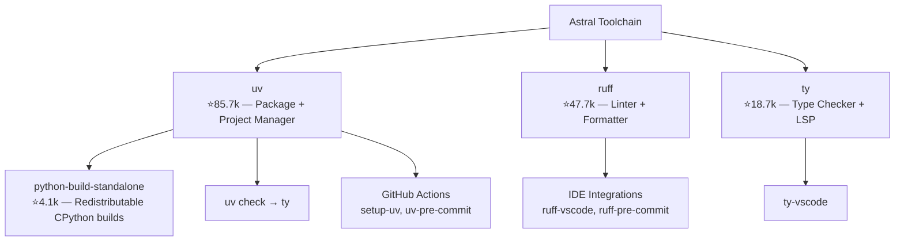
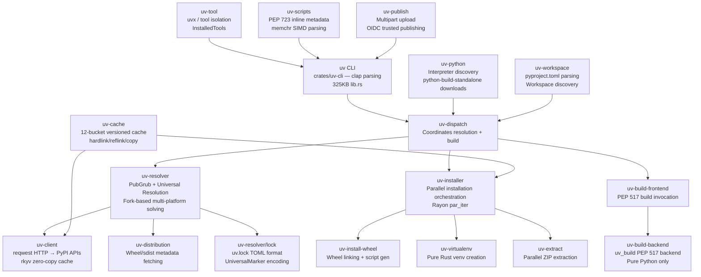

# `astral-sh/uv` — Comprehensive Technical Research Report

> **Research conducted:** 2026-05-31 | **Version studied:** 0.11.17 | **Rust MSRV:** 1.94.0

---

## Executive Summary

`uv` is an **extremely fast, all-in-one Python package and project manager written in Rust**, developed by Astral (creators of `ruff` and `ty`). It replaces `pip`, `pip-tools`, `pipx`, `poetry`, `pyenv`, `virtualenv`, and `twine` in a single binary, delivering **10–100× faster** performance through a combination of parallel Rayon-based installation, rkyv zero-copy cache deserialization, CoW reflink file copying, and a PubGrub-based dependency resolver that runs on a dedicated CPU thread while metadata is pre-fetched asynchronously. As of v0.11.17 (released 2026-05-28), the project has **85,767 GitHub stars**, sees multiple commits daily, and has received a new `uv check` command integrating Astral's `ty` type checker, signaling evolution toward a full "Cargo for Python" development toolchain.[^1][^2]

---

## Table of Contents

1. [Project Overview & Goals](#1-project-overview--goals)
2. [The Astral Ecosystem](#2-the-astral-ecosystem)
3. [Technical Stack & Dependencies](#3-technical-stack--dependencies)
4. [Architecture Overview](#4-architecture-overview)
5. [Crate Inventory (65+ Crates)](#5-crate-inventory-65-crates)
6. [Dependency Resolver (PubGrub + Universal Resolution)](#6-dependency-resolver-pubgrub--universal-resolution)
7. [Cache System](#7-cache-system)
8. [Package Installation Pipeline](#8-package-installation-pipeline)
9. [Python Version Management](#9-python-version-management)
10. [CLI Command Tree](#10-cli-command-tree)
11. [Workspace & Project System](#11-workspace--project-system)
12. [Build Backend (`uv_build`)](#12-build-backend-uv_build)
13. [Tool Isolation System (`uvx` / `uv tool`)](#13-tool-isolation-system-uvx--uv-tool)
14. [PEP 723 Inline Script Dependencies](#14-pep-723-inline-script-dependencies)
15. [Publishing & Trusted Publishing](#15-publishing--trusted-publishing)
16. [Performance Benchmarks](#16-performance-benchmarks)
17. [Development & CI/CD](#17-development--cicd)
18. [Key Repositories Summary](#18-key-repositories-summary)
19. [Confidence Assessment](#19-confidence-assessment)
20. [Footnotes](#footnotes)

---

## 1. Project Overview & Goals

`uv` is positioned as a "Cargo for Python" — a unified, production-quality tool that collapses the fragmented Python packaging ecosystem into a single binary. It was initially released in **February 2024** as a `pip`/`pip-tools` drop-in replacement, then dramatically expanded in **September 2024** to become a complete project manager.[^3]

**Five major capability pillars**[^1]:

| Pillar | Commands | Replaces |
|--------|----------|----------|
| **Projects** | `uv init`, `uv add`, `uv run`, `uv lock`, `uv sync` | Poetry, PDM, Rye |
| **Scripts** | `uv run script.py` with PEP 723 metadata | Standalone scripts |
| **Tools** | `uvx`, `uv tool install` | pipx |
| **Python versions** | `uv python install`, `uv python pin` | pyenv |
| **pip interface** | `uv pip compile`, `uv pip sync`, `uv pip install` | pip, pip-tools |

**Design principles**[^3]:
1. **Obsessive performance** — 10–100× faster than alternatives
2. **Optimized for adoption** — drop-in replacements for existing tools
3. **Simplified toolchain** — one tool, one binary, zero dependencies

---

## 2. The Astral Ecosystem

Astral is building a complete Rust-powered Python developer toolchain:



**Key evolution milestones**[^3][^4]:
- **Feb 2024**: Initial release — pip/pip-tools replacement; Astral takes stewardship of `rye` from Armin Ronacher
- **Sep 2024**: Full "Cargo for Python" — added `uv run`, `uv lock`, `uv sync`, `uv tool`, `uv python`, PEP 723 scripts
- **2025–2026**: Stable production tool; `rye` archived; new `uv check` integrates `ty` type checker
- **v0.11.17 (May 2026)**: Current stable release; Rust MSRV bumped to 1.94; `uv check` command added

**Astral-maintained infrastructure forks**[^5]:

| Crate | Upstream | Why Forked |
|-------|----------|------------|
| `astral-pubgrub` | nickel-org/pubgrub | Universal resolution extensions |
| `astral_async_zip` | Majored/async_zip | Multi-format (bzip2/lzma/xz/zstd) support |
| `astral-reqwest-middleware` | TrueLayer | Custom retry/auth hooks |
| `astral-tokio-tar` | alexcrichton/tokio-tar | Async tar for sdist extraction |
| `astral-version-ranges` | nickel-org/version-ranges | Version range algebra |

---

## 3. Technical Stack & Dependencies

**Core language and runtime**[^5]:

| Component | Version | Role |
|-----------|---------|------|
| **Rust edition** | 2024 (MSRV 1.94.0) | Language |
| **Async runtime** | tokio 1.40 (full features) | All async I/O |
| **HTTP client** | reqwest 0.13 (rustls, HTTP/2, socks) | PyPI API calls |
| **Dep resolver** | astral-pubgrub 0.3.3 | PubGrub version solving |
| **CLI parsing** | clap 4.5.17 (derive) | All subcommands |
| **Serialization** | serde 1.0, toml_edit 0.25.8, rmp_serde | Config/lock files |
| **Zero-copy cache** | rkyv 0.8.14 (with bytecheck) | PyPI API response caching |
| **Parallelism** | rayon 1.10.0 | Parallel wheel installation |
| **Concurrent maps** | dashmap 6.1.0, hashbrown 0.17.0 | Thread-safe package index |
| **Hashing** | rustc-hash 2.0.0, SeaHash | Cache keys (non-crypto) |
| **ZIP/TAR** | astral_async_zip 0.0.18-rc4, astral-tokio-tar 0.6.2 | Archive extraction |
| **CoW copies** | reflink-copy 0.1.19 | File deduplication |
| **Error display** | miette 7.2.0 | Rich terminal diagnostics |
| **Graph algorithms** | petgraph 0.8.0 | Dependency graph |
| **Binary inspection** | goblin 0.10.0 | ELF/PE binary analysis |
| **Cloud auth** | reqsign 0.20.0 (AWS/Azure/GCP) | Registry authentication |
| **SBOM** | cyclonedx-bom 0.8.1 | `uv audit` security |
| **Self-update** | axoupdater 0.10.0 | `uv self update` |
| **Env vars** | dotenvy 0.15.7 | `.env` support |
| **Windows APIs** | windows 0.61.0 | File system, registry |

**Build profile optimizations**[^5]:
```toml
[profile.release]
strip = true
lto = "fat"    # Fat LTO for cross-crate inlining — major performance boost
```

---

## 4. Architecture Overview



**Data flow for `uv sync` (most common operation)**:
```
User: uv sync
  1. uv-workspace: discover workspace, parse pyproject.toml
  2. uv-python: find/download compatible Python interpreter
  3. uv-virtualenv: create .venv if missing
  4. uv-resolver → solve():
     a. Dedicated thread: PubGrub solver ↔ request channel
     b. Tokio async: metadata fetcher → InMemoryIndex (DashMap)
     c. Output: Resolution graph → uv.lock
  5. uv-installer → install():
     a. Plan: diff installed vs. required
     b. Download: stream wheels concurrently
     c. Install: Rayon par_iter() per wheel
        → link_dir(): Clone (CoW) → Hardlink → Copy fallback
  6. ✅ Environment ready
```

---

## 5. Crate Inventory (65+ Crates)

All crates live in `crates/` as a Cargo workspace.[^6][^7]

**CLI & Dispatch** (entry points):

| Crate | Purpose |
|-------|---------|
| `uv` | Main binary entry point |
| `uv-cli` | All clap CLI definitions (325KB, ~50+ subcommands) |
| `uv-dispatch` | Central coordinator: resolver + builder + installer |
| `uv-types` | Shared traits (avoids circular dependencies) |

**Resolution** (the resolver):

| Crate | Purpose |
|-------|---------|
| `uv-resolver` | Core: PubGrub solver, fork machinery, lockfile, resolution graph |
| `uv-pep440` | PEP 440 version number parsing and comparison |
| `uv-pep508` | PEP 508 dependency specifier parsing |
| `uv-pypi-types` | PyPI API type definitions |
| `uv-platform-tags` | PEP 425 platform tag inference |
| `uv-normalize` | Package/extra name normalization |

**Distribution & Client** (package fetching):

| Crate | Purpose |
|-------|---------|
| `uv-client` | PyPI-compatible HTTP API client; rkyv `OwnedArchive` type |
| `uv-distribution` | Wheel/sdist metadata fetching and coordination |
| `uv-distribution-types` | Abstractions for distributions |
| `uv-distribution-filename` | Parses wheel/sdist filenames per PEP 427/625 |
| `uv-auth` | Authentication (keyring, netrc, basic auth) |
| `uv-keyring` | OS keyring integration |
| `uv-netrc` | `.netrc` file support |
| `uv-redacted` | URL redaction for sensitive credentials in logs |

**Installation** (venv population):

| Crate | Purpose |
|-------|---------|
| `uv-installer` | Installation orchestrator: plan, download, install |
| `uv-install-wheel` | Wheel installation: linking, script generation, RECORD update |
| `uv-virtualenv` | Pure Rust venv creation (replaces `python -m venv`) |
| `uv-extract` | Parallel ZIP/TAR extraction (sync + async streaming) |

**Build** (source packages):

| Crate | Purpose |
|-------|---------|
| `uv-build-frontend` | PEP 517 build frontend: invokes build backends |
| `uv-build-backend` | uv's own `uv_build` PEP 517 backend (pure Python only) |
| `uv-trampoline-builder` | Windows trampoline binary builder for entry points |

**Cache** (persistence):

| Crate | Purpose |
|-------|---------|
| `uv-cache` | 12-bucket versioned cache, file locking, CoW/hardlink management |
| `uv-cache-key` | `CacheKey` trait + SeaHash digest computation |
| `uv-cache-info` | Local dependency invalidation (`CacheInfo`: timestamps, git SHA, env vars) |

**Python** (interpreter management):

| Crate | Purpose |
|-------|---------|
| `uv-python` | Full interpreter discovery, download, version management |
| `uv-platform` | OS/arch detection |
| `uv-platform-tags` | PEP 425 wheel compatibility tag computation |

**Project & Config**:

| Crate | Purpose |
|-------|---------|
| `uv-workspace` | Workspace discovery, `pyproject.toml` parsing, `[tool.uv]` settings |
| `uv-settings` | Configuration loading (uv.toml, pyproject.toml, env vars) |
| `uv-scripts` | PEP 723 inline script dependency parsing |
| `uv-tool` | `uvx`/`uv tool` isolation and persistence |
| `uv-publish` | PyPI upload with trusted publishing (OIDC) |
| `uv-audit` | `uv audit` — OSV vulnerability scanning |
| `uv-torch` | PyTorch index specialization |

**Protocols** (VCS and network):

| Crate | Purpose |
|-------|---------|
| `uv-git` | Git repository support (clone, rev resolution) |
| `uv-git-types` | Git-related type definitions |

**Utilities & Internals**:

| Crate | Purpose |
|-------|---------|
| `uv-fs` | Filesystem utilities: `LinkMode`, reflink/hardlink/copy |
| `uv-dirs` | Platform-specific directory resolution |
| `uv-shell` | Shell detection and PATH manipulation |
| `uv-once-map` | Concurrent waitmap — deduplicates in-flight async tasks |
| `uv-fastid` | Fast non-secure random ID generation |
| `uv-small-str` | Stack-allocated small strings |
| `uv-performance-memory-allocator` | Custom global allocator for better performance |
| `uv-macros` | Procedural macros |
| `uv-warnings` | User-facing warning message utilities |
| `uv-errors` | Error code definitions |
| `uv-static` | Static data (e.g., `INSTALLER_NAME = "uv"`) |
| `uv-version` | Current uv version constant |
| `uv-preview` | Feature flags for preview features |
| `uv-flags` | Feature flag support |
| `uv-requirements` | `pyproject.toml`/`requirements.txt` input reading |
| `uv-requirements-txt` | `requirements.txt` parser |
| `uv-configuration` | Core configuration types |
| `uv-toml` | TOML utilities |
| `uv-globfilter` | Portable glob matching |
| `uv-logging` | Log setup |
| `uv-unix` | Unix-specific utilities |
| `uv-windows` | Windows-specific utilities |
| `uv-bench` | Benchmark scaffolding |
| `uv-dev` | Developer tools (benchmark rendering) |
| `uv-test` | Test utilities and `TestContext` |

---

## 6. Dependency Resolver (PubGrub + Universal Resolution)

The resolver in `crates/uv-resolver/` is uv's most architecturally novel component.[^8]

### 6.1 Architecture: Two-Thread Design

```
┌─────────────────────────────────────────────────┐
│  Tokio async runtime                             │
│  ┌────────────────────┐   request channel        │
│  │  Metadata fetcher  │ ◄──────────────────────┐ │
│  │  (HTTP + cache)    │                        │ │
│  │  OwnedArchive      │ ──response DashMap──► │ │
│  └────────────────────┘                        │ │
│                                                 │ │
│  ┌─────────────────────────────────────────┐   │ │
│  │  PubGrub solver thread (CPU-bound)      │   │ │
│  │  ForkState stack → unit propagation     │ ──┘ │
│  │  → choose_version → get_dependencies   │     │
│  └─────────────────────────────────────────┘     │
└─────────────────────────────────────────────────┘
```

The PubGrub solver runs on a **dedicated OS thread** (CPU work), communicating with the async metadata fetcher via mpsc channels. This prevents the solver from blocking the Tokio event loop during package metadata requests.[^8]

### 6.2 PubGrubPackageInner — The Core Package Type

Extras and dependency groups are modeled as **virtual proxy packages**, forcing PubGrub to co-pin extras to the same base version:[^8]

```rust
pub enum PubGrubPackageInner {
    Root(Option<PackageName>),          // virtual root
    Python(PubGrubPython),              // python version constraint
    Package { name, extra, group, marker },  // real package
    Extra { name, extra, marker },      // proxy: base + extra version pinning
    Group { name, group, marker },      // proxy: dependency group
    Marker { name, marker },            // marker-scoped proxy
    System(PackageName),
}
```

### 6.3 Universal Resolution — The Key Innovation

uv computes a **single `uv.lock` that is valid for ALL platforms and Python versions simultaneously**. This is done via "fork-based resolution":[^8]

**Two types of forking**:

1. **Version-based forking** — When a package has different `requires-python` bounds, the solver forks into Python version sub-ranges:
   ```
   numpy 2.2.0 requires python>=3.10 → Fork 1: python>=3.10 → numpy==2.2.0
                                      → Fork 2: python==3.9  → numpy==2.0.2
                                      → Fork 3: python==3.8  → numpy==1.24.4
   ```

2. **Dependency-based forking** — When the same dependency has disjoint marker expressions:
   ```
   foo>=1.0 ; sys_platform == 'linux'
   foo<1.0  ; sys_platform == 'win32'
   → Fork per disjoint marker group
   ```

**Conflict-group forking** (for `[tool.uv.conflicts]`): Creates N+1 forks per conflict set — one "none" fork excluding all conflicting items, one per item including only it.[^8]

### 6.4 The UniversalMarker Encoding Trick

Conflict markers (extras/groups) are **encoded inside a PEP 508 MarkerTree** using the `extra` attribute field with synthetic namespacing:[^8]

```
extra-3-foo-x1     ← extra 'x1' on package 'foo'
group-3-bar-dev    ← group 'dev' on package 'bar'
project-5-mypkg    ← project 'mypkg'
```

This reuses the full boolean simplification engine (DNF/CNF reduction, disjointness checks) of `MarkerTree` for conflict markers — avoiding a separate implementation.

### 6.5 Fork Strategy

```rust
pub enum ForkStrategy {
    RequiresPython,  // Default: newest version per Python range
    Fewest,          // Minimize versions; prefer older broader-compatible versions
}
```

### 6.6 Candidate Priority System

```rust
enum PubGrubPriority {
    Root,                           // always first
    DirectUrl(Reverse<usize>),      // pinned URL — highest
    Singleton(Reverse<usize>),      // == constraint (pinned to one version)
    ConflictEarly(Reverse<usize>),  // conflict victim → decide early
    Unspecified(Reverse<usize>),    // FIFO discovery order
    ConflictLate(Reverse<usize>),   // conflict culprit → deprioritized
}
```

Adaptive conflict re-prioritization: packages that repeatedly cause backtracking get `ConflictEarly`, improving solver convergence.[^8]

### 6.7 The uv.lock Format

Version 1, revision 3. A TOML file at workspace root:[^8]

```toml
version = 1
revision = 3
requires-python = ">=3.8"

[options]
resolution-mode = "highest"
prerelease-mode = "disallow"
fork-strategy = "requires-python"

[[resolution-markers]]   # multi-version fork triggers
"python_full_version >= '3.10'"

[[package]]
name = "numpy"
version = "2.2.0"
source = { registry = "https://pypi.org/simple" }
resolution-markers = ["python_full_version >= '3.10'"]

sdist = { url = "...", hash = "sha256:...", size = 12345 }

[[package.wheels]]
url = "https://files.pythonhosted.org/..."
hash = "sha256:..."
filename = "numpy-2.2.0-cp310-cp310-manylinux_2_17_x86_64.whl"

[[package.dependencies]]
name = "scipy"
marker = "sys_platform == 'linux'"
```

**PackageId** is `(name, version?, source)`. If a package is unambiguous (appears once), `version` and `source` are omitted from dependency references for compactness.[^8]

---

## 7. Cache System

The cache is organized into **12 versioned buckets** with suffix-versioned directories (e.g., `simple-v21`).[^9]

### 7.1 Cache Directory Layout

```
$HOME/.cache/uv/          # Unix (XDG_CACHE_HOME/uv)
%LOCALAPPDATA%\uv\cache   # Windows

├── .lock                  # Shared/exclusive file lock
├── simple-v21/            # PyPI Simple API responses (rkyv zero-copy)
│   └── pypi/<package>.rkyv
│
├── wheels-v6/             # Pre-built wheel metadata + archive symlinks
│   ├── pypi/<name>/
│   ├── index/<digest>/
│   ├── url/<digest>/
│   ├── path/<digest>/
│   └── git/<digest>/<sha>/
│
├── sdists-v9/             # Source distributions + built wheels
│   └── pypi/<name>/<version>/
│       ├── manifest.msgpack   # CacheInfo (timestamps, git SHA, env vars)
│       ├── metadata.msgpack   # Resolution metadata
│       └── built-wheel-<id>/ → symlink to archive-v0
│
├── archive-v0/            # Canonical unzipped wheel trees (UUID-named)
│   └── <ArchiveId>/       # Full wheel directory contents
│
├── flat-index-v2/         # --find-links flat indexes
├── git-v0/                # Bare Git clones
├── interpreter-v4/        # Python interpreter metadata (.msgpack per path)
├── builds-v0/             # Ephemeral PEP 517 build venvs
├── environments-v2/       # Persistent tool venvs (uv tool)
├── python-v0/             # Downloaded Python versions
├── binaries-v0/           # Downloaded tool binaries
└── osv-v0/                # OSV vulnerability records (uv audit)
```

**Version numbers are critical**: bumping the suffix (e.g., `simple-v20` → `simple-v21`) silently abandons old cache entries — they become "dangling" and are prunable but not read. This is how uv handles incompatible cache format changes without user disruption.[^9]

### 7.2 Archive/Symlink Indirection

All buckets (wheels, sdists) store **symlinks pointing to `archive-v0/<ArchiveId>/`** rather than storing directory contents directly. This provides:[^9]

- **Atomic replacement**: swapping a symlink is a single syscall
- **Reference counting** via symlink counting
- **Deduplication**: multiple environments share the same archive entry

`ArchiveId` is a fast random UUID (not content-addressed, though content-addressing via SHA is planned).

### 7.3 rkyv Zero-Copy Deserialization

PyPI Simple API responses are stored as `.rkyv` files. Reading them is essentially free:[^9]

```rust
pub struct OwnedArchive<A> {
    raw: AlignedVec,   // owns aligned byte buffer
    archive: PhantomData<A>,
}

impl<A> Deref for OwnedArchive<A> {
    type Target = A::Archived;
    fn deref(&self) -> &A::Archived {
        // SAFETY: validated in constructor
        unsafe { rkyv::access_unchecked::<A::Archived>(&self.raw) }
    }
}
```

After one validation pass on first read, every subsequent field access (e.g., `archived.versions[i].files[j].url`) is a **direct pointer dereference** — zero deserialization cost.[^9]

### 7.4 Cache Key System

```rust
pub fn cache_digest<H: CacheKey>(hashable: &H) -> String {
    // SeaHash — stable, non-crypto, fast
    // Output: 16-char hex string (u64 digest)
}
```

**SeaHash** is chosen because it is stable across platforms (no random seeding) and consistent across uv versions — required for persistent on-disk keys.[^9]

`CacheInfo` for local dependencies tracks: `timestamp` (max ctime), `commit` (Git SHA), `tags` (Git tags), environment variables, and directory timestamps. Users can extend via `[tool.uv] cache-keys`.[^9]

---

## 8. Package Installation Pipeline

### 8.1 LinkMode — The File-Linking Strategy

```rust
pub enum LinkMode { Clone, Hardlink, Copy, Symlink }

impl Default for LinkMode {
    fn default() -> Self {
        if cfg!(target_os = "macos" | "ios" | "linux") {
            Self::Clone   // CoW reflink on APFS/btrfs/xfs/bcachefs
        } else {
            Self::Hardlink // Windows
        }
    }
}
```

**Automatic fallback chain**: `Clone → Hardlink → Copy`[^9]

**Linux Clone implementation** uses `ioctl_ficlone` directly via `rustix`, with a custom `reflink_with_permissions` to handle permissions separately (avoiding a TOCTOU race).[^9]

**macOS Clone implementation** uses `clonefile()` for **entire directories in one syscall** — the single most impactful optimization for macOS performance.[^9]

### 8.2 Wheel Installation Steps

Following PEP 427:[^9]

```
1. Parse WHEEL → Root-Is-Purelib?
2. Select site-packages (purelib or platlib)
3. link_dir(): archive-v0/<ArchiveId>/ → site-packages/
   - Clone → Hardlink → Copy fallback
   - RECORD file always gets a real copy (must be mutable)
4. Parse entry_points.txt → console_scripts + gui_scripts
5. Write script entrypoints (shebang wrapping; .exe stubs on Windows)
6. Process .data/ subdirs → purelib/platlib/headers/scripts/data
7. Write INSTALLER ("uv"), direct_url.json, updated RECORD
8. If Clone mode: force-update site-packages mtime
   (CPython checks mtime to decide whether to rescan for new packages)
```

### 8.3 Parallel Installation

All wheels are installed in parallel using Rayon:[^9]

```rust
wheels.par_iter().try_for_each(|wheel| {
    uv_install_wheel::install_wheel(layout, wheel.path(), ..., link_mode, &state)?;
    Ok::<(), Error>(())
})?;
```

The shared `InstallState` (across all parallel tasks) detects module path conflicts.

---

## 9. Python Version Management

Implemented entirely in `crates/uv-python/` (~450KB across 5+ major files).[^10]

### 9.1 Discovery Order

uv searches for Python interpreters in strict priority order:[^10]

| Priority | Source | When |
|----------|--------|------|
| 1 | `UV_INTERNAL__PARENT_INTERPRETER` | Running as `python -m uv` |
| 2 | `VIRTUAL_ENV` env var | Active virtual environment |
| 3 | `CONDA_PREFIX` (child) | Active conda environment |
| 4 | `.venv` (filesystem walk up) | Auto-discovered project venv |
| 5 | `CONDA_PREFIX` (base) | Base conda environment |
| 6 | Managed installs (`~/.local/share/uv/python/`) | Default: **before PATH** |
| 7 | `PATH` executables | System Python |
| 8 | Windows Registry (PEP 514) | Windows only |
| 9 | Microsoft Store | Windows only |

Default preference is `PythonPreference::Managed` — uv-managed installs take priority over system Python.[^10]

### 9.2 python-build-standalone Integration

The **complete download catalog** (2.7MB JSON) is **embedded in the uv binary at compile time**:[^10]

```rust
const BUILTIN_PYTHON_DOWNLOADS_JSON: &[u8] =
    include_bytes!(concat!(env!("OUT_DIR"), "/download-metadata-minified.json"));
```

**Download URL format**:
```
https://github.com/astral-sh/python-build-standalone/releases/download/20260510/
  cpython-3.15.0b1%2B20260510-aarch64-apple-darwin-install_only_stripped.tar.gz
```

Mirror priority: Astral CDN mirror (primary) → GitHub releases (fallback). Override with `UV_PYTHON_INSTALL_MIRROR` or `UV_ASTRAL_MIRROR_URL`.[^10]

### 9.3 Version Resolution (e.g., `3.12` → Latest Patch)

1. `"3.12"` → `VersionRequest::MajorMinor(3, 12)` with current platform info
2. Filter embedded catalog (pre-sorted newest-first during JSON parsing)
3. First match = newest available patch for that minor version
4. Pre-releases excluded by default; fallback if no stable version exists[^10]

### 9.4 Installation Paths

```
~/.local/share/uv/python/           # Unix (XDG_DATA_HOME/uv/python)
%APPDATA%\uv\data\python\           # Windows

├── cpython-3.12.7-macos-aarch64-none/   # specific patch
└── cpython-3.12-macos-aarch64-none      # symlink → cpython-3.12.7-...
```

Post-install steps: `ensure_externally_managed()`, `ensure_sysconfig_patched()`, `ensure_canonical_executables()`, `ensure_minor_version_link()`, `ensure_dylib_patched()` (macOS RPATH).[^10]

### 9.5 `.python-version` File

Discovered by walking up from CWD to workspace root, then checking `~/.config/uv/`. Supports any `PythonRequest` format. `uv python pin --global` writes to `~/.config/uv/.python-version`.[^10]

---

## 10. CLI Command Tree

The CLI is defined via clap in `crates/uv-cli/src/lib.rs` (325KB). ~50+ total subcommands.[^11]

```
uv
├── run         ─── Execute command/script in project or script environment
├── init        ─── Create new project or script
├── add         ─── Add dependencies to pyproject.toml + re-lock + re-sync
├── remove      ─── Remove dependencies
├── sync        ─── Sync environment with lockfile
├── lock        ─── Create/update uv.lock
├── export      ─── Export lockfile to requirements.txt or pylock.toml
├── tree        ─── Display dependency tree
├── tool
│   ├── run         (alias: uvx)
│   ├── install
│   ├── uninstall
│   ├── list
│   ├── upgrade
│   ├── update-shell
│   └── dir
├── python
│   ├── install
│   ├── uninstall
│   ├── list
│   ├── find
│   ├── pin
│   ├── dir
│   └── update-shell
├── pip
│   ├── compile     ─── pip-compile: resolve → requirements.txt
│   ├── sync        ─── pip-sync: install exact set
│   ├── install     ─── pip install (additive)
│   ├── uninstall
│   ├── freeze
│   ├── list
│   ├── show
│   ├── tree
│   └── check
├── venv        ─── Create virtual environment
├── build       ─── Build .whl and .tar.gz via PEP 517
├── publish     ─── Upload distributions to index
├── workspace
│   └── list
├── version     ─── Read/update project version (PEP 440-compatible bumping)
├── format      ─── Format Python code (delegates to ruff)
├── check       ─── Type check (delegates to ty) [NEW in v0.11.17]
├── audit       ─── Vulnerability audit (OSV database)
├── cache
│   ├── clean
│   ├── prune
│   ├── dir
│   └── size
└── self
    ├── update
    └── version
```

**Key command behaviors**[^11]:

- `uv add` = edit `pyproject.toml` + `uv lock` + `uv sync` in one operation
- `uv run` = auto-sync before executing (unless `--frozen` or `--no-sync`)
- `uv pip *` = no workspace/lockfile; operates directly on a target environment
- `uvx` = ephemeral isolated tool execution (no persistence)

---

## 11. Workspace & Project System

### 11.1 Core Data Structures

`crates/uv-workspace/src/workspace.rs` (109KB)[^11]:

```rust
pub struct Workspace {
    install_path: PathBuf,               // workspace root
    packages: WorkspaceMembers,          // BTreeMap<PackageName, WorkspaceMember>
    required_members: BTreeMap<PackageName, Editability>,
    sources: BTreeMap<PackageName, Sources>,  // [tool.uv.sources] at root
    indexes: Vec<Index>,
    pyproject_toml: PyProjectToml,
}

pub struct PyProjectToml {
    pub project: Option<Project>,        // PEP 621 [project]
    pub tool: Option<Tool>,
    pub dependency_groups: Option<DependencyGroups>,  // PEP 735
    pub raw: String,                     // for in-place mutation
}
```

### 11.2 `[tool.uv.sources]` — Rich Dependency Sources

```rust
pub enum Source {
    Git { git, subdirectory, rev, tag, branch, lfs, marker, extra, group },
    Url { url, subdirectory, marker, extra, group },
    Path { path, editable, package, marker, extra, group },
    Registry { index, marker, extra, group },  // pin dep to named index
    Workspace { workspace, editable, marker, extra, group },
}
```

Example usage:
```toml
[tool.uv.sources]
torch = { index = "pytorch-cu121" }              # pin to PyTorch GPU index
mylib = { git = "https://github.com/org/mylib", rev = "abc123" }
internal = { workspace = true }                  # workspace member
```

### 11.3 Workspace Discovery Algorithm

```
1. Walk up from CWD to find pyproject.toml
2. Check for [tool.uv.workspace] → this is the explicit root
3. If no [project] and no workspace → error
4. Otherwise search upward for a parent with [tool.uv.workspace]
5. If none found → implicit single-package workspace
6. collect_members(): glob-expand members[], exclude[]
   → read each member's pyproject.toml
   → validate no nested workspaces
   → build BTreeMap<PackageName, WorkspaceMember>
```

**Virtual workspaces**: A workspace root with `[tool.uv] package = false` (no `[project]`) is a virtual workspace — acts as a monorepo orchestrator without itself being a publishable package.[^11]

### 11.4 Mutable pyproject.toml

`pyproject_mut.rs` (78KB) enables atomic in-place edits for `uv add`/`uv remove`, preserving TOML formatting and comments using `toml_edit`.[^11]

---

## 12. Build Backend (`uv_build`)

**Only pure Python packages are supported** — no C extensions, no build scripts.[^12]

### 12.1 Supported Project Layouts

| Layout | Configuration |
|--------|---------------|
| Standard `src/` layout | Default (`module_root = "src"`) |
| Flat layout | `module-root = ""` |
| Namespace packages | Dotted `module-name` or `namespace = true` |
| Type stub packages | Names ending in `-stubs` |
| Multi-module | `module-name = ["foo", "bar"]` |

### 12.2 Embedded Backend

The `uv` binary contains an **embedded copy** of the backend. When `uv build` detects version compatibility, it uses the embedded backend directly — eliminating subprocess overhead.[^12]

### 12.3 Activation

```toml
[build-system]
requires = ["uv_build>=0.11.17,<0.12"]
build-backend = "uv_build"
```

### 12.4 Comparison with Other Backends

| Feature | `uv_build` | setuptools | hatchling |
|---------|-----------|------------|-----------|
| Extension modules | ❌ | ✅ | ✅ |
| Build scripts | ❌ | ✅ | ❌ |
| Build hooks | ❌ | ✅ | ✅ |
| Zero-config src layout | ✅ | Partial | ✅ |
| Bundled in frontend | ✅ | ❌ | ❌ |
| Language | Rust | Python | Python |

---

## 13. Tool Isolation System (`uvx` / `uv tool`)

### 13.1 Tool Data Structure

```rust
// crates/uv-tool/src/tool.rs
pub struct Tool {
    requirements: Vec<Requirement>,  // [0] = tool itself; rest = --with
    constraints: Vec<Requirement>,
    python: Option<PythonRequest>,
    entrypoints: Vec<ToolEntrypoint>,
    options: ToolOptions,
}
```

Persisted as `uv-receipt.toml` inside each tool's directory:[^12]

```
~/.local/uv/tools/
  ruff/
    .venv/              ← isolated virtualenv
    uv-receipt.toml     ← Tool serialized
~/.local/bin/
  ruff                  ← symlink/shim → .venv/bin/ruff
```

### 13.2 `uvx` vs `uv tool install`

| | `uvx` | `uv tool install` |
|-|-------|-------------------|
| Persistence | Ephemeral | Permanent (`~/.local/uv/tools/`) |
| PATH modification | None | Adds to `UV_TOOL_BIN_DIR` |
| Speed | Cached venv | Full install once |
| `@version` | ✅ | ❌ |
| `--with` extras | ✅ | ✅ |

**Key isolation rule**: `uvx pytest` inside a project does NOT see the project's packages. Use `uv run pytest` when project packages are needed.[^12]

### 13.3 File Locking

Tool directory operations use an exclusive `LockedFile` at `<tools_root>/.lock` to prevent concurrent access across uv processes.[^12]

---

## 14. PEP 723 Inline Script Dependencies

### 14.1 Script Format

```python
#!/usr/bin/env -S uv run
# /// script
# requires-python = ">=3.12"
# dependencies = ["requests", "rich"]
#
# [tool.uv]
# exclude-newer = "2024-01-01T00:00:00Z"
# [[tool.uv.index]]
# url = "https://pypi.org/simple"
# ///

import requests
```

### 14.2 SIMD-Accelerated Parsing

```rust
static FINDER: LazyLock<Finder> = LazyLock::new(|| Finder::new(b"# /// script"));
```

Uses `memchr::memmem::Finder` — a **SIMD-accelerated** byte pattern search for fast script tag detection.[^12]

### 14.3 Complete `Pep723Item` Support

Scripts can come from:[^12]

```rust
pub enum Pep723Item {
    Script(Pep723Script),    // local .py file
    Stdin(Pep723Metadata),   // stdin (uv run -)
    Remote(..),              // HTTP/HTTPS URL, GitHub Gists
}
```

### 14.4 Lockfile per Script

```console
$ uv lock --script example.py   # creates example.py.lock
$ uv run example.py             # uses example.py.lock if present
```

### 14.5 Inline `[tool.uv]` Options Available in Scripts

Scripts can declare private indexes, git sources, overrides, and `exclude-newer` for reproducibility — without a `pyproject.toml`.[^12]

### 14.6 `uv run` Dispatch Logic

```
uv run:
├── script with inline metadata → ScriptEnvironment (isolated, script-specific venv)
│   └── Project dependencies IGNORED even if run inside a project directory
└── no inline metadata in project → ProjectEnvironment (project .venv)
    └── auto-sync before execution (unless --frozen/--no-sync)
```

---

## 15. Publishing & Trusted Publishing

### 15.1 `TrustedPublishing` Enum

```rust
pub enum TrustedPublishing {
    Automatic,  // Try OIDC only if no credentials; soft-fail outside CI
    Always,     // Force OIDC; error if credentials also given
    Never,      // Skip OIDC entirely
}
```

### 15.2 OIDC Token Flow

```
uv publish --trusted-publishing automatic

1. GET /_/oidc/audience  →  get registry audience
2. ambient_id::Detector::detect(audience)
   ├── GitHub Actions: ACTIONS_ID_TOKEN_REQUEST_URL
   ├── GitLab CI: CI_JOB_JWT
   └── Buildkite: BUILDKITE_OIDC_TOKEN
3. POST /_/oidc/mint-token  →  short-lived upload token
4. ::add-mask:: token  (GitHub Actions only — masks token in logs)
5. Upload with upload token
```

### 15.3 Three Upload HTTP Clients

```
upload_client  → retries=0, custom retry loop (streaming body not cloneable)
oidc_client    → default retries, no-auth
s3_client      → retries=0, no-auth (for pyx.dev two-phase S3 upload)
```

### 15.4 PEP 740 Attestation

Files named `<dist>.publish.attestation` are automatically paired with their distribution and uploaded together.[^12]

---

## 16. Performance Benchmarks

**Headline**: 10–100× faster than pip.[^4]

### Virtual Environment Creation

| Tool | With seed pkgs | Without seed pkgs |
|------|---------------|-------------------|
| **uv** | **4.1ms** | **18.2ms** |
| virtualenv | 24.1ms | 141.4ms |
| python -m venv | 74.4ms | 1,540ms |

**uv venv: 80× faster than `python -m venv`**

### HuggingFace Transformers (all optional deps)

| Tool | No cache | With cache |
|------|----------|------------|
| **uv** | **7.48s** | **0.14s** |
| poetry | 47.91s | 4.32s |
| PDM | 91.91s | 58.61s |

### Trio docs-requirements (warm vs. cold)

| Tool | Warm resolve | Warm install | Cold install |
|------|-------------|--------------|-------------|
| **uv** | **0.01s** | **0.06s** | **1.1s** |
| pip-compile/pip-sync | 3.37s | 4.63s | ~30s |
| poetry | 1.56s | 1.90s | ~15s |

### Key Optimization Techniques

1. **Fat LTO** (`lto = "fat"`) — aggressive cross-crate inlining
2. **macOS `clonefile()`** — entire directory clone in one syscall (APFS CoW)
3. **Linux `ioctl_ficlone`** — block-level CoW on btrfs/xfs/bcachefs
4. **Hardlinks on Windows** — zero-copy file linking
5. **rkyv zero-copy** — Simple API responses deserialized at pointer speed
6. **Range requests** (`astral_async_http_range_reader`) — fetch wheel metadata without downloading full wheels
7. **Rayon parallel installation** — all wheels installed concurrently
8. **`uv-once-map`** — concurrent waitmap deduplicating in-flight async metadata requests
9. **Global `archive-v0/`** — wheels extracted once and shared across all environments
10. **Embedded catalog** — no network request to determine available Python versions

---

## 17. Development & CI/CD

### 17.1 CI Architecture (`ci.yml`)

A `plan` job runs first on fast `depot-ubuntu-24.04` runners, detecting changed files and setting flags to conditionally trigger downstream jobs. All decisions are file-diff-based to avoid unnecessary CI runs.[^13]

**PR label overrides**[^13]:

| Label | Effect |
|-------|--------|
| `test:skip` | Skip most tests |
| `test:integration` | Force integration tests |
| `test:system` | Force system tests |
| `test:macos` | Force macOS tests |
| `build:skip-docker` | Skip Docker builds |
| `build:release` | Force release binary build |

**Security**: `check-zizmor.yml` runs [zizmor](https://github.com/woodruffw/zizmor) for GitHub Actions security auditing. All workflows use minimal permissions.[^13]

### 17.2 Testing Infrastructure

- **Test runner**: `cargo nextest` (recommended)
- **Snapshot testing**: `insta` crate + `cargo-insta`
- **Macro**: `uv_snapshot!` for CLI output testing
- **Fixture repos**: Dedicated `astral-sh/uv-*-test` GitHub repos (workspace scenarios)
- **CI snapshots**: `./scripts/apply-ci-snapshots.sh`[^13]

### 17.3 Key Development Dependencies

- `cargo-nextest` — faster test runner
- `cargo-insta` — snapshot review
- `cargo shear` — detect unused Cargo dependencies
- `zizmor` — GitHub Actions security linter
- `typos` — spell checker
- `shellcheck` — shell script linter
- `prettier` — markdown/YAML formatting

### 17.4 Recent Activity (v0.11.17, May 2026)

| SHA | Change |
|-----|--------|
| `f69c1b2` | **Add `uv check` — run `ty` from uv** (Gankra) |
| `81dabd5` | Rust toolchain to 1.96, MSRV to 1.94 |
| `a33a629` | Bump to v0.11.17 |
| `71ae411` | Add diagnostic for `uv add` with stdlib modules |
| `28cb092` | Add `--no-editable-package` flag |
| `484ba39` | Fix `uv venv --clear` safety (don't remove non-venvs) |
| `19577` (PR) | Infer Python version from source trees in `uv tool` |

### 17.5 Current Development Priorities (Open Issues)

- **Windows robustness**: OneDrive Files-on-Demand (#19616), junction symlinks (#19622)
- **Security**: `uv audit` auto-integration with `uv add` (#19607)
- **Workspace**: per-member `requires-python` versioning (#19576)
- **Performance**: file handle limits (#17512), resolver progress output (#2014)
- **Ecosystem**: PEP 751 `pylock.toml` export (WIP), WSL1+2 compatibility

---

## 18. Key Repositories Summary

| Repository | Stars | Description |
|-----------|-------|-------------|
| [astral-sh/uv](https://github.com/astral-sh/uv) | 85.7k ⭐ | Main package manager (Rust monorepo, 65+ crates) |
| [astral-sh/ruff](https://github.com/astral-sh/ruff) | 47.7k ⭐ | Python linter + formatter (integrates as `uv format`) |
| [astral-sh/ty](https://github.com/astral-sh/ty) | 18.7k ⭐ | Python type checker (integrates as `uv check`) |
| [astral-sh/python-build-standalone](https://github.com/astral-sh/python-build-standalone) | 4.1k ⭐ | Redistributable CPython builds (powers `uv python install`) |
| [astral-sh/rye](https://github.com/astral-sh/rye) | 14.2k ⭐ *(archived)* | Predecessor tool; absorbed into uv |
| [astral-sh/setup-uv](https://github.com/astral-sh/setup-uv) | 780 ⭐ | GitHub Actions: install uv |
| [astral-sh/uv-docker-example](https://github.com/astral-sh/uv-docker-example) | 782 ⭐ | Using uv in Docker images |
| [astral-sh/uv-pre-commit](https://github.com/astral-sh/uv-pre-commit) | 331 ⭐ | Pre-commit hooks for uv |
| [astral-sh/packse](https://github.com/astral-sh/packse) | 133 ⭐ | Python packaging test scenarios (resolver fixtures) |

---

## 19. Confidence Assessment

| Claim | Confidence | Source |
|-------|-----------|--------|
| Performance numbers (10–100×) | **High** | Published benchmark data, `BENCHMARKS.md`, blog post |
| 65+ crates and their purposes | **High** | Direct Cargo.toml + crates/ inspection |
| Resolver architecture (PubGrub, forking) | **High** | Resolver source files directly inspected |
| uv.lock TOML format | **High** | Lock module source directly inspected |
| Cache bucket names and structure | **High** | `uv-cache/src/lib.rs` directly inspected |
| rkyv usage for Simple API cache | **High** | `uv-client/src/rkyvutil.rs` directly inspected |
| Python discovery order | **High** | `uv-python/src/discovery.rs` directly inspected |
| CLI command tree | **High** | `uv-cli/src/lib.rs` directly inspected |
| Workspace discovery algorithm | **High** | `uv-workspace/src/workspace.rs` directly inspected |
| Build backend limitations (no C ext) | **High** | `docs/concepts/build-backend.md` directly read |
| Trusted publishing OIDC flow | **High** | `uv-publish/src/trusted_publishing/` directly inspected |
| PEP 723 SIMD parsing (memchr) | **High** | `uv-scripts/src/lib.rs` directly inspected |
| `uv check` / `ty` integration details | **Medium** | PR #19605 description; full implementation not fetched |
| `uv-torch` crate purpose | **Low** | Cargo.toml confirmed existence; not deeply investigated |
| PEP 751 pylock.toml export status | **Medium** | PR #14728 confirmed as draft/in-progress |
| `pyx.dev` (new registry) | **Low** | Inferred from `pyx-auth-action` repo; not publicly documented |
| `uv_small_str` / `uv_fastid` internals | **Low** | Confirmed existence; not inspected |

---

## Footnotes

[^1]: [astral-sh/uv README.md](https://github.com/astral-sh/uv/blob/main/README.md)
[^2]: [astral-sh/uv CHANGELOG.md — v0.11.17](https://github.com/astral-sh/uv/blob/main/CHANGELOG.md)
[^3]: [Astral blog — "uv: Unified Python packaging"](https://astral.sh/blog/uv-unified-python-packaging)
[^4]: [Astral blog — "Introducing uv" (Feb 2024)](https://astral.sh/blog/uv)
[^5]: [astral-sh/uv Cargo.toml](https://github.com/astral-sh/uv/blob/main/Cargo.toml)
[^6]: [astral-sh/uv crates/README.md](https://github.com/astral-sh/uv/blob/main/crates/README.md)
[^7]: astral-sh/uv crates/ directory listing (workspace members from Cargo.toml)
[^8]: [astral-sh/uv crates/uv-resolver/src/](https://github.com/astral-sh/uv/tree/main/crates/uv-resolver/src) — resolver/mod.rs, lock/mod.rs, universal_marker.rs, pubgrub/
[^9]: [astral-sh/uv crates/uv-cache/src/lib.rs](https://github.com/astral-sh/uv/blob/main/crates/uv-cache/src/lib.rs); [crates/uv-fs/src/link.rs](https://github.com/astral-sh/uv/blob/main/crates/uv-fs/src/link.rs); [crates/uv-install-wheel/src/](https://github.com/astral-sh/uv/tree/main/crates/uv-install-wheel/src); [crates/uv-client/src/rkyvutil.rs](https://github.com/astral-sh/uv/blob/main/crates/uv-client/src/rkyvutil.rs)
[^10]: [astral-sh/uv crates/uv-python/src/](https://github.com/astral-sh/uv/tree/main/crates/uv-python/src) — discovery.rs, downloads.rs, managed.rs, version_files.rs; [docs/concepts/python-versions.md](https://github.com/astral-sh/uv/blob/main/docs/concepts/python-versions.md)
[^11]: [astral-sh/uv crates/uv-cli/src/lib.rs](https://github.com/astral-sh/uv/blob/main/crates/uv-cli/src/lib.rs); [crates/uv-workspace/src/](https://github.com/astral-sh/uv/tree/main/crates/uv-workspace/src)
[^12]: [astral-sh/uv crates/uv-build-backend/src/](https://github.com/astral-sh/uv/tree/main/crates/uv-build-backend/src); [crates/uv-tool/src/](https://github.com/astral-sh/uv/tree/main/crates/uv-tool/src); [crates/uv-scripts/src/lib.rs](https://github.com/astral-sh/uv/blob/main/crates/uv-scripts/src/lib.rs); [crates/uv-publish/src/](https://github.com/astral-sh/uv/tree/main/crates/uv-publish/src); [docs/concepts/build-backend.md](https://github.com/astral-sh/uv/blob/main/docs/concepts/build-backend.md)
[^13]: [astral-sh/uv .github/workflows/ci.yml](https://github.com/astral-sh/uv/blob/main/.github/workflows/ci.yml); [CONTRIBUTING.md](https://github.com/astral-sh/uv/blob/main/CONTRIBUTING.md)
