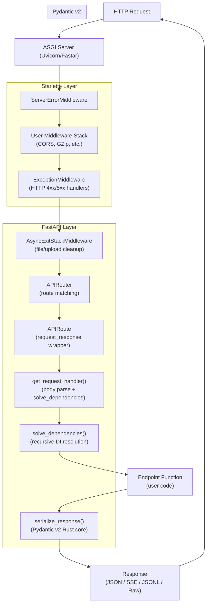
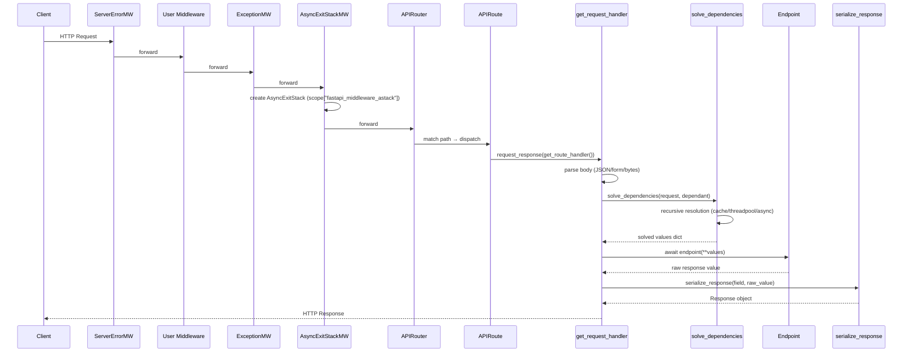

# FastAPI Framework — Comprehensive Technical Deep-Dive

> **Repository:** [fastapi/fastapi](https://github.com/fastapi/fastapi)  
> **Version Analyzed:** `0.136.3`  
> **Research Date:** May 31, 2026  
> **Latest Commit:** `ee22a4b8ca46dcce26c8c183afc4992a888d8be2`

---

## Executive Summary

FastAPI is a modern, high-performance Python web framework for building APIs, built as a thin but powerful layer on top of **Starlette** (ASGI foundation) and **Pydantic v2** (data validation). With nearly **99,000 GitHub stars** and a 100% test coverage requirement across Python 3.10–3.14 (including free-threaded 3.14t), it is one of the most widely adopted Python frameworks — particularly dominant in AI/LLM serving use cases. The architecture is elegantly simple: `FastAPI` inherits directly from Starlette's application class, delegates all HTTP/ASGI machinery upward, and adds a strongly-typed `APIRouter`, a recursive dependency injection system, and automatic OpenAPI 3.1 schema generation driven entirely by Python type hints. In 2026, FastAPI added first-class SSE support, Pydantic Rust-backed serialization, and free-threaded Python support, positioning it firmly in the AI/real-time ecosystem.

---

## Table of Contents

1. [Repository Overview & Statistics](#1-repository-overview--statistics)
2. [Architecture Overview](#2-architecture-overview)
3. [Core Application Class](#3-core-application-class)
4. [Routing System](#4-routing-system)
5. [Parameter System](#5-parameter-system)
6. [Dependency Injection System](#6-dependency-injection-system)
7. [Request Handling Pipeline](#7-request-handling-pipeline)
8. [Response Serialization](#8-response-serialization)
9. [OpenAPI & Interactive Documentation](#9-openapi--interactive-documentation)
10. [Security Module](#10-security-module)
11. [Streaming & Server-Sent Events](#11-streaming--server-sent-events)
12. [Middleware System](#12-middleware-system)
13. [Utility Layer](#13-utility-layer)
14. [Testing & CI/CD](#14-testing--cicd)
15. [Community, Roadmap & Recent Releases](#15-community-roadmap--recent-releases)
16. [Key Repositories Summary](#16-key-repositories-summary)
17. [Confidence Assessment](#17-confidence-assessment)
18. [Footnotes](#footnotes)

---

## 1. Repository Overview & Statistics

| Metric | Value |
|---|---|
| **Stars** | ~98,690 ⭐ |
| **Forks** | 9,357 |
| **Open Issues** | 1 (pinned Roadmap tracker) |
| **Primary Language** | Python |
| **License** | MIT |
| **Created** | December 8, 2018 |
| **Last Push** | May 30, 2026 |
| **Homepage** | https://fastapi.tiangolo.com/ |
| **Current Version** | `0.136.3` |
| **Maintainer** | Sebastián Ramírez (`@tiangolo`) — BDFL model |
| **Python Support** | `>=3.10` (dropped 3.8, 3.9) |

The `fastapi/` package itself contains **30+ source files** organized into sub-packages for dependencies, OpenAPI generation, security, and middleware.[^1]

### Key Required Dependencies

```toml
dependencies = [
    "starlette>=0.46.0",           # ASGI foundation
    "pydantic>=2.9.0",             # Data validation (Pydantic v2 only)
    "typing-extensions>=4.8.0",    # Type hint backports
    "typing-inspection>=0.4.2",    # Runtime type introspection
    "annotated-doc>=0.0.2",        # Annotation docs
]
```
[^2]

### Optional `standard` Install Extras

```toml
"fastapi-cli[standard] >=0.0.8"   # CLI: `fastapi run`, `fastapi dev`
"uvicorn[standard] >=0.12.0"       # ASGI server
"httpx >=0.23.0,<1.0.0"           # Test client
"jinja2 >=3.1.5"                   # HTML templates
"python-multipart >=0.0.18"        # Form & file upload parsing
"email-validator >=2.0.0"          # Email field validation
"pydantic-settings >=2.0.0"        # Settings management
"pydantic-extra-types >=2.0.0"     # Extra Pydantic types
```
[^2]

---

## 2. Architecture Overview

FastAPI's architecture is a layered composition model where it delegates all ASGI machinery to Starlette while adding type-driven parameter parsing, DI, and schema generation on top.



### Class Inheritance Chain

```
FastAPI
  └── starlette.applications.Starlette
        └── ASGI Application (__call__(scope, receive, send))

APIRouter
  └── starlette.routing.Router

APIRoute
  └── starlette.routing.Route

APIWebSocketRoute
  └── starlette.routing.WebSocketRoute
```
[^3]

---

## 3. Core Application Class

### `FastAPI.__init__` — Constructor Parameters (Complete)

The `FastAPI` class inherits from `Starlette` but builds its own internal state rather than calling `Starlette.__init__()` the conventional way.[^4]

| Parameter | Type | Default | Purpose |
|---|---|---|---|
| `debug` | `bool` | `False` | Enable debug tracebacks on 500 errors |
| `title` | `str` | `"FastAPI"` | API title in OpenAPI/Swagger docs |
| `summary` | `str \| None` | `None` | Short API summary in OpenAPI |
| `description` | `str` | `""` | Full Markdown description |
| `version` | `str` | `"0.1.0"` | **Your app's** version (not FastAPI's) |
| `openapi_url` | `str \| None` | `"/openapi.json"` | `None` disables all docs |
| `openapi_tags` | `list[dict] \| None` | `None` | Tag ordering and descriptions |
| `servers` | `list[dict] \| None` | `None` | OpenAPI server list |
| `dependencies` | `Sequence[Depends] \| None` | `None` | Global dependencies for every route |
| `default_response_class` | `type[Response]` | `JSONResponse` | Override default serializer |
| `redirect_slashes` | `bool` | `True` | Auto-redirect `/items` → `/items/` |
| `docs_url` | `str \| None` | `"/docs"` | Swagger UI path |
| `redoc_url` | `str \| None` | `"/redoc"` | ReDoc UI path |
| `swagger_ui_oauth2_redirect_url` | `str \| None` | `"/docs/oauth2-redirect"` | OAuth2 callback for Swagger |
| `swagger_ui_parameters` | `dict \| None` | `None` | Raw Swagger UI config |
| `middleware` | `Sequence[Middleware] \| None` | `None` | Prefer `add_middleware()` instead |
| `exception_handlers` | `dict \| None` | `None` | Exception type → handler mapping |
| `on_startup` / `on_shutdown` | `Sequence[Callable]` | — | ⚠️ **Deprecated** — use `lifespan` |
| `lifespan` | `Lifespan[AppType] \| None` | `None` | Async context manager for startup/shutdown |
| `webhooks` | `APIRouter \| None` | `None` | OpenAPI 3.1 webhook documentation |
| `separate_input_output_schemas` | `bool` | `True` | Distinct request/response schemas |
| `strict_content_type` | `bool` | `True` | Enforce `Content-Type` header (CSRF protection) |

### Constructor Key Initializations

```python
def __init__(self: AppType, ...) -> None:
    self.openapi_version: str = "3.1.0"       # Can override post-init
    self.openapi_schema: dict | None = None    # Lazy-generated

    # Main router — FastAPI is just a root APIRouter with extra setup
    self.router: routing.APIRouter = routing.APIRouter(
        dependency_overrides_provider=self,    # self injected for test overrides
        lifespan=lifespan,
        default_response_class=default_response_class,
        ...
    )

    # Default exception handlers added automatically
    self.exception_handlers.setdefault(HTTPException, http_exception_handler)
    self.exception_handlers.setdefault(RequestValidationError, request_validation_exception_handler)

    # Test dependency override map
    self.dependency_overrides: dict[Callable, Callable] = {}

    self.state: State = State()   # Shared application state
    self.setup()                  # Registers /openapi.json, /docs, /redoc routes
```
[^4]

---

## 4. Routing System

### `APIRouter` Constructor Parameters

```python
class APIRouter(routing.Router):
    def __init__(
        self,
        prefix: str = "",                          # Path prefix (must start with /)
        tags: list[str | Enum] | None = None,      # Applied to all routes
        dependencies: Sequence[Depends] | None = None,
        default_response_class: type[Response] = Default(JSONResponse),
        responses: dict | None = None,
        callbacks: list[BaseRoute] | None = None,
        deprecated: bool | None = None,
        include_in_schema: bool = True,
        lifespan: Lifespan[Any] | None = None,
        route_class: type[APIRoute] = APIRoute,    # Customizable route class
        generate_unique_id_function: Callable = Default(generate_unique_id),
        strict_content_type: bool = Default(True),
    )
```
[^5]

### Router Merging — `include_router()`

Router-level tags, dependencies, and responses are **merged** (not replaced) when including routers, enabling composable API design:[^6]

```python
# In APIRouter.add_api_route():
current_tags = self.tags.copy()
if tags:
    current_tags.extend(tags)          # router tags + route-level tags combined

current_dependencies = self.dependencies.copy()
if dependencies:
    current_dependencies.extend(dependencies)   # router deps + route deps

combined_responses = {**self.responses, **responses}  # merged response dicts
```

### `APIRoute` Key Design

`APIRoute` auto-detects the `response_model` from the function's return type annotation at registration time:[^7]

```python
class APIRoute(routing.Route):
    def __init__(self, path, endpoint, *, response_model=Default(None), ...):
        # 1. Auto-detect response_model from return annotation
        if isinstance(response_model, DefaultPlaceholder):
            return_annotation = get_typed_return_annotation(endpoint)
            stream_item = get_stream_item_type(return_annotation)
            if stream_item is not None:
                self.stream_item_type = stream_item  # For JSONL/SSE streaming
                response_model = None
            else:
                response_model = return_annotation  # ← used as response_model

        # 2. Detect generator endpoints for streaming
        is_generator = self.dependant.is_async_gen_callable or self.dependant.is_gen_callable
        self.is_sse_stream = is_generator and lenient_issubclass(response_class, EventSourceResponse)
        self.is_json_stream = is_generator and isinstance(response_class, DefaultPlaceholder)

        # 3. Wire up ASGI handler
        self.app = request_response(self.get_route_handler())
```

#### Custom Route Handler Pattern

```python
class TimedRoute(APIRoute):
    def get_route_handler(self) -> Callable:
        original = super().get_route_handler()
        async def custom(request: Request) -> Response:
            before = time.time()
            response = await original(request)
            response.headers["X-Response-Time"] = str(time.time() - before)
            return response
        return custom

app = FastAPI(router_class=TimedRoute)  # All routes use the custom class
```
[^7]

---

## 5. Parameter System

All parameter types inherit from a single chain rooted in Pydantic's `FieldInfo`:[^8]

```
pydantic.fields.FieldInfo
  ├── Param(FieldInfo)            # URL-borne params (base)
  │     ├── Path(Param)           # in_ = "path"  — REQUIRED by default (default=...)
  │     ├── Query(Param)          # in_ = "query"
  │     ├── Header(Param)         # in_ = "header" + convert_underscores=True
  │     └── Cookie(Param)         # in_ = "cookie"
  └── Body(FieldInfo)             # Request body params
        ├── Form(Body)            # media_type="application/x-www-form-urlencoded"
        └── File(Form)            # media_type="multipart/form-data"

# Separate frozen dataclasses (NOT FieldInfo subclasses):
@dataclass(frozen=True)
class Depends:
    dependency: Callable | None = None
    use_cache: bool = True
    scope: Literal["function", "request"] | None = None

@dataclass(frozen=True)
class Security(Depends):          # Adds OAuth2 scope tracking
    scopes: Sequence[str] | None = None
```

### Path Parameter Enforcement

```python
class Path(Param):
    in_ = ParamTypes.path
    def __init__(self, default: Any = ..., ...):
        assert default is ..., "Path parameters cannot have a default value"
```
[^8]

### Header Underscore Conversion

```python
class Header(Param):
    def __init__(self, default=Undefined, *, convert_underscores: bool = True, ...):
        self.convert_underscores = convert_underscores
        # user_agent → User-Agent (HTTP header convention)
```

As of v0.136.3, headers with underscores are explicitly rejected when `convert_underscores=True` is enabled, hardening against ambiguous behavior.[^9]

---

## 6. Dependency Injection System

FastAPI's DI is a **recursive, inspect-driven framework** that analyzes callables' type annotations at route registration time to build a `Dependant` tree, then at request time recursively resolves and executes dependencies with per-request caching.

### `Depends()` and `Security()` Declarations

```python
# params.py — the sentinel data classes
@dataclass(frozen=True)
class Depends:
    dependency: Callable[..., Any] | None = None
    use_cache: bool = True
    scope: Literal["function", "request"] | None = None

# Public factory function (param_functions.py)
def Depends(dependency=None, *, use_cache=True, scope=None) -> Any:
    return params.Depends(dependency=dependency, use_cache=use_cache, scope=scope)
```
[^10]

The `frozen=True` makes the sentinel immutable, safe for use as a function parameter default value.

### The `Dependant` Node — `fastapi/dependencies/models.py`

```python
@dataclass
class Dependant:
    path_params:    list[ModelField]  = field(default_factory=list)
    query_params:   list[ModelField]  = field(default_factory=list)
    header_params:  list[ModelField]  = field(default_factory=list)
    cookie_params:  list[ModelField]  = field(default_factory=list)
    body_params:    list[ModelField]  = field(default_factory=list)
    dependencies:   list["Dependant"] = field(default_factory=list)  # sub-graph
    call: Callable | None = None
    use_cache: bool = True
    scope: Literal["function", "request"] | None = None

    @cached_property
    def cache_key(self) -> DependencyCacheKey:
        # (callable, oauth_scopes_tuple, computed_scope_string)
        return (self.call, scopes_for_cache, self.computed_scope or "")

    @cached_property
    def computed_scope(self) -> str | None:
        if self.is_gen_callable or self.is_async_gen_callable:
            return "request"   # yield deps default to request scope
        return None
```
[^11]

### Graph Building — `get_dependant()` (Depth-First Recursion)

```python
def get_dependant(*, path: str, call: Callable, ...) -> Dependant:
    dependant = Dependant(call=call, path=path, ...)
    for param_name, param in endpoint_signature.parameters.items():
        param_details = analyze_param(...)
        if param_details.depends is not None:
            # RECURSION: build sub-dependant for nested Depends(...)
            sub_dependant = get_dependant(
                path=path,
                call=param_details.depends.dependency,
                ...
            )
            dependant.dependencies.append(sub_dependant)   # Tree edge
```
[^12]

### Dependency Resolution — `solve_dependencies()` (Three Execution Paths)

```python
async def solve_dependencies(*, request, dependant, dependency_cache, async_exit_stack, ...):
    for sub_dependant in dependant.dependencies:
        # Path 1: Cache HIT (use_cache=True, already resolved this request)
        if sub_dependant.use_cache and sub_dependant.cache_key in dependency_cache:
            solved = dependency_cache[sub_dependant.cache_key]

        # Path 2: yield dependency → AsyncExitStack context manager
        elif is_gen_callable or is_async_gen_callable:
            solved = await _solve_generator(dependant=..., stack=use_astack, ...)

        # Path 3: async dependency → await directly
        elif is_coroutine_callable:
            solved = await call(**sub_values)

        # Path 4: sync dependency → offload to anyio threadpool
        else:
            solved = await run_in_threadpool(call, **sub_values)

        dependency_cache[sub_dependant.cache_key] = solved  # store for cache
```
[^13]

| Execution Path | Detection | Mechanism |
|---|---|---|
| Async coroutine | `is_coroutine_callable` | `await call(...)` |
| Sync function | else | `await run_in_threadpool(call, ...)` |
| Async generator (yield) | `is_async_gen_callable` | `AsyncExitStack.enter_async_context()` |
| Sync generator (yield) | `is_gen_callable` | `contextmanager_in_threadpool` |

### `yield` Dependencies — Context Manager Pattern

```python
async def get_db():
    db = SessionLocal()
    try:
        yield db        # ← value injected into dependants
    finally:
        db.close()      # ← runs when AsyncExitStack closes (end of request)

# FastAPI converts this to:
cm = asynccontextmanager(dependant.call)(**sub_values)
solved = await stack.enter_async_context(cm)  # registers cleanup
```
[^13]

### Two Scopes: Request vs Function

Two `AsyncExitStack` instances exist per request:

- `fastapi_inner_astack` (**request scope**): closes AFTER response is sent — use for DB sessions
- `fastapi_function_astack` (**function scope**): closes BEFORE response — use for file operations

**Scope constraint:** A `"request"` scope dependency **cannot** depend on a `"function"` scope dependency — FastAPI raises `DependencyScopeError` at registration time.[^13]

### `Depends()` Inference — No-Argument Form

```python
# Depends() with no argument infers from the type annotation:
item: MyModel = Depends()   # ← equivalent to item: MyModel = Depends(MyModel)
# Enables class-based injection like:
class ItemService:
    def __init__(self, db: Session = Depends(get_db)):
        self.db = db

@app.get("/items")
def get_items(service: ItemService = Depends()):  # MyModel resolved as dependency
    ...
```
[^12]

### Pydantic v2 Compatibility Layer — `fastapi/_compat/`

```python
# fastapi/_compat/v2.py — Custom ModelField wrapping TypeAdapter
@dataclass
class ModelField:
    field_info: FieldInfo
    name: str
    mode: Literal["validation", "serialization"] = "validation"

    def __post_init__(self) -> None:
        # Builds TypeAdapter from Annotated[annotation, *metadata, Field(**attrs)]
        self._type_adapter: TypeAdapter[Any] = TypeAdapter(
            Annotated[annotated_args], config=self.config
        )

    def validate(self, value, values, *, loc) -> tuple[Any, list[dict]]:
        try:
            return (self._type_adapter.validate_python(value, from_attributes=True), [])
        except ValidationError as exc:
            return None, _regenerate_error_with_loc(...)
```

Each field gets exactly **one** `TypeAdapter` instance, built once and reused across all requests.[^14] Pydantic v1 is fully dropped — usage raises `PydanticV1NotSupportedError`.

---

## 7. Request Handling Pipeline


[^15]

### Full `get_request_handler()` Inner Logic

```python
async def app(request: Request) -> Response:
    # 1. Get file cleanup stack from middleware
    file_stack = request.scope.get("fastapi_middleware_astack")

    # 2. Parse body based on body_field type
    if body_field:
        if is_body_form:
            body = await request.form()
            file_stack.push_async_callback(body.close)  # auto-close uploads
        else:
            body_bytes = await request.body()
            if strict_content_type:
                # Guards against CSRF via Content-Type check
                if subtype == "json" or subtype.endswith("+json"):
                    json_body = await request.json()

    # 3. Solve all dependencies
    solved_result = await solve_dependencies(...)

    if not errors:
        if is_sse_stream:
            # SSE streaming with keepalive
            response = StreamingResponse(sse_stream_content, media_type="text/event-stream")
            response.headers["Cache-Control"] = "no-cache"
            response.headers["X-Accel-Buffering"] = "no"
        elif is_json_stream:
            response = StreamingResponse(jsonl_stream_content, media_type="application/jsonl")
        else:
            # 4. Run endpoint function
            raw_response = await run_endpoint_function(
                dependant=dependant, values=solved_result.values, is_coroutine=is_coroutine
            )
            # 5. Serialize
            content = await serialize_response(
                field=response_field, response_content=raw_response, dump_json=use_dump_json
            )
            response = actual_response_class(content, **response_args)

    if errors:
        raise RequestValidationError(errors, body=body, endpoint_ctx=endpoint_ctx)

    return response
```
[^15]

---

## 8. Response Serialization

FastAPI uses **two serialization paths**:[^16]

**Fast path** (Pydantic Rust core, new in v0.133.x): When `response_model` is a Pydantic model and the default `JSONResponse` is used, FastAPI calls Pydantic's Rust-backed `model_dump_json()` to produce JSON bytes directly, bypassing Python dict intermediaries:

```python
use_dump_json = response_field is not None and isinstance(response_class, DefaultPlaceholder)
if use_dump_json:
    content = await serialize_response(..., dump_json=True)  # → bytes directly
    return Response(content=content, media_type="application/json")
```

**Standard path** (via `jsonable_encoder`): For non-Pydantic returns, custom response classes, or complex types:

```python
# fastapi/encoders.py — ENCODERS_BY_TYPE dispatch table
ENCODERS_BY_TYPE: dict[type[Any], Callable[[Any], Any]] = {
    bytes:               lambda o: o.decode(),
    datetime.date:       isoformat,
    datetime.datetime:   isoformat,
    datetime.timedelta:  lambda td: td.total_seconds(),
    Decimal:             decimal_encoder,
    Enum:                lambda o: o.value,
    frozenset:           list,
    UUID:                str,
    Path:                str,
    set:                 list,
    IPv4Address:         str,
    SecretStr:           str,
    # ... and more
}
```

The encoder dispatches in this priority order: custom_encoder → BaseModel.model_dump() → dataclasses → Enum → str/int/float/None → dict/list/set → ENCODERS_BY_TYPE → fallback to `dict(obj)`/`vars(obj)`.[^17]

---

## 9. OpenAPI & Interactive Documentation

### Schema Generation Pipeline

FastAPI generates an OpenAPI 3.1.0 schema lazily (on first `/openapi.json` request) via `get_openapi()`:[^18]

```python
def get_openapi(*, title, version, routes, webhooks=None, ...) -> dict[str, Any]:
    # Step 1: Collect all fields across all routes
    all_fields = get_fields_from_routes(routes + webhooks)

    # Step 2: Flatten nested Pydantic models + build name map
    flat_models = get_flat_models_from_fields(all_fields)
    model_name_map = get_model_name_map(flat_models)

    # Step 3: Generate JSON Schema definitions for each Pydantic model
    field_mapping, definitions = get_definitions(fields=all_fields, ...)

    # Step 4: For each route, build operation object
    for route in routes:
        if isinstance(route, APIRoute):
            result = get_openapi_path(route=route, ...)

    # Step 5: Validate through Pydantic OpenAPI model and JSON-encode
    return jsonable_encoder(OpenAPI(**output), by_alias=True, exclude_none=True)
```

### Auto-injected 422 Validation Error

For every endpoint that has parameters or a request body, FastAPI automatically adds a `422 Validation Error` response to the OpenAPI spec:[^18]

```python
if (all_route_params or route.body_field) and "422" not in operation["responses"]:
    operation["responses"]["422"] = {
        "description": "Validation Error",
        "content": {"application/json": {
            "schema": {"$ref": "#/components/schemas/HTTPValidationError"}
        }},
    }
```

### Docs UI URLs and CDN References

| URL | Content | CDN |
|---|---|---|
| `/openapi.json` | Raw OpenAPI 3.1.0 schema | — |
| `/docs` | Swagger UI | `jsdelivr.net/npm/swagger-ui-dist@5` |
| `/docs/oauth2-redirect` | OAuth2 callback handler | — |
| `/redoc` | ReDoc UI | `jsdelivr.net/npm/redoc@2` |
[^19]

**XSS Prevention:** The `_html_safe_json()` function escapes `<`, `>`, `&` when embedding JSON in `<script>` tags.[^19]

### Schema Customization Hooks

| Method | How |
|---|---|
| Override `app.openapi()` | Replace method to inject custom fields post-generation |
| `openapi_extra` per route | `@app.get("/path", openapi_extra={"x-custom": True})` |
| `include_in_schema=False` | Exclude a route entirely from schema |
| `swagger_ui_parameters={}` | Raw Swagger UI config (e.g., `persistAuthorization`) |
| `app.openapi_version = "3.0.2"` | Force older spec version for tool compatibility |
| `generate_unique_id_function` | Custom operation ID generation |
| `separate_input_output_schemas` | Distinct schemas for request body vs. response |
[^18][^19]

### SSE and JSONL in OpenAPI

```python
# SSE streaming endpoint
if route.is_sse_stream:
    operation["responses"][status_code]["content"]["text/event-stream"] = {
        "itemSchema": sse_item_schema  # Per-event schema
    }
# JSONL streaming endpoint
if route.is_json_stream:
    operation["responses"][status_code]["content"]["application/jsonl"] = {
        "itemSchema": item_schema
    }
```
[^18]

---

## 10. Security Module

FastAPI's `fastapi/security/` provides **15 public security symbols** covering all major auth patterns.[^20]

### Class Hierarchy

```
SecurityBase
  ├── APIKeyBase
  │     ├── APIKeyQuery      # ?api_key=... query parameter
  │     ├── APIKeyHeader     # X-API-Key: ... custom header
  │     └── APIKeyCookie     # cookie: session=... cookie
  ├── HTTPBase
  │     ├── HTTPBasic        # Authorization: Basic <base64(user:pass)>
  │     ├── HTTPBearer       # Authorization: Bearer <token>
  │     └── HTTPDigest       # Authorization: Digest ... (stub only)
  └── OAuth2
        ├── OAuth2PasswordBearer         # Password flow
        └── OAuth2AuthorizationCodeBearer # Auth code flow

# Utility types:
OAuth2PasswordRequestForm        # Form dependency for password grant
OAuth2PasswordRequestFormStrict  # Strict: requires grant_type=password
SecurityScopes                   # Injects accumulated scopes
OpenIdConnect                    # OpenID Connect stub
```

### `OAuth2PasswordBearer` — Most Common Pattern

```python
class OAuth2PasswordBearer(OAuth2):
    def __init__(
        self,
        tokenUrl: str,                              # e.g. "token" or "/auth/token"
        scopes: dict[str, str] | None = None,       # {"me": "Read current user"}
        refreshUrl: str | None = None,
        auto_error: bool = True,
    ): ...

    async def __call__(self, request: Request) -> str | None:
        authorization = request.headers.get("Authorization")
        scheme, param = get_authorization_scheme_param(authorization)
        if not authorization or scheme.lower() != "bearer":
            if self.auto_error:
                raise HTTPException(401, headers={"WWW-Authenticate": "Bearer"})
            return None
        return param    # ← returns only the bare token (strips "Bearer ")
```
[^21]

### `Security()` vs `Depends()` — The Critical Difference

```python
# Depends — no scope tracking
current_user: Annotated[User, Depends(get_current_user)]

# Security — scopes flow through the whole chain + appear in OpenAPI spec
current_user: Annotated[User, Security(get_current_user, scopes=["me", "items"])]
```

`Security()` is identical to `Depends()` except it accepts a `scopes` parameter. FastAPI collects all scopes from all `Security()` calls in the dependency chain, makes them available via `SecurityScopes` injection, **and** registers them in the OpenAPI specification.[^22]

### `SecurityScopes` — Scope Accumulation

```python
# Available scopes accumulated from the entire dependency tree:
async def get_current_user(
    token: str = Depends(oauth2_scheme),
    security_scopes: SecurityScopes,    # ← auto-injected
):
    if "items:read" not in security_scopes.scopes:
        raise HTTPException(403, detail=f"Insufficient scope. Required: {security_scopes.scope_str}")
```
[^22]

### `OAuth2PasswordRequestForm` — Login Form Dependency

```python
class OAuth2PasswordRequestForm:
    def __init__(
        self, *,
        grant_type: str | None = Form(pattern="^password$"),
        username: str = Form(),
        password: str = Form(json_schema_extra={"format": "password"}),
        scope: str = Form(),                  # space-separated
        client_id: str | None = Form(),
        client_secret: str | None = Form(json_schema_extra={"format": "password"}),
    ):
        self.scopes = scope.split()           # "read write" → ["read", "write"]
```
[^21]

### API Key Schemes

All three read from different request locations via the same base class pattern:

```python
api_key_query  = APIKeyQuery(name="api_key")   # ?api_key=<key>
api_key_header = APIKeyHeader(name="X-API-Key") # X-API-Key: <key>
api_key_cookie = APIKeyCookie(name="session")   # Cookie: session=<key>
```
[^23]

---

## 11. Streaming & Server-Sent Events

FastAPI added native SSE support in **v0.135.0** (March 1, 2026). The implementation lives entirely in `fastapi/sse.py`.[^24]

### Architecture

```
fastapi/sse.py
├── EventSourceResponse(StreamingResponse)    — marker class, sets Content-Type
├── ServerSentEvent(BaseModel)               — Pydantic model with validators
├── format_sse_event(...)→bytes              — wire format builder
├── KEEPALIVE_COMMENT = b": ping\n\n"        — 15s keep-alive to prevent proxy timeouts
└── _PING_INTERVAL = 15.0                    — configurable via monkeypatch

fastapi/routing.py
└── imports format_sse_event + handles:
    ├── generator detection (is_sse_stream / is_json_stream)
    ├── item encoding (ServerSentEvent vs plain objects)
    ├── keep-alive timer injection via anyio task groups
    └── mandatory SSE response headers (Cache-Control, X-Accel-Buffering)
```

### `ServerSentEvent` — Full Pydantic Model with Validators

```python
class ServerSentEvent(BaseModel):
    data:     Annotated[Any, Doc("JSON-serializable. Always JSON-encoded.")] = None
    raw_data: Annotated[str | None, Doc("Raw string — NO JSON encoding. For [DONE] etc.")] = None
    event:    Annotated[str | None, AfterValidator(_check_event_single_line)] = None
    id:       Annotated[str | None, AfterValidator(_check_id_valid)] = None  # no \0 chars
    retry:    Annotated[int | None, Field(ge=0)] = None                      # non-negative int only
    comment:  Annotated[str | None, Doc("': ' prefix. Ignored by EventSource.")] = None

    @model_validator(mode="after")
    def _check_data_exclusive(self):
        if self.data is not None and self.raw_data is not None:
            raise ValueError("Cannot set both 'data' and 'raw_data'")
```
[^25]

| Field | Validation Rule |
|---|---|
| `event` | Single line (no `\r`, `\n`) |
| `id` | Single line, no null chars (`\0`) |
| `retry` | Non-negative integer (`ge=0`), no floats |
| `data` vs `raw_data` | Mutually exclusive |

### Wire Format Builder

```python
def format_sse_event(*, data_str=None, event=None, id=None, retry=None, comment=None) -> bytes:
    lines: list[str] = []
    if comment:  lines += [f": {line}" for line in comment.splitlines()]
    if event:    lines.append(f"event: {event}")
    if data_str:
        for line in data_str.splitlines():
            lines.append(f"data: {line}")   # multi-line safe
    if id:       lines.append(f"id: {id}")
    if retry:    lines.append(f"retry: {retry}")
    lines += ["", ""]    # blank line = event terminator (SSE spec)
    return "\n".join(lines).encode("utf-8")
```
[^25]

### Five Official SSE Tutorials

| Tutorial | Pattern | Key Feature |
|---|---|---|
| `tutorial001` | `-> AsyncIterable[MyPydanticModel]` | Auto JSON-encoded models |
| `tutorial002` | `-> AsyncIterable[ServerSentEvent]` | All SSE fields (event, id, retry) |
| `tutorial003` | `raw_data=log_line` | No JSON encoding (log lines, CSV) |
| `tutorial004` | `Header(last_event_id)` | Reconnection / stream resumption |
| `tutorial005` | `@app.post(...)` | **POST-based SSE** — canonical LLM token streaming |
[^26]

### LLM Token Streaming — Canonical Pattern

```python
@app.post("/chat/completions", response_class=EventSourceResponse)
async def stream_completion(req: ChatRequest) -> AsyncIterable[ServerSentEvent]:
    async for token in llm_client.stream(req.prompt, model=req.model):
        yield ServerSentEvent(
            data=token,          # JSON-encoded token string
            event="token",       # addEventListener("token", handler)
        )
    yield ServerSentEvent(raw_data="[DONE]", event="done")  # OpenAI-style sentinel
```
[^26]

### StreamingResponse (non-SSE)

```python
@app.get("/items/stream")
async def stream_items() -> AsyncIterable[Item]:
    for item in items:
        yield item
# FastAPI auto-detects → application/jsonl (JSON Lines)

# Or explicit bytes/strings:
@app.get("/video")
async def video():
    return StreamingResponse(video_generator(), media_type="video/mp4")
```
[^26]

---

## 12. Middleware System

### Available Middleware Types

All middleware types are **re-exports from Starlette** with one FastAPI-native addition:[^27]

| Import | Source | Purpose |
|---|---|---|
| `from fastapi.middleware.cors import CORSMiddleware` | Starlette | Cross-Origin Resource Sharing |
| `from fastapi.middleware.gzip import GZipMiddleware` | Starlette | Response compression |
| `from fastapi.middleware.httpsredirect import HTTPSRedirectMiddleware` | Starlette | Redirect HTTP → HTTPS |
| `from fastapi.middleware.trustedhost import TrustedHostMiddleware` | Starlette | Host header validation |
| `from fastapi.middleware.wsgi import WSGIMiddleware` | Starlette | Mount WSGI apps (Flask, Django) |
| `AsyncExitStackMiddleware` | **FastAPI** | Per-request `AsyncExitStack` for upload cleanup |

### Middleware Stack Order (Outer → Inner)

```python
def build_middleware_stack(self) -> ASGIApp:
    middleware = (
        [Middleware(ServerErrorMiddleware, handler=error_handler, debug=debug)]
        + self.user_middleware                     # e.g. CORSMiddleware, GZipMiddleware
        + [
            Middleware(ExceptionMiddleware, handlers=exception_handlers, debug=debug),
            Middleware(AsyncExitStackMiddleware),   # FastAPI-native, innermost user layer
        ]
    )
    app = self.router
    for cls, args, kwargs in reversed(middleware):
        app = cls(app, *args, **kwargs)  # wraps innermost → outermost
    return app
```
[^27]

**Call chain:** `ServerErrorMiddleware → [User Middlewares] → ExceptionMiddleware → AsyncExitStackMiddleware → APIRouter`

**Key design decision:** `AsyncExitStackMiddleware` is placed *inside* user middlewares so that context variables set by user middlewares are visible within the dependency/endpoint context. User middleware wraps *outside* `ExceptionMiddleware`, so it can intercept and modify both requests AND exception responses.

### `AsyncExitStackMiddleware` — Full Implementation

```python
class AsyncExitStackMiddleware:
    """Creates per-request AsyncExitStack for upload file cleanup."""
    def __init__(self, app: ASGIApp, context_name: str = "fastapi_middleware_astack"):
        self.app = app
        self.context_name = context_name

    async def __call__(self, scope: Scope, receive: Receive, send: Send) -> None:
        async with AsyncExitStack() as stack:
            scope[self.context_name] = stack   # stash in ASGI scope
            await self.app(scope, receive, send)
```
[^27]

---

## 13. Utility Layer

### Exception Hierarchy

```
Exception
├── HTTPException(StarletteHTTPException)
│     def __init__(status_code, detail=None, headers=None)
├── WebSocketException(StarletteWebSocketException)
│     def __init__(code, reason=None)
├── FastAPIError(RuntimeError)
│     ├── DependencyScopeError        # request-scoped dep depends on function-scoped dep
│     └── PydanticV1NotSupportedError
└── ValidationException
      ├── RequestValidationError      # includes .body (the raw failed body)
      ├── WebSocketRequestValidationError
      └── ResponseValidationError

FastAPIDeprecationWarning(UserWarning)  # Uses UserWarning (not DeprecationWarning)
                                         # because Python silences DeprecationWarning by default
```
[^28]

### `jsonable_encoder` — Full Signature

```python
def jsonable_encoder(
    obj: Any,
    include: IncEx | None = None,
    exclude: IncEx | None = None,
    by_alias: bool = True,
    exclude_unset: bool = False,
    exclude_defaults: bool = False,
    exclude_none: bool = False,
    custom_encoder: dict[Any, Callable] | None = None,
    sqlalchemy_safe: bool = True,    # Strip _sa* internal SQLAlchemy attributes
) -> Any:
```
[^17]

### `BackgroundTasks` — Typed Wrapper

```python
from starlette.background import BackgroundTasks as StarletteBackgroundTasks

class BackgroundTasks(StarletteBackgroundTasks):
    """Adds typed add_task() signature using ParamSpec."""
    def add_task(
        self,
        func: Callable[P, Any],     # Both def and async def work
        *args: P.args,
        **kwargs: P.kwargs,         # Type-checked against func's signature
    ) -> None:
        return super().add_task(func, *args, **kwargs)
```
[^29]

### `UploadFile` — Pydantic v2 Integration

```python
class UploadFile(StarletteUploadFile):
    # All I/O methods run in threadpool (non-blocking async wrappers)
    async def write(self, data: bytes) -> None: ...
    async def read(self, size: int = -1) -> bytes: ...
    async def seek(self, offset: int) -> None: ...

    @classmethod
    def __get_pydantic_json_schema__(cls, ...) -> dict:
        return {"type": "string", "contentMediaType": "application/octet-stream"}

    @classmethod
    def __get_pydantic_core_schema__(cls, source, handler):
        # Hooks into Pydantic v2 validation pipeline
        return with_info_plain_validator_function(cls._validate)
```
[^30]

---

## 14. Testing & CI/CD

### Test Suite Overview

| Metric | Value |
|---|---|
| Total test files | **267+** (`test_*.py`) |
| Total test functions | **468+** (`def test_`) |
| Coverage target | **100%** (hard-enforced in CI) |
| Primary test framework | `pytest ≥9.0` |
| HTTP test client | `httpx`-backed `TestClient` |
| Async backend | `anyio[trio]` (tests run on both asyncio and Trio) |
| Benchmark suite | `tests/benchmarks/` — 28 scenarios via `pytest-codspeed` |
[^31]

### Pytest Configuration

```toml
[tool.pytest]
minversion = "9.0"
addopts = ["--strict-config", "--strict-markers", "--ignore=docs_src"]
filterwarnings = ["error"]   # ALL warnings → errors (enforces clean API usage)
timeout = "20"               # 20-second per-test timeout
```
[^31]

### CI Matrix (GitHub Actions `test.yml`)

The CI matrix spans **3 OSes × 5 Python versions × multiple configuration axes**:[^32]

| Axis | Values |
|---|---|
| **OS** | `ubuntu-latest`, `macos-latest`, `windows-latest` |
| **Python** | `3.10`, `3.12`, `3.13`, `3.14`, `3.14t` (free-threaded) |
| **uv resolution** | `highest` (latest deps) or `lowest-direct` (minimum compat) |
| **Starlette source** | PyPI release or Git `main` branch |
| **Deprecated tests** | with or without `orjson`/`ujson` installed |

Notable matrix entries:
- `3.14t` (free-threaded Python / no-GIL) tested on Ubuntu + macOS
- `lowest-direct` resolution pins `pydantic==2.9.0` to verify minimum version compat
- `starlette-git` runs against Starlette's development branch to catch upstream regressions early

### CI Pipeline Jobs

```
test.yml
├── changes (path-filter: skip on docs-only PRs)
├── test (matrix above)
│     └── uploads coverage artifacts per cell
├── benchmark (Python 3.13, Ubuntu, CodSpeed simulation mode, 28 scenarios)
├── coverage-combine
│     ├── merge all coverage cells
│     └── coverage report --fail-under=100  ← HARD 100% GATE
└── check (alls-green branch protection gate)
```

Additional workflows: `pre-commit.yml` (Ruff), `build-docs.yml`, `guard-dependencies.yml`, `zizmor.yml` (Actions security audit), `publish.yml` (PyPI release).[^32]

### Performance Benchmark Scenarios

The `tests/benchmarks/test_general_performance.py` file covers 28 scenarios including:[^31]

| Scenario | Variants |
|---|---|
| Small payload, sync/async, with/without response_model | 4 |
| Dict return, with/without response_model validation | 4 |
| Model return, with/without response_model | 4 |
| Large payload (300 items), receive/return dict/return model | 6 |
| All above × async variants | +10 |

CodSpeed runs in **simulation mode** on PR branches — enabling relative regression detection without hardware access.

---

## 15. Community, Roadmap & Recent Releases

### Governance

- **BDFL:** `@tiangolo` (Sebastián Ramírez) — reviews every PR before merge
- **Team:** `@YuriiMotov` (daily review/CI/translations), `@svlandeg` (Pydantic/type checking), `@alejsdev` (docs)
- **Open Issues:** Only **1** open issue (the pinned Roadmap tracker #10370) — aggressive triage policy pushes everything to GitHub Discussions

### Recent Releases (2026)

| Version | Date | Key Change |
|---|---|---|
| **0.136.3** | May 23, 2026 | Reject underscored headers when `convert_underscores=True` |
| **0.136.1** | Apr 23, 2026 | Starlette → 1.0.0 (major upstream milestone) |
| **0.136.0** | Apr 16, 2026 | **Free-threaded Python 3.14t support** ([PR #15149][pr15149]) |
| **0.135.0** | Mar 1, 2026 | **Native SSE support** ([PR #15030][pr15030]) — 1,681 additions |
| **0.134.0** | Feb 27, 2026 | **Streaming JSON Lines + binary `yield`** ([PR #15022][pr15022]) |
| **0.133.x** | Feb 22, 2026 | **Pydantic Rust JSON serialization** ([PR #14962][pr14962]) |
[^33]

[pr15149]: https://github.com/fastapi/fastapi/pull/15149
[pr15030]: https://github.com/fastapi/fastapi/pull/15030
[pr15022]: https://github.com/fastapi/fastapi/pull/15022
[pr14962]: https://github.com/fastapi/fastapi/pull/14962

### Active Roadmap (Pending Items)

From the pinned Issue [#10370](https://github.com/fastapi/fastapi/issues/10370):[^34]

1. **Pydantic v2 for request parsing** (serialization done, parsing still uses v1 path)
2. **Router refactor** — middlewares per-router, custom router classes, router-level 404 handling
3. **Security & auth tooling** — OAuth2 third-party, SSO server, cookie-based auth
4. **Improved dependency overrides** for testing
5. **Kubernetes docs** — liveness/readiness probe guidance
6. **RFC 9457 errors** — Problem Details standard for HTTP errors
7. **Non-JSON serialization** — custom parsing/serialization hooks
8. **Improved lifespan API**
9. **Batch processing experiments** for ML inference use cases
10. **Updated SQL/NoSQL tutorials** (SQLModel-based)

### AI/LLM Ecosystem Positioning

FastAPI is actively positioning for AI use cases:[^34]
- **FastAPI Agents Skill** merged (PR #14982) — AI agent tooling integration
- **FastAPI Conf '26** announced — first community conference
- SSE POST pattern designed for MCP (Model Context Protocol) compatibility
- `pydantic-ai` and `fastmcp` in the test suite dependencies
- The `.agents/` directory added to the repo contains AI agent integration configs

---

## 16. Key Repositories Summary

| Repository | Stars | Purpose |
|---|---|---|
| [fastapi/fastapi](https://github.com/fastapi/fastapi) | ~99K | Main framework source, docs, tests |
| [encode/starlette](https://github.com/encode/starlette) | ~10K | ASGI foundation (FastAPI inherits from it) |
| [pydantic/pydantic](https://github.com/pydantic/pydantic) | ~22K | Data validation (required dependency) |
| [encode/uvicorn](https://github.com/encode/uvicorn) | ~9K | Recommended ASGI server |
| [fastapi/typer](https://github.com/fastapi/typer) | ~16K | CLI counterpart to FastAPI, same creator |
| [fastapi/sqlmodel](https://github.com/fastapi/sqlmodel) | ~15K | SQL ORM built for FastAPI, same creator |
| [fastapi/fastapi-cli](https://github.com/fastapi/fastapi-cli) | — | `fastapi run`/`fastapi dev` CLI tool |

---

## 17. Confidence Assessment

### High Confidence (Directly Verified from Source Code)

- Repository statistics, version (`0.136.3`), and dependency versions[^1][^2]
- `FastAPI` class inheritance (`FastAPI(Starlette)`) and all constructor parameters[^4]
- `APIRouter`/`APIRoute` constructor parameters and internal behavior[^5][^7]
- Full parameter system class hierarchy (`Param`, `Body`, `Depends`, `Security`)[^8]
- Complete DI resolution algorithm: `get_dependant()`, `solve_dependencies()`, `Dependant` dataclass[^10][^11][^12][^13]
- Two-scope system (`function` vs `request`) and `AsyncExitStack` integration[^13]
- OpenAPI generation pipeline: `get_openapi()`, `get_openapi_path()`, auto-422 injection[^18]
- All 15 security symbols with full implementation code[^20][^21][^22][^23]
- Full SSE implementation: `EventSourceResponse`, `ServerSentEvent`, `format_sse_event`, all 5 tutorials[^24][^25][^26]
- Complete middleware stack order and `AsyncExitStackMiddleware`[^27]
- Exception hierarchy and `jsonable_encoder` type dispatch[^17][^28]
- Test suite: 267+ files, 100% coverage gate, CI matrix[^31][^32]
- Roadmap (Issue #10370) and recent release history[^33][^34]

### Inferred / Partially Verified

- **SSE keep-alive internals** in `routing.py`: The import of `format_sse_event` and `_PING_INTERVAL` is confirmed; exact anyio task group implementation was inferred from test behavior and docs (routing.py is 197KB and wasn't fully read).
- **Performance numbers** ("200–300% faster development"): Taken from README, not independently benchmarked.
- **Python 3.11 CI coverage**: Listed in `pyproject.toml` classifiers but not explicitly in CI matrix `include` entries — likely covered by base matrix.

### Assumptions Made

- All code snippets are from the `master` branch at commit `ee22a4b8` (May 30, 2026) unless otherwise noted.
- `fastar >= 0.9.0` listed as a `standard` optional dependency appears to be a new/experimental fast ASGI runner not yet widely documented; its behavior was not investigated.

---

## Footnotes

[^1]: [fastapi/fastapi](https://github.com/fastapi/fastapi) — Repository metadata, `fastapi/__init__.py` at commit `ee22a4b8`
[^2]: [fastapi/fastapi:pyproject.toml](https://github.com/fastapi/fastapi/blob/ee22a4b8ca46dcce26c8c183afc4992a888d8be2/pyproject.toml) — `[project] dependencies` and `[project.optional-dependencies]`
[^3]: [fastapi/fastapi:fastapi/routing.py](https://github.com/fastapi/fastapi/blob/ee22a4b8ca46dcce26c8c183afc4992a888d8be2/fastapi/routing.py) — `class APIRoute(routing.Route)` and `class APIRouter(routing.Router)`
[^4]: [fastapi/fastapi:fastapi/applications.py](https://github.com/fastapi/fastapi/blob/ee22a4b8ca46dcce26c8c183afc4992a888d8be2/fastapi/applications.py) — `class FastAPI(Starlette)` constructor, lines ~52–820
[^5]: fastapi/fastapi:fastapi/routing.py — `class APIRouter`, constructor lines ~525–720
[^6]: fastapi/fastapi:fastapi/routing.py — `APIRouter.add_api_route()`, lines ~750–950
[^7]: fastapi/fastapi:fastapi/routing.py — `class APIRoute`, constructor lines ~3200+, `get_route_handler()`, `TimedRoute` example in `docs_src/custom_request_and_route/tutorial003_py310.py`
[^8]: [fastapi/fastapi:fastapi/params.py](https://github.com/fastapi/fastapi/blob/ee22a4b8ca46dcce26c8c183afc4992a888d8be2/fastapi/params.py) — Full parameter class hierarchy
[^9]: fastapi/fastapi:fastapi/params.py — `class Header`, `convert_underscores`; CHANGES in v0.136.3
[^10]: [fastapi/fastapi:fastapi/param_functions.py](https://github.com/fastapi/fastapi/blob/ee22a4b8ca46dcce26c8c183afc4992a888d8be2/fastapi/param_functions.py) — `def Depends()` lines ~2283–2369; `def Security()` lines ~63070–63200
[^11]: [fastapi/fastapi:fastapi/dependencies/models.py](https://github.com/fastapi/fastapi/blob/ee22a4b8ca46dcce26c8c183afc4992a888d8be2/fastapi/dependencies/models.py) — `Dependant` dataclass, `cache_key` cached property
[^12]: [fastapi/fastapi:fastapi/dependencies/utils.py](https://github.com/fastapi/fastapi/blob/ee22a4b8ca46dcce26c8c183afc4992a888d8be2/fastapi/dependencies/utils.py) — `get_dependant()` lines 286–359; `analyze_param()` lines 393–559; `get_flat_dependant()` lines 138–189
[^13]: fastapi/fastapi:fastapi/dependencies/utils.py — `solve_dependencies()` lines 598–735; `_solve_generator()` lines 578–586; scope error guard lines 319–329
[^14]: [fastapi/fastapi:fastapi/_compat/v2.py](https://github.com/fastapi/fastapi/blob/ee22a4b8ca46dcce26c8c183afc4992a888d8be2/fastapi/_compat/v2.py) — `class ModelField`, `TypeAdapter` usage, lines 103–160
[^15]: fastapi/fastapi:fastapi/routing.py — `get_request_handler()` inner `app` coroutine, byte offset ~8,500 to ~18,000
[^16]: fastapi/fastapi:fastapi/routing.py — `serialize_response()`, byte offset ~7,700; `use_dump_json` fast path; PR [#14962](https://github.com/fastapi/fastapi/pull/14962)
[^17]: [fastapi/fastapi:fastapi/encoders.py](https://github.com/fastapi/fastapi/blob/c9f882d/fastapi/encoders.py) — `jsonable_encoder()` lines 111–320; `ENCODERS_BY_TYPE` lines 80–104
[^18]: [fastapi/fastapi:fastapi/openapi/utils.py](https://github.com/fastapi/fastapi/blob/ee22a4b8ca46dcce26c8c183afc4992a888d8be2/fastapi/openapi/utils.py) — `get_openapi()` lines 312–390; `get_openapi_path()` lines 230–305; 422 auto-injection; SSE/JSONL schema
[^19]: [fastapi/fastapi:fastapi/openapi/docs.py](https://github.com/fastapi/fastapi/blob/ee22a4b8ca46dcce26c8c183afc4992a888d8be2/fastapi/openapi/docs.py) — `get_swagger_ui_html()` lines 23–175; `get_redoc_html()` lines 178–270; `_html_safe_json()` lines 10–18
[^20]: [fastapi/fastapi:fastapi/security/__init__.py](https://github.com/fastapi/fastapi/blob/ee22a4b8ca46dcce26c8c183afc4992a888d8be2/fastapi/security/__init__.py) — 15 exported security symbols
[^21]: [fastapi/fastapi:fastapi/security/oauth2.py](https://github.com/fastapi/fastapi/blob/ee22a4b8ca46dcce26c8c183afc4992a888d8be2/fastapi/security/oauth2.py) — `OAuth2PasswordBearer` lines ~475–590; `OAuth2PasswordRequestForm` lines ~14–220
[^22]: fastapi/fastapi:fastapi/security/oauth2.py — `SecurityScopes`; fastapi/param_functions.py `Security()` definition; `docs_src/security/tutorial005_an_py310.py`
[^23]: [fastapi/fastapi:fastapi/security/api_key.py](https://github.com/fastapi/fastapi/blob/ee22a4b8ca46dcce26c8c183afc4992a888d8be2/fastapi/security/api_key.py) — `APIKeyQuery`, `APIKeyHeader`, `APIKeyCookie`
[^24]: PR [#15030](https://github.com/fastapi/fastapi/pull/15030) — Native SSE support (v0.135.0, March 1, 2026); 1,681 additions, 23 files
[^25]: [fastapi/fastapi:fastapi/sse.py](https://github.com/fastapi/fastapi/blob/ee22a4b8ca46dcce26c8c183afc4992a888d8be2/fastapi/sse.py) — `EventSourceResponse` lines 18–30; `ServerSentEvent` lines 50–165; `format_sse_event` lines 167–230; `_PING_INTERVAL` lines 232–238
[^26]: fastapi/fastapi:docs_src/server_sent_events/ — `tutorial001_py310.py` through `tutorial005_py310.py`; `docs_src/stream_data/tutorial001–002_py310.py`
[^27]: [fastapi/fastapi:fastapi/middleware/](https://github.com/fastapi/fastapi/blob/ee22a4b8ca46dcce26c8c183afc4992a888d8be2/fastapi/middleware/) — all middleware re-exports; `asyncexitstack.py` full implementation; `applications.py` `build_middleware_stack()`
[^28]: [fastapi/fastapi:fastapi/exceptions.py](https://github.com/fastapi/fastapi/blob/d7065c5/fastapi/exceptions.py) — Full exception hierarchy; `EndpointContext` TypedDict; `FastAPIDeprecationWarning`
[^29]: [fastapi/fastapi:fastapi/background.py](https://github.com/fastapi/fastapi/blob/7677058/fastapi/background.py) — `BackgroundTasks` typed wrapper using `ParamSpec`
[^30]: [fastapi/fastapi:fastapi/datastructures.py](https://github.com/fastapi/fastapi/blob/1da784c/fastapi/datastructures.py) — `UploadFile` Pydantic v2 integration; `DefaultPlaceholder`/`Default()` sentinel
[^31]: fastapi/fastapi:pyproject.toml — `[dependency-groups.tests]`, `[tool.pytest]`, `[tool.coverage.*]`; `tests/benchmarks/test_general_performance.py`
[^32]: [fastapi/fastapi:.github/workflows/test.yml](https://github.com/fastapi/fastapi/blob/ee22a4b8ca46dcce26c8c183afc4992a888d8be2/.github/workflows/test.yml) — 5 CI jobs, full matrix definition, CodSpeed integration
[^33]: fastapi/fastapi:docs/en/docs/release-notes.md — Full release timeline 2026; PRs #15149, #15030, #15022, #14962
[^34]: fastapi/fastapi Issue [#10370](https://github.com/fastapi/fastapi/issues/10370) — Living Roadmap tracker; PR [#14982](https://github.com/fastapi/fastapi/pull/14982) FastAPI Agents Skill
