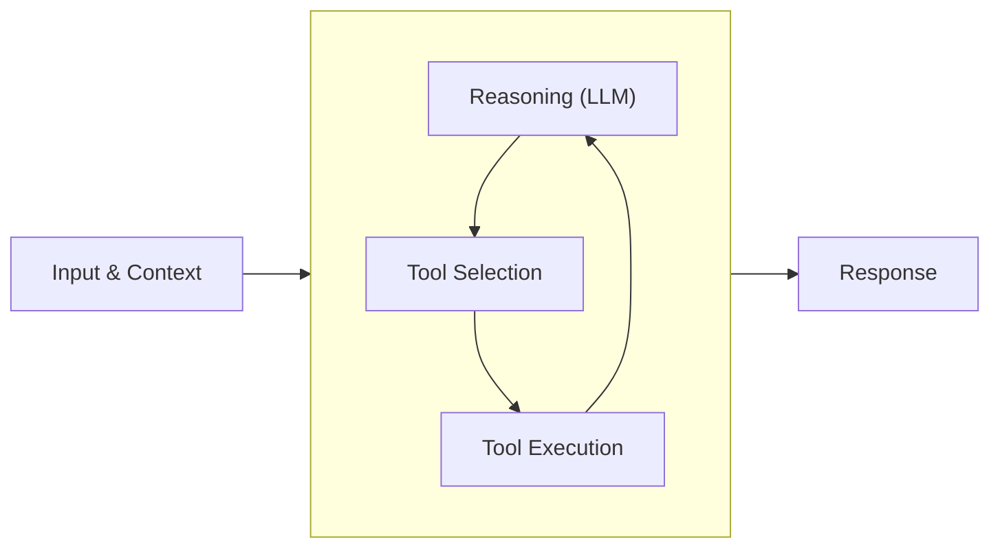
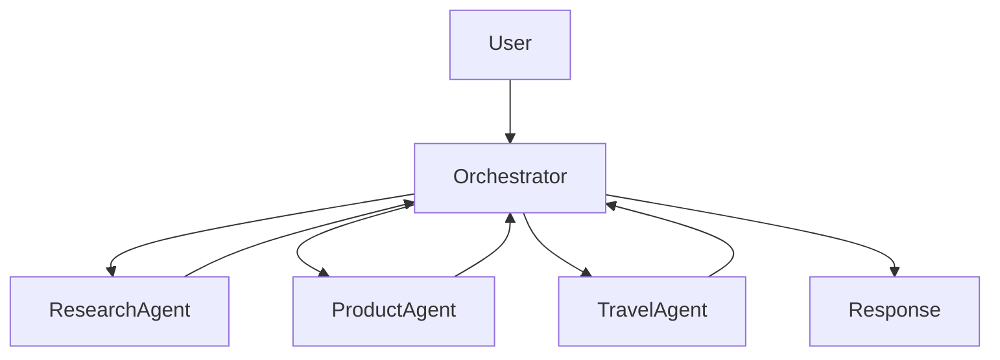
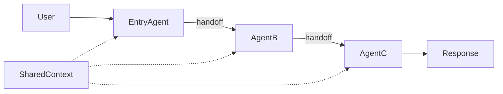
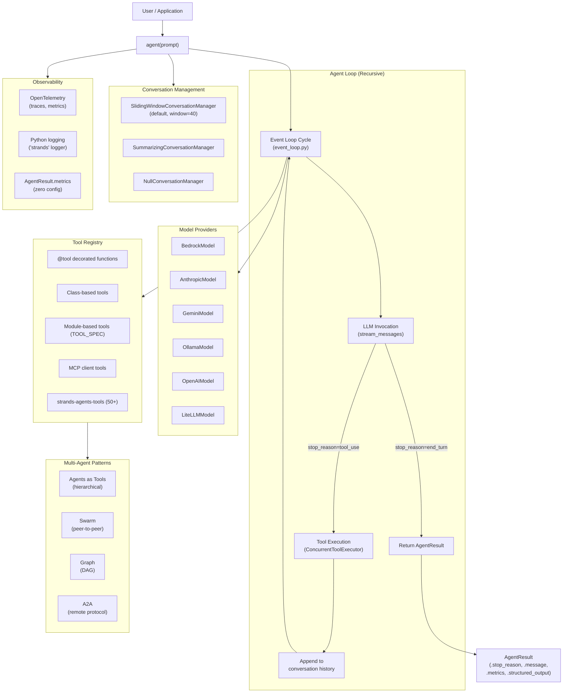

# Strands Agents SDK — Python Quickstart & Deep-Dive Reference

**Source:** [strandsagents.com/docs/user-guide/quickstart/overview/](https://strandsagents.com/docs/user-guide/quickstart/overview/)  
**Researched:** 2026-05-31 | **SDK Version:** strands-agents ≥ 1.0.0 (released May 2025)

---

## Executive Summary

**Strands Agents** is an open-source, model-driven AI agent harness SDK created by AWS. Available as `strands-agents` on PyPI (Python 3.10+) and `@strands-agents/sdk` on npm (TypeScript), it lets developers build, manage, evaluate, and deploy AI agents in as few as 3 lines of Python. Its core design principle is a **unified interface across all model providers** — swap backends without changing agent code. The SDK features a recursive event-loop architecture, a `@tool` decorator for converting any Python function into an LLM-callable tool, 11+ model provider integrations, 50+ pre-built community tools, three multi-agent orchestration patterns, and first-class deployment targets for AWS Lambda, Fargate, AgentCore, App Runner, EKS, and EC2. The Python SDK is the flagship offering with significantly more capabilities than the TypeScript counterpart.

---

## Table of Contents

1. [Key Repositories](#key-repositories)
2. [Installation & Setup](#installation--setup)
3. [Feature Availability (Python vs TypeScript)](#feature-availability-python-vs-typescript)
4. [Core Architecture — The Agent Loop](#core-architecture--the-agent-loop)
5. [Your First Agent (Complete Quickstart)](#your-first-agent-complete-quickstart)
6. [The Agent Class API](#the-agent-class-api)
7. [Tools System](#tools-system)
8. [Model Providers](#model-providers)
9. [Multi-Agent Patterns](#multi-agent-patterns)
10. [Conversation Management](#conversation-management)
11. [Streaming Patterns](#streaming-patterns)
12. [Structured Output](#structured-output)
13. [Built-in Community Tools (strands-agents-tools)](#built-in-community-tools-strands-agents-tools)
14. [Observability & Metrics](#observability--metrics)
15. [Safety & Guardrails](#safety--guardrails)
16. [Deployment Options](#deployment-options)
17. [Confidence Assessment](#confidence-assessment)
18. [Footnotes](#footnotes)

---

## Key Repositories

| Repository | Stars | Purpose |
|---|---|---|
| [strands-agents/sdk-python](https://github.com/strands-agents/sdk-python) | ⭐ 5,980 | Core Python SDK (monorepo with TypeScript + WebAssembly) |
| [strands-agents/tools](https://github.com/strands-agents/tools) | ⭐ 1,076 | `strands-agents-tools` — 50+ pre-built tools |
| [strands-agents/samples](https://github.com/strands-agents/samples) | ⭐ 776 | Official examples (Jupyter notebooks + Python scripts) |
| [strands-agents/docs](https://github.com/strands-agents/docs) | ⭐ 195 | Documentation source → [strandsagents.com](https://strandsagents.com) |
| [strands-agents/agent-builder](https://github.com/strands-agents/agent-builder) | ⭐ 416 | `strands-agents-builder` CLI agent builder |
| [strands-agents/sdk-typescript](https://github.com/strands-agents/sdk-typescript) | ⭐ 693 | TypeScript SDK |
| [strands-agents/evals](https://github.com/strands-agents/evals) | ⭐ 131 | Evaluation framework |
| [aws-samples/sample-getting-started-with-strands-agents-course](https://github.com/aws-samples/sample-getting-started-with-strands-agents-course) | ⭐ 81 | Jupyter course: Bedrock/Anthropic/MCP/A2A/eval |

**Monorepo Layout** (`strands-agents/sdk-python`)[^1]:
```
strands-py/     ← Python SDK (strands-agents on PyPI)
strands-ts/     ← TypeScript SDK (@strands-agents/sdk on npm)
strands-wasm/   ← WebAssembly bindings
site/           ← docs site (strandsagents.com, built with Astro/Starlight)
designs/        ← RFCs / design proposals
strandly/       ← developer CLI
```

---

## Installation & Setup

### Prerequisites
- **Python 3.10, 3.11, 3.12, 3.13, or 3.14**
- Default model: Amazon Bedrock (Claude Sonnet 4, `us-west-2`) — requires AWS credentials

### Step 1 — Create Virtual Environment

```bash
python -m venv .venv
source .venv/bin/activate          # macOS / Linux
# .venv\Scripts\activate.bat       # Windows CMD
# .venv\Scripts\Activate.ps1       # Windows PowerShell
```

### Step 2 — Install the SDK[^2]

```bash
# Core SDK only (uses Bedrock by default)
pip install strands-agents

# With community tools (30+ pre-built tools)
pip install strands-agents strands-agents-tools

# With agent builder CLI
pip install strands-agents-builder

# Install optional model provider extras:
pip install strands-agents[anthropic]   # Anthropic Claude direct
pip install strands-agents[openai]      # OpenAI
pip install strands-agents[gemini]      # Google Gemini
pip install strands-agents[litellm]     # LiteLLM (100+ providers)
pip install strands-agents[ollama]      # Ollama local models
pip install strands-agents[mistral]     # Mistral AI
pip install strands-agents[llamaapi]    # Llama API
pip install strands-agents[sagemaker]   # AWS SageMaker
pip install strands-agents[a2a]         # Agent-to-Agent protocol
pip install strands-agents[bidi]        # Bidirectional streaming (voice)
pip install strands-agents[all]         # Everything
```

**Core dependencies** (always installed)[^3]:
- `boto3>=1.26.0`, `botocore>=1.29.0` (AWS SDK)
- `mcp>=1.23.0` (Model Context Protocol)
- `pydantic>=2.4.0`
- `opentelemetry-api/sdk>=1.30.0`
- `docstring_parser>=0.15`

### Step 3 — Configure AWS Credentials (for Bedrock)

Four credential options:
1. **Environment variables**: `AWS_ACCESS_KEY_ID`, `AWS_SECRET_ACCESS_KEY`, optionally `AWS_SESSION_TOKEN`
2. **AWS credentials file**: `aws configure`
3. **IAM roles**: EC2, ECS, Lambda
4. **Bedrock API keys**: `AWS_BEARER_TOKEN_BEDROCK` env variable

### Step 4 — Project Structure

```
my_agent/
├── __init__.py          # from . import agent
├── agent.py             # main agent code
└── requirements.txt     # strands-agents>=1.0.0 \n strands-agents-tools>=0.2.0
```

Run with: `python -u my_agent/agent.py`

### Optional: IDE Integration via MCP Server

Strands provides an MCP server for AI coding assistants (Kiro, Cursor, Claude, Cline, etc.)[^4]:

```json
// ~/.kiro/settings/mcp.json
{
  "mcpServers": {
    "strands-agents": {
      "command": "uvx",
      "args": ["strands-agents-mcp-server"]
    }
  }
}
```

---

## Feature Availability (Python vs TypeScript)

Full feature matrix from the official Getting Started overview[^5]:

| Category | Feature | Python | TypeScript |
|---|---|:---:|:---:|
| **Core** | Agent creation and invocation | ✅ | ✅ |
| | Streaming responses | ✅ | ✅ |
| | Structured output | ✅ | ✅ |
| **Model providers** | Amazon Bedrock | ✅ | ✅ |
| | OpenAI | ✅ | ✅ |
| | OpenAI Responses API | ✅ | ✅ |
| | Anthropic | ✅ | ✅ |
| | Google Gemini | ✅ | ✅ |
| | Ollama | ✅ | ❌ |
| | LiteLLM | ✅ | ❌ |
| | Custom providers | ✅ | ✅ |
| | Additional providers | 5+ | 1+ |
| **Tools** | Custom function tools | ✅ | ✅ |
| | MCP (Model Context Protocol) | ✅ | ✅ |
| | Built-in tools | 50+ via community package | 4 built-in |
| **Conversation** | Null manager | ✅ | ✅ |
| | Sliding window manager | ✅ | ✅ |
| | Summarizing manager | ✅ | ✅ |
| **Hooks** | Lifecycle hooks | ✅ | ✅ |
| | Custom hook providers | ✅ | ✅ |
| **Multi-agent** | Swarms | ✅ | ✅ |
| | Graphs | ✅ | ✅ |
| | Workflows | ✅ | ✅ |
| | Agents as tools | ✅ | ✅ |
| | Agent-to-Agent (A2A) | ✅ | ✅ |
| **Session management** | File, S3, repository managers | ✅ | ✅ |
| **Observability** | OpenTelemetry integration | ✅ | ✅ |
| **Experimental** | Bidirectional streaming | ✅ | ❌ |
| | Agent steering | ✅ | ❌ |

---

## Core Architecture — The Agent Loop



> *"A language model can answer questions. An agent can do things. The agent loop is what makes that difference possible."* — Strands docs[^6]

The agent loop operates on a simple principle: **invoke the model → check if it wants a tool → execute the tool → invoke the model again with the result → repeat until the model produces a final response.**

### Internal Call Chain[^7]

```
agent("user prompt")           # __call__
  └─► run_async(invoke_async)  # runs in async context
        └─► stream_async       # main async generator
              ├─ _convert_prompt_to_messages()
              ├─ _start_agent_trace_span()
              └─ _run_loop()   # outer while-loop
                    └─► _execute_event_loop_cycle()   # CORE RECURSIVE LOOP
                          ├─ _check_limits()
                          ├─ _handle_model_execution() ← LLM call
                          ├─ _handle_tool_execution()  ← tools run concurrently
                          └─ recurse_event_loop()      ← RECURSIVE CALL
```

### Stop Reasons[^8]

| `stop_reason` | Behavior |
|---|---|
| `end_turn` | Normal exit — return final model message |
| `tool_use` | Execute tools, append results, **recurse** |
| `max_tokens` | Raise `MaxTokensReachedException` (unrecoverable) |
| `cancelled` | Return immediately with `stop_reason="cancelled"` |
| `stop_sequence` | Normal termination |
| `content_filtered` | Safety mechanism blocked response |
| `guardrail_intervention` | Guardrail policy stopped generation |

### Cancellation (Thread-Safe)[^9]

```python
import threading
import time
from strands import Agent

def timeout_watchdog(agent: Agent, timeout: float) -> None:
    """Cancel the agent after a timeout period."""
    time.sleep(timeout)
    agent.cancel()

agent = Agent()
watchdog = threading.Thread(target=timeout_watchdog, args=(agent, 30.0))
watchdog.start()
result = agent("Analyze this large dataset")
watchdog.join()
if result.stop_reason == "cancelled":
    print("Agent was cancelled due to timeout")
```

> `cancel()` is **thread-safe and idempotent** — calling it multiple times or from different threads is safe.

---

## Your First Agent (Complete Quickstart)

Full working example from the official Python quickstart[^10]:

```python
# my_agent/agent.py
from strands import Agent, tool
from strands_tools import calculator, current_time

# Define a custom tool as a Python function using the @tool decorator
@tool
def letter_counter(word: str, letter: str) -> int:
    """
    Count occurrences of a specific letter in a word.

    Args:
        word (str): The input word to search in
        letter (str): The specific letter to count

    Returns:
        int: The number of occurrences of the letter in the word
    """
    if not isinstance(word, str) or not isinstance(letter, str):
        return 0
    if len(letter) != 1:
        raise ValueError("The 'letter' parameter must be a single character")
    return word.lower().count(letter.lower())

# Create an agent with tools
agent = Agent(tools=[calculator, current_time, letter_counter])

# Ask the agent a multi-tool question
message = """
I have 4 requests:
1. What is the time right now?
2. Calculate 3111696 / 74088
3. Tell me how many letter R's are in the word "strawberry" 🍓
"""

agent(message)
```

**Minimal 3-line hello world:**

```python
from strands import Agent
agent = Agent()
agent("Hello! Tell me a joke.")
```

**Check which model is configured:**

```python
agent = Agent()
print(agent.model.config)
# {'model_id': 'us.anthropic.claude-sonnet-4-20250514-v1:0'}
```

---

## The Agent Class API

### Constructor Signature[^11]

```python
class Agent(AgentBase):
    def __init__(
        self,
        model: Model | str | None = None,            # Model provider; defaults to BedrockModel
        messages: Messages | None = None,            # Pre-loaded conversation history
        tools: list[...] | None = None,              # Functions, modules, paths, dicts, ToolProviders, Agents
        system_prompt: str | list[...] | None = None,
        structured_output_model: type[BaseModel] | None = None,  # Pydantic for typed output
        callback_handler: Callable | None = DEFAULT, # Event streaming handler
        conversation_manager: ConversationManager | None = None,
        record_direct_tool_call: bool = True,
        load_tools_from_directory: bool = False,     # Hot-reload ./tools/ directory
        trace_attributes: Mapping[str, AttributeValue] | None = None,
        *,
        agent_id: str | None = None,
        name: str | None = None,
        description: str | None = None,
        state: AgentState | dict | None = None,
        plugins: list[Plugin] | None = None,
        hooks: list[HookProvider | HookCallback] | None = None,
        session_manager: SessionManager | None = None,
        tool_executor: ToolExecutor | None = None,
        retry_strategy: ModelRetryStrategy | None = DEFAULT,
        concurrent_invocation_mode: ConcurrentInvocationMode = ConcurrentInvocationMode.THROW,
    )
```

### Invocation Patterns

```python
result = agent("natural language prompt")         # __call__ — synchronous
result = await agent.invoke_async("prompt")       # async
async for event in agent.stream_async("prompt"):  # async streaming iterator
    ...
result = agent.tool.calculator(expression="2+2")  # direct tool call (bypasses LLM)
```

### AgentResult Dataclass[^12]

```python
@dataclass
class AgentResult:
    stop_reason: StopReason
    message: Message
    metrics: EventLoopMetrics
    state: Any
    interrupts: Sequence[Interrupt] | None = None
    structured_output: BaseModel | None = None  # populated when structured_output_model is set

    # str(result) → text output string
    # result.structured_output → Pydantic instance
    # result.metrics.get_summary() → full metrics dict
```

### Public API Exports[^13]

```python
from strands import (
    Agent,              # Core agent class
    AgentBase,          # Abstract base for custom agents
    AgentSkills,        # Skills/plugin system
    ModelRetryStrategy, # Retry configuration
    MultiAgentPlugin,   # Plugin for multi-agent orchestration
    Plugin,             # Base plugin interface
    Skill,              # Individual skill unit
    Snapshot,           # State snapshot for persistence
    tool,               # @tool decorator
    ToolContext,        # Context injected into tool functions
)
```

---

## Tools System

### Approach 1: `@tool` Decorator (Most Common)[^14]

```python
from strands import Agent, tool

@tool
def weather_forecast(city: str, days: int = 3) -> str:
    """Get weather forecast for a city.

    Args:
        city: The name of the city
        days: Number of days for the forecast
    """
    return f"Weather forecast for {city} for the next {days} days..."

agent = Agent(tools=[weather_forecast])
```

**What the decorator auto-extracts:**
- Tool **name**: function name
- Tool **description**: first paragraph of docstring
- **Parameter descriptions**: from `Args:` section of docstring  
- **Input schema**: from Python type hints (auto-generates JSON Schema)

**Naming rules**: must match `^[a-zA-Z0-9_-]+$`, 1–64 characters.

**Override name, description, or JSON schema:**

```python
@tool(name="get_weather", description="Retrieves weather forecast for a specified location")
def weather_forecast(city: str, days: int = 3) -> str:
    ...

# Custom JSON schema override
@tool(
    inputSchema={
        "json": {
            "type": "object",
            "properties": {
                "shape": {"type": "string", "enum": ["circle", "rectangle"]},
                "radius": {"type": "number"},
            },
            "required": ["shape"]
        }
    }
)
def calculate_area(shape: str, radius: float = None) -> float:
    ...
```

### Async Tools (Concurrent Execution)[^15]

```python
import asyncio
from strands import Agent, tool

@tool
async def call_api() -> str:
    """Call API asynchronously."""
    await asyncio.sleep(5)  # simulated API call
    return "API result"

# With progress streaming:
@tool
async def process_dataset(records: int) -> str:
    """Process records with progress updates."""
    for i in range(records):
        await asyncio.sleep(0.1)
        if i % 10 == 0:
            yield f"Processed {i}/{records} records"
    yield f"Completed {records} records"
```

> "Strands will invoke all async tools concurrently."

### ToolContext (Access Agent State Inside Tools)[^16]

```python
from strands import tool, Agent, ToolContext

@tool(context=True)
def get_self_name(tool_context: ToolContext) -> str:
    return f"The agent name is {tool_context.agent.name}"

@tool(context=True)
def api_call(query: str, tool_context: ToolContext) -> dict:
    """Make an API call with user context.
    Args:
        query: The search query
        tool_context: Context containing user information
    """
    user_id = tool_context.invocation_state.get("user_id")
    return {"user_id": user_id, "query": query}

agent = Agent(tools=[get_self_name, api_call], name="Best agent")
agent("Get my profile data", user_id="user123")
```

### Approach 2: Class-Based Tools (Shared State)[^17]

```python
from strands import Agent, tool

class DatabaseTools:
    def __init__(self, connection_string):
        self.connection = self._establish_connection(connection_string)

    @tool
    def query_database(self, sql: str) -> dict:
        """Run a SQL query against the database.
        Args:
            sql: The SQL query to execute
        """
        return {"results": f"Query results for: {sql}", "connection": self.connection}

    @tool
    def insert_record(self, table: str, data: dict) -> str:
        """Insert a new record into the database.
        Args:
            table: The table name
            data: The data to insert as a dictionary
        """
        return f"Inserted data into {table}: {data}"

db_tools = DatabaseTools("connection_string")
agent = Agent(tools=[db_tools.query_database, db_tools.insert_record])
```

### Approach 3: Module-Based Tools (No SDK Dependency)[^18]

```python
# weather.py
from typing import Any
from strands.types.tools import ToolResult, ToolUse

TOOL_SPEC = {
    "name": "weather",
    "description": "Get weather information for a location",
    "inputSchema": {
        "json": {
            "type": "object",
            "properties": {
                "location": {
                    "type": "string",
                    "description": "City or location name"
                }
            },
            "required": ["location"]
        }
    }
}

def weather(tool: ToolUse, **kwargs: Any) -> ToolResult:
    tool_use_id = tool["toolUseId"]
    location = tool["input"]["location"]
    return {
        "toolUseId": tool_use_id,
        "status": "success",
        "content": [{"text": f"Weather for {location}: Sunny, 72°F"}]
    }
```

**Load by module or path:**

```python
import weather
agent = Agent(tools=[weather])
# or
agent = Agent(tools=["./weather.py"])
# or auto-load from ./tools/ directory
agent = Agent(load_tools_from_directory=True)
```

### Tool Loading Methods

```python
# Inspect loaded tools
print(agent.tool_names)
print(agent.tool_registry.get_all_tools_config())

# Direct tool invocation (bypass LLM — always keyword args)
result = agent.tool.file_read(path="/path/to/file.txt", mode="view")
```

### Sequential vs. Concurrent Tool Execution

```python
from strands.tools.executors import SequentialToolExecutor

# Default: concurrent execution (asyncio parallel)
agent = Agent(tools=[weather_tool, time_tool])

# Sequential execution (for order-dependent tools)
agent = Agent(
    tool_executor=SequentialToolExecutor(),
    tools=[screenshot_tool, email_tool]
)
```

### MCP Tools Integration[^19]

```python
from strands import Agent
from strands.tools.mcp import MCPClient
from mcp import stdio_client, StdioServerParameters
from mcp.client.sse import sse_client

# stdio transport
aws_docs_client = MCPClient(
    lambda: stdio_client(StdioServerParameters(
        command="uvx",
        args=["awslabs.aws-documentation-mcp-server@latest"]
    ))
)

# SSE transport
sse_mcp_client = MCPClient(lambda: sse_client("http://localhost:8000/sse"))

with aws_docs_client:
    agent = Agent(tools=aws_docs_client.list_tools_sync())
    response = agent("Tell me about Amazon Bedrock")
```

---

## Model Providers

### Amazon Bedrock (Default)[^20]

```python
from strands import Agent
from strands.models import BedrockModel
from botocore.config import Config as BotocoreConfig

# Simplest — just use the default
agent = Agent()

# Pass model_id string directly
agent = Agent(model="anthropic.claude-sonnet-4-20250514-v1:0")

# Full configuration
boto_config = BotocoreConfig(
    retries={"max_attempts": 3, "mode": "standard"},
    connect_timeout=5,
    read_timeout=60
)

bedrock_model = BedrockModel(
    model_id="anthropic.claude-sonnet-4-20250514-v1:0",
    region_name="us-east-1",
    temperature=0.3,
    top_p=0.8,
    stop_sequences=["###", "END"],
    boto_client_config=boto_config,
)
agent = Agent(model=bedrock_model)

# With Guardrails
bedrock_model = BedrockModel(
    model_id="anthropic.claude-sonnet-4-20250514-v1:0",
    guardrail_id="your-guardrail-id",
    guardrail_version="DRAFT",
    guardrail_trace="enabled",
    guardrail_stream_processing_mode="sync",
    guardrail_redact_input=True,
    guardrail_redact_output=False,
)

# Multimodal input
response = agent([
    {
        "document": {
            "format": "pdf",
            "name": "report.pdf",
            "source": {
                "location": {
                    "type": "s3",
                    "uri": "s3://my-bucket/documents/report.pdf"
                }
            }
        }
    },
    {"text": "Summarize this document."}
])
```

### Other Model Providers[^21]

```python
from strands.models.anthropic import AnthropicModel
from strands.models.gemini import GeminiModel
from strands.models.ollama import OllamaModel
from strands.models.openai import OpenAIModel
from strands.models.litellm import LiteLLMModel

# Anthropic (direct API)
agent = Agent(model=AnthropicModel(
    model_id="claude-opus-4-5",
    params={"temperature": 0.7, "max_tokens": 4096}
))

# Google Gemini
agent = Agent(model=GeminiModel(
    client_args={"api_key": "YOUR_KEY"},
    model_id="gemini-2.5-flash",
    params={"temperature": 0.7}
))

# Ollama (local models)
agent = Agent(model=OllamaModel(
    host="http://localhost:11434",
    model_id="llama3"
))

# OpenAI
agent = Agent(model=OpenAIModel(
    api_key="YOUR_KEY",
    model_id="gpt-4o"
))

# LiteLLM (100+ providers via unified interface)
agent = Agent(model=LiteLLMModel(
    model_id="anthropic/claude-3-sonnet"
))
```

**Additional providers** (community/extras):
- `LlamaCppModel` — llama.cpp local inference
- `MistralModel` — Mistral AI
- `LlamaAPIModel` — Meta Llama API
- `SageMakerAIModel` — AWS SageMaker
- `WriterModel` — Palmyra models
- Cohere, CLOVA Studio (community OpenAI-compatible)

---

## Multi-Agent Patterns

### Pattern 1: Agents as Tools (Hierarchical / Orchestrator–Subagent)[^22]



```python
from strands import Agent

research_agent = Agent(
    name="research_assistant",
    system_prompt="You are a specialized research assistant."
)
product_agent = Agent(
    name="product_specialist",
    system_prompt="You are a product catalog specialist."
)

# Pass agents directly — SDK auto-wraps via _AgentAsTool
orchestrator = Agent(
    system_prompt="You route queries to specialized agents.",
    tools=[research_agent, product_agent]
)

# With customization
orchestrator = Agent(
    tools=[
        research_agent.as_tool(
            name="research_assistant",
            description="Process research queries requiring factual information.",
            preserve_context=False  # Default: reset state between calls
        )
    ]
)

result = orchestrator("Research quantum computing and recommend learning resources")
```

**Key behaviors:**
- `preserve_context=False` (default): agent state deep-copied and restored — stateless sub-agent
- `preserve_context=True`: agent remembers prior interactions within orchestrator session
- Structured output propagated as JSON content block
- Sub-agent stream events are forwarded upward

### Pattern 2: Swarm (Autonomous Peer-to-Peer)[^23]



```python
from strands.multiagent.swarm import Swarm

swarm = Swarm(
    nodes=[agent_a, agent_b, agent_c],
    entry_point=agent_a,
    max_handoffs=20,
    max_iterations=20,
    execution_timeout=900.0,
)
result = swarm("Complex task requiring multiple specialists")
```

**Key concepts:**
- `SwarmNode` — wraps an `Agent`, tracks initial messages/state for reset
- `SharedContext` — JSON-serializable dict visible to all agents, keyed by `node_id`
- Agents hand off via a `handoff_node` tool call
- Repetitive handoff detection prevents infinite loops

### Pattern 3: Graph (Deterministic DAG)[^24]

```python
from strands.multiagent.graph import GraphBuilder

graph = (
    GraphBuilder()
    .add_node(research_agent, "research")
    .add_node(writer_agent, "writer")
    .add_node(reviewer_agent, "reviewer")
    .add_edge("research", "writer")
    .add_edge("writer", "reviewer", condition=lambda state: len(state.results) > 0)
    .build()
)
result = graph("Write a research report on quantum computing")
```

**Key concepts:**
- `GraphNode` — wraps `AgentBase | MultiAgentBase`, captures initial state for reset
- `GraphEdge` — `from_node → to_node` with optional `condition: Callable[[GraphState], bool]`
- `reset_on_revisit=True` → supports cycles with clean state
- Nodes can be `Agent`, nested `Graph`, or `Swarm` (arbitrary nesting)

### Pattern 4: Agent-to-Agent (A2A) Remote Protocol[^25]

```python
# Consume a remote agent
from strands.agent.a2a_agent import A2AAgent
a2a_agent = A2AAgent(endpoint="http://calculator-service:9000")
result = a2a_agent("What is 10^6?")

# Expose a local agent as A2A server
from strands.multiagent.a2a import A2AServer
server = A2AServer(agent=my_agent)
server.serve()  # Serves /.well-known/agent-card.json + root JSON-RPC
```

---

## Conversation Management

Three built-in managers + abstract base[^26]:

```python
from strands.agent.conversation_manager import (
    SlidingWindowConversationManager,  # Default
    SummarizingConversationManager,
    NullConversationManager,
)
```

### SlidingWindowConversationManager (Default)[^27]

Maintains a fixed-size window of the most recent messages. Never splits `toolUse`/`toolResult` pairs.

```python
from strands.agent.conversation_manager import SlidingWindowConversationManager

agent = Agent(
    conversation_manager=SlidingWindowConversationManager(
        window_size=40,              # Max messages to keep. 0 = clear all on reduction. Default: 40
        should_truncate_results=True,# Truncate large tool results before dropping. Default: True
        per_turn=False,              # False=end-only, True=every model call, N=every N calls
        proactive_compression=None,  # None=reactive only, True=70% threshold, {"compression_threshold": 0.8}=custom
    )
)
```

| Parameter | Default | Description |
|---|---|---|
| `window_size` | `40` | Max messages. `0` clears all on overflow. |
| `should_truncate_results` | `True` | Keeps first+last 200 chars of old tool results; replaces images with `[image: png, N bytes]` |
| `per_turn` | `False` | `True`=every model call, `N`=every N-th call |
| `proactive_compression` | `None` | `True`=70% threshold; `{"compression_threshold": 0.8}`=custom |

**Web browsing example (frequent screenshots):**
```python
manager = SlidingWindowConversationManager(window_size=20, per_turn=True)
agent = Agent(conversation_manager=manager)
```

### SummarizingConversationManager[^28]

Instead of dropping messages, uses an LLM to summarize the oldest messages:

```python
from strands import Agent
from strands.agent.conversation_manager import SummarizingConversationManager
from strands.models import AnthropicModel

# Use a cheaper model for summarization
summarizer = Agent(model=AnthropicModel(model_id="claude-3-5-haiku-20241022"))

agent = Agent(
    conversation_manager=SummarizingConversationManager(
        summary_ratio=0.4,              # Summarize 40% of oldest messages (0.1–0.8)
        preserve_recent_messages=8,     # Always keep 8 most recent messages
        summarization_agent=summarizer, # Custom agent (or use default model)
    )
)
```

### NullConversationManager[^29]

No-op — never modifies history. Useful for testing or external history management:

```python
agent = Agent(conversation_manager=NullConversationManager())
```

---

## Streaming Patterns

### Async Iterator (Best for FastAPI, async frameworks)[^30]

```python
import asyncio
from strands import Agent
from strands_tools import calculator

agent = Agent(tools=[calculator], callback_handler=None)  # suppress default console

async def process_streaming_response():
    async for event in agent.stream_async("What is 25 * 48 and explain the calculation"):
        if "data" in event:
            print(event["data"], end="", flush=True)
        elif "current_tool_use" in event and event["current_tool_use"].get("name"):
            print(f"\n[Tool use: {event['current_tool_use']['name']}]")
        elif "result" in event:
            print(f"\n✅ Done: {event['result'].stop_reason}")

asyncio.run(process_streaming_response())
```

**FastAPI streaming endpoint:**

```python
from fastapi import FastAPI
from fastapi.responses import StreamingResponse
from pydantic import BaseModel as PydanticModel
from strands import Agent
from strands_tools import calculator

app = FastAPI()

class PromptRequest(PydanticModel):
    prompt: str

@app.post("/stream")
async def stream_response(request: PromptRequest):
    async def generate():
        agent = Agent(tools=[calculator], callback_handler=None)
        try:
            async for event in agent.stream_async(request.prompt):
                if "data" in event:
                    yield event["data"]  # forward text deltas only
        except Exception as e:
            yield f"Error: {str(e)}"
    return StreamingResponse(generate(), media_type="text/plain")
```

### Callback Handler (Synchronous, CLI apps)[^31]

```python
def custom_callback_handler(**kwargs):
    if "data" in kwargs:
        print(f"MODEL: {kwargs['data']}")
    elif "current_tool_use" in kwargs and kwargs["current_tool_use"].get("name"):
        print(f"\n[TOOL: {kwargs['current_tool_use']['name']}]")

agent = Agent(tools=[calculator], callback_handler=custom_callback_handler)
agent("Calculate 2+2")

# Suppress all output:
agent = Agent(callback_handler=None)
```

### Streaming Event Types[^32]

| Key | Description |
|---|---|
| **Lifecycle** | |
| `init_event_loop` | `True` — agent invocation starts |
| `start_event_loop` | `True` — a new event loop cycle begins |
| `message` | Dict with `role` — new message created |
| `result` | Final `AgentResult` object |
| `force_stop` + `force_stop_reason` | Loop force-stopped |
| **Model stream** | |
| `data` | **Text chunk** from the model — primary streaming text |
| `reasoningText` | Text from thinking/reasoning process |
| `delta` | Raw model delta |
| **Tools** | |
| `current_tool_use` | Dict with `toolUseId`, `name`, `input` |
| `tool_stream_event` | Dict with `tool_use` and `data` (streaming tool) |
| **Multi-agent** | |
| `multiagent_node_start` | Sub-agent node begins |
| `multiagent_node_stop` | Sub-agent node completes |
| `multiagent_handoff` | Control transfer event |
| `multiagent_result` | Final graph/swarm result |

**Event lifecycle sequence:** `init_event_loop` → `start_event_loop` (×N cycles) → `data`/tool events → `result` or `force_stop`

---

## Structured Output

Strands implements structured output as a **hidden `StructuredOutputTool`** that the LLM is instructed to call as its last action. The Pydantic model's fields auto-convert to a JSON Schema `ToolSpec`. On `ValidationError`, the error details are fed back to the LLM so it can retry[^33].

```python
from pydantic import BaseModel
from strands import Agent

class MovieReview(BaseModel):
    title: str
    rating: float
    summary: str

# Pattern 1: Per-call
agent = Agent()
result = agent("Review Inception", structured_output_model=MovieReview)
review: MovieReview = result.structured_output  # typed Pydantic object
print(result)  # auto calls .model_dump_json()

# Pattern 2: Agent-level default
agent = Agent(structured_output_model=MovieReview)
result = agent("Review The Matrix")
review: MovieReview = result.structured_output

# Custom prompt override
result = agent("Analyze data",
               structured_output_model=AnalysisResult,
               structured_output_prompt="Return analysis as structured JSON.")
```

---

## Built-in Community Tools (strands-agents-tools)

Install: `pip install strands-agents-tools`[^34]

```python
from strands import Agent
from strands_tools import calculator, file_read, shell, current_time
agent = Agent(tools=[calculator, file_read, shell, current_time])
```

### 📁 File Operations
| Tool | Description |
|---|---|
| `file_read` | Read any file |
| `file_write` | Write / create files |
| `editor` | Advanced editing: syntax highlighting, pattern replacement, multi-file |

### 🖥️ Shell & Code Execution *(not Windows)*
| Tool | Description |
|---|---|
| `shell` | Execute shell commands (lists supported, `ignore_errors` flag) |
| `python_repl` | Python REPL with state persistence and user-confirmation safety |
| `code_interpreter` | Sandboxed multi-language execution via Amazon Bedrock Agent Core |

### 🧮 Math & Time
| Tool | Description |
|---|---|
| `calculator` | Symbolic math (SymPy-based); supports equations |
| `current_time` | ISO 8601 time for any timezone |

### 🌐 Web & HTTP
| Tool | Description |
|---|---|
| `http_request` | Full HTTP client with auth; HTML→Markdown conversion |
| `tavily_search` | AI-optimized real-time web search |
| `tavily_extract` | Extract clean content from pages |
| `tavily_crawl` | Recursive web crawl |
| `exa_search` | Intelligent search with auto/fast/deep modes |
| `bright_data` | Web scraping, screenshots, structured data |

### 🧠 Memory & Knowledge
| Tool | Description |
|---|---|
| `mem0_memory` | Cross-run user/agent memory via Mem0 + OpenSearch |
| `memory` | Amazon Bedrock Knowledge Bases — store/retrieve |
| `retrieve` | Direct RAG retrieval from Bedrock Knowledge Bases |
| `mongodb_memory` | MongoDB Atlas semantic memory |
| `elasticsearch_memory` | Elasticsearch semantic memory |

### ☁️ AWS
| Tool | Description |
|---|---|
| `use_aws` | Any AWS service via boto3 (S3, EC2, DynamoDB, etc.) |

### 🖼️ Image, Video & Audio
| Tool | Description |
|---|---|
| `generate_image` | AI image generation (Bedrock) |
| `nova_reels` | Video generation via Amazon Bedrock Nova Reel |
| `speak` | Text-to-speech via Amazon Polly |
| `search_video` | Semantic video search (TwelveLabs) |
| `image_reader` | Read/process images for AI analysis |

### 🤖 Multi-Agent & Orchestration
| Tool | Description |
|---|---|
| `use_agent` | Nested agent with model switching |
| `swarm` | Multi-agent swarm: `collaborative`, `competitive`, `hybrid` |
| `agent_graph` | Persistent message-passing agent graph |
| `graph` | Deterministic DAG pipelines |
| `a2a_client` | Agent-to-Agent protocol client |

### ⚙️ Utility & Flow Control
| Tool | Description |
|---|---|
| `batch` | Parallel multi-tool invocation |
| `sleep` | Pause execution (SIGINT-interruptible) |
| `think` | Multi-step reasoning loop |
| `load_tool` | Dynamically load Python tool modules |
| `stop` | Gracefully terminate agent execution |
| `handoff_to_user` | Request user input mid-loop |
| `workflow` | Define and run multi-step automated workflows |

### 🖱️ Browser & Desktop Automation
| Tool | Description |
|---|---|
| `browser` | Chromium browser automation (playwright) |
| `use_computer` | Desktop automation: mouse, keyboard, screenshot |

### Optional Extras Installation

```bash
pip install "strands-agents-tools[mem0-memory,local-chromium-browser,rss,use-computer,diagram,a2a-client]"
```

**Bypass tool confirmation prompts** (for automation):
```bash
export BYPASS_TOOL_CONSENT=true
```

---

## Observability & Metrics

### Built-in Metrics (Zero Config)[^35]

Every `AgentResult` contains a `metrics` object:

```python
result = agent("What is the square root of 144?")

# Token usage
print(result.metrics.accumulated_usage['totalTokens'])
print(result.metrics.accumulated_usage['inputTokens'])
print(result.metrics.accumulated_usage.get('cacheReadInputTokens'))

# Performance
print(sum(result.metrics.cycle_durations))  # Total execution time
print(result.metrics.accumulated_metrics)   # {'latencyMs': 1799}

# Tool performance
for tool_name, tool_metric in result.metrics.tool_metrics.items():
    print(f"{tool_name}: {tool_metric.success_rate:.0%} success, "
          f"{tool_metric.average_exec_time:.3f}s avg")

# Full summary
print(result.metrics.get_summary())
```

**Example `get_summary()` output:**
```json
{
  "total_cycles": 2,
  "total_duration": 1.881,
  "accumulated_usage": {"inputTokens": 3921, "outputTokens": 83, "totalTokens": 4004},
  "accumulated_metrics": {"latencyMs": 6253},
  "tool_usage": {
    "calculator": {
      "execution_stats": {
        "call_count": 1,
        "success_count": 1,
        "success_rate": 1.0,
        "average_time": 0.0083
      }
    }
  }
}
```

### OpenTelemetry Integration[^36]

```python
from strands.telemetry import StrandsTelemetry

# Option 1: Zero config — auto-attaches to existing OTel global provider
agent = Agent(...)

# Option 2: Full setup via StrandsTelemetry
strands_telemetry = StrandsTelemetry()
strands_telemetry.setup_otlp_exporter()      # → OTLP endpoint
strands_telemetry.setup_console_exporter()   # → stdout
strands_telemetry.setup_meter(enable_console_exporter=True, enable_otlp_exporter=True)

# Option 3: Attach to your own tracer provider
strands_telemetry = StrandsTelemetry(tracer_provider=my_provider)
strands_telemetry.setup_otlp_exporter().setup_console_exporter()  # chaining supported

# Custom trace attributes per agent
agent = Agent(
    trace_attributes={
        "session.id": "abc-1234",
        "user.id": "user@domain.com",
    }
)
```

**Environment variables:**
```bash
export OTEL_EXPORTER_OTLP_ENDPOINT="http://collector.example.com:4318"
export OTEL_EXPORTER_OTLP_HEADERS="key1=value1,key2=value2"
export OTEL_TRACES_SAMPLER="traceidratio"
export OTEL_TRACES_SAMPLER_ARG="0.5"  # Sample 50% in production
```

**Trace hierarchy:**
```
Strands Agent (top-level span)
 └── Cycle <cycle-id>
      ├── Model invoke span
      │    ├── gen_ai.request.model
      │    ├── gen_ai.usage.input_tokens / output_tokens
      │    └── gen_ai.usage.cache_read_input_tokens
      └── Tool: <tool name> span
           ├── gen_ai.tool.name
           └── tool.status (success/error)
```

**Compatible backends:** Jaeger, Grafana Tempo, AWS X-Ray, Datadog, Zipkin, Langfuse, Opik

**Local dev with Jaeger:**
```bash
docker run -d --name jaeger \
  -e COLLECTOR_OTLP_ENABLED=true \
  -p 16686:16686 -p 4317:4317 -p 4318:4318 \
  jaegertracing/all-in-one:latest
# UI at http://localhost:16686
```

### Debug Logging[^37]

```python
import logging
from strands import Agent

logging.getLogger("strands").setLevel(logging.DEBUG)
logging.basicConfig(
    format="%(levelname)s | %(name)s | %(message)s",
    handlers=[logging.StreamHandler()]
)

# Fine-grained per-module:
logging.getLogger("strands.tools.registry").setLevel(logging.DEBUG)
logging.getLogger("strands.models").setLevel(logging.WARNING)
logging.getLogger("strands.event_loop").setLevel(logging.ERROR)

agent = Agent()
agent("Hello!")
```

---

## Safety & Guardrails

### Amazon Bedrock Guardrails (Native)[^38]

```python
from strands.models import BedrockModel

bedrock_model = BedrockModel(
    model_id="anthropic.claude-sonnet-4-20250514-v1:0",
    guardrail_id="your-guardrail-id",
    guardrail_version="1",
    guardrail_trace="enabled",
    guardrail_redact_input=True,
    guardrail_redact_input_message="[INPUT REDACTED]",
    guardrail_redact_output=False,
)

agent = Agent(model=bedrock_model)
response = agent("Tell me about financial planning.")

if response.stop_reason == "guardrail_intervened":
    print("Content blocked!")
```

**Guardrails capabilities:** Content Filtering, PII Protection, Topic Blocking, Response Quality enforcement, Compliance, Shadow Mode monitoring

### Shadow Mode (Soft-Launch Monitoring)[^39]

```python
from strands.hooks import HookProvider, HookRegistry, MessageAddedEvent, AfterInvocationEvent

class NotifyOnlyGuardrailsHook(HookProvider):
    def register_hooks(self, registry: HookRegistry) -> None:
        registry.add_callback(MessageAddedEvent, self.check_user_input)
        registry.add_callback(AfterInvocationEvent, self.check_assistant_response)

    def evaluate_content(self, content: str, source: str = "INPUT"):
        response = self.bedrock_client.apply_guardrail(
            guardrailIdentifier=self.guardrail_id,
            guardrailVersion=self.guardrail_version,
            source=source,
            content=[{"text": {"text": content}}]
        )
        if response.get("action") == "GUARDRAIL_INTERVENED":
            print(f"[GUARDRAIL] WOULD BLOCK - {source}: {content[:100]}...")

agent = Agent(
    system_prompt="You are a helpful assistant.",
    hooks=[NotifyOnlyGuardrailsHook("guardrail-id", "version")]
)
```

---

## Deployment Options

### Deployment Target Comparison

| Target | Best For | Scaling | Streaming |
|---|---|---|---|
| **AgentCore** | Production serverless agents | Thousands of sessions in seconds | ✅ |
| **Lambda** | Short-lived, event-driven | Auto-scale | ❌ (sync only) |
| **Fargate** | Long-running, containerized | ECS auto-scale | ✅ |
| **App Runner** | Managed HTTPS endpoints | Auto-scale | ✅ |
| **EKS** | Kubernetes-native | HPA | ✅ |
| **EC2** | Full control | Manual | ✅ |

### AWS Lambda[^40]

```python
# lambda/agent_handler.py
from strands import Agent
from strands_tools import http_request

SYSTEM_PROMPT = "You are a helpful assistant."

def handler(event, _context) -> str:
    agent = Agent(system_prompt=SYSTEM_PROMPT, tools=[http_request])
    response = agent(event.get('prompt'))
    return str(response)
```

**Official Lambda Layer ARNs:**
```
arn:aws:lambda:{region}:856699698935:layer:strands-agents-py{py_ver}-{arch}:{layer_ver}
# Example:
arn:aws:lambda:us-east-1:856699698935:layer:strands-agents-py3_12-x86_64:2
```
- Python versions: 3.10, 3.11, 3.12, 3.13
- Architectures: `x86_64`, `aarch64`
- 18 supported AWS regions

**Deploy:**
```bash
python ./bin/package_for_lambda.py
npx cdk bootstrap && npx cdk deploy
aws lambda invoke --function-name AgentFunction \
  --payload '{"prompt": "What is the weather in Seattle?"}' output.json
```

### AWS Fargate (Streaming Support)[^41]

```python
# app.py (FastAPI)
from fastapi import FastAPI
from fastapi.responses import StreamingResponse, PlainTextResponse
from strands import Agent
from strands_tools import http_request

app = FastAPI()

@app.post('/weather')
async def get_weather(prompt: str):
    agent = Agent(system_prompt="You are a weather assistant.", tools=[http_request])
    response = agent(prompt)
    return PlainTextResponse(content=str(response))

@app.post('/weather-streaming')
async def get_weather_streaming(prompt: str):
    agent = Agent(system_prompt="You are a weather assistant.", tools=[http_request])

    async def stream():
        async for item in agent.stream_async(prompt):
            if "data" in item:
                yield item['data']

    return StreamingResponse(stream(), media_type="text/plain")
```

**Dockerfile (shared across Fargate/App Runner/EKS):**
```dockerfile
FROM public.ecr.aws/docker/library/python:3.12-slim
WORKDIR /app
RUN useradd -m appuser && USER appuser  # Non-root user
EXPOSE 8000
CMD ["uvicorn", "app:app", "--host", "0.0.0.0", "--port", "8000", "--workers", "2"]
```

### Amazon Bedrock AgentCore (Recommended for Production)[^42]

Purpose-built serverless runtime for AI agents. Key features:
- Dedicated **microVMs per user session** (complete isolation)
- Scales to thousands of sessions in seconds
- Native MCP protocol and A2A orchestration support
- Integrates with Cognito, Microsoft Entra ID, Okta, Google, GitHub
- Session persistence and state recovery

```python
# Required IAM trust policy for AgentCore
trust_policy = {
    "Statement": [{
        "Effect": "Allow",
        "Principal": {"Service": "bedrock-agentcore.amazonaws.com"},
        "Action": "sts:AssumeRole",
        "Condition": {
            "StringEquals": {"aws:SourceAccount": account_id},
            "ArnLike": {"aws:SourceArn": f"arn:aws:bedrock-agentcore:{region}:{account_id}:*"}
        }
    }]
}
```

### Production Best Practices[^43]

```python
# Deterministic production model config
agent_model = BedrockModel(
    model_id="us.amazon.nova-premier-v1:0",
    temperature=0.3,     # Lower = more deterministic
    max_tokens=2000,
    top_p=0.8,
)

# Enable retry strategy
from strands import ModelRetryStrategy
agent = Agent(
    model=agent_model,
    retry_strategy=ModelRetryStrategy(
        max_attempts=6,
        initial_delay=4.0,     # seconds
        max_delay=240.0        # seconds
    )
)

# Custom context window limit (for custom models)
from strands.models import BedrockModel
model = BedrockModel(
    model_id="my-custom-model",
    context_window_limit=128_000,
)
```

---

## Architecture Diagram



---

## Confidence Assessment

| Claim | Confidence | Notes |
|---|---|---|
| Installation commands, package names | **High** | Verified from `pyproject.toml` and official docs |
| Agent class constructor signature | **High** | Verified from source `agent.py` (58 KB) |
| Agent loop mechanism | **High** | Verified from `event_loop.py` source code |
| Tool decorator patterns | **High** | Verified from docs + source |
| Model provider list and install extras | **High** | Verified from `pyproject.toml` and `models/__init__.py` |
| Built-in tools list | **High** | Verified from `strands-agents/tools` README and directory |
| Multi-agent patterns | **High** | Verified from `swarm.py`, `graph.py`, `_agent_as_tool.py` |
| Conversation managers | **High** | Verified from source code |
| Streaming event types | **High** | Verified from docs + samples notebooks |
| Deployment options | **High** | Verified from `strands-agents/docs` CDK examples and official docs |
| Star counts | **Medium** | As of May 2025; may have changed |
| AgentResult metrics fields | **Medium** | Constructor inferred; some field names from docs examples |
| Lambda Layer ARN versions | **Medium** | May be outdated as SDK updates |

**Assumed:**
- The SDK is actively maintained by AWS (Apache-2.0 license), released publicly May 2025
- Default model is `us.anthropic.claude-sonnet-4-20250514-v1:0` on Bedrock `us-west-2`
- TypeScript SDK (`sdk-typescript`) has fewer features than Python (no Ollama, LiteLLM, bidi streaming)

---

## Footnotes

[^1]: [strands-agents/sdk-python](https://github.com/strands-agents/sdk-python) — monorepo root directory structure (README.md)
[^2]: [strands-agents/sdk-python:strands-py/pyproject.toml](https://github.com/strands-agents/sdk-python/blob/main/strands-py/pyproject.toml) — package metadata, extras, dependencies
[^3]: [strands-agents/sdk-python:strands-py/pyproject.toml](https://github.com/strands-agents/sdk-python/blob/main/strands-py/pyproject.toml):L1-60 — core dependencies section
[^4]: [strands-agents/mcp-server](https://github.com/strands-agents/mcp-server) — MCP server for IDE integration; [strands-agents/docs:site/src/content/docs/user-guide/quickstart/python.mdx](https://github.com/strands-agents/docs) MCP config section
[^5]: [strands-agents/docs:site/src/content/docs/user-guide/quickstart/overview.mdx](https://github.com/strands-agents/docs) — feature availability table
[^6]: https://strandsagents.com/docs/user-guide/concepts/agents/agent-loop/ — agent loop concept page
[^7]: [strands-agents/sdk-python:strands-py/src/strands/agent/agent.py](https://github.com/strands-agents/sdk-python/blob/main/strands-py/src/strands/agent/agent.py):L300-380 — `stream_async` and `_run_loop` methods
[^8]: [strands-agents/sdk-python:strands-py/src/strands/event_loop/event_loop.py](https://github.com/strands-agents/sdk-python/blob/main/strands-py/src/strands/event_loop/event_loop.py):L148-295 — `event_loop_cycle` dispatch logic
[^9]: https://strandsagents.com/docs/user-guide/concepts/agents/agent-loop/ — cancellation section; [strands-agents/sdk-python:strands-py/src/strands/agent/agent.py](https://github.com/strands-agents/sdk-python/blob/main/strands-py/src/strands/agent/agent.py) — `cancel()` method
[^10]: [strands-agents/docs:site/src/content/docs/user-guide/quickstart/python.mdx](https://github.com/strands-agents/docs):L200-250 — Step 4 full agent code example
[^11]: [strands-agents/sdk-python:strands-py/src/strands/agent/agent.py](https://github.com/strands-agents/sdk-python/blob/main/strands-py/src/strands/agent/agent.py):L100-165 — `Agent.__init__` constructor signature
[^12]: [strands-agents/sdk-python:strands-py/src/strands/agent/agent_result.py](https://github.com/strands-agents/sdk-python/blob/main/strands-py/src/strands/agent/agent_result.py):L17-100 — `AgentResult` dataclass definition
[^13]: [strands-agents/sdk-python:strands-py/src/strands/__init__.py](https://github.com/strands-agents/sdk-python/blob/main/strands-py/src/strands/__init__.py):L1-22 — public API exports
[^14]: [strands-agents/docs:site/src/content/docs/user-guide/concepts/tools/custom-tools/](https://github.com/strands-agents/docs) — `@tool` decorator documentation
[^15]: [strands-agents/docs:site/src/content/docs/user-guide/concepts/tools/custom-tools/](https://github.com/strands-agents/docs) — async tools section
[^16]: [strands-agents/docs:site/src/content/docs/user-guide/concepts/tools/custom-tools/](https://github.com/strands-agents/docs) — `ToolContext` section
[^17]: [strands-agents/docs:site/src/content/docs/user-guide/concepts/tools/custom-tools/](https://github.com/strands-agents/docs) — class-based tools section
[^18]: [strands-agents/docs:site/src/content/docs/user-guide/concepts/tools/custom-tools/](https://github.com/strands-agents/docs) — module-based tools section
[^19]: [strands-agents/sdk-python:strands-py/src/strands/tools/mcp/](https://github.com/strands-agents/sdk-python/blob/main/strands-py/src/strands/tools/mcp/) — MCPClient source; https://strandsagents.com/docs/user-guide/concepts/tools/mcp/
[^20]: [strands-agents/docs:site/src/content/docs/user-guide/concepts/model-providers/amazon-bedrock/](https://github.com/strands-agents/docs) — Bedrock model provider documentation
[^21]: [strands-agents/sdk-python:strands-py/src/strands/models/__init__.py](https://github.com/strands-agents/sdk-python/blob/main/strands-py/src/strands/models/__init__.py):L1-55 — all model provider imports
[^22]: [strands-agents/sdk-python:strands-py/src/strands/agent/_agent_as_tool.py](https://github.com/strands-agents/sdk-python/blob/main/strands-py/src/strands/agent/_agent_as_tool.py):L128-210 — `_AgentAsTool` implementation
[^23]: [strands-agents/sdk-python:strands-py/src/strands/multiagent/swarm.py](https://github.com/strands-agents/sdk-python/blob/main/strands-py/src/strands/multiagent/swarm.py):L1-300 — Swarm and SwarmNode classes
[^24]: [strands-agents/sdk-python:strands-py/src/strands/multiagent/graph.py](https://github.com/strands-agents/sdk-python/blob/main/strands-py/src/strands/multiagent/graph.py):L1-280 — Graph, GraphBuilder, GraphNode classes
[^25]: [strands-agents/sdk-python:strands-py/src/strands/agent/a2a_agent.py](https://github.com/strands-agents/sdk-python/blob/main/strands-py/src/strands/agent/a2a_agent.py) — A2AAgent; https://strandsagents.com/docs/user-guide/concepts/multi-agent/agent-to-agent/
[^26]: [strands-agents/sdk-python:strands-py/src/strands/agent/conversation_manager/__init__.py](https://github.com/strands-agents/sdk-python/blob/main/strands-py/src/strands/agent/conversation_manager/__init__.py) — conversation manager exports
[^27]: [strands-agents/sdk-python:strands-py/src/strands/agent/conversation_manager/sliding_window_conversation_manager.py](https://github.com/strands-agents/sdk-python/blob/main/strands-py/src/strands/agent/conversation_manager/sliding_window_conversation_manager.py):L18-80 — constructor and parameters
[^28]: [strands-agents/sdk-python:strands-py/src/strands/agent/conversation_manager/summarizing_conversation_manager.py](https://github.com/strands-agents/sdk-python/blob/main/strands-py/src/strands/agent/conversation_manager/summarizing_conversation_manager.py):L28-195 — `SummarizingConversationManager`
[^29]: [strands-agents/sdk-python:strands-py/src/strands/agent/conversation_manager/null_conversation_manager.py](https://github.com/strands-agents/sdk-python/blob/main/strands-py/src/strands/agent/conversation_manager/null_conversation_manager.py) — `NullConversationManager`
[^30]: [strands-agents/samples:python/01-learn/04-streaming/advanced_processing_agent_response.ipynb](https://github.com/strands-agents/samples) — streaming samples notebook; https://strandsagents.com/docs/user-guide/concepts/streaming/
[^31]: https://strandsagents.com/docs/user-guide/concepts/streaming/callback-handlers/ — callback handler documentation
[^32]: https://strandsagents.com/docs/user-guide/concepts/streaming/#event-types — full event types reference; [strands-agents/samples:python/01-learn/04-streaming/advanced_processing_agent_response.ipynb](https://github.com/strands-agents/samples):cells 7-8
[^33]: [strands-agents/sdk-python:strands-py/src/strands/tools/structured_output/structured_output_tool.py](https://github.com/strands-agents/sdk-python/blob/main/strands-py/src/strands/tools/structured_output/structured_output_tool.py):L1-125 — `StructuredOutputTool` implementation
[^34]: [strands-agents/tools](https://github.com/strands-agents/tools) — README.md and `src/strands_tools/` directory listing
[^35]: https://strandsagents.com/docs/user-guide/observability-evaluation/metrics/ — built-in metrics documentation; [strands-agents/sdk-python:strands-py/src/strands/agent/agent_result.py](https://github.com/strands-agents/sdk-python/blob/main/strands-py/src/strands/agent/agent_result.py)
[^36]: https://strandsagents.com/docs/user-guide/observability-evaluation/traces/ — OpenTelemetry traces documentation
[^37]: https://strandsagents.com/docs/user-guide/observability-evaluation/logs/ — logging documentation; [strands-agents/docs:site/src/content/docs/user-guide/quickstart/python.mdx](https://github.com/strands-agents/docs) — debug logging section
[^38]: https://strandsagents.com/docs/user-guide/safety-security/guardrails/ — guardrails documentation
[^39]: https://strandsagents.com/docs/user-guide/safety-security/guardrails/ — shadow mode section; [strands-agents/sdk-python:strands-py/src/strands/event_loop/event_loop.py](https://github.com/strands-agents/sdk-python/blob/main/strands-py/src/strands/event_loop/event_loop.py):L270-340 — hooks lifecycle
[^40]: https://strandsagents.com/docs/user-guide/deploy/deploy_to_aws_lambda/ — Lambda deployment guide; [strands-agents/docs:docs/examples/cdk/deploy_to_lambda/lambda/agent_handler.py](https://github.com/strands-agents/docs)
[^41]: https://strandsagents.com/docs/user-guide/deploy/deploy_to_aws_fargate/ — Fargate deployment guide
[^42]: https://strandsagents.com/docs/user-guide/deploy/deploy_to_bedrock_agentcore/ — AgentCore deployment guide; [strands-agents/samples:python/02-deploy/03-agentcore/utils.py](https://github.com/strands-agents/samples):L1-120
[^43]: https://strandsagents.com/docs/user-guide/deploy/operating-agents-in-production/ — production best practices; [strands-agents/sdk-python:strands-py/src/strands/event_loop/_retry.py](https://github.com/strands-agents/sdk-python/blob/main/strands-py/src/strands/event_loop/_retry.py) — retry strategy
