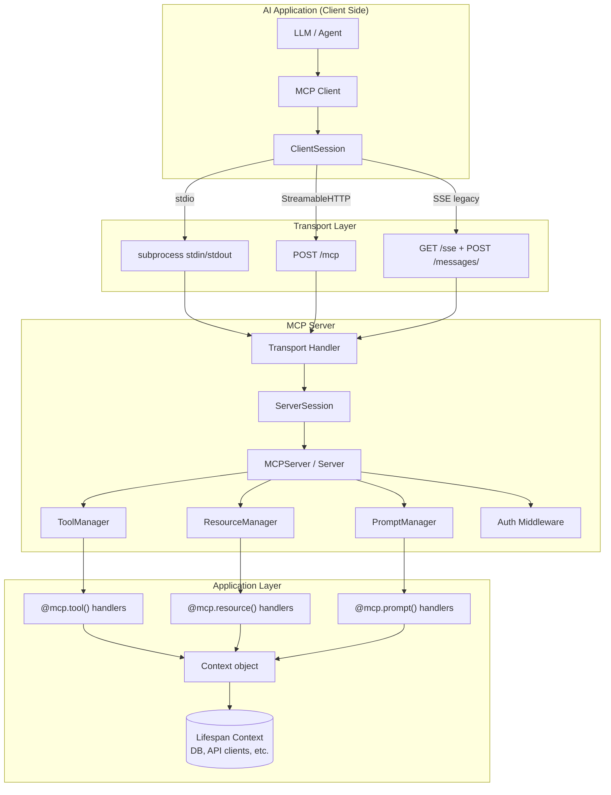
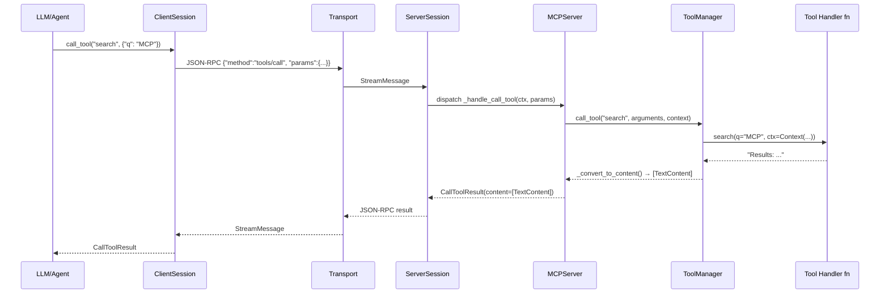
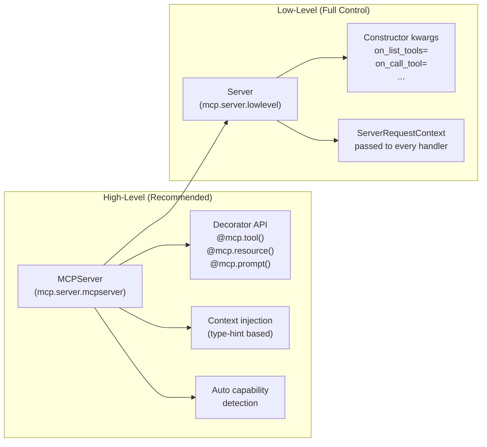

# Model Context Protocol — Python SDK
## Complete Technical Reference

> **Source:** https://github.com/modelcontextprotocol/python-sdk  
> **Research date:** 2026-05-31  
> **SDK commit (main):** `616476f6927a5c64213ea97bbd36a7466f410775`  
> **Subagents dispatched:** 9 (2 waves × discovery + server + types + transports + client, then FastMCP deep-dive + auth/examples + low-level/Context)

---

## Table of Contents

1. [Executive Summary](#1-executive-summary)
2. [Repository Identity](#2-repository-identity)
3. [What Is MCP?](#3-what-is-mcp)
4. [Architecture Overview](#4-architecture-overview)
5. [Protocol Versions](#5-protocol-versions)
6. [Transport Layer](#6-transport-layer)
7. [MCPServer — High-Level Server API](#7-mcpserver--high-level-server-api)
8. [Context Object](#8-context-object)
9. [Client API](#9-client-api)
10. [Protocol Types](#10-protocol-types)
11. [Authentication & OAuth 2.1](#11-authentication--oauth-21)
12. [Elicitation API](#12-elicitation-api)
13. [Lifespan Pattern](#13-lifespan-pattern)
14. [Low-Level Server API](#14-low-level-server-api)
15. [MCP Ecosystem](#15-mcp-ecosystem)
16. [Confidence Assessment](#16-confidence-assessment)
17. [Footnotes & Citations](#17-footnotes--citations)

---

## 1. Executive Summary

The **Model Context Protocol (MCP) Python SDK** is the official Python implementation of the Model Context Protocol — an open standard that lets AI applications (Claude, GitHub Copilot, Cursor, etc.) connect to external data sources and tools in a standardized way. Think of it as "USB-C for AI": one protocol, many servers, any client.

**Key facts at a glance:**

| Fact | Detail |
|------|--------|
| Latest stable branch | `v1.x` |
| Current main branch | v2.0 pre-alpha |
| Latest MCP protocol version | `2025-11-25` |
| Default negotiated protocol | `2025-03-26` |
| High-level server class | `MCPServer` (renamed from `FastMCP` in v2) |
| Transport (recommended) | StreamableHTTP (`/mcp` endpoint) |
| Transport (legacy) | SSE (`/sse` + `/messages/`) |
| Auth model | OAuth 2.1 / JWT — AS/RS separation (RFC 9728) |
| Core dependency | `anyio`, `pydantic ≥ 2.12`, `starlette`, `uvicorn`, `httpx` |

**The v2.0 breaking rename:** `FastMCP` → `MCPServer`. The old `src/mcp/server/fastmcp/` directory no longer exists. All code now lives in `src/mcp/server/mcpserver/`. There is **no backwards-compatibility alias** — all user code importing `from mcp.server.fastmcp import FastMCP` must be updated.[^1]

---

## 2. Repository Identity

```
https://github.com/modelcontextprotocol/python-sdk
Stars:    23,185 ⭐
License:  MIT
Language: Python
Owner:    Anthropic / modelcontextprotocol org (42 repos total)
Branches: main (v2.0 pre-alpha), v1.x (stable)
```

**`pyproject.toml` core dependencies:**[^2]

```toml
[project]
name = "mcp"
requires-python = ">=3.10"

dependencies = [
    "anyio>=4.5",
    "httpx>=0.27",
    "httpx-sse>=0.4",
    "pydantic>=2.12.0",          # v2 required
    "pydantic-settings>=2.5.2",
    "starlette>=0.40.0",
    "uvicorn>=0.23.1",
    "pyjwt>=2.8.0",
    "opentelemetry-api>=1.28.0",
    "opentelemetry-sdk>=1.28.0",
]

[project.optional-dependencies]
cli = ["typer>=0.12.4", "python-dotenv>=0.21.1"]
rich = ["rich>=13.9.4"]
```

**`src/mcp/` directory structure:**[^3]

```
src/mcp/
├── __init__.py          # Public exports: ClientSession, StdioServerParameters, etc.
├── types.py             # ALL protocol types (Tool, Resource, Prompt, ContentBlock, ...)
├── shared/
│   ├── session.py       # BaseSession (shared by client and server)
│   ├── auth.py          # OAuth shared types (OAuthToken, OAuthClientMetadata, ...)
│   └── exceptions.py    # McpError, UrlElicitationRequiredError
├── server/
│   ├── lowlevel/
│   │   └── server.py    # Low-level Server class
│   ├── mcpserver/       # High-level MCPServer (was fastmcp/)
│   │   ├── server.py    # MCPServer class (43 KB — main file)
│   │   ├── context.py   # Context object
│   │   ├── tools/       # Tool, ToolManager
│   │   ├── resources/   # Resource types, ResourceManager, templates
│   │   ├── prompts/     # Prompt, Message, UserMessage, AssistantMessage
│   │   └── utilities/   # Image, Audio, FuncMetadata, context_injection
│   ├── auth/
│   │   ├── provider.py  # OAuthAuthorizationServerProvider, TokenVerifier protocols
│   │   ├── settings.py  # AuthSettings
│   │   ├── middleware/  # BearerAuthBackend, AuthContextMiddleware, RequireAuthMiddleware
│   │   └── handlers/    # Route handlers for /authorize, /token, /register, /revoke
│   ├── session.py       # ServerSession
│   ├── stdio.py         # stdio_server() context manager
│   └── elicitation.py   # Elicitation result types and schema validation
└── client/
    ├── session.py        # ClientSession
    ├── client.py         # High-level Client wrapper
    ├── stdio.py          # stdio_client()
    ├── sse.py            # sse_client()
    ├── streamable_http.py # streamable_http_client()
    └── auth.py           # OAuthClientProvider, TokenStorage
```

---

## 3. What Is MCP?

**Model Context Protocol (MCP)** is an open protocol that standardizes how AI applications connect to external data sources and tools. It solves the M×N integration problem: instead of every AI app needing custom code to integrate with every data source, MCP provides one standard protocol that any server can implement and any client can consume.[^4]

**Core concepts:**

| Primitive | Purpose | Example |
|-----------|---------|---------|
| **Tool** | Executable functions the LLM can call | `search_web(query: str) → str` |
| **Resource** | Data the LLM can read (static or template) | `file:///docs/{name}` |
| **Prompt** | Reusable prompt templates | `code_review(language, code)` |
| **Sampling** | Server asks client to run LLM inference | `create_message(messages, max_tokens)` |
| **Elicitation** | Server asks human for input | `ctx.elicit("Confirm payment?", schema)` |

**Transport:** JSON-RPC 2.0 messages sent over stdio, SSE, or HTTP (StreamableHTTP). All communication is bidirectional.

---

## 4. Architecture Overview

### 4.1 System Architecture



### 4.2 Message Flow (Tool Call)



### 4.3 Two Server Layers



---

## 5. Protocol Versions

MCP uses **capability negotiation** — client and server declare their versions during the `initialize` handshake and the server picks the best mutually supported version.[^5]

| Version | Status | Key Additions |
|---------|--------|---------------|
| `2024-11-05` | Historical | Initial release |
| `2025-03-26` | **Default negotiated** | Streamable HTTP, structured output |
| `2025-06-18` | Supported | Elicitation API, OAuth improvements |
| `2025-11-25` | **Latest** | Task system, `ToolAnnotations`, audio content |

**`2025-11-25` highlights:**
- **Task system**: `Task`, `GetTaskResult`, `TaskStatusNotification` for long-running operations with background progress
- `ToolAnnotations` hint flags: `read_only_hint`, `destructive_hint`, `idempotent_hint`, `open_world_hint`
- `CallToolResult.structured_content` field (alongside legacy `content: list[ContentBlock]`)
- `AudioContent` type alongside existing `TextContent`, `ImageContent`
- `ElicitRequestURLParams` for URL-mode elicitation

---

## 6. Transport Layer

All transports yield a `(read_stream, write_stream)` pair via async context managers, using `anyio` memory object streams. Both streams carry `SessionMessage | Exception` objects.[^6]

### 6.1 Transport A — stdio (subprocess)

**Use case:** Connecting to local MCP servers launched as subprocesses (most common for Claude Desktop, Cursor integrations).

```python
# Server side
import asyncio
import mcp.server.stdio
from mcp.server import Server

server = Server("my-server", on_list_tools=..., on_call_tool=...)

async def run():
    async with mcp.server.stdio.stdio_server() as (read_stream, write_stream):
        await server.run(read_stream, write_stream,
                         server.create_initialization_options())

asyncio.run(run())

# --- OR with MCPServer high-level API ---
from mcp.server.mcpserver import MCPServer

mcp_server = MCPServer("my-server")

@mcp_server.tool()
def add(a: int, b: int) -> int:
    """Add two numbers."""
    return a + b

mcp_server.run(transport="stdio")   # blocks, runs anyio.run() internally
```

```python
# Client side
import asyncio
from mcp import ClientSession, StdioServerParameters
from mcp.client.stdio import stdio_client

async def main():
    server_params = StdioServerParameters(
        command="uvx",
        args=["mcp-server-fetch"],
        env={"MY_VAR": "value"},   # optional env vars
    )
    async with stdio_client(server_params) as (read, write):
        async with ClientSession(read, write) as session:
            init_result = await session.initialize()
            print(f"Connected to: {init_result.server_info.name}")
            print(f"Protocol: {init_result.protocol_version}")
            tools = await session.list_tools()
            result = await session.call_tool("fetch", {"url": "https://example.com"})

asyncio.run(main())
```

**Internals:** `stdio_server()` wraps `sys.stdin.buffer` / `sys.stdout.buffer` in anyio streams with newline-delimited JSON framing.[^7]

---

### 6.2 Transport B — SSE (Legacy)

**Use case:** Backward compatibility with pre-2025 servers. **Not recommended for new code** — use StreamableHTTP instead.

SSE transport uses **two separate HTTP endpoints**:
- `GET /sse` — long-lived SSE stream (server → client events)
- `POST /messages/` — client → server messages

```python
# Server side (MCPServer)
mcp_server.run(
    transport="sse",
    host="127.0.0.1",
    port=8000,
    sse_path="/sse",              # default
    message_path="/messages/",    # default
)

# Or as ASGI app embedded in FastAPI:
from fastapi import FastAPI

app = FastAPI()
sse_starlette_app = mcp_server.sse_app(sse_path="/sse", message_path="/messages/")
app.mount("/", sse_starlette_app)
```

```python
# Client side
import asyncio
from mcp import ClientSession
from mcp.client.sse import sse_client

async def main():
    async with sse_client("http://localhost:8000/sse") as (read, write):
        async with ClientSession(read, write) as session:
            await session.initialize()
            resources = await session.list_resources()

asyncio.run(main())
```

**Internals (`sse.py`):**[^8]
1. Opens long-lived SSE `GET` connection to `url`
2. On `endpoint` SSE event: receives the POST endpoint URL (with `sessionId`)
3. On `message` SSE event: deserializes JSON-RPC → `read_stream`
4. `post_writer`: POSTs JSON-RPC from `write_stream` to POST endpoint URL

---

### 6.3 Transport C — StreamableHTTP (Recommended, MCP 2025)

**Use case:** All new HTTP-based MCP servers. Single endpoint, supports resumability and server-sent events within the same connection.

**Key features:**
- Single endpoint (`/mcp` by default)
- Resumability via `EventStore` ABC + `Last-Event-ID` header
- `stateless_http=True` mode for serverless deployments
- `json_response=True` mode for request/response only (no streaming)

```python
# Server side (MCPServer)
mcp_server.run(
    transport="streamable-http",
    host="127.0.0.1",
    port=8000,
    streamable_http_path="/mcp",    # default
    json_response=False,             # True = no SSE streaming
    stateless_http=False,            # True = no session state
    event_store=None,                # Provide EventStore for resumability
    retry_interval=None,             # SSE retry interval in ms
)

# --- Resumability with EventStore ---
from mcp.server.streamable_http import EventStore

class InMemoryEventStore(EventStore):
    async def store_event(self, stream_id, event_id, event_data): ...
    async def replay_events(self, stream_id, last_event_id): ...

mcp_server.run(
    transport="streamable-http",
    event_store=InMemoryEventStore(),
)
```

```python
# Client side
import asyncio
from mcp import ClientSession
from mcp.client.streamable_http import streamable_http_client

async def main():
    async with streamable_http_client("http://localhost:8000/mcp") as (read, write):
        async with ClientSession(read, write) as session:
            await session.initialize()
            tools = await session.list_tools()
            print([t.name for t in tools.tools])

asyncio.run(main())
```

```python
# Embed in FastAPI / Starlette
from fastapi import FastAPI

app = FastAPI()
starlette_app = mcp_server.streamable_http_app(
    streamable_http_path="/mcp",
    stateless_http=False,
)
app.mount("/mcp", starlette_app)

# Multiple servers in one FastAPI app:
mcp1 = MCPServer("server-1")
mcp2 = MCPServer("server-2")
app.mount("/mcp/tools", mcp1.streamable_http_app())
app.mount("/mcp/data",  mcp2.streamable_http_app())
# Access: mcp_server.session_manager → StreamableHTTPSessionManager
```

**Internals:** `StreamableHTTPSessionManager` manages per-session read/write stream pairs. On `POST /mcp`, the manager routes the JSON-RPC message to the correct session. On `GET /mcp`, it opens an SSE stream for server-initiated notifications.[^9]

---

### 6.4 High-Level `Client` (Auto-Transport)

The `Client` class automatically chooses the right transport based on what you pass:[^10]

```python
from mcp.client import Client
from mcp.server.mcpserver import MCPServer

# Option 1: URL string → uses streamable_http_client automatically
async with Client("http://localhost:8000/mcp") as client:
    result = await client.call_tool("add", {"a": 1, "b": 2})
    tools = await client.list_tools()

# Option 2: In-memory MCPServer (for unit testing — no network)
server = MCPServer("test")

@server.tool()
def multiply(x: int, y: int) -> int:
    return x * y

async with Client(server) as client:
    result = await client.call_tool("multiply", {"x": 3, "y": 4})

# Option 3: Explicit transport
async with Client(my_custom_transport) as client: ...
```

`Client.__aenter__` auto-calls `session.initialize()` — no manual handshake needed.

---

## 7. MCPServer — High-Level Server API

`MCPServer` is the recommended way to build MCP servers. It handles all protocol machinery, capability negotiation, type validation, and context injection automatically.[^11]

### 7.1 Constructor

```python
from mcp.server.mcpserver import MCPServer

class MCPServer(Generic[LifespanResultT]):
    def __init__(
        self,
        name: str | None = None,            # Server name (default: "mcp-server")
        title: str | None = None,            # Human-readable display title
        description: str | None = None,      # Server description for LLMs
        instructions: str | None = None,     # Instructions shown to the LLM
        website_url: str | None = None,      # Associated website URL
        icons: list[Icon] | None = None,     # Server icons
        version: str | None = None,          # Server version string
        auth_server_provider: OAuthAuthorizationServerProvider | None = None,
        token_verifier: TokenVerifier | None = None,
        *,                                   # keyword-only from here
        tools: list[Tool] | None = None,     # Pre-registered tools
        resources: list[Resource] | None = None,
        debug: bool = False,
        log_level: Literal["DEBUG","INFO","WARNING","ERROR","CRITICAL"] = "INFO",
        warn_on_duplicate_resources: bool = True,
        warn_on_duplicate_tools: bool = True,
        warn_on_duplicate_prompts: bool = True,
        dependencies: list[str] | None = None,  # for `mcp install` / `mcp dev`
        lifespan: Callable[
            [MCPServer[LifespanResultT]],
            AbstractAsyncContextManager[LifespanResultT]
        ] | None = None,
        auth: AuthSettings | None = None,
    ): ...
```

**Notes:**
- `auth_server_provider` and `token_verifier` are mutually exclusive
- All settings configurable via `.env` or `MCP_*` environment variables (via `pydantic-settings`)
- `MCP_DEBUG=true`, `MCP_LOG_LEVEL=DEBUG`, `MCP_WARN_ON_DUPLICATE_TOOLS=false`, etc.[^12]

---

### 7.2 `@mcp.tool()` Decorator

```python
def tool(
    self,
    name: str | None = None,                    # Defaults to function.__name__
    title: str | None = None,                   # Human-readable display title
    description: str | None = None,             # Defaults to function.__doc__
    annotations: ToolAnnotations | None = None, # Hint flags (see below)
    icons: list[Icon] | None = None,
    meta: dict[str, Any] | None = None,
    structured_output: bool | None = None,      # None=auto, True=force, False=disable
) -> Callable[[_CallableT], _CallableT]: ...
```

**`ToolAnnotations` hint flags** (for `2025-11-25`+):[^13]

| Flag | Type | Meaning |
|------|------|---------|
| `read_only_hint` | `bool` | Tool only reads data, never mutates |
| `destructive_hint` | `bool` | Tool may permanently delete data |
| `idempotent_hint` | `bool` | Calling N times = calling once |
| `open_world_hint` | `bool` | Tool interacts with external systems |

**Structured output auto-detection** (when `structured_output=None`):[^14]

| Return type annotation | Output mode |
|------------------------|-------------|
| `BaseModel` subclass | Used directly as output schema |
| `TypedDict` | Converted to Pydantic model |
| `dataclass` / class with type hints | Converted to Pydantic model |
| `dict[str, T]` | `RootModel` |
| `str`, `int`, `float`, `bool` | Wrapped as `{"result": value}` |
| `list[...]`, `tuple`, `Union` | Wrapped as `{"result": value}` |
| `None` | No structured output |

```python
from mcp.server.mcpserver import MCPServer, Context
from mcp.types import ToolAnnotations
from pydantic import BaseModel, Field
from typing import Annotated

mcp = MCPServer("demo")

# ── Basic tool ─────────────────────────────────────────────────────────────
@mcp.tool()
def add(a: int, b: int) -> int:
    """Add two numbers."""
    return a + b

# ── With annotations ───────────────────────────────────────────────────────
@mcp.tool(
    description="Deletes a file permanently",
    annotations=ToolAnnotations(
        destructive_hint=True,
        idempotent_hint=False,
    )
)
async def delete_file(path: str) -> str:
    """Delete a file from the filesystem."""
    import os; os.remove(path)
    return f"Deleted {path}"

# ── Annotated[...] with Pydantic Field metadata ────────────────────────────
@mcp.tool()
def search(
    query: Annotated[str, Field(description="The search query", min_length=1)],
    max_results: Annotated[int, Field(gt=0, le=100, default=10)],
) -> list[str]:
    """Search the database."""
    return [f"Result {i} for {query}" for i in range(max_results)]

# ── Structured output (Pydantic return type) ───────────────────────────────
class UserInfo(BaseModel):
    name: str
    email: str
    age: int

@mcp.tool()
def get_user(user_id: str) -> UserInfo:
    """Get user information."""
    return UserInfo(name="Alice", email="alice@example.com", age=30)
# → result.structured_content == {"name": "Alice", "email": "...", "age": 30}

# ── Context injection ──────────────────────────────────────────────────────
@mcp.tool()
async def long_task(data: list[str], ctx: Context) -> str:
    """Process data with progress reporting."""
    total = len(data)
    for i, item in enumerate(data):
        await ctx.report_progress(i, total, f"Processing {item}")
        await ctx.info(f"Processing item: {item}")
    return f"Processed {total} items"

# ── Programmatic add/remove ────────────────────────────────────────────────
mcp.add_tool(add, name="sum", description="Sum two numbers")
mcp.remove_tool("sum")
```

**Claude Desktop JSON-in-string quirk:** `FuncMetadata.pre_parse_json()` automatically detects when Claude Desktop sends array/object arguments as JSON strings (e.g., `'["a","b"]'` instead of `["a","b"]`) and parses them back — unless the type annotation is `str`.[^15]

---

### 7.3 `@mcp.resource()` Decorator

```python
def resource(
    self,
    uri: str,                               # REQUIRED — URI or URI template
    *,
    name: str | None = None,
    title: str | None = None,
    description: str | None = None,
    mime_type: str | None = None,           # Defaults to "text/plain"
    icons: list[Icon] | None = None,
    annotations: Annotations | None = None,
    meta: dict[str, Any] | None = None,
) -> Callable[[_CallableT], _CallableT]: ...
```

**URI template syntax:**[^16]

| URI pattern | Behavior |
|-------------|----------|
| `"resource://my-data"` | Static resource → `FunctionResource` |
| `"resource://{city}/weather"` | Template → `ResourceTemplate` (auto-detected from `{...}`) |
| `"github://{owner}/{repo}/issues"` | Any scheme, any path with params |

```python
# ── Static resource ────────────────────────────────────────────────────────
@mcp.resource("config://settings")
def get_settings() -> str:
    """Get application settings."""
    return '{"theme": "dark", "language": "en"}'

# ── Template resource (URI params → function args) ─────────────────────────
@mcp.resource("file://documents/{name}")
def read_document(name: str) -> str:
    """Read a document by name."""
    return f"Content of {name}"

# ── Binary resource ────────────────────────────────────────────────────────
@mcp.resource("image://thumbnails/{filename}", mime_type="image/png")
def get_thumbnail(filename: str) -> bytes:
    with open(f"thumbnails/{filename}", "rb") as f:
        return f.read()

# ── Pre-built resource types (without decorator) ──────────────────────────
from mcp.server.mcpserver.resources.types import (
    TextResource, BinaryResource, FileResource,
    HttpResource, DirectoryResource
)

mcp.add_resource(FileResource(
    uri="file:///etc/hosts",
    path=Path("/etc/hosts"),
    mime_type="text/plain",
))
```

**Return type mapping:**

| Function return | MCP type |
|----------------|---------|
| `str` | `TextResourceContents` (`text/plain`) |
| `bytes` | `BlobResourceContents` (base64-encoded) |
| Any other | JSON via `pydantic_core.to_json()` |

---

### 7.4 `@mcp.prompt()` Decorator

```python
def prompt(
    self,
    name: str | None = None,
    title: str | None = None,
    description: str | None = None,
    icons: list[Icon] | None = None,
) -> Callable[[_CallableT], _CallableT]: ...
```

```python
from mcp.server.mcpserver import MCPServer
from mcp.server.mcpserver.prompts.base import UserMessage, AssistantMessage

mcp = MCPServer("prompts-demo")

# ── Simple string return ────────────────────────────────────────────────────
@mcp.prompt(title="Code Review")
def review_code(code: str, language: str = "python") -> str:
    return f"Please review this {language} code:\n\n```{language}\n{code}\n```"

# ── Multi-turn conversation ─────────────────────────────────────────────────
@mcp.prompt(title="Debug Assistant")
def debug_error(error: str) -> list[UserMessage | AssistantMessage]:
    return [
        UserMessage(f"I'm seeing this error:\n\n{error}"),
        AssistantMessage("I'll help debug that. What steps have you tried?"),
        UserMessage("I haven't tried anything yet."),
    ]
```

**Return type flexibility:**[^17]

| Return | Behavior |
|--------|----------|
| `str` | Wrapped as `UserMessage(TextContent(...))` |
| `UserMessage` / `AssistantMessage` | Used directly |
| `dict` | Validated as `UserMessage | AssistantMessage` via Pydantic |
| Non-list | Automatically wrapped in list |

---

### 7.5 Additional Decorators

```python
# ── @mcp.completion() — Argument autocomplete ──────────────────────────────
from mcp.types import ResourceTemplateReference, Completion

@mcp.completion()
async def handle_completion(ref, argument, context):
    if isinstance(ref, ResourceTemplateReference):
        if argument["name"] == "owner":
            return Completion(values=["modelcontextprotocol", "anthropics"])
    return None

# ── @mcp.custom_route() — Custom HTTP endpoints (no auth required) ─────────
from starlette.requests import Request
from starlette.responses import JSONResponse

@mcp.custom_route("/health", methods=["GET"])
async def health_check(request: Request) -> JSONResponse:
    return JSONResponse({"status": "ok"})

@mcp.custom_route("/login/callback", methods=["POST"])
async def login_callback(request: Request) -> JSONResponse:
    form = await request.form()
    # handle OAuth callback ...
    return JSONResponse({"code": "..."})
```

**Note:** `@custom_route` handlers are **not covered by auth middleware** — intended for OAuth callback flows, health checks, webhooks.[^18]

---

### 7.6 `mcp.run()` — Transport Entry Points

```python
# Overload 1: stdio (default — for Claude Desktop, subprocess integrations)
mcp.run()
mcp.run(transport="stdio")

# Overload 2: SSE (legacy)
mcp.run(
    transport="sse",
    host="127.0.0.1",   # default
    port=8000,           # default
    sse_path="/sse",              # default
    message_path="/messages/",    # default
    transport_security=None,
)

# Overload 3: StreamableHTTP (recommended for new servers)
mcp.run(
    transport="streamable-http",
    host="127.0.0.1",
    port=8000,
    streamable_http_path="/mcp",  # default
    json_response=False,
    stateless_http=False,
    event_store=None,
    retry_interval=None,
    transport_security=None,
)
```

**`TransportSecuritySettings`** (DNS rebinding protection):[^19]
```python
from mcp.server.transport_security import TransportSecuritySettings

security = TransportSecuritySettings(
    enable_dns_rebinding_protection=True,
    allowed_hosts=["localhost", "127.0.0.1"],
    allowed_origins=["http://localhost:3000"],
)
mcp.run(transport="streamable-http", transport_security=security)
```

---

## 8. Context Object

The `Context` object is automatically injected into any `@mcp.tool()`, `@mcp.resource()`, or `@mcp.prompt()` function that has a parameter annotated with type `Context`. The parameter name can be anything (`ctx`, `context`, `c`, etc.).[^20]

```python
from mcp.server.mcpserver import MCPServer, Context
from mcp.types import LoggingLevel

mcp = MCPServer("context-demo")

@mcp.tool()
async def example_tool(data: str, ctx: Context) -> str:
    # ── Logging (sends to client's log stream) ─────────────────────────────
    await ctx.debug("Starting processing")
    await ctx.info(f"Processing: {data}")
    await ctx.warning("This might be slow")
    await ctx.error("Something went wrong")
    # Generic (any level):
    await ctx.log(level="notice", data={"key": "val"}, logger_name="my-logger")

    # ── Progress reporting ─────────────────────────────────────────────────
    await ctx.report_progress(progress=0, total=100, message="Starting...")
    await ctx.report_progress(progress=50, total=100, message="Halfway done")
    await ctx.report_progress(progress=100, total=100, message="Complete")
    # Note: no-op if no progress_token in request meta

    # ── Resource access ────────────────────────────────────────────────────
    contents = await ctx.read_resource("resource://my-data")
    for item in contents:
        print(item.text if hasattr(item, "text") else item.data)

    # ── Metadata ──────────────────────────────────────────────────────────
    print(ctx.request_id)     # Unique request ID string
    print(ctx.client_id)      # Client ID from _meta (not OAuth token), or None

    # ── Raw session (advanced) ─────────────────────────────────────────────
    session = ctx.session     # ServerSession — send_log, send_progress, create_message
    mcp_server = ctx.mcp_server  # The MCPServer instance

    # ── Lifespan context (DB, API clients shared across all requests) ───────
    db = ctx.request_context.lifespan_context.db  # type-safe if typed generic

    return f"Done: {data}"
```

**Full `Context` API reference:**[^21]

| Method / Property | Signature | Description |
|-------------------|-----------|-------------|
| `ctx.log()` | `async (level, data, logger_name?)` | Send log to client |
| `ctx.debug()` | `async (data, logger_name?)` | Debug log |
| `ctx.info()` | `async (data, logger_name?)` | Info log |
| `ctx.warning()` | `async (data, logger_name?)` | Warning log |
| `ctx.error()` | `async (data, logger_name?)` | Error log |
| `ctx.report_progress()` | `async (progress, total?, message?)` | Progress notification |
| `ctx.read_resource()` | `async (uri)` → `Iterable[ReadResourceContents]` | Read server resource |
| `ctx.elicit()` | `async (message, schema)` → `ElicitationResult[T]` | Form-based user input |
| `ctx.elicit_url()` | `async (message, url, elicitation_id)` → `UrlElicitationResult` | URL redirect input |
| `ctx.close_sse_stream()` | `async ()` | Close request SSE stream → trigger reconnect |
| `ctx.close_standalone_sse_stream()` | `async ()` | Close standalone GET SSE stream |
| `ctx.request_id` | `str` | Unique ID for this request |
| `ctx.client_id` | `str \| None` | Client ID from `_meta` |
| `ctx.session` | `ServerSession` | Raw session for advanced use |
| `ctx.request_context` | `ServerRequestContext` | Full context (`.lifespan_context`) |
| `ctx.mcp_server` | `MCPServer` | Parent server instance |

---

## 9. Client API

### 9.1 Low-Level `ClientSession`

`ClientSession` implements the full MCP client protocol. You always call `initialize()` first.[^22]

```python
from mcp import ClientSession
from mcp.client.streamable_http import streamable_http_client

async with streamable_http_client("http://localhost:8000/mcp") as (read, write):
    async with ClientSession(read, write) as session:
        # ── MANDATORY first call ───────────────────────────────────────────
        init_result = await session.initialize()
        print(f"Server: {init_result.server_info.name}")
        print(f"Protocol: {init_result.protocol_version}")
        print(f"Capabilities: {init_result.capabilities}")

        # ── Tools ──────────────────────────────────────────────────────────
        tools = await session.list_tools()
        for tool in tools.tools:
            print(tool.name, tool.description)

        # Basic call
        result = await session.call_tool("add", {"a": 1, "b": 2})

        # With timeout + progress
        result = await session.call_tool(
            "long_task",
            {"data": [1, 2, 3]},
            read_timeout_seconds=30.0,
            progress_callback=lambda progress, total, msg: print(f"{progress}/{total}"),
        )

        # Check errors + parse content
        if result.is_error:
            for c in result.content:
                print(f"Error: {c.text}")
        for content in result.content:
            if isinstance(content, types.TextContent):
                print(content.text)
            elif isinstance(content, types.ImageContent):
                print(f"Image: {len(content.data)} bytes, {content.mime_type}")
            elif isinstance(content, types.EmbeddedResource):
                print(content.resource.text)

        # Structured content (auto-validated against tool's output_schema)
        if result.structured_content:
            user = result.structured_content  # dict validated by jsonschema
            print(user.get("name"))

        # ── Resources ──────────────────────────────────────────────────────
        resources = await session.list_resources()
        content = await session.read_resource("file:///path/data.txt")
        for item in content.contents:
            print(item.text if isinstance(item, types.TextResourceContents) else item.data)

        # Pagination
        page1 = await session.list_resources()
        if page1.next_cursor:
            from mcp.types import PaginatedRequestParams
            page2 = await session.list_resources(
                params=PaginatedRequestParams(cursor=page1.next_cursor)
            )

        # Subscribe to resource changes
        await session.subscribe_resource("file:///path/watched.txt")
        await session.unsubscribe_resource("file:///path/watched.txt")

        # Resource templates
        templates = await session.list_resource_templates()
        for t in templates.resource_templates:
            print(t.uri_template)  # e.g. "github://{owner}/{repo}"

        # ── Prompts ────────────────────────────────────────────────────────
        prompts = await session.list_prompts()
        result = await session.get_prompt("code_review", {"language": "python", "code": "..."})
        for msg in result.messages:
            print(msg.role, msg.content)

        # ── Completions (argument autocomplete) ────────────────────────────
        from mcp.types import ResourceTemplateReference
        completion = await session.complete(
            ref=ResourceTemplateReference(type="ref/resource", uri="github://{owner}/{repo}"),
            argument={"name": "owner", "value": "model"},
        )
        print(completion.completion.values)  # ["modelcontextprotocol", ...]

        # With context (previously resolved args)
        completion = await session.complete(
            ref=ResourceTemplateReference(type="ref/resource", uri="github://{owner}/{repo}"),
            argument={"name": "repo", "value": ""},
            context_arguments={"owner": "modelcontextprotocol"},
        )
```

### 9.2 `ClientSessionGroup` — Multiple Servers

```python
from mcp.client.session_group import ClientSessionGroup

# Connect to multiple servers simultaneously
async with ClientSessionGroup() as group:
    session1 = await group.connect_streamable_http("http://localhost:8001/mcp")
    session2 = await group.connect_streamable_http("http://localhost:8002/mcp")
    session3 = await group.connect_stdio(StdioServerParameters(command="uvx", args=["mcp-server-fetch"]))

    # Aggregate tools from all servers
    all_tools = await group.list_tools()   # merged list
    result = await group.call_tool("fetch", {"url": "..."})  # routed to correct server
```

### 9.3 OAuth Client Authentication

```python
from mcp.client.auth import OAuthClientProvider, TokenStorage
from mcp.client.streamable_http import streamable_http_client
from mcp.shared.auth import OAuthClientInformationFull, OAuthClientMetadata, OAuthToken
import httpx

class InMemoryTokenStorage(TokenStorage):
    def __init__(self): self.tokens = None; self.client_info = None
    async def get_tokens(self) -> OAuthToken | None: return self.tokens
    async def set_tokens(self, tokens: OAuthToken) -> None: self.tokens = tokens
    async def get_client_info(self) -> OAuthClientInformationFull | None: return self.client_info
    async def set_client_info(self, info: OAuthClientInformationFull) -> None: self.client_info = info

async def handle_redirect(url: str): print(f"Open: {url}")
async def handle_callback() -> tuple[str, str]: ...  # returns (code, state)

oauth_auth = OAuthClientProvider(
    server_url="http://localhost:8001",
    client_metadata=OAuthClientMetadata(
        client_name="My MCP Client",
        redirect_uris=["http://localhost:3000/callback"],
        grant_types=["authorization_code", "refresh_token"],
        response_types=["code"],
        scope="user",
    ),
    storage=InMemoryTokenStorage(),
    redirect_handler=handle_redirect,   # opens auth URL
    callback_handler=handle_callback,   # captures code+state from redirect
)

# OAuthClientProvider is an httpx auth handler — handles DCR, PKCE, refresh
async with httpx.AsyncClient(auth=oauth_auth, follow_redirects=True) as http_client:
    async with streamable_http_client(
        "http://localhost:8001/mcp", http_client=http_client
    ) as (read, write):
        async with ClientSession(read, write) as session:
            await session.initialize()
            tools = await session.list_tools()
```

**Flow:** `OAuthClientProvider` automatically handles: DCR (Dynamic Client Registration) → PKCE code challenge → authorization redirect → token exchange → token storage → automatic refresh on 401.[^23]

---

## 10. Protocol Types

All protocol types live in `mcp.types` (Pydantic v2 models). This is the single source of truth for the wire format.[^24]

### 10.1 Content Blocks

```python
from mcp import types

# Text
TextContent(type="text", text="Hello, world!")

# Image (base64-encoded)
ImageContent(type="image", data="<base64>", mime_type="image/png")

# Audio (base64-encoded, new in 2025-11-25)
AudioContent(type="audio", data="<base64>", mime_type="audio/wav")

# Embedded resource (inline resource content in tool result)
EmbeddedResource(
    type="resource",
    resource=TextResourceContents(uri="file:///data.txt", text="content", mime_type="text/plain")
)
# or:
EmbeddedResource(
    type="resource",
    resource=BlobResourceContents(uri="file:///img.png", data="<base64>", mime_type="image/png")
)

# Union type
ContentBlock = TextContent | ImageContent | AudioContent | EmbeddedResource
```

### 10.2 Tool Types

```python
# Tool definition (what server exposes to client)
types.Tool(
    name="search",
    description="Search the web",
    input_schema={
        "type": "object",
        "properties": {
            "query": {"type": "string"},
            "max_results": {"type": "integer", "default": 10},
        },
        "required": ["query"],
    },
    annotations=types.ToolAnnotations(
        read_only_hint=True,
        open_world_hint=True,
    ),
    output_schema={  # new in 2025-03-26
        "type": "object",
        "properties": {"results": {"type": "array", "items": {"type": "string"}}},
    },
)

# Tool call result
types.CallToolResult(
    content=[types.TextContent(type="text", text="Results...")],
    structured_content={"results": ["r1", "r2"]},  # validated against output_schema
    is_error=False,
)
```

### 10.3 Resource Types

```python
types.Resource(
    uri="file:///data/report.pdf",
    name="Annual Report",
    description="Company annual report",
    mime_type="application/pdf",
    size=1024000,
    annotations=types.Annotations(audience=["assistant"]),
)

types.ResourceTemplate(
    uri_template="github://{owner}/{repo}",
    name="GitHub Repo",
    mime_type="application/json",
)
```

### 10.4 Prompt Types

```python
types.Prompt(
    name="code_review",
    description="Review code for bugs and style",
    arguments=[
        types.PromptArgument(name="language", description="Programming language", required=True),
        types.PromptArgument(name="code", description="Code to review", required=True),
    ],
)

types.GetPromptResult(
    description="Review the following code",
    messages=[
        types.PromptMessage(
            role="user",
            content=types.TextContent(type="text", text="Review this Python code:\n...")
        ),
    ],
)
```

### 10.5 Capabilities & Initialization

```python
# Server capabilities
types.ServerCapabilities(
    tools=types.ToolsCapability(list_changed=True),
    resources=types.ResourcesCapability(subscribe=True, list_changed=True),
    prompts=types.PromptsCapability(list_changed=True),
    logging=types.LoggingCapability(),
    completions=types.CompletionsCapability(),
    elicitation=types.ElicitationCapability(),
    experimental={},
)

# Initialize result (from session.initialize())
types.InitializeResult(
    protocol_version="2025-03-26",
    capabilities=ServerCapabilities(...),
    server_info=types.Implementation(name="my-server", version="1.0.0"),
    instructions="Use this server to search the web...",
)
```

### 10.6 Error Codes

```python
# JSON-RPC error codes
-32700  # Parse error
-32600  # Invalid request
-32601  # Method not found
-32602  # Invalid params
-32603  # Internal error
# MCP-specific
-32001  # Request cancelled
-32002  # Content too large
-32042  # URL elicitation required (UrlElicitationRequiredError)
```

### 10.7 Special Return Types (MCPServer)

```python
from mcp.server.mcpserver import Image, Audio

@mcp.tool()
def get_chart(data: list[float]) -> Image:
    """Generate a chart image."""
    buf = render_chart(data)
    return Image(data=buf, format="png")
    # OR: return Image(path="/tmp/chart.png")

@mcp.tool()
def text_to_speech(text: str) -> Audio:
    """Convert text to audio."""
    audio_bytes = tts_engine.speak(text)
    return Audio(data=audio_bytes, format="mp3")
    # OR: return Audio(path="/tmp/speech.wav")

# ── Return type conversion chart ──────────────────────────────────────────
# None            → [] (empty content list)
# str             → [TextContent(text=str)]
# Image(...)      → [ImageContent(data=base64, mime_type="image/png")]
# Audio(...)      → [AudioContent(data=base64, mime_type="audio/mpeg")]
# ContentBlock    → [content block directly]
# list of above   → flattened list of content blocks
# Any other type  → [TextContent(text=pydantic_core.to_json(val))]
# CallToolResult  → returned verbatim (bypasses conversion)
```

---

## 11. Authentication & OAuth 2.1

The SDK implements OAuth 2.1 with **RFC 9728** (AS/RS separation) as the default architecture. The MCP server acts as a pure Resource Server (RS) and delegates authorization to a separate Authorization Server (AS).[^25]

### 11.1 Architecture: AS/RS Separation (Recommended)

```
┌─────────┐    ① GET /.well-known/oauth-protected-resource    ┌──────────┐
│  Client │ ─────────────────────────────────────────────────► │ MCP (RS) │
│         │ ◄───── {"authorization_servers": ["http://AS"]} ── │ :8001    │
│         │                                                     └──────────┘
│         │    ② GET /.well-known/oauth-authorization-server   ┌──────────┐
│         │ ─────────────────────────────────────────────────► │ Auth (AS)│
│         │ ◄───── {authorization_endpoint, token_endpoint} ── │ :9000    │
│         │                                                     │          │
│         │    ③ Authorization Code + PKCE flow                 │          │
│         │ ────────────────────── /authorize ────────────────► │          │
│         │ ◄──────────────── redirect + ?code=mcp_xxx ──────── │          │
│         │ ────────────────────── /token ─────────────────────► │          │
│         │ ◄──────────────── {"access_token": "mcp_xxx"} ───── │          │
│         │                                                     └──────────┘
│         │    ④ Call MCP with Bearer token
│         │ ──── POST /mcp (Authorization: Bearer mcp_xxx) ───► ┌──────────┐
│         │                                                     │ MCP (RS) │
│         │              ⑤ Token introspection                  │ introspects│
│         │                                      ─ /introspect ►│ via AS   │
│         │ ◄─────────────── tool results ──────────────────── │          │
└─────────┘                                                     └──────────┘
```

### 11.2 Resource Server Mode (New Architecture)

```python
from mcp.server.mcpserver import MCPServer
from mcp.server.auth.settings import AuthSettings

# Implement TokenVerifier (or use IntrospectionTokenVerifier)
from mcp.server.auth.provider import TokenVerifier, AccessToken

class MyTokenVerifier:
    """Structural Protocol — any class with verify_token() satisfies TokenVerifier."""
    async def verify_token(self, token: str) -> AccessToken | None:
        # Call your AS /introspect endpoint
        response = await httpx.post(f"{AS_URL}/introspect", data={"token": token})
        data = response.json()
        if not data.get("active"):
            return None
        return AccessToken(
            token=token,
            client_id=data.get("client_id", ""),
            scopes=data.get("scope", "").split(),
            expires_at=data.get("exp"),
            subject=data.get("sub"),
            claims=data,
        )

# Configure MCPServer as Resource Server
mcp = MCPServer(
    name="My Protected Server",
    token_verifier=MyTokenVerifier(),   # OR use IntrospectionTokenVerifier
    auth=AuthSettings(
        issuer_url="http://localhost:9000",           # external AS
        required_scopes=["user"],
        resource_server_url="http://localhost:8001",  # this server's URL (RFC 9728)
    ),
)

@mcp.tool()
async def protected_action(data: str) -> str:
    """This tool requires a valid Bearer token with 'user' scope."""
    return f"Processed: {data}"

# Access the authenticated user's token inside any tool:
from mcp.server.auth.middleware.auth_context import get_access_token

@mcp.tool()
async def get_my_identity() -> str:
    token = get_access_token()  # contextvars — available anywhere in request
    return f"You are: {token.subject} with scopes: {token.scopes}"

mcp.run(transport="streamable-http", host="localhost", port=8001)
```

**Production `IntrospectionTokenVerifier`:**[^26]

```python
from mcp.server.auth.provider import IntrospectionTokenVerifier

token_verifier = IntrospectionTokenVerifier(
    introspection_endpoint="http://localhost:9000/introspect",
    server_url="http://localhost:8001/mcp",
    validate_resource=False,   # True = RFC 8707 strict audience validation
)
# SSRF guard built-in: only allows https:// or http://localhost and http://127.0.0.1
```

### 11.3 Legacy Combined AS+RS Mode

```python
# MCP server is BOTH the Authorization Server AND Resource Server
from mcp.server.auth.provider import OAuthAuthorizationServerProvider
from mcp.server.auth.settings import AuthSettings, ClientRegistrationOptions

mcp = MCPServer(
    name="Simple Auth Server",
    auth_server_provider=oauth_provider,   # Full AS implementation
    auth=AuthSettings(
        issuer_url=server_url,
        client_registration_options=ClientRegistrationOptions(
            enabled=True,
            valid_scopes=["user", "admin"],
            default_scopes=["user"],
        ),
        required_scopes=["user"],
        resource_server_url=None,   # None = legacy mode (no RFC 9728)
    ),
)

# Register custom login routes
@mcp.custom_route("/login", methods=["GET"])
async def login_page(request): ...

@mcp.custom_route("/login/callback", methods=["POST"])
async def login_callback(request): ...
```

### 11.4 Auth Middleware Stack

```
Request arrives at /mcp
    ↓
BearerAuthBackend (extracts "Authorization: Bearer <token>")
    ↓
TokenVerifier.verify_token(token) → AccessToken | None
    ↓
AuthContextMiddleware (stores AccessToken in contextvars)
    ↓
RequireAuthMiddleware (checks required_scopes; returns 401/403 if not met)
    ↓
MCP handler (tool/resource/prompt)
    ↓
get_access_token() → AccessToken from contextvars
```

### 11.5 `AuthSettings` Fields

| Field | Purpose |
|-------|---------|
| `issuer_url` | AS issuer URL; used in `/.well-known` metadata |
| `required_scopes` | Scopes every request must carry |
| `resource_server_url` | RS's URL for RFC 9728 Protected Resource Metadata; `None` = legacy |
| `client_registration_options` | Enable DCR, set `valid_scopes` / `default_scopes` |
| `revocation_options` | Token revocation endpoint configuration |
| `service_documentation_url` | URL for human-readable auth documentation |

---

## 12. Elicitation API

Elicitation lets an MCP tool **pause and ask the human user for input** during tool execution. The SDK supports two modes.[^27]

### 12.1 Form Mode — `ctx.elicit()` with Pydantic Schema

Use for: collecting structured data (confirmations, preferences, parameters).

**Constraints:** Only primitive field types are allowed: `str`, `int`, `float`, `bool`, `list[str]`, and `Optional` of those. Nested models are forbidden (enforced at call time with `TypeError`).

```python
from pydantic import BaseModel, Field
from mcp.server.mcpserver import Context, MCPServer

mcp = MCPServer("elicitation-demo")

class BookingPreferences(BaseModel):
    check_alternative: bool = Field(
        description="Would you like to check another date?"
    )
    alternative_date: str = Field(
        default="2024-12-26",
        description="Alternative date (YYYY-MM-DD)"
    )

@mcp.tool()
async def book_table(date: str, party_size: int, ctx: Context) -> str:
    """Book a restaurant table."""
    if date == "2024-12-25":
        result = await ctx.elicit(
            message=f"No tables for {party_size} on {date}. Try another?",
            schema=BookingPreferences,
        )
        # result.action: "accept" | "decline" | "cancel"
        if result.action == "accept" and result.data:
            if result.data.check_alternative:
                return f"✓ Booked for {result.data.alternative_date}"
        return "✗ No booking made"
    return f"✓ Booked for {date}"
```

**`ElicitationResult` types:**

```python
from mcp.server.elicitation import (
    AcceptedElicitation,  # .action = "accept", .data = populated model instance
    DeclinedElicitation,  # .action = "decline"
    CancelledElicitation, # .action = "cancel"
)
ElicitationResult = AcceptedElicitation[T] | DeclinedElicitation | CancelledElicitation
```

### 12.2 URL Mode — `ctx.elicit_url()` for Out-of-Band Flows

Use for: OAuth flows, payment confirmations, credential collection, anything requiring browser interaction.

```python
import uuid

@mcp.tool()
async def secure_payment(amount: float, ctx: Context) -> str:
    elicitation_id = str(uuid.uuid4())
    result = await ctx.elicit_url(
        message=f"Please confirm payment of ${amount:.2f}",
        url=f"https://payments.example.com/confirm?amount={amount}&id={elicitation_id}",
        elicitation_id=elicitation_id,
    )
    # result.action: "accept" | "decline" | "cancel"
    if result.action == "accept":
        return f"Payment of ${amount:.2f} initiated — complete in browser"
    return "Payment cancelled"
```

### 12.3 `UrlElicitationRequiredError` — Pre-emptive Auth Guard

For tools that **cannot proceed at all** without prior authorization:

```python
from mcp.shared.exceptions import UrlElicitationRequiredError
from mcp.types import ElicitRequestURLParams
import uuid

@mcp.tool()
async def connect_service(service_name: str, ctx: Context) -> str:
    elicitation_id = str(uuid.uuid4())
    raise UrlElicitationRequiredError([
        ElicitRequestURLParams(
            mode="url",
            message=f"Authorization required to connect to {service_name}",
            url=f"https://{service_name}.example.com/oauth/authorize?id={elicitation_id}",
            elicitation_id=elicitation_id,
        )
    ])
    # The framework converts this to a -32042 JSON-RPC error response
```

### 12.4 Client-Side Elicitation Handling

```python
from mcp.client.context import ClientRequestContext
from mcp import ClientSession, types
import webbrowser
from urllib.parse import urlparse

async def handle_elicitation(
    context: ClientRequestContext,
    params: types.ElicitRequestParams,
) -> types.ElicitResult | types.ErrorData:
    if params.mode == "url":
        # Security: validate URL scheme
        parsed = urlparse(str(params.url))
        if parsed.scheme.lower() not in {"http", "https"}:
            return types.ElicitResult(action="decline")
        response = input(f"Open {params.url} in browser? (y/n): ").strip()
        if response.lower() in ("y", "yes"):
            webbrowser.open(str(params.url))
            return types.ElicitResult(action="accept")
        return types.ElicitResult(action="decline")
    # Form mode: render schema as form, collect input, return populated data
    ...
```

---

## 13. Lifespan Pattern

The lifespan pattern lets you manage **shared resources** (database connections, HTTP clients, ML models) that are initialized once at server startup and shared across all request handlers. The lifespan context is type-safe and injected into every handler.[^28]

### 13.1 High-Level MCPServer Lifespan

```python
from collections.abc import AsyncIterator
from contextlib import asynccontextmanager
from dataclasses import dataclass
import asyncpg
from mcp.server.mcpserver import Context, MCPServer

@dataclass
class AppContext:
    db: asyncpg.Pool
    http_client: httpx.AsyncClient

@asynccontextmanager
async def app_lifespan(server: MCPServer) -> AsyncIterator[AppContext]:
    """Runs ONCE at server startup and shutdown. NOT per-request."""
    db = await asyncpg.create_pool("postgresql://localhost/mydb")
    async with httpx.AsyncClient() as http_client:
        try:
            yield AppContext(db=db, http_client=http_client)
        finally:
            await db.close()

mcp = MCPServer("my-app", lifespan=app_lifespan)

# Access via ctx.request_context.lifespan_context (typed as AppContext)
@mcp.tool()
async def query_database(sql: str, ctx: Context[AppContext]) -> str:
    """Execute a database query."""
    db = ctx.request_context.lifespan_context.db
    rows = await db.fetch(sql)
    return str(rows)

@mcp.tool()
async def fetch_url(url: str, ctx: Context[AppContext]) -> str:
    """Fetch a URL."""
    client = ctx.request_context.lifespan_context.http_client
    response = await client.get(url)
    return response.text

mcp.run(transport="streamable-http")
```

### 13.2 Low-Level Server Lifespan

```python
from typing import TypedDict
from contextlib import asynccontextmanager
from mcp.server import Server, ServerRequestContext
from mcp import types

class AppContext(TypedDict):
    db: Database

@asynccontextmanager
async def server_lifespan(_server: Server) -> AsyncIterator[AppContext]:
    db = await Database.connect()
    try:
        yield {"db": db}          # yielded value = ctx.lifespan_context
    finally:
        await db.disconnect()

async def handle_call_tool(
    ctx: ServerRequestContext[AppContext],
    params: types.CallToolRequestParams,
) -> types.CallToolResult:
    db = ctx.lifespan_context["db"]   # TypedDict access
    results = await db.query((params.arguments or {})["query"])
    return types.CallToolResult(content=[
        types.TextContent(type="text", text=str(results))
    ])

server = Server(
    "my-server",
    lifespan=server_lifespan,
    on_call_tool=handle_call_tool,
)
```

**Key difference:** High-level uses `ctx.request_context.lifespan_context.field` (dataclass attribute access); low-level uses `ctx.lifespan_context["key"]` (TypedDict key access).

---

## 14. Low-Level Server API

The low-level `Server` class gives you full control over the protocol at the cost of more boilerplate. Use it when you need custom behavior that `MCPServer` doesn't expose.[^29]

### 14.1 Constructor

```python
from mcp.server import Server

server = Server(
    name="my-server",
    version="1.0.0",
    title="My Server",
    description="Server description",
    instructions="How to use this server",
    website_url="https://example.com",
    icons=None,
    lifespan=my_lifespan,            # optional
    # ── Request handlers ──────────────────────────────────────────────────
    on_list_tools=handle_list_tools,
    on_call_tool=handle_call_tool,
    on_list_resources=handle_list_resources,
    on_list_resource_templates=handle_list_resource_templates,
    on_read_resource=handle_read_resource,
    on_subscribe_resource=handle_subscribe_resource,
    on_unsubscribe_resource=handle_unsubscribe_resource,
    on_list_prompts=handle_list_prompts,
    on_get_prompt=handle_get_prompt,
    on_completion=handle_completion,
    on_set_logging_level=handle_set_logging_level,
    on_ping=None,                    # default no-op handler built in
    # ── Notification handlers ─────────────────────────────────────────────
    on_roots_list_changed=handle_roots_changed,
    on_progress=handle_progress,
)
```

**Capability auto-detection:** Capabilities are automatically derived from which handlers are registered. If you register `on_list_tools`, the `tools` capability is declared. If you register `on_list_resources` with `on_subscribe_resource`, the `resources.subscribe` capability is declared.[^30]

### 14.2 Handler Pattern

All handlers receive `ServerRequestContext` as first argument:

```python
from mcp.server import ServerRequestContext
from mcp import types

async def handle_list_tools(
    ctx: ServerRequestContext[AppContext],
    params: types.PaginatedRequestParams | None,
) -> types.ListToolsResult:
    return types.ListToolsResult(tools=[
        types.Tool(
            name="my_tool",
            description="Does something useful",
            input_schema={
                "type": "object",
                "properties": {"data": {"type": "string"}},
                "required": ["data"],
            },
        )
    ])

async def handle_call_tool(
    ctx: ServerRequestContext[AppContext],
    params: types.CallToolRequestParams,
) -> types.CallToolResult:
    if params.name != "my_tool":
        raise ValueError(f"Unknown tool: {params.name}")

    # Access lifespan resources
    db = ctx.lifespan_context.db

    # Send progress to client
    await ctx.session.send_progress_notification(
        progress_token=ctx.meta.get("progressToken"),
        progress=50,
        total=100,
        message="Processing...",
    )

    return types.CallToolResult(
        content=[types.TextContent(type="text", text="Done!")]
    )
```

### 14.3 `ServerSession` Key Methods

```python
# Capability checking
session.check_client_capability(capability) -> bool

# Logging (send to client)
await session.send_log_message(level, data, logger?, related_request_id?)

# Progress
await session.send_progress_notification(progress_token, progress, total?, message?)

# Resource change notifications
await session.send_resource_updated(uri)
await session.send_resource_list_changed()
await session.send_tool_list_changed()
await session.send_prompt_list_changed()

# Sampling (ask client to run LLM)
result = await session.create_message(
    messages=[SamplingMessage(...)],
    max_tokens=1024,
    system_prompt="You are helpful.",
    temperature=0.7,
    model_preferences=ModelPreferences(hints=[ModelHint(name="claude")]),
)

# Client filesystem roots
roots = await session.list_roots()

# Elicitation
result = await session.elicit_form(message, requested_schema, related_request_id?)
result = await session.elicit_url(message, url, elicitation_id, related_request_id?)

# Connectivity
await session.send_ping()

# State
session.client_params   # InitializeRequestParams from client
session.experimental    # ExperimentalServerSessionFeatures
```

### 14.4 Complete Low-Level Example (stdio)

```python
import asyncio
from contextlib import asynccontextmanager
from typing import AsyncIterator, TypedDict
import mcp.server.stdio
from mcp.server import Server, ServerRequestContext
from mcp import types

class AppContext(TypedDict):
    db: "Database"

@asynccontextmanager
async def server_lifespan(_server: Server) -> AsyncIterator[AppContext]:
    db = await Database.connect()
    try:
        yield {"db": db}
    finally:
        await db.disconnect()

async def list_tools(ctx: ServerRequestContext[AppContext], params) -> types.ListToolsResult:
    return types.ListToolsResult(tools=[
        types.Tool(
            name="query",
            description="Query the database",
            input_schema={
                "type": "object",
                "properties": {"sql": {"type": "string"}},
                "required": ["sql"],
            },
        )
    ])

async def call_tool(
    ctx: ServerRequestContext[AppContext],
    params: types.CallToolRequestParams
) -> types.CallToolResult:
    db = ctx.lifespan_context["db"]
    rows = await db.query((params.arguments or {})["sql"])
    return types.CallToolResult(content=[
        types.TextContent(type="text", text=str(rows))
    ])

server = Server(
    "db-server",
    lifespan=server_lifespan,
    on_list_tools=list_tools,
    on_call_tool=call_tool,
)

async def main():
    async with mcp.server.stdio.stdio_server() as (read, write):
        await server.run(
            read, write,
            server.create_initialization_options(),
        )

if __name__ == "__main__":
    asyncio.run(main())
```

---

## 15. MCP Ecosystem

The `modelcontextprotocol` GitHub org hosts 42 repositories as of the research date.[^31]

| Repository | Stars | Purpose |
|------------|-------|---------|
| **[python-sdk](https://github.com/modelcontextprotocol/python-sdk)** | 23,185 ⭐ | Official Python SDK |
| **[servers](https://github.com/modelcontextprotocol/servers)** | 86,000+ ⭐ | Reference servers: filesystem, GitHub, Slack, Postgres, Puppeteer, and 20+ more |
| **[typescript-sdk](https://github.com/modelcontextprotocol/typescript-sdk)** | — | Official TypeScript SDK |
| **[go-sdk](https://github.com/modelcontextprotocol/go-sdk)** | — | Official Go SDK |
| **[inspector](https://github.com/modelcontextprotocol/inspector)** | — | Dev tool for debugging/testing MCP servers visually |
| **[specification](https://github.com/modelcontextprotocol/specification)** | — | Protocol specification (JSON-RPC schema) |

**CLI tools (installed with `pip install "mcp[cli]"`):**

```bash
mcp dev my_server.py           # Hot-reload dev mode with inspector
mcp run my_server.py           # Run a server directly
mcp install my_server.py       # Install as Claude Desktop server
```

---

## 16. Confidence Assessment

| Section | Confidence | Notes |
|---------|-----------|-------|
| `MCPServer` constructor | ✅ High | Full constructor confirmed from source |
| `@mcp.tool()` / `@mcp.resource()` / `@mcp.prompt()` | ✅ High | Complete decorator signatures verified |
| Transport implementations | ✅ High | Source confirmed for stdio, SSE, StreamableHTTP |
| `Context` object API | ✅ High | Full API confirmed from `context.py` source |
| `ClientSession` methods | ✅ High | Confirmed from `session.py` and examples |
| OAuth 2.1 / Auth flow | ✅ High | Full example server confirmed |
| Elicitation API | ✅ High | Confirmed from examples + `elicitation.py` |
| Lifespan pattern | ✅ High | Both high- and low-level confirmed from examples |
| Protocol versions | ✅ High | Confirmed from `mcp/types.py` constants |
| `FastMCP` → `MCPServer` rename | ✅ High | Confirmed — no compat alias exists |
| `ServerSession` methods | 🔶 Medium | Confirmed key methods; some peripheral methods inferred |
| Task system (2025-11-25) | 🔶 Medium | Existence confirmed; full API not deeply explored |
| `TransportSecuritySettings` | 🔶 Medium | Existence confirmed; exact fields inferred |
| `ExperimentalHandlers` | 🔻 Low | Referenced in source; API not directly fetched |

---

## 17. Footnotes & Citations

[^1]: `src/mcp/server/mcpserver/__init__.py:1-7` — Public exports: `MCPServer`, `Context`, `Image`, `Audio`, `Icon`. The old `src/mcp/server/fastmcp/` directory does not exist in the v2 `main` branch.

[^2]: `pyproject.toml` — direct inspection of the repository's dependency manifest.

[^3]: Confirmed via `GET https://api.github.com/repos/modelcontextprotocol/python-sdk/git/trees/main?recursive=1` — full tree enumeration.

[^4]: `README.md` — Official SDK description and MCP protocol overview.

[^5]: `src/mcp/types.py` — `LATEST_PROTOCOL_VERSION = "2025-11-25"`, `SUPPORTED_PROTOCOL_VERSIONS = ["2024-11-05", "2025-03-26", "2025-06-18", "2025-11-25"]`.

[^6]: `src/mcp/shared/session.py` — `BaseSession` using `anyio.abc.ObjectReceiveStream[SessionMessage | Exception]`.

[^7]: `src/mcp/server/stdio.py` — `stdio_server()` context manager wrapping `sys.stdin.buffer` / `sys.stdout.buffer`.

[^8]: `src/mcp/client/sse.py:37-165` — SSE client internals: `endpoint` event parsing, POST endpoint URL, `post_writer` coroutine.

[^9]: `src/mcp/server/streamable_http.py` — `StreamableHTTPSessionManager` with per-session stream management.

[^10]: `src/mcp/client/client.py:100-125` — `Client.__aenter__` auto-calls `session.initialize()`.

[^11]: `src/mcp/server/mcpserver/server.py:129-207` — `MCPServer.__init__` full constructor.

[^12]: `src/mcp/server/mcpserver/server.py:80-114` — `Settings(BaseSettings)` with `env_prefix="MCP_"`.

[^13]: `src/mcp/types.py` — `ToolAnnotations` model with `read_only_hint`, `destructive_hint`, `idempotent_hint`, `open_world_hint`.

[^14]: `src/mcp/server/mcpserver/utilities/func_metadata.py:62-168` — `FuncMetadata` structured output auto-detection logic.

[^15]: `src/mcp/server/mcpserver/utilities/func_metadata.py:499-530` — `pre_parse_json()` Claude Desktop compatibility shim.

[^16]: `src/mcp/server/mcpserver/resources/templates.py:89-96` — URI template `{param}` → `(?P<param>[^/]+)` regex conversion.

[^17]: `src/mcp/server/mcpserver/prompts/base.py:22-56` — `Prompt.render()` method and `SyncPromptResult` type alias.

[^18]: `src/mcp/server/mcpserver/server.py:805-846` — `custom_route()` decorator implementation and notes on auth bypass.

[^19]: `src/mcp/server/transport_security.py` — `TransportSecuritySettings` for DNS rebinding protection.

[^20]: `src/mcp/server/mcpserver/utilities/context_injection.py:11-43` — `find_context_parameter()` type-hint scanning.

[^21]: `src/mcp/server/mcpserver/context.py:1-220` — Full `Context` class implementation.

[^22]: `src/mcp/client/session.py:100-360` — `ClientSession` method implementations.

[^23]: `src/mcp/client/auth.py` — `OAuthClientProvider` httpx auth handler with DCR + PKCE + refresh.

[^24]: `src/mcp/types.py` — All protocol types as Pydantic v2 models.

[^25]: `examples/servers/simple-auth/README.md` — RFC 9728 AS/RS separation architecture.

[^26]: `examples/servers/simple-auth/mcp_simple_auth/token_verifier.py:1-100` — `IntrospectionTokenVerifier` with SSRF guard.

[^27]: `src/mcp/server/elicitation.py` — `ElicitationResult`, `_validate_elicitation_schema` (primitive-only enforcement).

[^28]: `examples/snippets/servers/lifespan_example.py` — High-level `MCPServer` lifespan example; `examples/snippets/servers/lowlevel/lifespan.py` — Low-level lifespan example.

[^29]: `src/mcp/server/lowlevel/server.py:90-175` — `Server.__init__` with all handler kwargs.

[^30]: `src/mcp/server/lowlevel/server.py:241-275` — Capability auto-detection from registered handlers.

[^31]: `https://api.github.com/orgs/modelcontextprotocol/repos?per_page=100` — Organization repository enumeration; `modelcontextprotocol/servers` star count from GitHub search.
